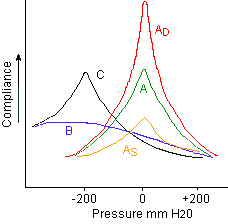
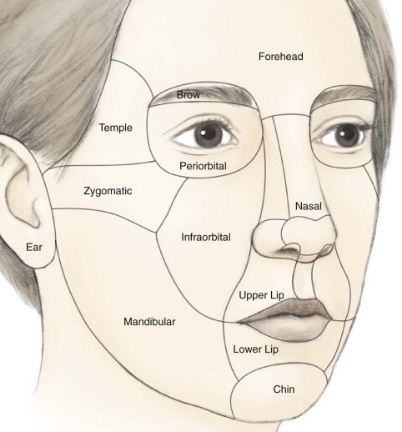
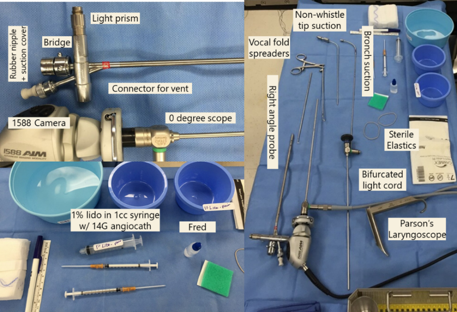
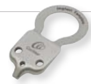
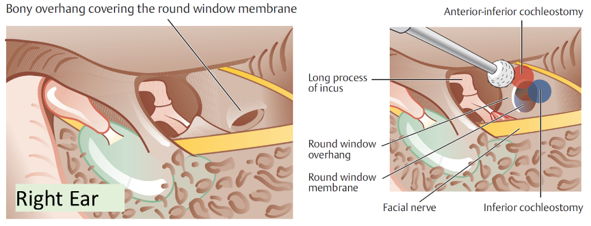
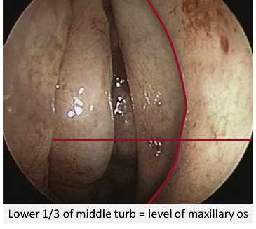
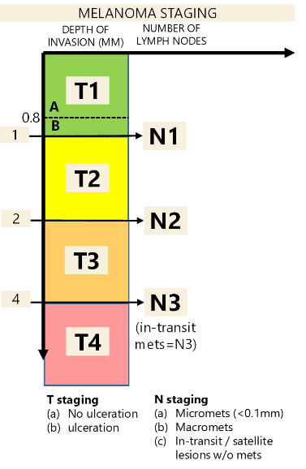
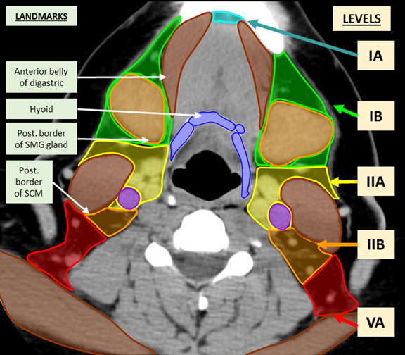
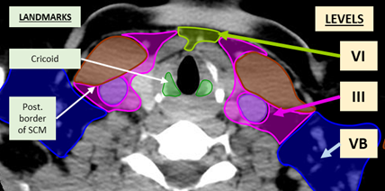

**Contributors**

Jonathan C. Simmonds, M.D.

Jennifer L. Harb, M.D.

Erin Haser, M.D.

Ameer Shah, M.D.

Samih Nassif, M.D.

Andrew R. Scott, M.D.

Michelle White, M.D.

Anju Patel, M.D.

Ramya Bharathi, M.D.

Emily Gall, M.D.

If you add to the pocket guide, feel free to add your name to the list above

To edit the pocket guide – go to the g-drive folder “ENT Pocket guide”

> **<u>Contents</u>**

[Rules of the Game [7](#rules-of-the-game)](#rules-of-the-game)

[Daily Routine [8](#daily-routine)](#daily-routine)

[Things to Do Before Rounds [8](#things-to-do-before-rounds)](#things-to-do-before-rounds)

[Things to Do After Rounds [8](#things-to-do-after-rounds)](#things-to-do-after-rounds)

[Weekly Routines [8](#weekly-routines)](#weekly-routines)

[Monthly Routines [9](#monthly-routines)](#monthly-routines)

[Yearly Routines [9](#yearly-routines)](#yearly-routines)

[Tips [9](#tips)](#tips)

[Templates/Protocols [10](#templatesprotocols)](#templatesprotocols)

[Orders, Discharges, & Dictations [10](#orders-discharges-dictations)](#orders-discharges-dictations)

[Case & Duty Hour Logs [11](#case-duty-hour-logs)](#case-duty-hour-logs)

[On-Call Room [11](#on-call-room)](#on-call-room)

[Otolaryngology National Conference Schedule [12](#otolaryngology-national-conference-schedule)](#otolaryngology-national-conference-schedule)

[VACATION REQUESTS [12](#vacation-requests)](#vacation-requests)

[On-Call Guide [13](#on-call-guide)](#on-call-guide)

[Calls [13](#calls)](#calls)

[Consults [14](#consults)](#consults)

[Facial Trauma Guide [18](#facial-trauma-guide)](#facial-trauma-guide)

[Mandible Fractures and their management [19](#mandible-fractures-and-their-management)](#mandible-fractures-and-their-management)

[Otology [21](#otology)](#otology)

[Otology - Clinic Guide [21](#otology---clinic-guide)](#otology---clinic-guide)

[Audiology [21](#audiology)](#audiology)

[Neuro-otology Imaging [22](#neuro-otology-imaging)](#neuro-otology-imaging)

[Vertigo [24](#vertigo)](#vertigo)

[Causes of Vertigo [25](#causes-of-vertigo)](#causes-of-vertigo)

[Otitis [26](#otitis)](#otitis)

[Tinnitus-**Clinical Practice Guideline** [27](#tinnitus-clinical-practice-guideline)](#tinnitus-clinical-practice-guideline)

[Otosclerosis [27](#otosclerosis)](#otosclerosis)

[Facial Nerve [27](#facial-nerve)](#facial-nerve)

[Otology – OR [28](#otology-or)](#otology-or)

[Dr. Sillman’s Tympanomastoidectomy [28](#dr.-sillmans-tympanomastoidectomy)](#dr.-sillmans-tympanomastoidectomy)

[Dr. Noonan’s Tympanomastoidectomy [29](#dr.-noonans-tympanomastoidectomy)](#dr.-noonans-tympanomastoidectomy)

[Temporal Bone Lab [29](#temporal-bone-lab)](#temporal-bone-lab)

[Cranial Nerves [29](#cranial-nerves)](#cranial-nerves)

[Facial Plastics [31](#facial-plastics)](#facial-plastics)

[Facial Plastics – Clinic Guide [31](#facial-plastics-clinic-guide)](#facial-plastics-clinic-guide)

[Injectables [31](#injectables)](#injectables)

[Rhinoplasty – Clinical Practice Guideline [31](#rhinoplasty-clinical-practice-guideline)](#rhinoplasty-clinical-practice-guideline)

[Facial Analysis (Rhinoplasty Focus) [31](#facial-analysis-rhinoplasty-focus)](#facial-analysis-rhinoplasty-focus)

[Facial Plastics – OR Guide [35](#facial-plastics-or-guide)](#facial-plastics-or-guide)

[Lee - General [35](#lee---general)](#lee---general)

[Lee - Septorhinoplasty [35](#lee---septorhinoplasty)](#lee---septorhinoplasty)

[Auricular cartilage harvest [36](#auricular-cartilage-harvest)](#auricular-cartilage-harvest)

[Lee- Sentinel lymph node biopsy [36](#lee--sentinel-lymph-node-biopsy)](#lee--sentinel-lymph-node-biopsy)

[Lee- Skin Grafting [37](#lee--skin-grafting)](#lee--skin-grafting)

[Lee-Post Mohs Reconstruction [37](#lee-post-mohs-reconstruction)](#lee-post-mohs-reconstruction)

[Local Rotational Flaps [39](#local-rotational-flaps)](#local-rotational-flaps)

[Facial Plastics Post-Op Guide [40](#facial-plastics-post-op-guide)](#facial-plastics-post-op-guide)

[Pediatric Otolaryngology [41](#pediatric-otolaryngology)](#pediatric-otolaryngology)

[Pediatric Otolaryngology Clinic Guide [41](#pediatric-otolaryngology-clinic-guide)](#pediatric-otolaryngology-clinic-guide)

[OME - Clinical Practice Guidelines [41](#ome---clinical-practice-guidelines)](#ome---clinical-practice-guidelines)

[Pediatric Vocal Fold Paralysis [42](#pediatric-vocal-fold-paralysis)](#pediatric-vocal-fold-paralysis)

[Pediatric Hearing Loss (failed newborn hearing screen) [42](#pediatric-hearing-loss-failed-newborn-hearing-screen)](#pediatric-hearing-loss-failed-newborn-hearing-screen)

[Pediatric Syndromes [43](#pediatric-syndromes)](#pediatric-syndromes)

[Cleft lip/palate [43](#cleft-lippalate)](#cleft-lippalate)

[Microtia/Aural Atresia [44](#microtiaaural-atresia)](#microtiaaural-atresia)

[PEDIATRIC NECK MASSES [45](#pediatric-neck-masses)](#pediatric-neck-masses)

[CONGENITAL NECK MASSES [45](#congenital-neck-masses)](#congenital-neck-masses)

[INFECTIOUS/INFLAMMATORY NECK MASSES [46](#infectiousinflammatory-neck-masses)](#infectiousinflammatory-neck-masses)

[PEDIATRIC VASCULAR LESIONS [46](#pediatric-vascular-lesions)](#pediatric-vascular-lesions)

[Pediatric Otolaryngology – OR guide [48](#pediatric-otolaryngology-or-guide)](#pediatric-otolaryngology-or-guide)

[Rigid Bronchoscopy (Scott or Vecchiotti) [48](#rigid-bronchoscopy-scott-or-vecchiotti)](#rigid-bronchoscopy-scott-or-vecchiotti)

[Flexible bronchoscopy [48](#_Toc139824222)](#_Toc139824222)

[Laryngotracheal Reconstruction (Vecchiotti & Scott) [49](#laryngotracheal-reconstruction-vecchiotti-scott)](#laryngotracheal-reconstruction-vecchiotti-scott)

[Tonsils, Adenoids, Ear Tubes (Vecchiotti) [49](#tonsils-adenoids-ear-tubes-vecchiotti)](#tonsils-adenoids-ear-tubes-vecchiotti)

[Open Neck Cases eg thyroglossal duct cyst (Vecchiotti) [50](#open-neck-cases-eg-thyroglossal-duct-cyst-vecchiotti)](#open-neck-cases-eg-thyroglossal-duct-cyst-vecchiotti)

[Cochlear Implants (Vecchiotti) [50](#cochlear-implants-vecchiotti)](#cochlear-implants-vecchiotti)

[Botox injections to salivary glands - both MV & AS [52](#botox-injections-to-salivary-glands---both-mv-as)](#botox-injections-to-salivary-glands---both-mv-as)

[Dr Scott’s OR Guide [52](#dr-scotts-or-guide)](#dr-scotts-or-guide)

[Adenotonsillectomy (Scott) [52](#_Toc139824229)](#_Toc139824229)

[Nasal endoscopy case/DCR in combo w/ ophtho - Scott [53](#nasal-endoscopy-casedcr-in-combo-w-ophtho---scott)](#nasal-endoscopy-casedcr-in-combo-w-ophtho---scott)

[Butterfly tympanoplasty – Scott [53](#butterfly-tympanoplasty-scott)](#butterfly-tympanoplasty-scott)

[Pediatric Otolaryngology – Post Op Guide [53](#pediatric-otolaryngology-post-op-guide)](#pediatric-otolaryngology-post-op-guide)

[Rhinology [56](#rhinology)](#rhinology)

[Rhinology Clinic Guide [56](#rhinology-clinic-guide)](#rhinology-clinic-guide)

[Allergy [56](#allergy)](#allergy)

[Other causes of Rhinitis [57](#other-causes-of-rhinitis)](#other-causes-of-rhinitis)

[Sinusitis – Clinical Practice Guideline (*Italicized* = not part of guidelines) [57](#sinusitis-clinical-practice-guideline-italicized-not-part-of-guidelines)](#sinusitis-clinical-practice-guideline-italicized-not-part-of-guidelines)

[Nasal Polyps [58](#nasal-polyps)](#nasal-polyps)

[Inverted Papilloma [58](#inverted-papilloma)](#inverted-papilloma)

[Other Nasal Mass Vignettes [58](#other-nasal-mass-vignettes)](#other-nasal-mass-vignettes)

[Epistaxis [58](#epistaxis-1)](#epistaxis-1)

[Adult Obstructive Sleep Apnea [59](#adult-obstructive-sleep-apnea)](#adult-obstructive-sleep-apnea)

[Zenkers Diverticulum [59](#zenkers-diverticulum)](#zenkers-diverticulum)

[Nasal Cavity/Sinus Cancer [59](#nasal-cavitysinus-cancer)](#nasal-cavitysinus-cancer)

[Otolaryngologic Manifestations of Autoimmune Diseases [59](#otolaryngologic-manifestations-of-autoimmune-diseases)](#otolaryngologic-manifestations-of-autoimmune-diseases)

[Surgical Planning: The CT Sinus Scan [60](#surgical-planning-the-ct-sinus-scan)](#surgical-planning-the-ct-sinus-scan)

[Rhinology – OR Guide [61](#rhinology-or-guide)](#rhinology-or-guide)

[REBEIZ FESS SET UP / PROCEDURE [61](#rebeiz-fess-set-up-procedure)](#rebeiz-fess-set-up-procedure)

[SONERU FESS SET UP / PROCEDURE [63](#soneru-fess-set-up-procedure)](#soneru-fess-set-up-procedure)

[• Soneru typically sends pre-operative antibiotics, steroids, and nasal saline rinses (NeilMed Sinus Rinse) [63](#soneru-typically-sends-pre-operative-antibiotics-steroids-and-nasal-saline-rinses-neilmed-sinus-rinse)](#soneru-typically-sends-pre-operative-antibiotics-steroids-and-nasal-saline-rinses-neilmed-sinus-rinse)

[• Once in the OR, intubate patient and tape the tube to the left lower lip. [63](#once-in-the-or-intubate-patient-and-tape-the-tube-to-the-left-lower-lip.)](#once-in-the-or-intubate-patient-and-tape-the-tube-to-the-left-lower-lip.)

[• Turn 90 Degrees counter-clockwise. Video tower should be at the left side of the patient’s head across from where you will stand. Medtronic Stealth Navigation tower will be place to the right of the video tower. [63](#turn-90-degrees-counter-clockwise.-video-tower-should-be-at-the-left-side-of-the-patients-head-across-from-where-you-will-stand.-medtronic-stealth-navigation-tower-will-be-place-to-the-right-of-the-video-tower.)](#turn-90-degrees-counter-clockwise.-video-tower-should-be-at-the-left-side-of-the-patients-head-across-from-where-you-will-stand.-medtronic-stealth-navigation-tower-will-be-place-to-the-right-of-the-video-tower.)

[• Place Afrin soaked pledgets in bilateral nasal cavities. [63](#place-afrin-soaked-pledgets-in-bilateral-nasal-cavities.)](#place-afrin-soaked-pledgets-in-bilateral-nasal-cavities.)

[• Microdebrider, Medtronic navigation instruments, and FESS trays are needed for standard FESS [63](#microdebrider-medtronic-navigation-instruments-and-fess-trays-are-needed-for-standard-fess)](#microdebrider-medtronic-navigation-instruments-and-fess-trays-are-needed-for-standard-fess)

[• Have suction electrocautery and nasopores for hemostasis [63](#have-suction-electrocautery-and-nasopores-for-hemostasis)](#have-suction-electrocautery-and-nasopores-for-hemostasis)

[Laryngology [64](#laryngology)](#laryngology)

[Laryngology Clinic Guide [64](#laryngology-clinic-guide)](#laryngology-clinic-guide)

[Structure of Clinic Note (Hron) [64](#structure-of-clinic-note-hron)](#structure-of-clinic-note-hron)

[Head & Neck Surgery [66](#head-neck-surgery)](#head-neck-surgery)

[Head & Neck Surgery – Clinic Guide [66](#head-neck-surgery-clinic-guide)](#head-neck-surgery-clinic-guide)

[Dr. O’Leary’s Clinic [66](#dr.-olearys-clinic)](#dr.-olearys-clinic)

[Dr. Wein’s Clinic [66](#dr.-weins-clinic)](#dr.-weins-clinic)

[Dr. Tracy’s Clinic [66](#dr.-tracys-clinic)](#dr.-tracys-clinic)

[Burning Mouth Consults [66](#_Toc139824264)](#_Toc139824264)

[Aphthous ulcer treatments [66](#aphthous-ulcer-treatments)](#aphthous-ulcer-treatments)

[Inspire Consults [66](#inspire-consults)](#inspire-consults)

[Thyroid Nodules [67](#thyroid-nodules)](#thyroid-nodules)

[Adult Neck Mass – Clinical Practice Guideline [68](#adult-neck-mass-clinical-practice-guideline)](#adult-neck-mass-clinical-practice-guideline)

[Nerve Sheath Tumors [68](#nerve-sheath-tumors)](#nerve-sheath-tumors)

[Salivary Glands [68](#salivary-glands)](#salivary-glands)

[Melanoma [68](#melanoma)](#melanoma)

[Head & Neck Squamous Cell Carcinoma [70](#head-neck-squamous-cell-carcinoma)](#head-neck-squamous-cell-carcinoma)

[Oral Cavity CA [70](#oral-cavity-ca)](#oral-cavity-ca)

[Oropharyngeal CA [71](#oropharyngeal-ca)](#oropharyngeal-ca)

[Laryngeal CA [71](#laryngeal-ca)](#laryngeal-ca)

[Post- H&N Cancer Treatment Follow-up Guide: [72](#post--hn-cancer-treatment-follow-up-guide)](#post--hn-cancer-treatment-follow-up-guide)

[Head & Neck – OR Guide [73](#head-neck-or-guide)](#head-neck-or-guide)

[Dr. Tracy’s Radial Forearm Free Flap [73](#dr.-tracys-radial-forearm-free-flap)](#dr.-tracys-radial-forearm-free-flap)

[Dr. O’Leary’s Thyroidectomy [73](#dr.-olearys-thyroidectomy)](#dr.-olearys-thyroidectomy)

[Dr. Dhingra’s Thyroidectomy [73](#dr.-dhingras-thyroidectomy)](#dr.-dhingras-thyroidectomy)

[Dr Wein Thyroidectomy [74](#dr-wein-thyroidectomy)](#dr-wein-thyroidectomy)

[Dr Wein INSPIRE Hypoglossal Nerve Implants [74](#dr-wein-inspire-hypoglossal-nerve-implants)](#dr-wein-inspire-hypoglossal-nerve-implants)

[Head & Neck – Post-op Guide [75](#head-neck-post-op-guide)](#head-neck-post-op-guide)

[Dr. Wein’s patients [75](#dr.-weins-patients)](#dr.-weins-patients)

[Dr. O’Leary’s patients [76](#dr.-olearys-patients)](#dr.-olearys-patients)

[Generic Free Flap \[Tracy\] [76](#generic-free-flap-tracy)](#generic-free-flap-tracy)

[Laryngectomy patients [77](#laryngectomy-patients)](#laryngectomy-patients)

[Thyroidectomy patients [77](#thyroidectomy-patients)](#thyroidectomy-patients)

[Tracheostomy Tube Placement [77](#tracheostomy-tube-placement)](#tracheostomy-tube-placement)

[Specific Complications and their management [77](#specific-complications-and-their-management)](#specific-complications-and-their-management)

[Head & Neck Staging - 8th Edition [78](#head-neck-staging---8th-edition)](#head-neck-staging---8th-edition)

[ ORAL CAVITY [78](#oral-cavity)](#oral-cavity)

[OROPHARYNGEAL [79](#oropharyngeal)](#oropharyngeal)

[LARYNX [80](#larynx)](#larynx)

[MAXILLARY SINUS [82](#maxillary-sinus)](#maxillary-sinus)

[NASAL CAVITY/ETHMOID SINUS [82](#nasal-cavityethmoid-sinus)](#nasal-cavityethmoid-sinus)

[NASOPHARYNGEAL CA [83](#nasopharyngeal-ca)](#nasopharyngeal-ca)

[SALIVARY GLAND [83](#salivary-gland)](#salivary-gland)

[WELL DIFFERENTIATED THYROID CA [83](#well-differentiated-thyroid-ca)](#well-differentiated-thyroid-ca)

[NON-MELANOMA SKIN CANCER (SCC etc) [84](#non-melanoma-skin-cancer-scc-etc)](#non-melanoma-skin-cancer-scc-etc)

[MELANOMA (SKIN) [84](#melanoma-skin)](#melanoma-skin)

[MUCOSAL MELANOMA [85](#mucosal-melanoma)](#mucosal-melanoma)

[OR / Clinic Schedule [86](#or-clinic-schedule)](#or-clinic-schedule)

[PERIOPERATIVE ASPIRIN/ANTICOAGULATION GUIDE [86](#perioperative-aspirinanticoagulation-guide)](#perioperative-aspirinanticoagulation-guide)

[ANTI PLATELET [86](#anti-platelet)](#anti-platelet)

[ANTICOAGULATION [86](#anticoagulation)](#anticoagulation)

[Post-op Floor Guide Troubleshooting [87](#post-op-floor-guide-troubleshooting)](#post-op-floor-guide-troubleshooting)

[Notes from other services [88](#notes-from-other-services)](#notes-from-other-services)

[Rotations [89](#rotations)](#rotations)

[BROCKTON ROTATION GUIDELINES [89](#brockton-rotation-guidelines)](#brockton-rotation-guidelines)

[RHODE ISLAND ROTATION GUIDELINES [91](#rhode-island-rotation-guidelines)](#rhode-island-rotation-guidelines)

[BOSTON CHILDRENS HOSPITAL GUIDE [96](#boston-childrens-hospital-guide)](#boston-childrens-hospital-guide)

[Laryngoscope, Bronchoscope, Esophagoscope Sizing [97](#laryngoscope-bronchoscope-esophagoscope-sizing)](#laryngoscope-bronchoscope-esophagoscope-sizing)

[Antibiotic Coverage [99](#antibiotic-coverage)](#antibiotic-coverage)

[Antibiogram [100](#antibiogram)](#antibiogram)

[Quick Anatomy [102](#_Toc139824316)](#_Toc139824316)

[Local Rotational Flaps [104](#local-rotational-flaps-1)](#local-rotational-flaps-1)

[How to fix a standing cone deformity w/ Burows Triangles [104](#image-result-for-facial-nerve-layers-of-temporalishow-to-fix-a-standing-cone-deformity-w-burows-triangles)](#image-result-for-facial-nerve-layers-of-temporalishow-to-fix-a-standing-cone-deformity-w-burows-triangles)

[Levels of the Neck [104](#levels-of-the-neck)](#levels-of-the-neck)

[Radiology - Levels of the Neck [105](#radiology---levels-of-the-neck)](#radiology---levels-of-the-neck)

[OR Instruments [106](#or-instruments)](#or-instruments)

[Location of Key Equipment [106](#location-of-key-equipment)](#location-of-key-equipment)

[Dr. Lee’s Septoplasty [106](#dr.-lees-septoplasty)](#dr.-lees-septoplasty)

[Dr. Rebeiz Endoscopic Sinus Instruments [107](#dr.-rebeiz-endoscopic-sinus-instruments)](#dr.-rebeiz-endoscopic-sinus-instruments)

[Common ENT Instruments [108](#common-ent-instruments)](#common-ent-instruments)

[Inner Ear Picks [109](#inner-ear-picks)](#inner-ear-picks)

[CPT Codes, Globals, RVUs [110](#cpt-codes-globals-rvus)](#cpt-codes-globals-rvus)

[Adult Medications [118](#adult-medications)](#adult-medications)

[Otic Medications [121](#otic-medications)](#otic-medications)

[Common Pediatric / Liquid Meds [121](#common-pediatric-liquid-meds)](#common-pediatric-liquid-meds)

[REVIEW OF SYSTEMS [123](#review-of-systems)](#review-of-systems)

[Head & Neck [123](#head-neck)](#head-neck)

[Map of Tufts Medical Center [124](#map-of-tufts-medical-center)](#map-of-tufts-medical-center)

[Directory [127](#directory)](#directory)

# Rules of the Game

The goal of residency is avoiding **phone calls** and avoiding **pages**

**Build your differential**: mistakes happen when you prematurely close on a diagnosis. R/O the worst-case scenarios

**Never make assumptions.**

If you **delegate work,** you are still responsible for following up on the result

**Escalate** any clinical changes in a patient to a senior resident or attending. This is not just to CYA but to avoid mistakes. Two eyes are better than one

**Text out** to the other residents for any consults, new ED or post-op admissions.

**Everyone’s time is valuable**. No matter what level of training you are, no job is above or beneath you. Don’t ask others to do your busy work. No-one is going to clean up your mess.

**Help the PGY-2**. It’s a small service so if anyone isn’t pulling their weight things fall apart. We are our own checks and balances.

**Teach**– you have an obligation to pass on your knowledge to the residents, interns, and medical students under you. If you present, make sure you give people 3-4 take away points.

**Be prepared for every case** – pretend there is no attending with you.

When you present to an attending, give **just the meat** – tell them what symptoms the patient has before telling them what the patient doesn’t have**.**

**Don’t miss didactics.** The service as a team must protect this time.

**Temporal bones don’t drill themselves** – but they want to be drilled. Keep the temporal bone lab in good working order and harvest bones in the Spring

**Treat every day like a job interview** – The attendings notice when you work hard and when you slack off. Ultimately, their opinion of you dictates your ability to get a job/match into a fellowship after residency.

**Update the guide**: every time you think “this would be useful for the pocketbook,” add it in. This doesn’t update itself.

Try and **improve every aspect of our program**. Everyone has to do their bit to leave this program better off than when you came.

# Daily Routine

### Things to Do Before Rounds

1.  **Send Staff E-mail** (performed by on-call resident)

    1.  Overnight Consults / Calls / Admissions / Discharges requiring follow-up

2.  **Sign-In Pagers on Residents In-House** – “In Hospital – On Page”

    1.  3552 – Chief

    2.  1699– Senior(s)

    3.  1221/5511 – Mid Level(s)

    4.  1777 – Junior

    5.  \#### - Intern

3.  **Update List & Print for Everyone**

    1.  On-Call (Resident, Adult Attending, & Pedi Attending)

    2.  Room Numbers (Walk rounds order: North ascending, Floating & Main building descending)

    3.  Vitals / I&Os (including drain outputs)

> -The last 3 JP outputs (q8hrs) should be written from oldest to newest (e.g. 25→15→5)

4.  Labs / Imaging / Cultures / Path

### Things to Do After Rounds

1.  **Update List**

    1.  On-Call (Resident, Adult Attending, & Pedi Attending)

    2.  Room Numbers (Walk rounds order: North ascending, Main building descending)

    3.  Daily Hospital Course

    4.  Meds / Diet / Lines / Drains

    5.  Labs / Imaging / Cultures

    6.  To Do List

    7.  Discharge Paperwork / Scripts

2.  **Update Pathology / Trauma**

3.  **Sign-out Pagers**

    1.  1777 = “Out of Hospital – On Page”

    2.  1777 = Covered by on call resident

    3.  On-call resident = “Out of Hospital – On Page”

    4.  4100 (Chief) = “Redirect to Chief’s cell phone”

    5.  All other pagers = “Out of hospital – Not Available”

# Weekly Routines

**Monday**: PGY-2 sends out final radiology rounds list

**Tuesday**:

Attending on-call switches

PGY-4 reminds on-call attending re mock orals the next day)

**Wednesday** (didactic day)

7-7:30am: Mock Orals (On-call attending vs PGY-4)

7:30-8am: Chalk talk: Med students, PGY-1, PGY-2s, rotating interns

8-9am: Radiology conference

12:15-1pm: Audiology Lecture (students, PGY-1, PGY-2)

1-2pm: Tumor Board: run by PGY-4 or PGY-5

2:30-3:30pm: Resident Review session (Boardvital questions etc.)

4-6pm: Didactics

**Thursday** (8:30am OR start): 7:00-8am: Article review (led by PGY-4/PGY-5)

**Friday**:

PGY-5 e-mails out weekly schedule.

**Saturday**: nothing

**Sunday**: PGY-2 sends out prelim radiology rounds list

# Monthly Routines

**Trauma Conference**: first Thursday of the month every other month (odd numbered months). Cases presented by the PGY-2 on-service during the trauma month. Location typically is the OMFS conference room

**Grand Rounds:** Typically, monthly from Oct-Jun. Each resident PGY-2→PGY-5 presents an hour-long talk. Must have a faulty advisor.

**Morbidity & Mortality (M&M):** Four M&Ms over the year. Oct, Jan, Apr, June.

# Yearly Routines

These are the things that we need to make sure happen.

1.  Temporal Bone Lab:

    1.  Obtain a copy of the House Dissector Manuel for Temporal Bone Lab

    2.  Make sure every resident has a key to the temporal bone lab

    3.  In mid/late March – speak to the Anatomy lab and ask when we can harvest temporal bones and go with Dr. Sillman to Harvest them

2.  Self-Study

    1.  Make sure we have access to the Home Study Course (Go to AcademyU.org and sign in with your AAO-HNS login and access HSC Plus)

    2.  Obtain access to the boardvitals website for questions

# Tips

**EMR:**

> Epic for desktop and Haiku for mobile platforms

**Links:**

> Tufts Intranet URL:<http://intranet.nemc.org/>
>
> Paging URL:<http://neamcomweb.tufts-nemc.org/smartweb/pages/directory/PersonSearchResults.jsf>

Citrix Receiver: https://access.well-net.org/Citrix/WellforceWeb/

**Radiology**

> **Access PACS from home** Log on to the VPN and go to <http://radlink.tufts-nemc.org/>
>
> **Access Vue motion**: <http://10.138.132.14/>
>
> **PACS** (PC and internet explorer only): <http://155.36.152.94/>
>
> **CT wet reads** from radiology resident (proger 4).
>
> **OSH Imaging reads:** read request form in North 4 charting room, clarify which images want read and hand deliver form to radiologist
>
> **IR:** order in Epic, call after 7 to book and discuss.

**Phlebotomy times:** 1, 5AM, 1,5,7,9,11 PM. Page if it’s timed or urgent; notify nursing if they have a PICC/Central line. If STAT, use “now” order, draw them yourself, label, bag, and tube to the lab.

**XR STAT:** Order in Epic, page 1208 with patient name, location, image, indication

**MRI screening forms:** done by nursing, unless you need it STAT (do it yourself)

**PICC**: Consent form in Epic- print, get it signed, and fax before placing order. Requires recent PT/PTT/platelet/Cr

**Central line removal form:** Must be done for every line pull, requires an observer (RN or MD), put in procedures section of chart

**Add on labs:** in Epic, lab order \> add to last collection

**Pager forwarding:** Paging system\>personal profile\> login/pw is pager number \> Status/Exceptions\> Add new exception \> Coverage \> New; Put start and end date

- You can put in your coverage for multiple days at a time

- Don’t forget to forward your pager when you’re on vacation

# Templates/Protocols

Click to access (electronic version):

[Consent templates](https://1drv.ms/f/s!AgoNMr1jv4esgtB_XesPkzDNWmAYbw)

[Discharge instructions](https://1drv.ms/w/s!AgoNMr1jv4esgtB-EB_yGrmtyULstQ)

[Discharge Instructions for Inspire Implant](https://1drv.ms/b/s!AgoNMr1jv4esgbMvDI7FAwrYUtDQVg)

[OR equipment list](https://1drv.ms/p/s!AgoNMr1jv4esgsJGAXN7TbROeBe8jQ)

[MDO Handout and Log](https://1drv.ms/w/s!AgoNMr1jv4esgbon7kS9r1SFII1IPg)

[Resident Approval Forms for Conferences](https://1drv.ms/w/s!AgoNMr1jv4esgsJIEtgeKz9gNRBggA)

# Orders, Discharges, & Dictations

**Day surgery:** On doctor order sheet, put any meds they need IN PACU on the left, then on the right column write:

- Complete medication reconciliation under the Discharge-\>orders. Continue all home meds unless otherwise stated

- Order PACU pain meds if needed under red “orders” tab

- D/C instruction: Diet, activity, wound care, when to shower, follow up instructions

- Order any new outpatient meds

- Don’t forget to fill out the brief operative note if you are not able to complete the op note prior to leaving the OR

**Inpatient/Bedded Outpatient Orders**

- Can use the “General Surgery Admission” order set

> -make sure you correctly fill out if a patient is bedded outpatient (BOP) or inpatient (ADA)

- Every patient needs orders for vital signs, I&Os, and a diet order

**Discharge Instructions (Generic)-**

- Diet

- Activity (no heavy lifting x2 weeks, light exercise encouraged)

- Wound care (leave bandage for 48 hr. then may shower, etc.)

- Do not drive or make important decisions while taking narcotic pain medication

- Follow up (MAKE THE APPOINTMENT if possible)

- Call or return to the ED if you have fevers, chills, chest pain, difficulty breathing, vomiting, severe diarrhea, pain not controlled by medication, or any other symptoms that are concerning to you.

**Generic Operative Report Format:**

- Date of Surgery

- Preoperative diagnosis

- Postoperative diagnosis

- Procedure

- Surgeon

- Assistant(s)

- Anesthesia

- EBL / IVF / UOP

- Specimens / Implants / Complications / Condition

- Findings

- Indications

- Description: Remember to explicitly note written **consent**, **timeout**, administration of **antibiotics** was performed, proper **positioning** and **anesthesia** were achieved, the area was **prepped and drape in sterile fashion**, **sponge/needle/instrument counts were correct times two**, and that the **attending was scrubbed and present for the entirety of the case**.

- *For Dr. Scott’s DLB’s add plan*

**Example Dictation Description:**

**Begin:** After informed consent was obtained, the patient was brought into the operating room and placed in supine position. A time out was performed to verify the patient, procedure and side of surgery. The patient was then induced and intubated by anesthesia. The incision was marked and injected with \_cc of 1% lidocaine with epinephrine. The patient was then prepped and draped in the usual sterile fashion

**End:** ...this concluded the procedure. The patient was turned over to the care of anesthesia and extubated without complication. The patient was then transported to the PACU in stable condition. Dr \_\_\_, the attending surgeon, was present throughout the entire case.

## Case & Duty Hour Logs

**<u>LOGGING DUTY HOURS</u>**

1\. DEPARTMENT

\- “Department of Otolaryngology/ENT – Otolaryngology”

2\. CHOOSE TRAINING LOCATION

3\. DUTY TYPE

-Call: on-call AND in-house, (weekend rounds, consults)

-Home Call-Called in: phone call but did not physically come in

-try to lump all phone calls into 1 period at end of call block

-Home Call-Not Called in: on-call but no calls and no coming in

-Regular Duty Hours: regular M-F working hours

-Research: use during your research rotation, just not when you’re on call

-Conference: when attending national/regional conference (ASPO, NEOS)

-Vacation: use “log vacation” button, only log M-F

**<u>LOGGING CASES</u>**

1\. ACGME Case Log website

2\. All residents must update cases monthly

## On-Call Room 

Located in the Resident Suites on Farnsworth 1st floor (you need to make sure your badge has access)

**Room A182 = ENT On Call Room Code=0044833**

# Otolaryngology National Conference Schedule

Triological (Combined Sections Meeting)

- -Abstract due end on July/early august

- -Winter meeting end of Jan

> CORE Grants

- -Start in Nov/early December on proposal

- -Letter of Interest is due end of December

- -Actual grant due mid/late Jan

- -e-mail Emily Cameron

> Combined Spring Otolaryngology Meeting (COSM)

- -Abstracts due mid-Oct to mid-Nov (depends on society you apply to)

- -Conference in April

> ASPO

- -Abstract Deadline in Nov

- -Tend to have a summer meeting in May/June

> AHNS

- -Odd years: Annual meeting at COSM

- -Even years: Annual meeting in July (Abstract due Dec/Jan)

> AAO-HNSF (Academy)

- -Abstracts due early feb

- -Conference in Sep (sometimes early Oct)

> AAFPRS

- -abstracts due in Feb

- -Conference at mid/end of October

> SENTAC

- -Abstracts due end of July

- -Conference in December

> New England Otolaryngology Society (NEOS)

- -Meetings in Oct, Dec, March/April

- -Presentations by the PGY-3s

# 

### VACATION REQUESTS

• If 2 residents at different locations want the same week, need permission from Dr. Noonan

• No vacation during 1st 7 days of a rotation

• In general, the PGY-3 take the calls during the x-mas holiday (so only one resident is on call)

• Tufts: 3-month notice of vacations & conferences (NEOS, national) to Dr. Scott

• RIH: 2-month notice of vacations & conferences (NEOS, national) to Dr. Groblewski

• Brockton: way, way in notice of vacations & conferences (NEOS, national) to Lori Keany. **Do not count on being off the weekend before/after a vacation**

• Children’s: 2-month notice of vacations to Dr. Gi-Soo Lee and Alanna Boyson + the MEEI resident on service with you (who make the schedule)

#### 

#### Deadlines for vacation submission to Dr. Scott and Dr. Noonan:

> April 1 – July to September
>
> July 1 – October to December
>
> October 1 – January to March
>
> January 1 – April to June

# 

# 

# On-Call Guide

## Calls

#### Post-tonsillectomy patients

- **Bleeding:** Ask all tonsil bleeds to go to an ED. If sounds like a large active bleed, they go to the nearest ED, otherwise they come to us.

- **Fever:** Fever is expected for up to 2 weeks. If fever continues, can consider course of azithromycin (sometimes adenoid bed can become infected)

- Neck Pain: A small amount of neck pain is expected (typically from suspension or the adenoidectomy). If the patient cannot move their neck, send patient to ED for CT to r/o Grisel’s syndrome (especially if patient has down syndrome)

- Pain: check if patient has been able to receive pain meds (often parents can’t get kids to drink the meds). Offer PR Tylenol to help catch up pain

#### 

#### Post Septorhinoplasty Q&A

- Duration of swelling/bruising: 7-10days. Ways to reduce: sit up, apply ice

- When can I blow nose: gentile blowing starts 1-week post-op

- When should nasal drainage stop? 2-3 days postop

- When can I resume sports: light exercise 2-3 weeks. Sports where nose could be injured (ball-sports/contact sports) 3 months.

- When does nasal fullness/congestion subside – few weeks to a month

- When can I return to work – probably 1 week. Sooner if they are up to it but need to take it easy w/ lifting and moving

- Can I use my CPAP post-op – No (especially if cosmetic or osteotomies are performed since mask sits on nose + packing is in nose). May be able to start after packing removed at 1-week post-op check (Dr. Lee is typically okay once packing comes out). Tell patients to sit up or discuss with sleep specialist

- When can I wear sunglasses: Can wear them over splint. Once splint comes off, if possible, try and avoid glasses on bridge of nose for another 1 week (especially if osteotomies done) but can wear them if needed – just try and take them off for small periods of time.

- When can I fly? 2-3 weeks post-op

**Post-ear surgery Restrictions**:

- Glasscock dressing: 1-2 days

  - For Dr. Sillman: Glasscock/cotton bud in ear is removed after 2 days, then ear drops started

- Sinus precautions: 2 weeks

- Restrictions on flying: 2-3 weeks

- Restriction on scuba diving: for stapedectomy - forever

- Dry ear precautions: 6 weeks

#### Sinus Surgery Restrictions:

- Sinus precautions for 2-3 weeks

- Avoid flying for 2-3 weeks

#### Travel Restrictions:

- Avoid flying for:

  1.  Sinus surgery or septorhinoplasty — 2-3 weeks

  2.  Ear surgery (except tubes) — 2-3 weeks

  3.  Stapedectomy — 2 weeks for Dr. Sillman (6-8 weeks: most other Otologists)

- Avoid travelling far from hospital

  1.  Tonsillectomies: 2 weeks

#### Post-Op Precautions:

- **Dry ear precautions:**

  1.  Before showering, coat a small piece of cotton with a tablespoon of Vaseline ointment. Gently insert the cotton ball into the ear canal and keep in for the duration of the shower.

  2.  If swimming or bathing is desired, purchase earplugs and a headband to keep earplugs from falling out.

- **Sinus Precautions**:

  1.  Blowing your nose: Do not pinch your nose: do not blow your nose. You can gently wipe your nose if needed.

  2.  Sneezing: If you must sneeze, keep your mouth open and do not pinch your nose closed.

  3.  Sucking in air/liquid: Do not drink though a straw. Do not smoke.

  4.  Blowing out air: Do not play a wind instrument. Do not blow up balloons.

  5.  Pushing or lifting: Do not lift or push objects weighing more than 20 pounds. Avoid strenuous activity. Please use soft softeners.

  6.  Bending over: Keep your head above the level of your heart. Sleep with your head slightly raised

## Consults

#### Epistaxis

- Most bleeds stop with Afrin soaked cotton and pressure.

- Check for hx of malignancy, trauma, HTN, family hx, dry environment, cocaine use. Check the BP, coags, platelets. Find out which side the bleed started

- Bring epistaxis kit: 0-degree rigid scope, phenylephrine+lidocaine, pledgets, surgicel, Surgifoam, Bactroban, ant/post rhinorocket (7.5cm), nasal speculum, bayonet forceps, \#7 & \#9 Frazier tip suction, silver nitrate cautery. Can bring thrombigel or ask the ED to send for Surgiflo if you want to get fancy

- Think posterior bleeds if the patient is post-surgical or there is a hx of malignancy or trauma. Also, can hide on the lateral posterior aspect of the middle turbinate (where the SPA comes out from behind the maxillary sinus) For posterior bleeds, can use:

  1.  10F Foley – Put into nasopharynx down to oropharynx, inflate w/ 10cc, pull until balloon wedges against choanae. Clamp or tape at nasal alar. Monitor for palate necrosis

  2.  Epistat – put into nasopharynx. Inflate posterior balloon with 7-10cc of sterile water. Withdraw until balloon wedges against posterior nasal cavity, inflate anterior balloon with 15-30cc.

  3.  Ant/Posterior Rapid Rhino (7.5cm) – works well. Inflate until the patient can’t tolerate it anymore

  4.  Rule of thumb: posterior packing and bilateral packing requires hospital admission and pulse ox monitoring and telemetry (its arrhythmia you are monitoring for)

- It’s never coming from both sides. If the ED has packed both sides, take at least one of them out.

<!-- -->

- ED doctors can pack a nose. As an Otolaryngologist, when you see an epistaxis patient, your job is to find out where the bleeding is coming from and why it is happening. **Find the bleeding source**

- Soak the lidocaine/phenylephrine neuropatty and using bayonet forceps, gently feed it along the floor of the nasal cavity. You should get about two neuropatties in. They should slide all the way back and not bunch up at the front. Once that is in, have the patient hold pressure for 5-10mins. This will likely stop/slow down most bleeds and numb everything up so that you can look. Use a 0-degree scope and a Frazier tip suction and push the anterior aspect of the neuropatties back bit by bit so that they are wiping the septum just before you visualize it. This will show you where the bleeding is coming from.

- **If its anterior** and a vessel can be seen, use a silver nitrate stick to cauterize it. Make sure you dry the area before and after cautery with a cotton tip applicator otherwise it will drop down onto patients’ lips and discolor their skin.

- **If its further back (mid septum)**, wrap surgicel around Surgifoam (add some Bactroban) and press it against the area that’s bleeding.

- **If it’s posterior: use a posterior pack**. Pumping vessels posteriorly will likely need to the OR to stop. Try medializing the middle turbinate and looking for the vessel on the lateral posterior aspect of the middle turbinate where the SPA comes out.

- **If it’s an HHT patient**. Surgiflo seems to work best. Just coat the entire nasal cavity with it.

#### 

#### PTAs

- CBC w/ Diff; Rapid Strep; <u>Monospot</u>

- Decadron 10 mg IV x 1 (only if drained or neg needle aspiration + neg CT for abscess;

- Unasyn IV or Clindamycin (PCN allergic) x1 only if CBC shows no atypical lymphocytes & monospot is negative; then continue PO x 7-14 days

- To Drain: yankeur suction at bedside, 18-gauge needle, \>27-gauge needle, 10 mL syringe, 5 mL syringe, lidocaine with epi, tongue depressor, 15 blade, Kelly clamp, hurricane spray

- Hurricane spray -\> lido w/ epi -\> You can needle aspirate to localize the region. March down the side of the peritonsillar space, it can be lower than you think. When you strike gold, send it for culture, then do an I&D w/ a \#15 blade and spread with clamp.

- Low threshold to scope (unless you have a CT) to clear the airway as edema can track down

#### 

#### Tracheostomy

- Family discussion completed by primary team (you aren’t responsible for that talk)

- Coagulation

  1.  Platelet, H/H, INR/PTT

  2.  Anticoagulation (why? Can it be shut off) – lovenox stop 24hrs before, heparin gtt 4-5 hours before - see anticoagulation guide

- Intubation hx (PEEP (PEEP \>8 makes trachs much more difficult – pts quickly desat, trach has higher risk of dislodging) duration, traumatic? Tube size? Extubation attempts, exposure)

- **Operative Steps:** Place shoulder roll. mark out midline, hyoid, thyroid cartilage, cricoid, sternal notch. Match a 3-4cm incision between cricoid and sternal notch. Inject w/ lido w/ epi. Prep & drape. Incision w/ 15 blade through platysma. Use bipolar to stop skin bleeders. Use sennas on superior and inferior aspects of incision and pull up. Everything that comes up is safe. Push down w/ curved mets midline open (in superior/inferior direction) a little. Don’t open to wide (you’ll get bleeding. Keep doing that until you see straps. Always look for bleeding vessels. Keep palpating for midline. Once you see straps. Use pickups on either side of midline raphe. Develop planes under straps then can retract laterally first with senns then with army navy. If trach dives deep, comes from above thyroid over cricoid. Can also use bovie to separate thyroid. Careful with FiO2 and bovie coming up to the trachea. Switch to bipolar if you have to use it. Push fascia off trachea w/ a peanut. Expose you window (2/3rd tracheal rings). Ask anesthesia to prepare circuit. Ask scrub tech to test cuff, put 10cc syringe on cuff of trach, put on obturator, get a 15 blade, ask anesthesia to lower cuff. Open trachea (careful not to cut cuff) by making two horizontal incisions over 2nd and 3rd tracheal rings. Widen with curved mets. Use a pickup to hold piece of trachea between cuts and use heavy mayos to cut the sides of the incision to remove window. Widen w/ trach spreaders. Ask anesthesia to withdraw circuit until it’s just above window then, if you have time, place a stay suture inferiorly and superiorly. Place trach, place inner cannula, inflate cuff, connect anesthesia circuit, wait for CO2 return, secure trach w/ 4-point sutures & Velcro trach tie.

#### 

#### Angioedema

- Look for watery edema of the uvula or lip edema. Always scope to r/o airway edema.

- Labs: get complement protein C4 levels and C1-INH (low levels -\> suspect C1 esterase deficiency). Also get CBC, Chem10, LFTs, CRP, ESR

- Causes: ACE inhibitor (lisinopril), NSAIDs

- Time frame:

  1.  Histamine related - comes & goes within 12 hours

  2.  Lisinopril related – can take 2 days for swelling to decrease

  3.  Hereditary angioedema – can take DAYS

- Rec: Racemic Epi, Heliox, IV decadron, H1/H2 blockers.

- If hereditary angioedema, can consider:

  1.  Purified C1 inhibitor concentrate (Cinryze, Berinert, or Ruconest).

  2.  Ecallantide (Kalbitor) (a kallikrein inhibitor)

  3.  Icatibant (Firazyr), a bradykinin-B2-receptor antagonist

- If significant airway edema, prophylactically intubate, otherwise admit to MICU overnight for airway monitoring and rescope in morning

- Have a game plan for intubation – speak to Anesthesia to notify that patient is being admitted, provide plan for intubation, nasotracheal, fiberoptic etc.

#### Parotitis/Sialadenitis

- MASH: Massage, antibiotics, sialagogues (lemon drops, orange wedges), hydration/heat.

#### Ear Foreign Body

- Always ask about hearing. If there is hearing loss, r/o SNHL with tuning fork exam

- Ask the ED to perform ketamine sedation. Giving a benzo (Ativan) is rarely enough

- Get a loop curette and bend it to 45 degrees, try and get it behind the foreign body and pop it out

- If the foreign body is an organic material such as popcorn, avoid putting in drops as this could cause the foreign body to swell

#### Fish Bone

- Do a fiberoptic exam. If you can’t see it, offer a thin-cut CT w/o contrast through the larynx

- If fishbone is visible, have the patient inhale 4cc of 4% lidocaine, use hurricane spray and a uro-jet (viscous lidocaine) to numb the posterior oropharynx

- Use the ED scope or bring a tower from clinic and get McGill forceps

- Have a nurse wrap patient’s tongue with gauze and pull it out to improve access.

- For children, its often easier to go to the OR.

#### 

#### Orbital Cellulitis

- **Preseptal vs Orbital Cellulitis**:

  1.  Orbital cellulitis is likely to have **chemosis**, pain with EOMI, restricted eye movement

- **When to drain a subperiosteal abscess?** If the abscess volume is \<1250mm3 can avoid OR (measure abscess in 3 dimensions WxDxL in mm)

- **How to tell if there is a cavernous sinus thrombosis**: get a MRI with contrast.

  1.  Look at DTI/DWI (isoDTI) - if the Cavernous sinus lights up, strong indication for Cavernous sinus thrombosis. Look for edema. If in the vessels, think of thrombophlebitis.

      1.  Rule out shine through. ADC map (dDTI) should be the opposite of the DWI (isoDTI) if it’s true. If they are the same, this is shine through effect.

  2.  On T1 post contrast- look for filling defect. Then confirm on DWI

      1.  1-2mm should be size of superior ophthalmic vein. Expect it to be dilated on both sides

#### 

#### Airway patients with stridor

- Ask: onset of stridor + speed of progression. Eval for infectious vs inflammatory vs foreign body vs neoplastic

- Evaluate: O2 sat, respiratory rate, retractions, ability to lay supine. Stridor: insp: supraglottic/glottic. Biphasic: glottic/subglottic. Expiratory: trachea/bronchi. **Perform fiberoptic exam and check airway**

- Management**:**

  1.  <u>Airway widely patent and mild edema, slow progression of symptoms</u> → observation on floor w/ O2 monitoring

  2.  <u>Airway patent but moderate edema (e.g. angioedema patients)</u> → observation in ICU

  3.  <u>Unable to entire airway</u> → OR for awake fiberoptic intubation w/ possible awake trach

  4.  <u>Unable to see any airway</u> → OR for awake trach

  <!-- -->

  1.  Surgical Airway patients

      1.  Alert an attending

      2.  Nasal trumpet, Heliox if increased WOB

      3.  Bag Mask (may not be the best) or LMA

      4.  If stable, perform fiberoptic exam. If intubation needed, try and do in OR

#### Pediatric Stridor

- Scope with nursing and bag mask equipment available. Always ask the NICU RN before you even touch a kid in the NICU

- When you scope, scope around the nasal cannula, don’t remove it

- No reflux medications in NICU babies unless the attending clears it (causes NEC)

- DDX:

  1.  Laryngomalacia

  2.  VF immobility: see VF immobility workup in Pedi ENT section

  3.  Complete tracheal rings

      1.  Get echo, head u/s +/- MRI

      2.  MBS if VF immobility

      3.  Low threshold for DLB

#### Transfers

- Never accept an unstable transfer.

- No direct admits unless one of our attendings has accepted it. In general, transfers go through the ED

#### Admissions from ED – What service?

In general, we have adopted the same model as Orthopedics.

- **Admit to Medicine with ENT consult**: Adults with **non-surgical issue** (peritonsillar phlegmon, angioedema) or **surgical issue + multiple co-morbidities** (taking medications for T2DM and HTN) or is high risk (history of MI)

- **Admit to ENT**: Adults with non-complicated surgical patients (e.g.: retropharyngeal abscess) and those with post-op complications (unless it is purely medical e.g. poor PO intake, pain control etc.).

- **Admit to Pediatrics**: Typically, all pediatric patients except those with post-surgical complications go to Pediatrics

> **General rule**: Be reasonable. Medicine are reasonable…which means they tend to get dumped on a lot. We should take the simple patients onto our service. At the same time, recognize that we are in the ORs during the day and are home-call at night so don’t have the manpower to manage difficult patients.
>
> **Inpatient or bedded outpatient patients who had surgery**: they come to our service.

#  Facial Trauma Guide

#### Guidelines 

1\. Not all traumas need to be seen by ENT service when resident is not in house

2\. On call resident must be called for all fractures as per previous ED practice

3\. All imaging must be reviewed by on call resident at time of call

4\. As outlined below, Category 1 patients do not need to be seen, unless deemed necessary by Resident after reviewing imaging. On call Resident will see every patient in Category 2.

5\. ALL pediatric facial trauma should be seen in ED, regardless of category (Pediatric Trauma service should be consulted as well)

6\. All trauma consults that come in from 7 am to 5 pm will be seen, regardless of Category.

7\. All fractures, even if Category 1, will be seen in ED if they have lacerations that require ENT repair

8\. Any patient transferred to Tufts from OSH for ENT/Facial trauma evaluation must be seen ED

9\. Any patient with specific concern raised by ED attending will be seen in ED

10\. All outpatients/discharges should have followed up scheduled within 1 week of trauma as outlined below – Resident will coordinate this and provide information to the ED

#### Timing of Trauma Follow up 

| **Timing of Trauma** | **Follow up**                         |
|----------------------|---------------------------------------|
| Mon-Wed              | By end of week                        |
| Thur                 | Friday or beginning of following week |
| Fri-Sun              | Beginning of following week           |

\*Exception is operative nasal bone fractures, which should be seen earlier so that they may be seen in clinic and taken to OR in appropriate time.

> -Adult – arrange clinic follow up in 2-3 days, plan for OR in 7-10 days
>
> -Pediatric – clinic follow up ASAP, plan for OR in 4-6 days

#### Category 1: Facial fractures that do not require evaluation in the ED

1\. Nasal bone fracture w/o concern for septal hematoma

2\. Maxillary sinus fractures

3\. Zygomatic arch fracture

4\. Orbital floor fracture (has been evaluated by Ophtho and IOP/fundoscopic exam/visual acuity normal and no subjective vision complaints **ie no entrapment)**

<u>When to repair</u>: If defect causes vision problems, hypoglobus, enophthalmos, **\>50% of orbital floor** or **\>1cm2 defect** (1cm defect in 2 dimensions)

5\. Mandible fracture (non displaced and no intraoral lacerations)

6\. ZMC fracture (if concomitant floor component then same rules as \#4 apply)

7\. Medial orbital wall/ lamina papyracea fractures with no visual complaints and normal Ophthalmology evaluation

9\. Lateral orbital wall fractures with no visual complaints and normal Ophthalmology evaluation

10\. Frontal process of maxilla

11\. Isolated anterior nasal spine

#### Category 2: Facial fractures requiring evaluation in the ED

1\. Nasal bone fracture with concern for septal hematoma

2\. Orbital floor fracture with abnormal Ophthalmologic exam or subjective visual complaints

3\. Mandible fractures (w/ Intraoral lacerations requiring repair, bilateral condylar fractures or concern for airway, or displaced/mobile segments that may require bridle wiring)

4\. All LeFort fractures

5\. All frontal sinus fractures

#### Category 3: Temporal bone fractures

\*Resident must be called, imaging must be reviewed

\*Isolated squamous temporal bone fractures, or any temporal bone with no involvement of otic capsule, facial nerve, middle ear, or subjective hearing loss, does not require ENT consultation. Patient should be seen in follow up in 2 weeks.

\*If involves carotid canal, consider CTA

\*Bloody otorrhea should be managed with drops (Floxin or equivalent, 5 gtt BID) but does not require evaluation. Must set up outpatient follow up 1 week.

\*If patient is being admitted, must be seen by ENT in house within 24 hours

\*tuning fork on all awake patients

#### Trauma Red Flags

- Penetrating Trauma: Levels of Neck- explore level II.

- Enophthalmos, Proptosis, EOM, PERRL, Pain on motion, diplopia

- Clear otorrhea, hemotympanum, perforation, abnormal tuning fork,

- Clear rhinorrhea, Perforated septum, septal hematoma,

- Trismus, Malocclusion, Teeth fractured,

- C-spine tenderness

- Abnormal Cranial Nerve exam

## Mandible Fractures and their management

In general: Locking plates: preferred because they are less likely to bring segments of bone towards the plate when screwing

#### Mandible Fracture Plates

load sharing (lag-screw plates, compression plates, miniplates)

load bearing (big recon bars - needed for comminuted fractures and atrophic edentulous patients

#### Mandible Fracture repair by site:

1.  Symphysis and parasymphysis: require two plates or one recon bar, MMF = 24G. Simple can be MMF alone

2.  Body: MMF or MMF w/ ORIF and 2 straight plates or a recon bar. Recon bar for edentulous fractures

3.  Angle: recommended two plates for ORIF with a champy plate to prevent pivoting of the tension band or MMF for simple fractures.

Pediatric Mandible Fractures:

In general just do MMF as ORIF on mandible may affect dentition. Open at 7-10days for physiotherapy

**Younger than 2 years**—Before age 2, a child’s jaws are often edentulous. splint with

circummandibular wires. Can wire through the pyriform aperture.

2–5 years: Interdental wiring. Arch bars are difficult

5–8 years, deciduous molars may be used for fixation,

7–11 years, the primary molars and incisors may be used for fixation.

9–12 years—MMF w/ arch bars.

# Otology 

## Otology - Clinic Guide

#### Sillman/Noonan Clinic

- Use the new patient or follow up visit templates for the physician exam

  - For the ear exam: use the microscope. Put “Microscopic exam in the ear section”

  - For vertigo patients: do dix-hallpike, head thrust, rhomberg, Fukuda stepping tests +/- checking vibratory sensation, finger to nose prn

- Assessments in the assessment/problem section with the ICD-9 codes

- Keep the plans short. Put a plan for each problem listed.

  - including discussions regarding dry ear precautions. Put observation if no specific plan was proposed

- Put in the Attestation template and replace the \*\*\* with your name

- Under follow up, put the time frame + “sooner prn.” Do NOT press done

### Audiology

- **PTA (pure tone)**: Hearing sensitivity at 500,1000,2000Hz

- **SRT** - lowest threshold **spondee** can be repeated 50% of time

- **WRS (word rec)** - % correct of a 50 word list of <u>monosyllabic phonetically balanced words.</u> Given at 40dB greater than SRT

- **Hearing loss levels:** go down by 15dB starting at \<25dB

> **Audiogram symbols**: Right = O, Left = X (triangle for right masking, square for left masking → THINK ROLEX)

#### Audiogram Patterns

1.  **2kHz notch** (air-bone) otosclerosis

2.  **4kHz notch** (SNHL) - noise exposure

3.  **Cookie bite** – hereditary

4.  **Low Frequency** (SNHL) — Meniere’s

#### Tympanometry

> **Ad = <u>D</u>**eep for **<u>d</u>**iscontinuity
>
> As= **<u>s</u>**hallow for oto**<u>s</u>**clerosis /ossicular fixation
>
> B + volume wnl: OME
>
> B + large volume: perforation
>
> C: ETD, retraction

#### Acoustic Reflex Testing

Image to the right are common patterns (Red = absent. Green = present)

**Right/Left**: the side of the sound stimulus.

**Ipsilateral/Contralateral**: side that the reflect stimulus is detected.

**Note**: Acoustic reflexes should be <u>absent</u> in <u>CHL</u> (otosclerosis etc) <u>unless</u> patients have <u>semicircular canal dehiscence.</u>

**OAEs**: <u>T</u>**EOAE - newborn testing.** <u>D</u>POAE - think <u>d</u>ouble tones (2 pure-tone freq.) DPOAE are good f or screening ototoxicity/noise toxicity

**ECoG**: Basically measuring Wave I on a ABR. The big thing to know is **<u>\>0.45 SP/AP</u>** is associated with **<u>Meniere's</u>**

**ABR**: **<u>Wave V latency</u>** (\>0.2ms) due to retrocochlear pathology

1.  Abnormal wave I-V and III-V latency = CHL

## 

## Neuro-otology Imaging

**CT Temporal Bone**:

**Stenvers/Perpendicular** view: a long-axis projection of the petrous portion of the temporal bone, perpendicular to axis of cochlear (best for seeing cochlear implant electrode array) and is used to depict the **round** window, **tegmen**, and **posterior** **semicircular canal**, as well as other structures.

The **Poschl/Parallel** view, a short-axis view of the petrous pyramid, was used to optimally visualize the **superior semicircular canal**

#### How to Read Temporal Bone Images

**Divide into:** EAC, Middle Ear, Inner Ear, Petrous Apex, Intratemporal Facial Nerve

**External Auditory Canal (EAC):**

- Necrotizing otitis externa: inflamed EAC and auricle w/ bony erosion of inferior EAC. T1 w/ contrast: cellulitis enhances. Same with T2

- Cholesteatoma: eroding mass in inferior, posterior EAC. MRI shows T1 iso/hypointense.T2 intermediate/high intensity. DWI is bright (aka restricted)

- Keratosis Obturans does not have bony destruction

- Exostoses (swimmers ears): typically at suture lines and are bilateral.

- Osteomas: Typically ovoid \<1cm

- Canal Atresia/Stenosis: look at ossicles – malleus/incus are typically fused. Oval window atresia

**Middle Ear**

- Cholesteatoma: congenital by EAC, TM intact. Acquired in epitympanum (Prussak’s space), erodes scutum and ossicles. T1 dark, they don’t enhance. Bright(ish) on T2, Lights up on DWI

- Aberrant Carotid Artery: the carotid canal just continues into the middle ear

- Glomus Tympanicum: oval mass of cochlear promontory

**Inner Ear**

- Superior SSC dehiscence

- Cochlear abnormalities: aplasia or common cavity

- Enlarged vestibular aqueduct: if \>1.5mm. Look for Mondini malformation: think Pendred’s

<!-- -->

- Hypoplastic CN8: If \<3mm

- Labyrinthitis: T1 w/ contrast = enhances. Schwannoma has similar appearance but also has filling defect on T2)

- Otosclerosis: demineralized bone over otic capsule

**Petrous Apex**

- Most common abnormality is asymmetric marrow (T1 bright)

- Mucocele: breakdown of bony trabecular, T1 low, T2 high, rim enhancement

- Cholesterol Granulomas: expand from petrous apex. T1/T2 high. Well circumscribed w/ smooth edges

- Chondrosarcoma: look for intratumoral calcification

**Intratemporal Fossa**

- Vestibular schwannomas: T1 iso, avidly enhance, T2 iso/high

- Meningiomas: similar to vestibular schwannomas but T2 is variable and have calcifications.

- Epidermoids: : T1 hypointense and T2 hyperintense, doesn't enhance. Differentiated from arachnoid cysts as epidermoids are bright on DWI.

*Image:* Adunka and Buchman, *Otology, Neurotology, and Lateral Skull Base Surgery*

.

#### MRI Internal Auditory Canal

**General principles of MRI:**

|             | Tissue Type |             |           |       |                                 |
|-------------|-------------|-------------|-----------|-------|---------------------------------|
|             | Fat         | Soft Tissue | CSF/Water | Edema | Best for                        |
| T1W         | ↑           | ↔           | ↓         | ↓     | Marrow, Fat, SAH                |
| T1W w/ Gad  | ↔           | ↔/↑         | ↓         | ↓     | Infection, Tumor, Inflamation   |
| T2W         | ↓           | ↔           | ↑         | ↑     | Nerves                          |
| FIESTA/CISS | ↓           | ↓/↔         | ↑         | ↑     | Membranous labyrinth/IAC/Nerves |
| FLAIR       | ↑           | ↔           | ↓         | ↑     | Epidermoids, SAH                |
| DWI         | ↓           | ↔           | ↓         | ↑     | Cholesteatomas                  |

Pathology:

|                               | T1  | T2  | T1 w/ Gad | Notes                                                                               |
|-------------------------------|-----|-----|-----------|-------------------------------------------------------------------------------------|
| Vestibular Schwannomas        | ↔   | ↑   | ↑         | Brighter than meningiomas on T2, Meningiomas tend to be broad against dural surface |
| Glomus tumors (paraganglioms) | ↔   | ↑   | ↑         | Salt & Pepper appearance of T1                                                      |
| Epidermoids/Arachnoid Cysts   | ↓   | ↑   | ↓         |                                                                                     |
| Cholesterol Granuloma         | ↑   | ↑   | ↑         |                                                                                     |
| Cholesteatomas                | ↔   | ↑   | ↔         | Lights up on DWI                                                                    |

### Vertigo

#### History

1.  Time course of sensation

    1.  Seconds: BPPV

    2.  Minutes to hours: Meniere's, vestibular migraines

    3.  Days: Vestibular neuritis, labyrinthitis

    4.  Constant: Central

2.  Accompanying symptoms:

    1.  Ear fullness/hearing loss: Meniere's

    2.  Fatigability

    3.  Photophobia: vestibular migraines.

    4.  Occurs with loud sounds: SCCD.

    5.  Syncope: Neuro cardiogenic syncope.

    6.  Relation to movement/Head position

|                      | Peripheral Vertigo            | Central Vertigo           |
|----------------------|-------------------------------|---------------------------|
| Intensity            | Severe                        | Mild                      |
| Fatigability         | Fatigues                      | Does not fatigue          |
| Associated symptoms  | Nausea, sweating              | Falls, weakness, numbness |
| Eye closure          | Worse with eye closure        | Better with eye closure   |
| Nystagmus            | Horizontal                    | Vertical                  |
| Fixation/suppression | Fixation suppresses nystagmus | No effect                 |

95% of Vertigo can be diagnosed by asking about hearing loss and time course:

|                | Episodic vertigo | Constant vertigo    |
|----------------|------------------|---------------------|
| Hearing Loss   | Meniere's        | Labyrinthitis       |
| Normal hearing | BPPV             | Vestibular Neuritis |

#### Physical exam for Vertigo

1.  Test hearing with tuning forks

2.  Test cranial nerves

3.  Nystagmus: **nystagmus named in direction of fast phase**

    1.  Does fixation help the vertigo (test by removing fixation: frenzel googles. Turning off lights, asking pt to close eyes)

    2.  Gets worse when looking to the side of the lesion

    3.  Vertical nystagmus = central

4.  Smooth pursuit: if patient cant track eyes smoothly: CNS pathology

5.  Test vestibulospinal reflex: Fukuda stepping test/Romberg

6.  Check for BPPV:

    1.  **Dix Hallpike**: have head turned to one side then drop patient flat with head hanging slightly backwards. Repeat for both sides. Rotatory nystagmus occurs on the side of the lesion. Posterior SCC most common site

    2.  **Head-shake test:**

> Ask patient to close eyes then shake head (lateral rotation left and right) twice a second (2Hz) for 15-20 seconds. Ask them to open eyes. **Fast phase = towards lesion**

3.  **Head Impulse test/Head Trust**

> Hold head and quickly rotate it toward one ear while patient fixates on your nose. If their eyes don't stay locked on you, patient has lesion on the side you rotate them towards

4.  **Oscillopsia test**: a quick test to evaluate for bilateral vestibular loss: Have patient do a head shake test while reading a snellen chart. If visual acuity significantly different than at rest, suspect b/l vestibular dysfunction

Additional testing

**VNG/ENG**: If you have a nystagmus graph. Use ur arms to determine which side. Ur left arm can be parallel to left sided slow beating.

#### Caloric Testing

- Normal nystagmus response: Cold Opposite Warm Same (COWS)

- It’s the only test for horizontal SCC. Test works by comparing sides. Can't detect bilateral lesions - will need rotary chair for this)

- Interpreting results

  1.  Unilateral weakness (UW): UW \>25-30% = abnormal

  2.  Directional preponderamce (DP): classic teaching is that DP \>30% = signficiant

      1.  DP towards central lesion/away from peripheral lesion

#### Rotary Chair

- Used to determine bilateral vestibular impairment (aminoglycoside toxicity)

  1.  Gain: normal is 1, decreased in acute peripheral disease, normalizes with time

      1.  If gain is still abnormal, patient would benefit from vestibular rehab

  2.  Phase lead - exaggerated in peripheral disease

**VEMP** (cervical to SCM)

- cVEMP evaluates saccule (vertical acceleration) -\> inferior vestibular nerve

- oVEMP evaluates utricle (horizontal acceleration) -\> superior vestibular nerve

- Unilateral decreased **amplitude** - peripheral lesion

- Decreased **threshold** - SCC dehiscence or perilymph fistula

- Increased threshold - middle ear pathology or ossicular chain abnormalities

#### Other

1.  **vHIT**: basically a recorded head impulse test

2.  **Computer Dynamic Posturography**: expensive test to test proprioception

#### Vignettes

- Down beating nystagmus with lateral gaze- Arnold chiari malformation (low medulla lesion)

- Bilateral INO lesions- lag dysmetria with lateral gaze. This is MS.

### Causes of Vertigo

#### Perilymph Fistula

-sudden <u>SNHL w/ vertigo</u> s/p trauma

-Tullio’s phenomenon (vertigo w/ loud sound) Hennebert’s sign: (vertigo w/ pneumatoscopy)

-Tx: bedrest, stool softeners, avoid straining

#### Superior Semicircular Canal Dehiscence

-vertigo, autophony, Tullio’s & Hennebert’s sign, aural fullness

-Audiogram: CHL, supernormal bone conduction. cVEMP (↓threshold, ↑amplitude), **acoustic reflexes are present**

-CT Temporal Bone: Get Porshl’s view

-r/o otosclerosis with acoustic reflexes (otosclerosis: reflexes would be negative)

#### BPPV - Clinical Practice Guideline

-Dix-Hallpike: offending side=side closer to the ground. Nystagmus: geotropic (posterior SCC BPPV). If strong hx & neg dix-hallpike. Consider Lateral SCC BPPV and perform supine test

-Assess patient’s home safety/risk of falling + ability to perform Epley

\-**No** i**maging or vestibular testing or vestibular suppressants** for those who have symptoms+exam findings of BPPV

-Can offer observation, vestibular rehab, or Epley maneuver: Dix hall pike to the offending side. Wait for nystagmus to stop, rotate head to contralateral side. **Hold head** and ask patient to rotate onto stomach, then have them tuck heels to bum and sit up. **Repeat** until nystagmus is gone

-can do Semont maneuver. Ask patient to keep head elevated for 48hours.

-patients w/ migraines and motion refractory take longer to recover. <u>F/u in 4-6 weeks</u>. If refractory, send to neurology to r/o migraines and get MRI to r/o retrocochlear pathology.

-surgery Tx: singular Neuroectomy (historic) posterior SCC occlusion (pack Posterior SCC with bone wax)

#### Meniere’s Disease

Symptoms (Tetrad): FATE: Fluctuating SNHL (low-mid frequency), aural fullness, tinnitus, episodic vertigo. Typically unilateral. Bilateral in 25%. Can have sudden loss of consciousness or drop attacks (Crisis of Tumarkin).

Dx: Audiogram & ECoG: SP/AP \>0.35

Tx: restrict salt intake \<1.5g/day, avoid EtOH, caffeine, even out water consumption

**Acute Vertigo** (diazepam 5-10mg q12hrs/lorazepam 0.5-1mg q6hrs + zofran 4mg q8hrs +/- Benadryl 25-50mg q4-6hrs)

**Maintenance therapy**: HCTZ 50mg qdaily

**Surgery**: endolymphatic sac decompression, transtympanic gentamycin injection (0.5 to 0.75 mL of a 40 mg/mL solution of gentamicin into middle ear space)

#### Other causes of vertigo

Cogan Syndrome: if patients have rapidly progressing blurry vision (interstitial keratitis) w/ vertigo + fluctuating SNHL. Tx: High dose steroids

Labyrinthine Concussion: BPPV like symptoms after trauma

## Otitis

#### Acute Otitis Externa – Clinical Practice Guideline

- **Diagnosis**: rapid onset (over 2 days) + ear pain, itchiness, fullness + EITHER signs of ear canal fullness (tenderness of tragus/pinnae) OR diffuse canal edema. Otorrhea is not needed for diagnosis. **MCC**: P aeruginosa + staph aureus. **Eval for**: Hx of T2DM, HIV, hx of XRT/immunocompromised. **Check for** TM perforation/Tubes – ciprodex/ofloxacin are the only drops if perforation/tubes are present. <u>If cranial nerve palsy or granulation tissue on inferior aspect of canal (at bony-cartilaginous junction)</u>: consider malignant otitis externa (which is AOE + osteomyelitis of skull base)

- **Tx**: **Topical Abx:** Ciprodex/cipro HC, cortisporin, acetic acid (Vinegar), Vosol HC (acetic acid+hydrocortisone). Dosing should be at least BID, for 7-10days Don’t give systemic antibiotics unless patients are high risk: T2DM, HIV, **Tell patients how to apply otic drops**: lie with affected ear up. Put drops. Tragus pump to help. Stay in position x3-5mins.

- When to place ear wick: If EAC edema means TM cannot be seen

- Follow up should be in 2-3 days

#### Malignant Otitis Externa

-granulation tissue in EAC at bony-cartilaginous junction

-CN7→X→XI involvement

-Technetium-99 (osteoblastic) to establish dx

Gallium-67 to follow.

-Tx: anti-pseudomonas Abx. Topical antibiotics. Debridement. Hyperbaric oxygen

#### Chronic Otitis Externa

-\>6weeks of persistent OE.

-first try **mineral oil** 2-3 drops at night. F/U in 2 months

-next can try **DermOtic** (fluocinolone) if that doesn’t work

#### Fungal Otitis External (Otomycosis)

MCC: aspergillus. Exam shows sheets of keratin with black conidophores on top of white filamentous hyphae. Tx: acetic acid (vinegar) vs c**lotrimazole 1% solution (lotrimin)**, glucose control, dry ear precautions. Consider gentian violet or methyl-cresyl actate for refractors cases

### Tinnitus-**Clinical Practice Guideline**

\- definitely get audiogram for tinnitus that is unilateral, persistent (\>6months) or associated with hearing loss. Note: Dr. Sillman says every tinnitus patient should get an audiogram as they often have high-tone SNHL (if hearing loss, can recommend hearing aids)

-In general, don’t get imaging. Only get imaging if tinnitus + either unilateral/asymmetric hearing loss or neurological abnormalities

-Tx: can observe for bothersome tinnitus that has lasted for \<6months. For tinnitus that is bothersome & persistent (\>6months) guideline recommends: **sound therapy** (white noise machine), **cognitive behavior therapy**, and **hearing aids** (ONLY IF patients have hearing loss). Guideline recommend against: dietary supplements, deep-brain stimulation, medical therapy. Dr Sillman also likely to recommend meditation.

### Otosclerosis

- Ask: Progressive CHL beginning in 20-40yo. Strong family history (**Autosomal Dominant w/ incomplete penetrance)**. Often have tinnitus. Hear better in noise

- Exam: Schwartze sign (red hue behind TM). Audiogram: look for Carharts notch @ 2kHz (CO2: Carhart notch in Otosclerosis at 2Khz). Absent acoustic reflex. Shallow tympanometry (As: for Oto<u>s</u>clerosis)

- DDx: SSCD (has present acoustic reflexes). Congenital stapes fixation (CHl since birth), Ossicular fixation (2/2 tympanosclerosis: presents w/ same findings/audiogram – hard to differentiate), Paget’s disease/Osteopetrosis (imaging is different)

- Tx: hearing aids or stapedectomy (criteria for stapedectomy: 25dB air-bone gap) w/ good bone line, good word rec)

- Stapedectomy: things to check:

  1.  Only 1 good ear = contraindication. If both ears are bad: initial surgery on poorer ear

  2.  Check CT for:

      1.  Widened IAC: associated w/ stapes gusher

      2.  Check for middle meningeal artery: patients may have persistent stapedial artery.

- Floating footplate: if footplate becomes mobile after stapes superstructure removed

  1.  If retrievable, remove. If non-retrievable: abort and wait for plate to refix

### 

### Facial Nerve

**Intracranial segment**: gives of Nervus intermedius – contributes to GSPN and chorda tympani -\> **meatal**: through IAC to fundus -\> **labyrinthine**: shortest segment – goes to geniculate ganglion and gives of GSPN \[gives off pregang. Parasymp to lacrimal gland\] -\> **tympanic** : goes inferior to HSCC & above oval window/stapes (which is why you down-fracture stapes) -\> mastoid segment

**Management of FN paralysis**:

- **HBI**-**V (Day 0-14)**: Give 14 day course of prednisone and have them f/u within 1 week. If progressed to HBVI at f/u, get a ENoG,

- **HBVI (Day 0-3):** Give 14 day course of prednisone, f/u within 1 week

- **HBVI (Day3-14)**: Get ENoG. If \>90% degeneration: Get EMG: decompress nerve if EMG is negative, observe if positive. If \<90% degeneration: give Prednisone.

#### 

#### Bell’s Palsy – Clinical Practice Guideline

Dx: typically rapid onset unilateral FN paresis or paralysis. **R/O stroke, parotid mass, systemic/infection**. Ask about **Sarcoidosis** (Heerfordt fever). Guidelines say: **no lab or imaging tests needed**. If complete paralysis (HBVI) can *offer* ENoG/EMG (get after 7 days). If HBI→HBV: don’t get nerve testing

Tx: **eye protection**: tape eyes shut at night, eye drops + **steroids within 72hrs of symptoms:** at least 5 days of high dose then taper. Can add antivirals but meh evidence. **f/u in 3 months** sooner if ocular symptoms or new/worsening neurological symptoms

Counsel: recover starts in 2-3 weeks, typically complete in 3-4months. HBVI (complete paralysis): 70% chance of recovery. HB1→HBV: 94% of recovery.

#### Sudden Sensorineural Hearing Loss - Clinical Practice Guideline

-non-CPG recommendations are in *italics*

-audiometric criteria: decrease in hearing of \>30db in 3 consecutive frequencies

1\. Clinician’s should exclude CHL

2\. Assess for modifying factors: check for bilateral SNHL, recurrent episodes, associated vertigo or eye symptoms or focal defects

*r/o vestibular schwannoma, stroke, autoimmune, syphilis/recent URI/medications/meniere’s. MS is also on differential*

3\. Do not order CT head/brain for presumptive SSNHL.

4\. Obtain audiogram to confirm diagnosis

5\. Do not obtain lab testing

*If history is suggestive, can consider RPR/FTA-ABS (syphilis), ESR, RF, ANA, Lyme*

6\. We SHOULD r/o retrocochlear pathology w/ MRI, ABR, or audio followup

*In general: Order MRI. ABR for those who can’t get MRI. Audio f/u can be offered w/ informed consent*.

7\. Counsel patients on natural history of idiopathic SSNHL:

~1/3 to 2/3 of patients recover some function within 2 weeks.

If no return of hearing within 2 weeks, less likely to recover

8\. Can (but not required) initiate steroid treatment (prednisone 1mg/kg/d (max 60mg/d), methylprednisone 48mg/d or decadron 10mg/d) for 7-14 days then taper over similar time. Offer up to 6 weeks out.

9\. Can give hyperbaric oxygen therapy within 3 months of disease

10\. Don't give any other meds (antivirals, thrombolytics, vasodilators, antioxidants)

11\. Can offer intratympanic steroids for those who fail initial therapy”

Decadron: 24mg/mL or 16mg/mL (compound) or 10mg/mL (stock)

Methylprednisolone: 30-40mg/mL

Inject 0.4-0.8mL into middle ear q3-7 days for 3-4 sessions. Keep head and affected ear up for 15-30mins after injection

12\. Repeat audio in 6 months

13\. If no improvement, should offer hearing aids

## Otology – OR

### Dr. Sillman’s Tympanomastoidectomy

- Remove the OR bed’s pad under head and place yellow gel + towels. Keep ear the same height as shoulder.

- Always balance the microscope and make sure the teaching oculars are on the ipsilateral side of the operating ear, and the oculars are “zeroed”

- NIM monitor for all mastoids

- Bien Air drill (Large 3L normal saline bags are used if using midas rex drill)

- Turn 180 degrees

- 6,4 cutter, 3,2,1 diamond

- 10% betadine

- Facial nerve leads: Orbicularis oris (in nasolabial fold next to nose pointing down) to get zygomaticus and orbicularis, and orbicularis oculi (just above lateral eyebrow pointing down and lateral) to get frontal and orbicularis

- For the hair, use mupirocin to keep it out of your way

- No thousand drapes. Blue towels start shoulder, posterior, superior, anterior. Staple

- Need crani drape. Direct the head of the little man to surgeon side.

- Drape microscope: don't connect the lens first- do last. Put hand pieces in first.

- Incision 1cm behind postauricular crease. Then switch to bovie down to TPF. Find temporal line and do a vertical incision then a horizontal one (T-shaped) through TPF to the bone. Use Joseph periosteal to expose mastoid. Harvests TPF if graft is needed

- **Postop**: f/u 2 weeks, glasscock/cotton in ear x2 days (remove POD#2), 1 week antibiotics (Augmentin preferred), drops start POD#2, bacitracin x1 week. No Narcotics.

### Dr. Noonan’s Tympanomastoidectomy

- Similar to Dr. Sillman’s but does not remove the OR bed’s pad under the head

- Have a shaver

- Use mastisol and place 2 halves of the 1020 drapes around the surgical ear

- Inject 10cc lido with epi off the field for post auricular incision, have 3 cc of 1:10,000 epi alone on the field for canal injections.

- Harvests TPF and TF if graft is needed

# Temporal Bone Lab

**Location**: 4th floor of the Boston Dispensary. Get a key made

**Temporal Bone Harvest**: At the end of the MD and PA anatomy courses in March/April. Speak to Michael Doyle at Tufts

Set up your station according to the House Dissection Manuel

**Steps to a Mastoidectomy / Cochlear implant:**

- Get a 6 cutting burr: Drill out Trotman’s triangle (temporal line, parallel to EAC, and sigmoid)

- Always keep the corner of the EAC/Temporal line as your deepest point and saucerize.

- Get your exposure:

- Make sure you hug the tegmen – the tegmen is the roof of the mastoid antrum and will lead you directly to it.

- Thin the posterior EAC (put your suction into the EAC and really thin it out)

- Get through Koerner’s Septum → you should enter the antrum and see Lateral SCC.

- Switch to 3 cutting burr: Drill away the inferior/anterior part of the antrum until you see the fossa incus (and the reflection of the incus) The incus points to the facial recess

- Thin the posterior EAC some more

- Switch to a 2 coarse diamond: start drilling the facial recess. There are some air cells above the facial recess (sentinel cells). Show yourself the cochlear. Practice a cochleostomy with a 1 fine diamond burr

# Cranial Nerves

**CNI**: Olfactory.

**CNII**: Optic.

**CNIII**: Oculomotor — constricts+ accommodates, innervates levator palpebrae. Moves eyes.

**CNIV**: Trochlear —innervates superior oblique. Diplopia when looking down (walking down stairs) or watching TV in bed. Pts tilt head.

**CNV:** Trigeminal—sensation to face. Corneal reflex (afferent tract). Muscles innervated: Muscles of mastication (medial pterygoid, lateral pterygoid, masseter, temporalis) Suprahyoid muscles (Ant belly of digastric, mylohyoid muscle) Tensorsx2 (Tensor veli palatini & Tensor tympani). Associated w/ 1st branchial arch

**CNVI:** Abducens: Innervates lateral rectus.

**CNVII:** Facial: Muscles: facial muscles (temporal, zygomatic, buccal, marginal, cervical), post. Belly of digastric, stapedius). Parasympathetic to lacrimal and submandibular glands. Taste to anterior 2/3s of tongue.

**CNVIII:** Vestibulocochlear— hearing & balance.

**CNIX:** Glossopharyngeal— muscle: stylopharyngeus. Parasympathetics to parotid. Taste: posterior 1/3 of tongue. Visceral afferent: info from carotid sinus&body. Sensation to middle ear, pharynx (afferent limb of gag reflex) Associated w/ 3rd branchial arch.

**CNX:** Vagus — muscles: cricothyroid, levator veli palatini (lifts palate), salpingopharyngeus, palatoglossus, palatopharyngeus, pharyngeal constructors, muscles of larynx. Sensation to dura, larynx, Arnold’s nerve (sensation in ear canal). Parasympathetic to abdomen heart (innervates SA/AV node).

**CNXI** – Spinal Accessory — innervates SCM, trapezius.

**CNXII**: Hypoglossal — all muscles of tongue except palatoglossus

# Facial Plastics

## Facial Plastics – Clinic Guide

### Injectables

####  Botox

Horizontal Rhytids: Procerus (glabella) & Frontalis (acts to raise brow)

Vertical Rhytids: Corrugator Supercilii

<u>Technique</u>:

Dilute to 1.25U per 0.1cc (8cc in a 100U vial)

If you get 60U in 3mL from OR (20U per mL) add 1.8cc of NS to get correct strength

If you get 20U in 1mL from OR (20U per mL) add 0.6cc of NS to get correct strength

Inject 0.2cc (2.5U) in each site (x) below.

### 

Cutaneous Malignancies — see H&N section

### Rhinoplasty – Clinical Practice Guideline

- Preoperative assessment: eval for sleep apnea, body dysmorphic disorder, bleeding disorders, Rhinitis medicamentosa (afrin abuse).

- Exam: Assess for nasal airway obstruction during exam: adenoids, caudal septum & septal deviation, inferior turbinates, nasal valve (cottle/modified cottle), septal spur, sinus ostia.

- Periopeartive techniques for pain: preop 8-10mg of decadron. Iced soaked gauze on nose intraop. Post-op irrigation w/ saline + Flonase post-op and avoid nasal packing. Allow NSAIDs

- Guidelines recommend against periop Abx for \>24hrs. Recommend against routine nasal packing without signs of bleeding.

- Follow up at 1 year post rhinoplasty to document patient satisfaction.

### Facial Analysis (Rhinoplasty Focus)

All views should be in the Frankfort horizontal plane: Infraorbital rim aligned with top of tragus

1.  **Frontal View:**

    1.  Base of nose = bottom of earlobe

    2.  Divide into vertical fifths and horizontal thirds.

        1.  Each vertical 1/5th = intercanthal distance

        2.  Horizontal thirds:

            - Upper 1/3: from **trichion** (hairline) to **glabella**.

            - Forehead: flat vs sloping

            - Middle 1/3: from glabella to **subnasale** (columella/upper lip junction).

            - Lower 1/3: from subnasale to **menton**

        3.  Subdivide nose into 1/3rds: line at the superior aspect of ULC and inferior aspect of ULC

            - Superior 1/3 \[radix to cephalic edge of ULC\] = nasal bones

              - Should be 75% of intercanthal distance

              - Deviations treated with osteotomies

            - Middle 1/3 \[cephalic to caudal edge of ULC\]= middle vault

              - Comment of brow-tip aesthetic line

              - Any inverted V deformity - caused by short nasal bones, weak ULC, dorsal hump reduction, Tx: spreader grafts

              - If narrow, think nasal valve dysfunction

              - Crocked nose (break in this: fixed with septoplasty, disarticulation of ULC, and osteotomies

            - Lower 1/3 = nasal tip: comment on double break and divergence of medial crura

              - Domes of medial crura = divergence. Goal is 50-60%

                - Narrow = pinched tip. This is tip bulbousness (different from base bulbousness)

2.  **Lateral View (facial plan)**

    1.  Describe nasofrontal angle: ~120degrees (115-130)

    2.  Radix—shallow, normal, deep

    3.  Describe dorsal profile - dorsal hump?

    4.  Define projection

        1.  Line from nasion/sellion to tip defining point.

            - **3-4-5 ratio (Crumley's method):** Vertical line peripendicular to frankfort's horizontal line through alar groove. Then a horizontal line from this line to nasal tip and a line connecting the other two lines. Ratio should be 3 to 4 to 5

            - **Goode's ratio:** line perpendicular to alar groove and line from tip to rhinion/glabella: 0.5-0.6

            - **Simons** method: tip to subnasale is 1:1 with subnasale to upper lip.

            - **120 deg nasofrontal:** Line from glabella to nasion to line between nasion and supratip point = 120

            <!-- -->

            - **If over projected:** push on tip to determine supports: springy - support is crura, if hard, support is from septu,

            - Define rotation with nasolabial angle

            - Angle at subnasale of columella to infratip point

              - Should be 90-105 deg in males and 95-110 in females

                - More narrow in men and ethnic groups due to midface retrusion

              - **If wide nasolabial angle.** Tip is overrotated - typically due to caudal septal excess

              - Assess alar rim and columella show

              - **Columella show**; alar rim should be 2-4mm above columella

              - Supratip break - where dorsum ends and tip begins: usually 1-3mm above tip defining point

              - Tip projection: Tip defining point: should "lead" dorsum by 1-2 mm.

              - Infratip break - when infratip lobule meets columella

              - Define Zero-meridian for chin (Gonzalez-Ulloa method)

              - Line perpendicular to frankfort's horizontal line and through Nasion and vermillion/cutaneous junction of lower lip

                - Pogonion should be infront of this line in men and behind this line in women

              - Microgenia = small chin. Retrognathia: class II occlusion, backwards displacement of chin but normal size.

              - Other measurements that are tested

              - If a line from the nasion to the menton is drawn. The nasion to the subnasale should be 43% and the subnasale to menton should be 57%

              - Width of nasal bone should be 75-80% of alar base width

Image: Carruthers and Carruthers, *Soft Tissue Augmentation E-Book*.

3.  **Oblique view (left/right)**

    1.  Tip of nose is at malar eminence

    2.  Comment on brow-tip aesthetic line

    3.  Pseudohump: when middle vault is smaller than bony vault

4.  **Base of nose/Basal view**

    1.  Tip of nose between midline between eyebrows, base should be at medial canthi

    2.  Describe the divergence of the dome: ideal is 120deg

    3.  Lobule to columella ratio (1/3 to 2/3s)

        1.  Shape of nasal base should be a triangle. If it is a trapazoid - tip is bulbous

        2.  Base should be same width as distance between medial canti. Increasing tip projection narrows base

        3.  Nostrils should be oval. Asymmetry should be worked up (due to dislocation of caudal septum off maxillary spine, alar retraction

    4.  Assess length of medial crura and footplate

    5.  If they are short - deprojection should be at the base. If they are long, deproject at the lobule

**Points on the face:**

- Trichion → Superior margin of forehead

- Nasion → depression at root of nose wher the nasofrontal suture is

- Sellion (below nasion) → deepest point of nasofrontal angle

- Rhinion → between the ULC and nasal bone

- Pogonion → most anterior border chin

- Menton → most inferior aspect of chin

- Gonion → most posterior/inferior point of angle of mandible

**Problems**:

1.  Narrow Nasal Valve

    1.  Angle between septum and lower border of Upper lateral cartilage

    2.  Osteotomies with hump removal makes this worse

    3.  Spreader grafts make this better

2.  Uneven transition from medial portion of brow to tip of nose

    1.  Cause: disruption of ULC fibrous attachments to underside of nasal bone

3.  Bulbousness of tip

    1.  Fixed by trimming scroll - junction between upper and lower lateral cartilage

4.  To Fix Crocked nose: septoplasty, disarticulation of ULC (divide where they join the septum at the rhinion), osteotomies, fracture central compartment, crushed cartilage along side walls of nose

5.  To increase tip projection

    1.  1-2mm increase: shield graft in pocket of tip

    2.  \>2mm: also suture a columella strut between medial crura

    3.  Do a transdomal suture. Lateral crus steel

6.  To decrease tip projection:

    1.  Full transfixion incision (works if septum is major support of tip?)

    2.  Shorten crura (and add shield graft) if crura is major support)

    3.  radix graft to give illusion of deprojection

7.  To increase tip rotation

    1.  Hump reduction

    2.  Excising caudal septum (if there is caudal septal show)

    3.  Shortening lateral crura \[ will decrease projection\]

    4.  Shield graft

8.  To decrease tip rotation

    1.  Trim caudal septum near spine

    2.  Augment dorsum

9.  To decrease bulbous nose:

    1.  Trim cephalic portion of lateral crura

10. To narrow tip:

    1.  suture between medial crura or suture between domes (interdomal stitch)

11. For external nasal valve collapse:

    1.  treatment is alar batton graft

**Complications**

1.  Rocker deformity (early)

    1.  When a medial osteotomy is too high. Fix by re doing the cephalic fracture lower on the nasal bone

    2.  Osteotomies should be Medial to lateral.

2.  Open roof deformity or Inverted V deformity (early)

    1.  Occurs if osteotomies are not done, if they are done but not lateralized, if the perpendicular plate of the ethmoid is deviated

3.  Polly-Beak deformity (late)

    1.  A couple of causes

        1.  Inadequate tip support

        2.  Inadequate dorsal hum reduction

        3.  Inadequate resection of anterior septal angle

        4.  Supratip scar formation

    2.  Most commonly due to under correction of cartilaginous dorsum (incomplete dorsal reduction) but can be overresection of lower lateral cartilages causing a loss of tip support. Worse in patients with thick skin or if tip deprojects due to scarFix with columella struts

4.  Saddle Nose

    1.  Collapse of nasal dorsum due to overresection of septum or failure to preserve L strut

> **Approaches**

1.  Endonasal

    1.  Intercartilaginous: between ULC & LLC

    2.  Transcartilaginous: through LLC (to help narrow nasal tip)

    3.  Delivery: marginal incisions + intercartilaginous

2.  External

    1.  Best exposure for suturing grafts

## Facial Plastics – OR Guide

### Lee - General

- Always rotate bed 90 degrees

- f/u is in 1 week

- typically gives Keflex x 1 week (azithromycin for PCN allergic patients), Zofran, and Narcotics

### Lee - Septorhinoplasty

**Prep**:<u>On prep table</u>:

- 4x neuropattys with Afrin.

- 10cc controlled injection syringe w/ 1% lido w/ epi + 27G 1.5” needle

- Throat pack (wet 4x8 gauze with silk suture tied at the end)

- Prep with 5% betadine

**Tell Anesthesia**:

- Oral rae taped to bottom lip, midline

- Tegaderms to eyes

- Ancef. Toradol ok at the end

- Rotate bed 90% counterclockwise

**Prep patient**

- Trim vibrissae (nose hairs)

- Pack nasal cavity with Afrin

- Mark nasal deformity, supraalar crease and midline, osteotomy sites (along brow tip aesthetic line)

- Inject 1% lido with epi along marginal incision to piriform aperture, transcolumellar incision, nasal spine, septum

- Pack again

- Head drape with 2 blue towel and half sheet

**Surgery**:

Mark base and apex of medial crus. Midline of that should be apex of inverted V. Equilateral triangle for inverted V incision with lateral edges pointing slightly up.

<u>Opening the nose</u>: 

\#11 blade for transcolumellar incision. Cut from apex to laterally. Just dermis laterally dont plunge. Retract ala large double prong hook,  #15 blade for marginal incision (scrape along caudal border of LLC) Make medial marginal incision along caudal end of medial crus and then connect to transcolumellar incision. Complete lateral marginal incision.

Converse scissors to bluntly dissect columella to go up and around medial crura. 3/4 from the right side, and then connect from left. Cauterize columellar vessels. 

3 point retraction with skinny double prong skin hook along columella, medial marginal incision and wide double prong along lateral crus with finger to push down on lateral crus. Sharp dissection with converse scissors between medial crura. Blunt dissection on top of LLC. Pronate wrist/arm one tine in one tine out to connect marginal incision. Cauterize the tissue laterally attaching LLC.

<u>Order of surgery</u>:Open nose \>\> dorsal hump \>\> osteotomy \>\> septo \>\> tip \>\> closure

<u>Septoplasty</u>:

Sharp dissection to Identify anterior septal angle. Dissection down to crest. Start with easy side. \#15 blade  to score septum and then scrape with blade to get into plane. Use cottle to elevate flap posteriorly to bony cartilaginous junction. Use speculum half way through. Dissect anterior caudally along the septum to identify posterior septal angle and maxillary crest. Use cottle to dissect a tunnel along the maxillary crest. Scraping bone, dissect over piriform aperture along floor. Connect the tunnel to the septal flap. \#15 blade to make 1.5cm L strut (3 scalpel blade width from dorsum, 1 scalpel blade length from caudal septum). Use cottle to disarticulate bony cartilaginous junction posteriorly and along nasal spine. Remove septum. Jansen middleton to chomp superior bony aspect of the perpendicular plate of ethmoid. Takahashi to twist off inferior bone.

<u>Bony vault</u>:

- Aufricht retractor

- Dissect with converse scissors to bony junction

- Jacob periosteal elevator in subperiosteal plane

<u>Closure</u>:

> 4-0 or 5-0 nylon for cartilage framework sutures
>
> 4-0 chromic quilting for septum
>
> 5-0 pds for columellar deep
>
> 4-0 chromic for marg incision
>
> 7-0 nylon for transcolumellar
>
> Noncompressed gelfoam
>
> Doyle silicone splints

### Auricular cartilage harvest

Make an incision 2mm anterior to postauricular crease. Incision shouldn’t be so superior that it is visible from the frontal view. It should extend inferiorly enough to access the entire conchal bowel. Use a 15 blade to incise down to the cartilage. Use Kay scissors (not curved iris scissors to exposure the cartilage all the way up to the antihelix. Develop it posteriorly as well. Use a 30G needle around the edge of the conchal bowl to demonstrate where the extent of your dissection should be and mark it with a marking pen. Use a 15 blade to release the cartilage in a C shaped incision. Make the incision as wide and big as possible. Dissect the reverse side of the cartilage with a pair of converse scissors. Use 5-0 vicyrl to reapproximate the deep layer and 5-0 fast absorbing plain gut for superficial. Use the 5-0 fast absorbing plain gut for thru-and-thru basting sutures to prevent a hematoma and put a bactroban soaked cotton ball in conchal bowl. Cotton comes out in 24hrs.

### Lee- Sentinel lymph node biopsy

YOU NEED: NeoProbe (to find where the LN are), 30 gauge needle (short needle is OK), methylene blue (at least 1mL), and NIM monitor

The patient will have gone to radiology and had a lymphoscintography prior to coming to the pre-operative area. Likely, radiology will have put an “X” or two over the area(s) that have lit up on their scan. They will also provide a paper print out of the areas that “lit up;” this should be in an envelope attached to the patient chart in pre-op. Based on where those “X”s are (and thus where the sentinel lymph nodes are most likely to be), you and Dr. Lee will decide what proper nerve monitoring will need to occur (ie: facial nerve monitoring for an intra-parotid LN vs. marginal mandibular for a neck LN, for example).

Often the sentinel lymph node biopsy will be part of a larger procedure, but these are the main steps for the SLNB:

- Use the NeoProbe to locate the lymph nodes that activate the highest; usually near the pre-marked Xs. The proper LN should register in/around 180-200, with all the surrounding areas registering in at significantly lower values (ie: 40-50).

- With this info, decide on the proper nerve monitoring, and set up the NIM.

- Go to the primary lesion. Inject methylene blue with the 30 gauge needle circumferentially. This MUST be in the dermal plane, as that’s where the lymphatics are. You should see the methylene blue splay underneath the skin.

- Inject, prep, drape. This is generally not a full neck dissection. This will usually be a 2-3cm incision, dissect to find the LN using the NeoProbe to check on location, and find the LN.

- Find the LN. Note, this may NOT appear like a pathologic LN. This may be a subcentimeter LN that has some slight hypervascularity/blue tint.

- Test the LN on the back table. If you have the right LN, the NeoProbe should register at the same level as before. Test the bed in which the LN came from. The surrounding areas should not register more than 20% of the original high-registering value (some people say 10% of highest value). If it does, there are more LN to get.

- Close.

### Lee- Skin Grafting

Prep out the thigh (usually right thigh) using Chlorhexidine. Try to find an area of the thigh that is most flat and without skin lesions. Drape using an upside down half sheet. Place a folded blue towel with a clamp on it over the prepped thigh. This ultimately gets covered with the over-drape, but the blue towel and clamp makes it easy to find when you’re ready to take the skin graft.

When it’s time, feel the clamp, cut out the area with scissors. Staple the edges of the over-drape down.

Measure out the skin graft (extra 1-2 cm in both directions). Rub mineral oil over the thigh. We use mineral oil because (1) it will not become rancid and (2) it smooths the area for easy skin graft harvesting.

Preparing the skin graft blade: for STSG, Dr. Lee likes to set it somewhere between 0.2 and 0.3 inches. You should be able to fit a flat 15-blade between the blade and the machine; this will give you a good split thickness skin graft width if you can’t remember 0.2-0.3 or if you’re using a different machine.

Choose the width gauge that is roughly 1-2cm larger than what you need.

Place the skin graft machine on the thigh at an angle dictated by the side piece (there is a slight angle to the width gauge; roughly 20-30 degrees). Press relatively firmly and push forward. Use DeBakey’s to grasp the skin graft.

Again, cut the graft so it is roughly 1-2cm longer than what you think you need. You do NOT need to mesh the graft. You will cut a few drainage holes in it once the graft is attached. You will likely bolster it down with cotton dipped in mineral oil wrapped in Xeroform, held down by silk ties. The skin graft site will be covered by a large Allevyn dressing, which stays there for one week.

### Lee-Post Mohs Reconstruction

#### **Flap Type**s

- Pivotal

  1.  Rotation: eg cervicofacial advancement, O-to-Z

  2.  Transpositional: eg bilobed and rhombic

  3.  Interpolation: base of flap bridges over tissue: eg paramedian

  4.  Island: eg V-toY island flap

- Advancement

  1.  Unipedicle. Eg mesolabial

  2.  Bilobed advancement

  3.  V-to Y advancement flap

#### BEST LOCAL FLAP FOR LOCATION

- SCALP: STSG or rotation flaps

  1.  \>6cm + partial thickness: STSG

  2.  \<6cm: Consider O-T or O-Z flaps (this is because two rotation flaps are used in OT & OZ flaps: Arc of scalp should be 4 times the diameter of defect

- FOREHEAD

  1.  Midline: Can close primarily in a vertical orientation (\<1cm). **Dissect in subgaleal plane.**

  2.  Paramedian/Lateral: do bilateral advancement flaps. Dissect in superficial plane to avoid supratrochlear/supraorbital nerves

- MEDIAL CHEEK

  1.  Above Ala: Transposition flaps (rhomboid) with lines in the melolabial/labial mandibular creases

  2.  At or below level of ala: V-to-Y island flap (imagine the defect is the base of a triangle and that the other two sides of the triangle close together).

      1.  Width of skin triangle = wide of defect at widest point. Have the length be TWICE length of defect. Have triangle in the direction of the mesolabial groove.

      2.  Undermine 2 cm in all directions.

      3.  Cut all three limbs of triangle. Blood supply is from deep (at least 1/3 of skin island must have deep attachments. Cut defect to fit graft

- LATERAL CHEEK

  1.  Small defects: transposition flap (rhomboid).

  2.  Large defects: rotation advancement flap (cervicofacial advancement)

- LIP:

  1.  Central lip/philtrum: bilateral advancement flap with incision on vermillion border

  2.  Lateral lip: rotation flap. Not from medial cheek to maintain melolabial crease

- NOSE

  1.  Anterior aspect of alar groove: island pedicle flap

  2.  Nasal tip or nasal dorsum/sidewall: bilobed flap (max for 1-1.5cm defects)

## Local Rotational Flaps

## 

## Facial Plastics Post-Op Guide

#### Septorhinoplasty

- Activity: OOB Ad Lib, no heavy lifting x 2 weeks.

- Sinus precautions: No nose blowing, sneeze through open mouth, use stool softeners, avoid using straws

- Change Nasal Drip Pad as needed

- Meds: oxycodone 5mg PO q6hrs (give 30 especially if osteotomies done), Tylenol 500mg PO q4hrs, Colace 100mg PO BID, Zofran 4mg PO q8hrs prn nausea, Keflex 500mg BID x 7days

- Follow-up with Dr. Lee in ENT clinic 1 week, for packing removal calling 617-636-7702 for appointment.

- Please give Dr. Lee’s Cell \# 617-519-1739

##  

# Pediatric Otolaryngology

## Pediatric Otolaryngology Clinic Guide

#### New patient visit format

\_\_\_\_\_ is a \_\_-year-old patient born full term. No NICU admission, no intubation, passed NBHS. No prenatal, perinatal, or postnatal problems. The patient presents to clinic today with \_\_

#### F/U visit format 

\_\_\_\_\_ is a \_\_-year-old patient who is followed by this clinic for \_\_. He/She was last seen on \_\_\_, at that time \_\_\_ was noted and the plan for the patient was \_\_\_. Today, the patient returns. Since then \_\_\_

#### 

#### NEED to ASK

\- Weight

\- Pregnancy

\- Birth Hx (NICU stay / Newborn hearing screen / Intubation hx how long; what size tube; traumatic intubation/extubation)

\- Siblings

\- Smoking Exposure

\- Daycare

\- Pets

\- Travel

\- Exposures

\- Last time on Antibiotics

\- Double course of antibiotics

\- \# of infections in last year (2 yr; 3 yrs)

\- OSA hx (mouth breathing, snoring, drooling, dry mouth, daytime somnolence, hyperactivity, inattentiveness, day time napping, enuresis)

\- Allergy testing

\- Immunizations (Up to date Vaccines?)

\- Growth (milestones?) height / weight / head circumference

o Social delay; motor skills

o Speech delay

\- Feeding

\- Family hx of ear disease; ankyloglossia (paternal);

#### Pediatric ROS

**Ears: No** episodes of AOM. No otorrhea or otalgia. No concerns for hearing loss. No difficulty with balance. No history of speech delay.

**Nose**: Denies chronic nasal congestion or rhinorrhea. No epistaxis. No history or symptoms of environmental allergies; no formal allergy evaluation to date.

**Throat**: No snoring or mouth breathing at night. No witnessed apneic pauses in breathing while sleeping. No nighttime enuresis. No episodes of tonsillitis or frequent sore throats.

**Airway**: No dysphagia or odynophagia. Denies any change in sound of voice or cry, no hoarseness. No gasping or choking spells. No episodes of respiratory distress. (Stridor/how’s the patient’s cry, choking w. food/hx of respiration PNA, weight loss/FTT, blue spells)

### OME - Clinical Practice Guidelines

**Recurrent AOM:** 3 discrete episodes of AOM in 6months or 4 in past 12 months

**Chronic OME**: OME that persists for 3+ months

Always use pneumatic otoscopy. Tympanometry if diagnosis is uncertain. Council parents of newborns who fail NBHS of importance of f/u due to risk of SNHL. Should screen of OME in at-risk patients. **Watchful waiting recommended for** c**hild with OME w/o risk factors.** Don’t give steroids, antihistamines, or decongestants to childrens with OME. **OME \>3months – get audiogram**. Re-eval patients with OME q3-6months until OME no longer present or hearing loss identified (yes, repeat hearing test q3-6months) or structural abnormalities/middle ear disease suspected. **Chronic OME + hearing loss or symptoms that are consistent w/ hearing loss** – book for tympanostomy tube placement. **Recurrent AOM**: book for tympanostomy tube placement if OME seen on day of visit. **Patients \>4yo should get an adenoidectomy with ear tubes.**

**SRBD/OSA**

- Obtain PSG if: (1) obese \>95th %ile (2) down syndrome (3) craniofacial disorder (4) neuromuscular disorder (5) sickle cell or mucopolysaccaharidose patients (6) when exam and history don’t match up

- Tx: T&A if tonsillar hypertrophy: Post-op admission in patients (1) \<3yo (2) with AHI \>10 or nadir \<80%. PICU if severe enough

#### Tonsillitis

1.  Paradise criteria: tonsillectomy if:

    1.  7infections/yr x 1 year,

    2.  5infections/yr x 2 years

    3.  3 infections/yr x 3 years

2.  Tonsillitis causing febrile convulsions, PTAx2, PFAPA (Periodic fever adenitis pharyngitis aphthous ulcers)

### Pediatric Vocal Fold Paralysis

1.  Workup

    1.  CXR: to r/o clavicular fx/TEF + Echo: to r/o cardiac anoms + Head U/S: to r/o hydro/chiari’s

    2.  If neg: can consider MRI skull base to aortic arch (RLN protocol).

    3.  If still negative, strongly consider bronch

### Pediatric Hearing Loss (failed newborn hearing screen)

Hearing screen should be done by 1month old. If referred (failed), ABR by 3 months old and early intervention by 6 months old.

Order:

**CMV** (PCR from urine saliva or IgM if \<3weeks old) + TORCH assay

**EKG** (r/o Jervell Lange Nielsen),

**Ophtho consult** (see below)

**Genetics testing**,

**Thyroid U/S** (multinodular goiter = Pendred’s), Percholrate test (Pendred’s) isn’t used anymore,

BUN/Cr- r/o Branchio-oto-renal or Alpert’s

Check:

-eyes

Coloboma? Think CHARGE

Retinal detachment? Sticker’s

Hypopigmentation/heterochromia? Think Waardenberg

Retinitis Pigmentosa? Ushers

-genital abnormalities? Think CHARGE

-extremities

syndactyly + abnormal facies: think Apert, Cornelia de Lange

absent radii: oromandibular limb dysgenesis

-ear abnormalities

Preauricular pits bilaterally? Get renal U/S to r/o Branchio-oto-renal

Aural atresia/microtia? Goldenhar/OAV/hemifacial macrosomia – look for vertebral abnormalities

-facial abnormalities

Craniosynotosis: Crouzon’s or Aperts

Broad based nose, Synophry (unibrow): think Waardenburg

-palate:

Sticker’s (retinal detachment, joint abnormalities

Treacher Collins (abnormal facies)

Oro-palato-digital syndrome (broad toes/fingers)

-facial nerve paralysis: Mobius syndrome (look for club foot, CNVI palsy), CHARGE, 22q11del, OAV

### Pediatric Syndromes

#### DiGeorge/Velocardiofacial syndrome 

C – Cardiac (trunk defect)

A – Abnormal facies (almond eyes, bulbous tip nose)

T – Thymic aplasia (immunodeficient)

C – Cleft lip/palate (this is why we get called)

H – Hypoparathyroidism (low calcum)

22q11 deletion

**15% patients have glottic webs**. Also have medialized carotids (important for tonsillectomies)

#### CHARGE Syndrome

C – Coloboma (iris keyhole defect)

H – Heart defects

A – Atresia (choanal – nurses can’t pass suction through nose)

R – Retardation

G – Genital hypoplasia

E – Ear abnormalities (microtia, inner ear abnormalities)

### Cleft lip/palate

-FISH 22q (r/o DiGeorge)

-cardiac u/s (r/o conotruncal abnormalities -\> DiGeorge)

#### Timeline for Cleft Lip/Palate patients

- Birth: taping, lip adhesion, NAM (nasoalveolar molding),

- 10 weeks: Cleft lip repair. Ear tubes (rule of 10s: 10 HgB, 10 weeks, 10 lbs) +/- primary rhinoplasty

- 10 months: Cleft palate repair:

- 6-12 years: consider revision rhino

- 3-5 years: speech surgery

- 14-18 years: definitive orthognathic and rhinoplasty procedures

#### Pierre Robin Sequence

1.  Work Up

    1.  Birth history:

        1.  gestation age, weight, complications of pregnancy: did mum smoking, use opioids,

        2.  delivery, complications,

    2.  Current status and work-up:

        1.  Stable/unstable?

        2.  Respiratory status: intubated, desats, PCO2, blue spells

        3.  Cardiac: Tetrology of Fallot (VSD, Aortic valve over ventricular septum, RV outflow obstruction, RV hypertrophy) Truncus arteriosus) - Think VCFS/DiGeorge

        4.  Neuro: reflexes? Tone? Important to determine Trach vs MDO

        5.  GI: weight gain? Ability to tolerate PO? Determines in MDO is needed, how severe symptoms are

        6.  Eyes: Lower lid coloboma? Treacher Collins; Large eyes, myopia, Retinal detachment Sticklers

        7.  Hearing: Treacher Collins, Sticklers

        8.  Hypocalcemia: VCFS

        9.  Extremities: absent radii? Nager

    3.  Family History

        1.  One of the parents has it? Treacher Collins, Sticklers are autosomal dominant

2.  Exam

    1.  Vitals including the trend of weight, PO intake (in % of overall feeds)

    2.  Head & Neck Exam: looking for ocular abnormalities, auricular abnormalities, symmetry of facial features, size/shape of jaw, cleft palate,

    3.  Other: Neuro exam: reflexes and tone. Extremities, respiratory status (accessory muscle use)

    4.  Perform fiberoptic exam: assess base of tongue obstruction and for other airway lesions (phrayngeal narrowing, anterior glottic web)

3.  Lab Work

    1.  pCO2 - check if intervention is needed

    2.  Ca2+: hypocalcemia? Think VCFS

    3.  Microarray?

4.  Radiology

    1.  CT facial bone if planning internal distraction.

5.  Associated syndromes

    1.  MC: Sticklers -\> DiGeorge -\> Treacher Collins -\> Goldenhar -\> Nager Syndrome

### Microtia/Aural Atresia

Workup: If newborn hearing screen on contralateral ear is ok, can <u>delay formal audiogram until 6-7 months of age</u> (ABR if fails on that side)

#### 

#### Microtia

**Grade I**: cup or lop ear. **Grade II**: rudimentary subunits **Grade III**: peanut ear **Grade IV**: anotia

Most commonly right side, seen in men.

Ask: about teratogens (isotretinoin, thalidomide, vascular insults during pregnancy)

Look for associated conditions: **Goldenhar** (mandibular hypoplasia/hemifacial microsomia → OAV if spine defects noted) **CHARGE** (coloboma, heart defects, choanal atresia, retardation, genital hypoplasia, ear abnormalities)

For crypotia, stahl ear or other partial deformations, noted at birth, wait 1 week to see if ear self corrects (1/3 of cases) then can do molding, but this must be done within first 3 weeks (mold for 4 weeks). After 6 weeks, cannot mold

#### 

#### Aural Atresia

Associated w/ microtia in 55-90%.

**Jahrsdoerfer** (10 total points, \>7 = candidate for repair) **SOME FIRMM**:

**S**tapes present (2 points), **O**val window, **M**iddle ear space, **E**xternal ear appearance

**F**acial nerve, **I**ncus-stapes connection, **R**ound window, **M**alleus-Incus complex **M**astoid pneumatization

No need to get CT before 4 years of age. CT to evaluate for **cholesteatoma** + to assess if candidate for aural atresia repair. Aural atresia repaired AFTER microtia (because you want skin w/ excellent blood supply for microtia)

## PEDIATRIC NECK MASSES

**History**: Ask if mass was present at birth, growth, fluctuate in size. Travel history. Pets at home (rabbits/cats). Exposure to farm animals (cows/pigs). B-symptoms (Fevers, chills, night sweats). Exposure to phenytoin (drug-induced)

**Work up**: First determine if congenital or acquired

> **Congenital + midline:** thyroglossal duct cyst → thyroid U/S (~1% of thyroglossal cysts are the only thyroid tissue in a patient)
>
> **Congenital + lateral:** If suspected to be branchial cleft cyst, LVM, dermoid → MRI/CT
>
> **Acquire + infectious/inflammatory:**
>
> Get CBC, EBV, cat-scratch (Bartonella), PPD. If atypical mycobacteria, consider surgical excision otherwise consider trial of antibiotics
>
> Additional labs to consider: Toxoplasmosis, Tularemia (rabits), Brucella (cows/pigs), ACE levels (Sarcoid)

**Acquired + suspicious for malignancy (eg HL)**: consider CBC, CXR, CT and excise

### 

### CONGENITAL NECK MASSES

**Thyroglossal Duct cysts**:

- Get Thyroid U/S to evaluate for thyroid tissue (1% of patients, TDC will be only thyroid tissue)

- Excision: Sistrunk: get mid portion of hyoid and cuff of tongue base (see *Posterior hyoid space as related to excision of the thyroglossal duct cyst. J Maddalozzo, J Alderfer, V Modi - The Laryngoscope, 2010*)

**Thymic cysts**:

- always on the left side and are cysts. Consider if patient has a macrocystic lymphatic malformation but no loculations (LVMs are multiple cysts, Thymic cysts are a single cyst). Get serial calcium and eval for Consider DiGeorge Syndrome

**Congenital Torticollis (SCM tumors of infancy)**:

- consider in patients with fibrous tissue within SCM. Typically increases in size for 2-3 months then regresses for 4-8 months. Typically disappears w/ physiotherapy.

#### Branchial Cleft Cyst

**First Branchial Cleft Cysts**:

- Type 1: 1 layer (ectoderm): Present as pre or post-auricular masses. Runs along EAC. Lateral to CN7

- Type 2: 2 layers (ectoderm + mesoderm)  More common

  1.  Angle of mandible → Ends in/near EAC. Can be medial to CN7 and may require a superficial parotidectomy (NIM monitoring required)

<!-- -->

- **Second Branchial Cleft:** Deep to CN7 (2nd arch). Superficial to CN9 (3rd arch)

  - Anterior border of SCM → Between carotids → Superficial to CN9, CN12 → Tonsillar Fossa

  - Treatment: Excision, may need tonsillectomy

- **Third Branchial Cleft**: Deep to CN9 (3rdarch). Superficial to CN10. Ends in piriform

- **Fourth Branchial Cleft**: Starts by clavicle/base of SCM → loops under subclavian or aortic arch → goes superiorly deep to carotids → loops around CN12 and goes to piriform sinus like 3rd branchial cleft cysts

- Treatment of 3rd & 4th Branchial Cleft cysts

  - Endoscopic Cauterization of Piriform Sinus Tract: Success rates similar to open technique. Occasionally needs 2 or 3 treatments

    1.  Especially good for patients who are revisions or have had multiple infections (lots of scarring in neck)

    2.  Use a 5 Fr Bugbee dome-tipped electrode. Use a setting of 8 on the Valleylab electrosurgical unit. Can throw a simple interrupted with a 6-0 or 7-0 polyglactin suture (Endoscopic electrocauterization of pyriform fossa sinus tracts as definitive treatment, EY Chen et al IJPORL 2009)

- Open excision should include partial thyroidectomy (superior pole of affected side)

### INFECTIOUS/INFLAMMATORY NECK MASSES

> **Viral**: Post-infectious (especially after EBV infections). EBV also helpful to r/o Postransplantation lymphproliferative disease (PTLD)
>
> **Bacterial**:

- Suppurative lymphadenopathy: Staph and Group A strep are MCC. Cover for anaerobic (19%) and MRSA (34%)

- Cat-Scratch (Bartonella): Treat with azithromycin

- Tularemia: via rabbits. Tonsillitis, pharyngitis, painful LAD, fever, chills, headaches

- Brucella: Cows, pigs, goats, elk and bison weakness, sweating, chills, malaise, headache, backache, and arthralgia typically occur. Afternoon fever peaks

- Toxoplasmoisis: look out for myocarditis/pneumoitis. Refer to ID

- Atypical mycobacterium (although m. tuberculosis rate is ↑) Get PPD (cannot distinguish between atypical mycobacterium and TB)

  1.  Tx: Surgical excision vs anti-TB drugs. Surgical excision is typically better since anti-TB drugs need to be taken for 3-12months

> **Inflammatory**:

- Kawasaki: fever x 5days + four of the following:

- Cervical LAD (2) Desquamation of hands/feet (3) Exanthum (rash) (4) Conjunctivitis (5) Lip/OC erythema (Strawberry tongue)

- Rosai-Dorfman. Looks like mono. Plasma cells and histiocytes in biopsy

- Drug-induced: Phenytoin (also pyrimethamine, allopurinol, phenylbutazone)

- Sarcoidosis: Get ACE levels

### PEDIATRIC VASCULAR LESIONS

- In general: They grow at the same rate as the child, do not involute

**Infantile Hemangiomas**:

- Can be present at birth but typically noted after birth (unlike vascular malformations). Enlarge w/ crying/straining. Associated w/ GLUT-1

- Phases

  - Proliferation: Enlarge to about 80% final size by 12months (rarely grows after 12months)

  - Involution: 50% regress by 5 years, 70% by 7years

- Diagnosis: MRI - high intensity T2, flow voids

  - If in beard distribution CNV: think PHACES (posterior fossa, hemangiomas, aorta/cardiac, seye, sternal pits) more common in females

    1.  Get cardiac u/s & Head MRI to r/o posterior cranial fossa abnormalities. Possible risk of subglottic hemangiomas (do DLB if any respiratory symptoms)

- Treatment: Propanolol: during proliferative phase (aka under 1yo)

  - Make sure no cardiac issues and \>5weeks old: consider in-hospital if high risk (concurrent diagnoses, airway symptoms), monitor glucose.

  - Dose: Start 0.5mg/kg/day (divided into 2-3x/day dosing). Give 1st dose in office. Monitor vitals for 2 hours and check blood sugar. Advance dose by 0.5mg/kk/dose q4days to 2 mg/kg/day as tolerated (many ppl have patients come back when increasing dose to monitor for another 2 hours). Stop after 12 month old (taper over 4 weeks). Stop if patient has illness (n/v) or wheezing from a cold. Once illness has resolved, can resume treatment

  - Superficial: can be treated with Pulse dye laser (PDL)

  - Subglottic: Treat with CO2 laser resection

#### Congenital Hemangiomas

- Not associated with GLUT-1. Typically fully formed at birth. Types:

  - Rapidly Involuting (RICH): disappear by 18month of age

  - Non-involving (NICH): consider embolization and excision once child is school age

**Kasabach-merrit dx**:

- Unlike infantile hemangiomas - they do not spontaneously involute

- Cause coagulopathy, bleeding risk

#### LOW FLOW VASCULAR MALFORMATIONS 

> **Capillary Malformations**: Presents with Port-Wine stain at birth. Associated with Sturge Weber syndrome: Can involve leptomeninges- risk of seizures, mental retardation. Treatment: Pulse Dye Laser
>
> **Venous malformations**: Commonly on the lips. Bluish hue. Can cause consumption coagulopathy. Imaging shows calcifications (phleboliths) because of low flow. Tx Sclerotherapy
>
> **Lymphatic Malformations**

- Macrocystic \>2cm2. Microcystic \<2cm2

- Staging: suprahyoid worse than infrahyoid and bilateral is worse than unilateral

  1.  Lateral to lateral canthus—tend to be macrocytic. Medial = microcystic.

- Symptoms/Presentation: airway compression (often needs an EXIT procedure if detected in utereo). Painful if infected. Hemorrhage into cyst can cause rapid enlargement

- Treatment:

  1.  Sclerotherapy: 100% ethanol, OK-432, doxycycline, bleomycin, Sirolimus

      - If suprahyoid, may involve oral/mucosa look for airway swelling w/ therapy

      - Best for Macrocystic stage I diseases (microcystic/bilateral is more resistant)

  2.  Macrocystic posterior neck, infrahyoid, LMs without septations can be observed

  3.  Excision if symptomatic (low recurrence if completely removed but should be conservative)

#### HIGH FLOW — ARTERIAL/ARTERIOVENOUS

- Small in childhood then rapid growth with puberty.

- Patients have a bruit. Untreated, can have heart failure

- Workup: Doppler, CTA. Tx: preop embolization and then resection

#### MALIGNANT LESIONS

- Lipomas: mobile

- Neurofibromas: Think family history of NF1 (Chr 17). Look for ocular symptoms (optic gliomas (astrocytomas); Lisch nodules (Hamartomas of iris), axillary/inguinal freckles.

- Lymphoma: Hogkins is more common than NHL in the neck: HL = B-symptoms

## Pediatric Otolaryngology – OR guide

### Rigid Bronchoscopy (Scott or Vecchiotti)

**Set up:**

- Check last op note to see what size laryngoscope, bronch, and ETT sizes were used

- On table for bronch:

<!-- -->

- **Parson’s Laryngoscope**: Age appropriate \[see chart\]

- **Y-split light cable** (must be the one with a straight light cable adapter on one side and the curved light prism for the laryngoscope of the other end.

- **Bronchoscope** age appropriate \[check chart\]

  1.  Connect the **rubber nipple, suction cover, bridge, and light prism** (only in half way down so it doesn’t obstruct the endoscope)

- **0 degree endoscope**: pick the largest size that will fit into the bronchoscope. **MAKE SURE IT FITS**. **MAKE SURE YOU CAN SEE THROUGH IT** (sometimes they are broken)

- **2 suctions:** A small shorter suction for the larynx and a longer suction (one that fits through the bronch)

- **Camera**: connect to endoscope, focus and white balance

- **Fred**

- **1% lidocaine**:

  1.  **Calculate max dose for patient’s weight**: 0.4 x pt’s weight (kg) = amount of 1% lidocaine in cc. \[eg 10kg child can have 4cc of 1%lidocaine\]

  2.  draw up into a **<u>non-luer lock</u> 1cc syringe** x 2. Put on a **14G angiocath** (orange tip)

- **Vocal fold spreader** + **sterile elastics + A right angled probe**

- **A shoulder roll.**

Flexible bronchoscopy:

- Need the flexible bronchoscopy (XP size), probably pediatric size (unless you’re bronching an older child), flexible bronchoscopy Olympus tower

- Place all of the following on a blue towel on top of the XP towel:

  1.  Lubrication on a separate blue towel

  2.  FRED and green pad

  3.  Swivel adapter – should be in the drawer, but if not, get one from anesthesia work room

  4.  1% Lidocaine (plain), 1mL in a 5cc syringe with a 14G angiocath

  5.  Pieces for the flexible bronchoscope – should also be in the drawer, but these include the suction piece and the injector piece. These need to click into place.

  6.  Blue basin with sterile saline

  7.  If he is performing BALs you will need:

      1.  Luken’s traps

      2.  A few of the sterile 10cc saline syringes

### Laryngotracheal Reconstruction (Vecchiotti & Scott)

- Have DL Bronch set up. Keep in room and don’t break down after use

- Have flex bronch set up (can keep in substerile room if space is needed – will use at end of case)

- Set-up:

  1.  Start with DLB. Afterwards, rotate patient so he/she is a full 180 degrees around

      1.  You have time as anesthesia places a femoral line.

  2.  Make sure anesthesia has a second circuit that comes under bed to a Christmas tree at the head of the bed.

  3.  Remove tracheostomy tube and replace with an oral rae. Suture this to the skin w/ silks like we do in free flaps

  4.  Mark a right-side inframammary incision & inject w. lido w/ epi

  5.  Mark an elliptical incision around trach stoma. Mark midline and the clavicles

  6.  Prep from upper lip to belly button all the way laterally to just past midline

  7.  Towel off (don’t include mouth in sterile field) and staple to skin (not on face). Use split from inferior to superior and then use half drape superiorly (like Wein’s INSPIRE patients) and then staple a blue towel between rib incision and clavicle (just one edge so it can flip upwards over the stoma when working on the ribs and flip back down once you finish to keep it clean

  8.  Make sure uncuffed oral rae tubes are on the sterile field (size of trach + 2/3 sizes up).

### Tonsils, Adenoids, Ear Tubes (Vecchiotti)

- Be in preop area <u>at least</u> 15 minutes prior to 1st case

- Update the pre-op paperwork. Sign the ticket to safety.

- Place post-op orders, and brief op note, but only if you have time! Get the room ready first!

- Check the room to make sure equipment is ready!

  1.  Ear tubes

      1.  Balance microscope (make sure plugged in).

      2.  Make sure 250 mm lens in place. Wipe lens with alcohol swab

      3.  2 Sheehey Silastic button collar tubes available

      4.  Chairs on both sides of the OR table.

      5.  Have speculum and loop curette wrapped in blue towel ready on OR bed

  2.  Tonsils and Adenoids

      1.  Head drape (blue towel folded into triangle) on OR bed. Tape for head drape

      2.  Shoulder roll

      3.  Settings:

          - Spatula-tip bovie on 20/20.

          - Suction cautery <u>coag on 28 (cut on 20) & blend</u> for adenoids

      4.  Head lights

      5.  On mayo stand:

          - appropriate size crowe-davis mouth gag.

          - soft suction catheter and curved kelly clamp

          - Allis clamp and herd elevator

          - laryngeal mirror + fred

          - pre-bend the suction cautery!

- For ear tubes, have your gloves on and be ready to push the microscope toward the OR bed as soon as the patient is asleep!

- For tonsils and adenoids, have your headlight on by the time the patient is intubated. Help anesthesia tape the tube down middle of bottom lip. Be ready to turn the table 90 degrees to the right. Place the head drape and shoulder roll. Have chair ready.

- Try to finish your op note when done

- Sign-out to the PICU resident if the patient is being admitted to PICU post-op.

### Open Neck Cases eg thyroglossal duct cyst (Vecchiotti)

Dr. Vecchiotti’s glove size: **7**

<u>PREPPING - You need:</u>

- “1000 drapes” cut in half. Mastisol. Betadine. Marking pen. Alcohol swabs. 1% lido with 1:100,000 epi (use 0.5 % with 1:200,000 epi if young infant, ask if in doubt) .

- 2 sets of headlights

Have marking pen ready to pre-mark incision – have alcohol swabs ready if need to erase/remark. Apply mastisol around your operative field. Place the 1000 drapes on all 4 sides. Do a wide prep with betadine. **Put on headlight before you scrub.** Have bipolar set on 10/10.

<u>CLOSING – in general:</u>

- 4.0 vicryl for deep layers; buried interrupted

- 5.0 or 6.0 fast absorbing gut for skin; simple running

- 5.0 monocryl if closing skin with subcuticular stitches

- Prolene if placing drain

- Bacitracin ointment (occasionally dermabond)

**Sistrunk (Thyroglossal Duct Cyst Excision) Technique:** see article *Posterior Hyoid Space as Related to Excision of the Thyroglossal Duct Cyst* John Maddalozzo, MD, FAAP, FACS, Jeremy Alderfer, MD; Vikash Modi, MD *The Laryngoscope 2010*

### Cochlear Implants (Vecchiotti)

**To confirm before patient enters room**

- Check the patient’s ear in the pre-op area to r/o mucoid effusion.

- Make sure CPD have pulled the cochlear implant instruments kit (there is a special kit for each CI manufacturer), the ear kit, an M&T kit, the Paparella press (for tympmastoids) the Visao drill with a 6 cutting, 3 cutting, 2 coarse diamond and 1 fine diamond drill on the field (a 1.5 fine diamond off the field as well)

- Make sure they have the PURPLE permanent marker on the field (it’s the only one that draws on the Ioban)

- Make sure they have a NIM nerve stimulator (the one where you can change the voltage) on the field

- A big bag of saline and big bag of sterile water handing on the irrigation machine (the one used for the microdebrider). Don’t allow the scrubs to open an actual microdebrider…for their sake.

- Make sure the cochlear instruments have these templates (Cochlear Corp)

- Balance the microscope. Don’t drape it yet.

- Call audiology and give them the serial numbers for the cochlear implants

- **Things to put on the non-sterile side table:**

  - M&T kit, mastisol, 1000 drapes cut in half (need 5-6), NIM electrodes, tegederms cut in ½, a razor, alcohol prep pads, lidocaine)

> **Set up**

- Bed rotated 180 degrees. Leica microscope at head of bed, tower can be on the scrub side of microscope, NIM monitor and suction on the scrub side by the feet.

- Draw out the BTE template. Draw out the location of the implant using the silicone template. This has to be above the temporal line and make the angle that it sits \>45 degrees (Vecchiotti likes it more vertical than usual) from the temporal line. Shave the hair by the proposed implant site.

- Draw a lazy S incision 0.5cm behind the post-auricular crease.

- Place the NIM and curl the leads before you stick the Tegaderm down. Test the monitor. Volume to max, voltage at 0.8.

- Put mastisol where the 1000 drapes will go and put the 1000 drapes down.

- **Evaluate the TM with the microscope before you prep**.

- Prep a wide area. Get the parts of the 1000 drapes that slip behind each other. put the craniotomy drape (the one that collects fluid) on the patient. Redraw template. Cut the ear out. Then put the Ioban from posterior to anterior pulling the ear forward as you do. Redraw template markings again. Have scrub drape the microscope and the chairs.

> **Procedure**

- 15 blade for incision, carry down to the temporalis fascia. Raise supraperiosteal flaps anteriorly to the posterior aspect of the EAC.

- Create a palva flap – use a bovie (if no contralateral implant placed) down to the bone. Raise the flap with a Lempert periosteal elevator to the spine of henle.

- Do a cortical mastoidectomy, focus on the corner where the tegmen and EAC meet. Use a \#6 until you hit Koerner septum, then switch to a \#3 to expose the lateral semicircular canal, incus buttress and the fossa incudes. The incus points to the facial recess. Use the facial nerve stimulator to get an idea where the facial nerve is, then take down the air cells on the EAC (your gonna take corda) to get through the facial recess. Expose round window. Drill part of your cochlostomy with a 1 diamond burr anterior/inferior to round window until you are about to pop through it then stop.

- Use a freer to create your pocket (make it small/tight. He’ll pimp you on what is keeps the implant from moving. The answer is the temporalis tendon blocks the anterior/inferior corner of the implant from migrating) Put the metal implant template on a Kelly and use that to dissect the pocket for a good fit. Use a pen to mark a line from the metal template to the mastoid cavity and use a 3 cutting burr to drill a well for the electrodes. Take some temporalis fascia for later

- Irrigate the mastoid. Ask for blue towels to put around the sterile area and change gloves. Open to the cochlear implant. Ask the nurses to disconnect the bovie and the circulator to order the portable x-ray

- Use the \#1 diamond burr to finish your cochleostomy. Hold the implant fin with AOS forceps and put the implant into the cochleostomy until you hit the Silastic stopper. Then advance the electrodes, stop if you feel resistance, until the white tabs line up. Pack the cochleostomy

- Use non-compressed gelfoam to pack the mastoid. Close palva flap with running 4-0 vicryl. Close deep layer with 4-0 vicyrl. Superficial with a 5-0 fast absorbing plain gut, use dermabond over that. Use a kerlex for fluffs. Then do a mastoid dressing (with 2 kerlexs)

> **Post-op Instructions**

- Mastoid/glasscock dressing for 24 hours. Then glasscock dressing at night until follow up

- Keflex until f/u (give a refill on script)

- HOB \>30 degrees. Sinus precautions. Dry ear precautions

- Call for fevers, chills, drainage, persistent vertigo etc

### Botox injections to salivary glands - both MV & AS

\- Call pedi ultrasound to make sure they’re available and will be in the room at start of case

\- x4 1cc syringes 

\- x4 yellow tip 27gauge needles

\- x1 5cc syringe filled with sterile NS. Use 18gauge needle to dilute botox in the 5cc sterile NS.

\- Draw 1cc into each of the 1cc syringes. Place 27gauge needles on the 4 1cc syringes

\- Alcohol swabs to clean skin before injections

- Usually inject 1cc or 20 units/gland

###  Dr Scott’s OR Guide

For **<u>Andrew Scott operative note</u>** you need to focus on FINDINGS: **+/- submucus cleft, Size of Tonsils, Size of Adenoids, Electrocautery Settings.**

Adenotonsillectomy (Scott):

- Have shoulder roll and head drape ready

- Drape head, place shoulder roll after intubated and rotated 90 degrees away from anesthesia

- Place Crowe-Davis mouth gag, feel for submucus cleft palate

- Place soft suction catheter through nasal cavity; <u>place rolled gauze between soft suction catheter and clamp to secure in place</u> (Vecchiotti does not use rolled gauze)

- Start with adenoidectomy- use microdebrider with the curved blade. Get all the adenoids out before blood hits the suction machine (this is Scott’s gauge if you’re doing it correctly)

- Pack with tonsil ball(s)

- Remove tonsils using Bovie electrocautery at setting of 20 and 20. Start more laterally than Vecchiotti (take the anterior pillar) Cauterize the tonsillar fossa with suction electrocautery at setting of 20.

- Remove the tonsil balls, cauterize adenoid bed at setting of 28.

- Irrigate oral and nasal cavity with saline. (The correct way to irrigate the nasal cavity is to place the bulb suction in the nostril, squeeze, and gradually remove will still squeezing so irrigation gets on the patient’s face. Do not release the squeeze while in the nose, as this could cause epistaxis and general annoyance.)

- Suction stomach with adult orogastric tube “Tummy time”

- Remove everything, you’re done!

### Nasal endoscopy case/DCR in combo w/ ophtho - Scott 

\- Afrin-soaked pledgets

\- 4.0 zero degree scope (this can be obtained from airway cart, does not need to be sterile, ie. don’t need pedi FESS kit solely for the scope)

\- lido w/ epi with yellow tip 27gauge needle

\- 4.0 Vicryl TF (if suturing stent in place)

\- BMT kit usually adequate for equipment (alligator, Frazier tip suctions), also might need freer - unless planning for full DCR in which case FESS kit +/- drill (not sure which kind) may be necessary

### Butterfly tympanoplasty – Scott

Steps:

-inject canal. Make an incision on posterior tragus. Incise through the cartilage to anterior surface. Elevate anterior surface first. Then do posterior. Keep scissors bevel up (check what this means). KEEP the perichondrium on the cartilage

-just close incision with 2 interrupted sutures to prevent a tragal hematoma

-rim perforation. Then use cartilage, size it 2mm larger than perforation. Butterfly the cartilage with a \#15 blade (circumferentially score it). The perichondrium will cause the edges to curl so it looks like a ear tube. Place it in the perforation.

## Pediatric Otolaryngology – Post Op Guide

- Pediatric hospitalist consult is MANDATORY for all children under 2 year old

#### Tonsillectomy Patients

> **Orders**: IVF, soft diet, pulse oximetry, cool humidified air, ice pack to back of neck,
>
> **Meds**:
>
> Tylenol & ibuprofen liquid PO (should be standing orders, to be given 3 hours apart), Tylenol PR
>
> Oxycodone and Morphine (since they are inpatient, its find to give to patients \<6yo)
>
> Zofran IV, +/- Phenergine PR
>
> **D/C Criteria**: When you check soarian in the AM of POD#1: make sure
>
> ~360cc (12 fl oz) PO intake since OR (that should be roughly 1 fl oz (12cc) per hour)
>
> No desats. If patient has a desat, ask the nurse to make sure the patient naps during the day. If no desats during pt’s nap, they can be d/c’d in the evening

#### Mandibular Distraction

POD#0-1: stay intubated. IV ancef or vanco. **Trend cap gas** (high risk of ↑↑PCO2) POD#2: clean pins w/ H2O2 and distraction begins.

**External devices:** 1.5 turns (0.75mm) BID ( 1.5mm/day)

**Internal devices:** 1 turn (1mm) BID (2mm/day)

POD#5: wean sedation POD#6: extubate, dispo planning. Discharge on oral antibiotics. F/U w/ Dr. Scott 2x/week. Distraction stops on POD10-14. Pins removed in OR in 6 weeks.

\[See MDO protocol\]

#### Laryngotracheal Reconstruction (LTR) Protocol

POD#0-5: Make sure patient is on zosyn. Check for pressure necrosis (occiput, heels), and alar necrosis.

**Periextubation plan (POD#5):** Decadron 0.25-0.5mg/kg to be given 13 hours prior to extubation q6hrs x3 so last dose is 1 hour prior to extubation. <u>Propofol “washout”:</u> 8-10 hours prior to planned extubation: start propofol 30mcg/kg/min (can titrate up to max 100mcg/kg/min) then after 1 hour, can cut opioid and benzodiazepine infusions to 25-50% of previous level. continue precedex at same rate. Discontinue vecuronium 4-6 hours prior to extubation

\[see LTR protocol\]

#### Vecchiotti Ear Patient

- Keflex x1 week

- Glasscock x 24 hours then at night prn comfort

- Ciprodex & Bactroban: Remove the cotton ball in ear, apply 3 drops of ciprodex, then placed a new cotton ball coated in Bactroban back into the ear. Do this <u>three times a day</u>

- <u>Sinus</u> precautions and <u>dry ear</u> precautions x 2 weeks

- Follow up in 2 weeks

- Perform tuning fork and facial nerve exam post-op

#### Scott Cleft Lip & Cleft Palate

**Medications**:

- Tylenol

- Motrin (ONLY if \>6 months)

- Morphine

- +/- Oxycodone

- LR @ mIVF rate

- Nasal saline spray: 4 drops to each nostril and to lip incisions q4 hours **<u>\[cleft lip only\]</u>** (this is super important – write an RN order to clean nose with q-tip if there is any crusting and do this on rounds in the AM)

- Amoxicillin x1 week (Azithromycin for PCN allergic patients)

**Non-Medication Orders**:

- Vitals per unit routine

- Activity ad lib

- Regular Pedi Age-appropriate diet **<u>\[cleft lip\]</u>**

- Soft/Pureed diet until follow up **<u>\[cleft palate\]</u>**

- Welcome sleeves at all times (except under direct supervision) x2 weeks (*sign the restraint order form in PACU otherwise you WILL get a page at night)*

- No sippy cups or cups that have a valve or from a bottle. May drink from a regular cup. May be spoon fed. May not use a pacifier.

- Humidified air at all times

- Continuous O2 sat monitoring

- Titrate FiO2 to maintain sats \>92%

- Call ENT for significant bleeding or desaturations

- I&O per unit routine

- HOB elevated 30 degrees

- No ointment of any kind to incisions

- <u>Follow up is 3 weeks</u>

# Rhinology

## Rhinology Clinic Guide

### Allergy

#### Allergic Rhinitis – Clinical Practice Guideline

1.  Dx: nasal congestion, rhinorrhea, itchy nose or sneezing with an allergic etiology

2.  Workup: can treat empirically but if no response or if you want to target therapy get allergy testing (aka: pretty much always get allergy testing)

    1.  Ask about allergies to pollen, animals, insects, molds.

3.  Medical treatment:

    1.  Nasal steroids (Flonase/Nasacort/Nasonex/Rhinocort)

    2.  Can give oral 2nd gen antihistamines if sneezing, itching

    3.  Can give intranasal antihistamines for seasonal or episodic AR (Olopatadine/Azelastine/Dymista) 1-2 sprays 1-2x/day

    4.  Don’t give Montelukast

4.  Avoidance:

    1.  Dust: dust resistant mattress covers, hard floors, plastic pillow cases, acaricides (chemicals that kill dust mites)

    2.  Mold: dehumidify basements, clean fridge, throw away old blankets etc

    3.  Pollen: air filters, keep windows closed

    4.  Animals: shoot the animals (jokes) but can recommend washing animals more frequently (not great evidence)

5.  **Inferior turbinate reduction:** can be offered if allergic rhinitis \_ nasal obstruction+ enlarged inferior turbinates + failed medical management. Dr. Rebeiz likes to offer one side at a time to see if patients get a response before he does the other side.

6.  Can offer immunotherapy for refractory cases:

    1.  Subcutaneous Immunotherapy (SCIT)

        1.  Higher risk of anaphylaxis

        2.  Give 5-20ug of allergan. Given in physician’s office

        3.  More likely to be covered by insurance

        4.  More likely to cause SOB, wheezing

    2.  Sublingual Immunotherapy (SLIT)

        1.  Probably safer and more effective

        2.  1st dose in office. After that, administered at home

        3.  More likely to cause GI upset

> **Allergy testing**:

1.  <u>Skin testing</u>: contraindicated in eczema, uncontrolled asthma, cardiovascular disease or on beta-blockers (Can do blood tests on these patients instead). **Patients should stop antihistamines 48-72hrs prior**

2.  Intradermal Skin Allergies Testing: Inject 0.01-0.02mL of antigen into dermis with 27G needle to make a 2-3mm wheal. Dilute the extract 100-1000 times less than the concentration for skin extract. Wheal and flare is read in 15-20 minutes. Increase concentration 1:5 until wheal enlarges (use 1ml of previous strength + 4ml of dilute)

#### Allergens (will associated oral allergy triggers)

**Spring** — trees (birch) → Apples, Peaches, Carrots, Peanuts

**Summer** — grass → dates, orange, tomato, watermelon

**Summer/Fall** — Mugwort → celery, carrots

**Fall** — Ragweed → bananas, melon

**Nighttime** — dust mites

**Cross-reactive oral allergens**:

Peach → 55% of apple, plum, pear

Cantaloupe → 92% avocado, banana, kiwi

Latex → 30-50% avocado, banana, kiwi

Pediatric Allergens

Most likely to resolve - Cow's milk & Eggs

Least likely to resolve with age - Tree nuts, then peanuts)

### Other causes of Rhinitis

**Acid reflux**. MCC of rhinitis. Especially at night.

**Rhinoscleroma:** nasal deformity 2/2 klebsiella

**Rhinosporidososis**: strawberry friable nasal mass 2/2 rhinosporidium seebri

**Nonallergic rhinitis w/ eosinophilia Syndrome (NARES):** associated w/ aspirin allergies.

**Rhinitis of pregnancy**: avoid afrin. Consider turbinate reduction

**Atrophic Rhinitis**: Includes empty nose syndrome.

**Rhinitis Medicamentosa**: due to overuse of afrin

**Vasomotor Rhinitis**: diagnosis of exclusion.

### Sinusitis – Clinical Practice Guideline (*Italicized* = not part of guidelines)

**ARS**: purulent nasal **drainage** accompanied by nasal **obstruction**, facial **pain**-pressure fullness,

or both. **Suspect Acute Bacterial Rhinosinusitis (ABRS) if symptoms \>10days or get better then worse.** If you see patients w/ symptoms \<10days, this is likely viral: give Flonase, nasal saline, Tylenol/ibuprofen.

**ABRS:** amox or augmentin x5-10days (doxycycline or levoquin or moxifloxacin for PCN allergic patients). Can do watchful waiting for 7 days in reliable patients. If no improvement after 7 days: give antibiotics (if watchful waiting) or change antibiotics (if patient given amox/augmentin, do doxycycline, Levaquin, or combo clindamycin + 3rd gen cephalosporin)

*<u>Frontal sinusitis</u>: treat more aggressively*

**Recurrent ABRS**: 4+ episodes a year with periods where symptoms are gone/

**Chronic Rhinosinusitis**: \>12 weeks of symptoms. Confirm diagnosis with clinical exam (anterior rhinoscopy, nasal endoscopy) or CT sinus. Patients should be evaluated for asthma, cystic fibrosis, immunocompromised state, and ciliary dyskinesia +/- allergy and immunology testing. Patients should be evaluated for polyps.

Tx: Flonase and/or saline. Some evidence that macrolides or budesonide rinses maybe useful for CRS w/ polyps but not officially recommended. Don’t give antifungals.

*If no response to Flonase, can give course of oral steroids (2-4 week) + antibiotics (macrolides especially – for 3-6 weeks) at same time (especially for CRSw/ polyps)*

#### Allergic Fungal Rhinosinusitis

1.  Major Criteria (Bent & Kuhn)

    1.  Type 1 hypersensitivity (skin or serology testing)

    2.  Nasal poylps

    3.  Double density sign on CT sinus

    4.  Eosinophilic mucus w/o fungal invasion

    5.  Positive fungal stain of sinus content

2.  **Mycetoma (Fungal Ball)**: typically aspergillus (Y-shaped 45 degree septated hyphae) in one sinus treated with surgery

3.  Tx: oral/nasal steroids. Surgical debridement

#### Invasive Fungal Sinusitis

1.  Seen in immunocompromised (diabetics, transplant pts, HIV+)

2.  Typically Mucor (nonseptate 90degree broad based)

3.  Dx: MRI shows T1 w/ gad: absent mucosal enhancement (2/2 necrosis) – invasion outside sinus is enhanced.

### Nasal Polyps

Causes: CRS, Cystic Fibrosis, Trauma, Churg-Strauss

Ask: Asthma? ASA sensitivity? (Samter’s Triad = severe, recurring, recalcitrant form of disease)

R/O: encephalocele, inverted papilloma, glioma, antrochoanal polyp (retention cyst of max sinus that protrudes through antrum). **Get CT scan, allergy test**

Surgical Tx: Do FESS – polypectomy, sphenoidethmoidectomy, max antrostomy. Send specimen to r/o inverted papilloma

Medical Tx : aggressive allergy mgmt**, flonase** +/- rhinocort aqua (Budesonide) or Azelastine HCl 137mcg/spray (H1 blocker) \[2 sprays BID\], avoid ASA

*Severe disease*: consider low-dose steroids, budesonide rinses, corticosteroid eluding stents (propel)

### Inverted Papilloma

1.  Caused by HPV 6/11. Have Schneiderian mucosa on path report

2.  Tend to be unilateral + vascular. Occur on lateral nasal wall. Require Medial Maxillectomy. Freq involve middle turbinate

3.  10% risk of becoming SCCA

### Other Nasal Mass Vignettes

1.  Bluish mass behind middle turbinate in adolescent male w/ hx of epistaxis→ Juvenile Nasopharyngeal Angiofibroma

2.  Friable mass on septum in pregnant women → pyogenic granuloma (Lobular capillary hemangioma)

3.  Unilateral OME in elderly Chinese male → Nasopharyngeal CA

4.  Nasal mass in wood and leather workers → adenocarcinoma

5.  Brown friable mass that has bimodal distribution (teens and elderly) → esthesioneuroblastoma

6.  Male with a few years of clear rhinorrhea and nasal obstruction develops septal perforation, rapidly progressive ulceration around nasal cavity → Lethal Midline Granuloma

### Epistaxis

**Anatomy**

1.  Anterior bleeds : 1) int carotid -\> ophthalmic -\> ant. ethmoid 2) ext carotid -\> facial -\> superior labial 3) ext carotid -\> int max -\> greater palatine 4) ext carotid -\> int max -\> sphenopalatine

2.  Posterior bleeds: 1) ext carotid -\> int max -\> sphenopalatine 2) ext carotid -\> ascending pharyngeal

#### Hereditary Hemorrhagic Telangiectasia

Autosomal dominant. Tx: NdYAG laser. **Saunder’s dermoplasty**: removal telangiectic mucosa and replaced with STSG **Young’s procedure**: close nasal cavity. For acute bleeds in the ED: surgiflo works well.

### Adult Obstructive Sleep Apnea

*See Dr. Wein’s Head & Neck clinic section for Inspire patients*

**Apnea** = cessation of nasal air pressure \[defined as 90% of baseline\] (for \>10secs)

**Hypopnea**:

- 30+4 criteria: drop in 30% of baseline nasal air pressure + 4% O2 desat (for \>10 secs)

- 30+3/arousal criteria: drop in 30% of baseline + 3% O2 desat **or** an arousal (\>10secs)

**AHI**: Apnea+hypopnea per hour. AHI \> 5 = OSA. \>15 = moderate. \>30 = severe

**RERA**: Arousal preceded by inc. respiratory effort (for \>10sec)

**RDI**: Apnea+hypopnea+RERA/hour

**Central Apnea:** cessation of respiratory effort during apnea. \>5 central apneas/hour = primary central sleep apnea.

#### Evaluation

- Perform fiberoptic scope w/ exam to determine site of collapse:

- Nose: septum, turbinates, nasal valve → improves CPAP compliance, doesn’t affect AHI

- Nasopharynx: Adenoids?

- Velopharynx: do **mullers maneuver**: attempt to breathing in with mouth/nose closed. **If \>50% collapse**→ retropalatal/retrolingual collapse (velopharynx)

- Can address with uvulopalatopharyngoplasty (UPPP) or lateral pharyngoplasty (but this can make air leak w/ CPAP worse). Midface/Mandibular advancement for severe cases

- Oral Cavity: tonsillar hypertrophy

- OP/Hypopharyngeal: lingual tonsillectomy, genioglossal advancement, hyoid suspension, INSPIRE placement

### Zenkers Diverticulum

Presents w/ dysphagia and regurgitation of indigested food

**Pulsion** diverticulum at Killians Triangle (between cricopharyngeus and inferior constrictor). Occurs on left side 90% of time

### Nasal Cavity/Sinus Cancer

Ask: about exposure to heavy metals and job (woodworkers inc. rate of SCCA (if soft wood work) and Adenocarcinoma (if hard wood))

**Types**:

SCCA, Adenocarcinoma (in wood/leather workers), Adenoid Cystic (slow groeth), Melanoma (bad), Esthesioneuroblastoma (teens and elderly) Rhabdomyosarcoma (pleomorphic MC in adults). Chordoma (from clivus/skull base) or chondro/osteosarcomas: bad. Juvenile Nasopharyngeal Angiofibroma (bluish mass at post. Aspect of middle turbinate. Consider preop embolization, hormonal therapy)

### Otolaryngologic Manifestations of Autoimmune Diseases

**W.A.S.: Autoimmune** laryngeal manifestations → Wegener’s=supraglottic. Amyloid = Glottic. Sarcoidosis= Subglottic

**Wegener’s (Granulomatosis with Polyangiitis GPA):** MC H&N symptom recurrent sinusitis. Also associated w/ septal perforation, chronic otitis, subglottic stenosis. Order c-ANCA

**Amyloidosis**: causes macroglossia, deposits on TVF. Requires biopsy for diagnosis

**Sarcoidosis**: can cause <u>supraglottic</u> mass (epiglottis) w/ TVF immobility. Also risk of FN palsy (w/ uveitis and parotitis = Heerfordt’s disease) Order ACE levels

## Surgical Planning: The CT Sinus Scan

#### Maxillary Antrostomy

- Look at coronal & axial

- Identify uncinate process and its relation to medial orbital wall**. Check that it is not lateralized as a lateralized uncinate = easy orbital entry**

- Look for **Haller cells** (infraorbital cells) as thse crowd middle meatus and can be hard to reach

- Look on floor of maxillary sinus for retention cyst/polyp (if present, may need angled instruments)

Figure 8: (Left) Haller cell (Right) Lateralized uncinate process. Palmer and Chiu, *Atlas of Endoscopic Sinus and Skull Base Surgery*.

#### Ethmoidectomy/Sphenoidectomy (Figure 8)

- Sagittal Look at **slope of skull base** the more it slopes, the lower your entry through the basal lamella should be (image 1 below)

- The height of the skull base doesn't matter as much as the difference between the height of the **roof of maxillary to height of skull base** matters. Maxillary sinus roof is ur landmark, if the maxillary sinus roof is high, and skull base is low, u may enter basal lamella too high (image 2)

- Keros classification: Distance between fovea ethmoidalis & cribriform plate. Type I: 1-3mm; Type 2: 3-7mm; Type 3 (most dangerous) 7-16mm (Image 2)

- Identify **onodi cells** (check coronals) - this is a posterior ethmoid cell superior or lateral to sphenoid. Important because the sphenoid isn't posterior to it but the optic nerve/apex is! (Image 3)

- Check i**ntrasinus septum of sphenoid** (check axials) to make sure its doesn't lead to carotid (Image 4)

#### Frontal Sinusotomy

- Check sagittal. Determine **anterior-posterior dimension of frontal recess**. If small, stripping the mucosa in the recess = high likelihood of restenosis

- Check for extra cells

  1.  Around bullae: retrobullar, suprabullar, frontal bullar,

  2.  Around orbit: supraorbital ethmoid cell

  3.  Around frontal recess

      1.  **Agger nasi**

      2.  Type 1 (the 1st cell above agger nasi)

      3.  Type 2 any cells that are above Type 1 but don't go into frontal sinus

      4.  Type 3, any cell that extends into frontal sinus

      5.  Type 4 within frontal sinus

Figure 9: Palmer and Chiu, Atlas of Endoscopic Sinus and Skull Base Surgery.

## Rhinology – OR Guide

### REBEIZ FESS SET UP / PROCEDURE

- TELL ANESTHESIA: Ancef or clinda, NOT before cultures are taken. ETT to the left (no oral rae) no eye protection.

- PATIENT SET-UP: Gel donut head rest. No turning, bring bed south a bit away from anesthesia, mild reverse tberg. Nothing on the eye (no ointment, no tegaderm). Make sure headpiece screws are tightened. Tuck arms. Throat pack (vag pack). Pack nasal cavity with afrin. Prep with 5% betadine just on nose. Drape with blue towels: 1 over lip and 1 above fusion forehead, no towel clamps, split sheet.

- EQUIPMENT/FUSION SET-UP: Tower on opposite side, slave tower on surgeon side. Fusion monitor under surgeon monitor. Set up fusion: attach forehead sticker and adjust the sticker on fusion screen to match. Fusion sensing probe 1 fist away from face. Drape fusion with lahey bag. Register fusion first before anything! After registered and confirmed, remove probe and register two fusion suctions (curved and straight). Suction should be connected with silastic tubing. Do not open microdebrider unless rebeiz wants it. If microdebrider is used, ask scrub to set it up first (takes time to calibrate) 0 degree 4mm rigid hopkins rod, white balance and focus. Fred on patient's right cheek. Wet sponge too.

SURGERY:

- **Inject** 1% lido + epi : root of middle turb and lateral nasal wall. Inject with patties in place in middle meatus

- Remove packs, use upbiting forceps to medialize middle turb.

- **<u>Turbinoplasty</u>** with up biting tru-cut along inferomedial, inferior, inferolateral surface of middle turb and hold medially for 30 secs

- **<u>Uncinectomy</u>**: Use **ostium seeker** to probe max ostium. With **cottle**, perform uncinectomy, then remove inferior portion with a small **backbiter**. Use **ostium seeker** to pull the superior uncinate and remove with a **upbiting tru-bite**. Used **curved navigation suction** to confirm you’ve opened it up.

- **<u>Widen maxillary antrostomy</u>** by excising the posterior fontanelle posterior to the maxillary os with a **straight tru-bite**

- **<u>Anterior ethmoidectomy</u>** enter ethmoid bullae with suction, remove pieces with **blakesley forcep**

- **<u>Posterior ethmoidectomy</u>**: identify basal lamella (horizontal/vertical portion). Enter basal lamella with a **j curette** on inferior/medial aspect below level of the roof of the maxillary sinus

Figure 10: Palmer and Chiu, Atlas of Endoscopic Sinus and Skull Base Surgery.

- **<u>Sphenoidotomy</u>**: anterior face of sphenoid = 7cm from nasal sill. Find it medial to superior turbinate or the bolger’s box method (the box is superior turbinate \[medial\], lamina papyracea \[laterally\], skull base, basal lamella: locate it inferior/medially). Use a straight tru-bite to transect lower 1/3 of superior turbinate to better visualize sphenoid os, then use j curette to enlarge os **laterally**

- Come back along skull base using **J curette**

- **<u>Frontal sinusotomy</u>:** Enter frontal sinus with **ostium seeker** then curved suction. Take down the superior part of the uncinate if that hasn’t already been done. If there is an agger nasi cell, get a **45 or 70 degree scope** and take down <u>inferior</u> part of agger nasi. <u>Do not strip mucosa</u>. A lot of people just do balloon dilation for frontal sinus

- Pack and repeat on other side. 

Closing:

- Surgiflo in middle meatus. Suction surgiflo, place kennedy pack in middle meatus. Irrigate nasal cavity to inflate pack then place bactroban around pack in middle meatus. Suction floor of nose to nasopharynx.

- Benzoine along nasal tip. Tie kennedy packs and secure to dorsum with steristrips. Remove throat pack.

Post-op: 

- Keflex or clinda (if permanent packing in place)

- f/u a week (Tuesday or Thursday)

## SONERU FESS SET UP / PROCEDURE 

## Soneru typically sends pre-operative antibiotics, steroids, and nasal saline rinses (NeilMed Sinus Rinse)

## Once in the OR, intubate patient and tape the tube to the left lower lip.

## Turn 90 Degrees counter-clockwise. Video tower should be at the left side of the patient’s head across from where you will stand. Medtronic Stealth Navigation tower will be place to the right of the video tower. 

## Place Afrin soaked pledgets in bilateral nasal cavities. 

## Microdebrider, Medtronic navigation instruments, and FESS trays are needed for standard FESS

## Have suction electrocautery and nasopores for hemostasis 

# Laryngology

## Laryngology Clinic Guide

### Structure of Clinic Note (Hron)

Gen- NAD. Voice frequent pitch fluctuations. no rhythmic tremor with sustained "a". Voice strained without pitch fluctuations during stroboscopy

Head - No facial swelling/edema.

Eyes - conjunctiva clear

Ears - EACs clear. TMs intact. MEs aerated

Nose - no purulence or masses

OC/OP - no oc/op masses.

Neck - no lad/masses

Resp - no wob/stridor

Neuro - Face symm. Symm tongue protusion. Symm palate elev.

TRANSNASAL DISTAL CHIP STROBOSCOPY - s/p lidocaine and phenylephrine applied topically to the nares. Distal chip endoscope introduced transnasally. BOT without masses. Piriforms without pooling of secretions or masses. Arytenoids fully mobile. Mild to moderate interarytenoid edema. Vocal folds without masses or mucosal abnormalities. Mucosal wave intact and symmetric. Moderate false vocal fold compression during phonation. Complete glottic closure. No tremor or voice changes during phonation

#### How to perform stroboscopy

- Sniff and ee

- Sniff x3 quickly

- Glide low to high eee (see if they have symmetric stretch).

- Start high and go low

- Eehe eehe eehe eehe as fast as they can-- some people have subtle weaknesses that show up when you do that. Clues you into which side the paresis is on. Like rapid alternating movements for the larynx.

- We were away a year ago.

- Most comfortable pitch and loudness.

#### Stroboscopy findings

- "SAPMuC"

- **Symmetry** (i.e. position, shape, mass, tension)

  1.  If immobile, note position: paramedian, median, intermediate or lateral

      1.  <u>RLN paralysis</u>: in paramedian position. Adduction preserved

      2.  <u>SLN Paralysis</u>: lowers voice pitch, bowing deformity, decreased sensation

      3.  <u>RLN+SLN</u>: cadaveric position

  2.  Arytenoids: posterior commissure points to paralyzed side in SLN paralysis

- **Amplitude** (medial to lateral excursion from the midline during vibration)

- **Periodicity** (most important)- if strobe doesn’t pic up vibration, it's aperiodic.

- **Mucosal wave**- is there a wave traveling over the vocal fold and laterally

- **Glottic Closure** - how we describe the pattern of VFs touching

  1.  Complete (long vs short) closure--Frame by frame analysis should be 1:1 open to closed.

  2.  Posterior gap (can be normal in Females)

  3.  Hour glass (bumps)

  4.  Anterior gap

  5.  Elliptical -- atrophy

  6.  Irregular (post radiation/cancer/scar)

  7.  Transglottic- air escape

- **Supraglottic Activity**- Muscle tension dysphonia → send to SLP

- Tests for Spasmodic Dysphonia

  1.  ADDuctor SD (more common): Ask them to count from 80→90 or say “we eat eggs everyday”. Inject TA/LCA.

  2.  Abductor SD: Count from 60→70 “the puppy bit the tape”. Inject PCA muscle

#### Laryngopharyngeal Reflux Treatment Algorithm

- Gives patient a choice of empiric qd/qhs PPI/ranitidine vs. up-front testing pH-impedance

- If pH testing shows acid events--\>PPI

- If pH testing shows non-acid events --\> alginates vs. Nissen

- For any long-standing reflux events have to send to GI for EGD for Barretts esophagus testing.

- Alginates eg: Gaviscon advance liquid from UK (order on amazon) — 1 teaspoons after meals and qhs (It's the only non-surgical barrier to reflux that exists)

- If completely negative (no reflux events, no acid)--\> get allergy testing (for itchy nose, watery eyes, cat allergy). Then start amitriptyline for chronic throat clearing

#### Hoarseness – Clinical Practice Guideline

Don’t prescribe reflux for symptoms alone, must have FOE showing reflux related changes. Don’t give Rx for steroids, Abx either. Should do FOE prior to given Rx for voice therapy. Botox for spasmodic dysphonia.

# Head & Neck Surgery

## Head & Neck Surgery – Clinic Guide

### Dr. O’Leary’s Clinic

1.  Correct the chief compliant. Put type/site of cancer TNM stage and treatment (with date) at the beginning of every note (T2N1M0 HPV+ left base of tongue SCCa s/p concomitant chemoradiation with weekly cisplatin completed on 10/13/2018.)

2.  Use Dr O’Leary’s New patient or Follow up visit templates

3.  ALWAYS CC op-note to primary care physician, other care providers (rad onc, med onc) and referring physician’

4.  Spray the patients with Lidocaine/Afrin spray prior to presenting to Dr. O’Leary so there is enough time for local anesthesia and decongestion

### Dr. Wein’s Clinic

1\. if you can, dictate your notes and minimize the amount of templating

2\. always give patients a copy of their pathology, lab, or imaging results at the time of an office visit

3\. document and circle the appropriate spaces on the encounter form if:

- smoking cessation advised

- imaging/labs ordered or surgery booked

- imaging/labs/path reviewed

- procedures performed

4\. Always CC the corresponding MD at the end of the note with “CC: Andrew Scott, MD”, and not with less formal approaches like “Dr. Scott, PCP”

### Dr. Tracy’s Clinic

1\. Similar to Dr. O’Leary’s clinic flow

Burning Mouth Consults: *Dr. O’Leary’s workup*

-Obtain lab tests: ANA, SS-A, SS-B, TSH, fasting glucose, A1c, CBC w/ diff, ferritin, Vit B1, B2, B6, B12, folate, Mg2+, Zinc

-Biopsy if visible lesion

-can consider patch testing

### Aphthous ulcer treatments

triamcinolone acetonide with carboxymethylcellulose paste (Kenalog in Orabase)

Fluocinonide (Lidex) gel

Peridex mouthwash

Aphthasol paste – Aphthasol oral paste is usually applied 4 times each day--usually after breakfast, lunch, and dinner, and at bedtime.

Oral B12 melts (made by same company as Xylimelts)

### Inspire Consults

1.  Check diagnosis of sleep apnea: AHI, (must be btw 15-65 w/ \<25% central apneas) date of sleep study (should be in last 3 years). Ask previous nasal, palate, tonsil surgeries. Still having daytime fatigue. Check social hx: work history/driving problems. Ask about heart failure/afib

2.  Patients must be \>21yo. BMI\<32

3.  Check CPAP usage: \<4 hours/\<5days tolerated and reasons for poor tolerance (claustrophobia etc).

4.  Contraindications: Pts w/ neuromuscular disorders or those who can’t operate the remote at night. Pregnant pts. Pts w/ complete concentric collapse of the soft palate of sleep endoscopy

### Thyroid Nodules

1.  Nodules incidentally found on imaging 

    1.  Should always be confirmed by Thyroid & Cervical U/S 

    2.  Nodules \>1cm seen on PET scans that are confirmed on thyroid U/S should get an FNA 

2.  Initial workup of palpable or incidentally found nodules 

    1.  **TSH **\[Free T4\] and **Ultrasound ** 

    2.  **Normal or high TSH** → no need for reuptake radionuclide cscan 

    3.  **Low** TSH → get a Iodine123 or Technetium99 reuptake scan 

        1.  "Hot Nodule" → evaluate for hyperthyroidism 

        2.  "Cold Nodules" have a 5% risk of cancer and should get an ultrasound 

3.  Multiple nodules? Evaluate each one separately. 

    1.  If TSH low or normal. Get I123 scan to see if there are autonomous nodules  

    2.  FNA iso or nonfunctioning nodules. 

4.  FNA 

    1.  Don't bother if its completely cystic 

    2.  Perform FNA if nodule is (A) \>2cm ** or **(B)  \>1cm + suspicious features 

    3.  Suspicious Ultrasound features (70% chance of malignancy) 

        1.  **<u>Hypo</u>**echoic - think hypOH DEAR ITS CANCER 

            - partially cystic and iso/hyperechoic are less worrying features: perform FNA if \>1.5cm 

        2.  Microcalcification or rim calcifications 

        3.  Increased central vascularity 

        4.  Tall than wide (think a Cachetic patient) = bad. Wider than tall (fat person) = good 

        5.  Irregular margins 

#### Bethesda system - Interpreting Results

4.  Malignant (99% risk) & suspicious for malignancy (70% risk) 

    1.  Go to Surgery   

5.  Indeterminate cytology - Two types 

    1.  Follicular neoplasm or suspicious for follicular neoplasm or Hurthle Cell (25% risk of malignancy) 

        - Pretty much all of these are surgically excised. Affirma to supplement decision making 

    2.  FLUS (follicular lesion of unknown significance) or Atypia of undetermined significance — 14% risk 

        - Can observe or excise.  Affirma test can help you rule out malignancy 

    3.  Surgery: if excision is planned - do a lobectomy unless there are reasons in the history that make us more suspicious for malignancy  

6.  Nondiagnostic—(around 1-4% risk):  

    1.  repeat U/S guided FNA. Most people wait ~3months but should repeat sooner if there are concerning U/S findings 

    2.  Can excise if suspicious u/s findings or if its growth \>20% in 2 directions 

7.  Benign — 2.5% risk 

    1.  Follow up these patients 

        - Suspicious U/S features: repeat U/S & FNA within 12 months 

        - Otherwise repeat U/S in 12-24months and FNA if (a) growth \>20% in 2 directions or (b) nodule develops suspicious features 

8.  You can stop following any nodule that's had two benign cytology results. Its benign, get over it 

<!-- -->

5.  Follow Up 

    1.  Nodules that met criteria for FNA but were benign: see above 

    2.  Nodules that did not meet criteria for FNA 

    3.  repeat U/S in 12-24months (you don't need to follow spongiform or purely cyst nodules) 

    4.  Nodules that are \>4cm or cause compressive symptoms can be surgically removed 

#### Improving Voice Outcomes after Thyroid Surgery – Clinical Practice Guideline

- Preoperative: Guidelines recommend documentation of voice and performing a FOE prior to Thyroid surgery on EVERY patient. Discuss risk of thyroid surgery to voice. Discuss findings of FOE w/ anesthesia.

- Perioperative: should identify RLN and SLN. Intraop nerve monitoring is optional. No opinion on decadron

- Postop: should perform FOE on patients w/ voice change post op. If abnormal voice or VF mobility abnormality, patients should f/u with SLP

### Adult Neck Mass – Clinical Practice Guideline

- Don’t routinely give antibiotics unless other signs of infection exist

- Suspicious if: present for \>2 weeks w/o change in size <u>or</u> if on exam mass is (1) fixed to adjacent structure (2) firm (3) \>1.5cm or (4) has ulceration of overlying skin <u>or</u> history highly suspicious

  1.  In these patients, do targeted physical exam (FOE etc)

  2.  Strongly recommend CT neck (U/S or MRI ok) or performing an FNA on these suspicious neck masses

      1.  FNA should be done INSTEAD of an open biopsy

      2.  Cystic masses: don’t assume that they are benign

  3.  If testing is negative:

      1.  Can either with open biopsy (should <u>always</u> be done with a direct laryngoscopy)

      2.  Or could do additional testing (CBC, ANA, SSA/SSB, ESR, TSH, PTH, EBV,CMV, PPD, Bartonella, Thyroid U/S, CT chest /w contrast, Thyroglobulin FNA-needle wash assay

### Nerve Sheath Tumors

#### Paragangliomas (Glomus tumors)

Glomus Jugulare: supplied by ascending pharyngeal a.

Glomus Tympanicum: arise from Jacobson’s nerve (CNIX)

Carotid Body: MC in H&N: internal carotid posterior and external carotid anteriorly (Lyre sign)

Vagal paraganglioma: Displaces carotid anteriorly and medially

### Salivary Glands

Innervation:

-Sup. Salivary nuc → GSPN (pregang. parasymp.) \[CN7\] →pterygopalatine ganglion → lacrimal

-Inf. Salivary nuc → Lesser petrosal \[CN9\] → Otic ganglion → auriculotemporal n. → parotid

-Sup. Salivary nuc → Corda Tympani \[CN7\] → Submandibular ganglion → submandibular gland

### Melanoma

- Ask about:

  1.  Sunlight exposure, history of skin burns, family history (xeroderma pigmentosum, familial atypical multiple mole melanoma syndrome, dysplastic nevus syndrome)

- Presents as a mole-like growth with "ABCD" (ABCD is diagnostic not prognostic )

  1.  Asymmetry, Borders are irregular. Color is not uniform. Diameter \> 6 mm.

- Workup:

  1.  Ideally: excisional biopsy w/ 1-2mm narrow margins. If too large, can do punch biopsy however this is subject to sampling error so if negative, strongly consider repeating. This will give you information to perform the wide local excision later.

  2.  Patients with:

  3.  Stage IB or higher: should get a CXR (r/o lung mets) LDH (eval for liver mets)

  4.  Palpable LNs or imaging findings for enlarged LNs: get U/S guided FNA to eval for metastatic LN disease

  5.  Stage III disease: some advocate for CT C/A/P to look for distant mets (CT chest is most important)

  6.  Stage IV disease: PET-CT C/A/P, MRI head, refer for clinical trials

- Prognosis depends on variant: worse with ↑Breslow Depth, ulceration, M\>F, and Head/Neck location

  1.  Occiput and cheek most common sites of H&N

- Markers

  1.  HMB-45 (specific). S-100 sensitive. Melan A. MART-1

- Variants include

  1.  Superficial spreading—most common subtype; dominant early radial growth results in good prognosis.

  2.  Lentigo maligna melanoma (LMM)—lentiginous proliferation (radial growth); best prognosis. Associated with sun-exposed skin and the elderly

  3.  Nodular—blue/blackish, looks like hemangiomaearly vertical growth; poor prognosis

  4.  Acral lentiginous—arises on the palms or soles, often in dark-skinned individuals; not related to UV light exposure

  5.  Desmoplastic-Neurotropic Melanoma (DM): often are amelanotic. High rate of recurrence

- Clark levels: <u>only useful for prognosis in T1 lesions.</u>

  1.  **epidermis** only = stage I.

  2.  **Into papillary** dermis = II.

  3.  **All of papillary** dermis =III.

  4.  Invades **reticular** dermis = IV.

  5.  Into **subcutaneous** tissue: V

- Melanoma TNM Staging

|     | N0  | N1  |
|-----|-----|-----|
| T1a | IA  | III |
| T1b | IB  | III |
| T2a | IB  | III |
| T2b | IIA | III |
| T3a | IIA | III |
| T3b | IIB | III |
| T4a | IIB | III |
| T4b | IIC | III |

Survival: T1 95%, T2 80-95%, T3:40-85%. T4:10-30%

- Treatment

  1.  Surgical margins

> Tis = 0.5mm margin
>
> T1 (\<1mm) = 1cm margin.
>
> T2 (1-2mm): do 1-2cm margin
>
> T3+ (\>2mm): do 2cm

2.  T2/T3/T4

    1.  Adjuvant: may consider interferon alpha 2b (Stage III+)

    2.  N0 neck: consider sentinel LN biopsy (SLNB). Especially if

        - \<60 yo especially for tumors w/o ulceration, Ulceration, High mitotic rate, Angiolymphatic invasion, Clark level IV

3.  N1-N3: Neck dissection

    1.  Superficial parotidectomy + MRND if primary location is: anterior/lateral scalp, temple, lateral forehead, lateral cheek , ear (basically anything anterior to the plane of the EACs)

    2.  Level II-V neck dissection: If primary is scalp/occiput posterior to the coronal plane of the EACs.

4.  Special considerations:

    1.  Lentigo maligna melanoma (LMM) — tends to have subclinical spread (often has positive margins). After resection, take a circumferential "square" margin (Anderson et al. Johnson et al.)

5.  Chemo:

    1.  Interferon alpha-2b — use for stage III, consider for T2+ lesions. Can cause hepatic and cardiac toxicity.

    2.  Dacarbazine (DTIC) — stage IV

- Sentinel LN biopsy (SLNB) w/ pre-operative lymphoscintigraphy

  1.  2-4 hours preop, patients get radioactive colloid into melanoma. Inject methylene blue into melanoma (dermis). Dissect out the hottest radiactive node and all other nodes that are above 10% of the cpm value of the hottest node.

## Head & Neck Squamous Cell Carcinoma

#### Prognosis by Stage

> Stage 0 —99%
>
> Stage 1 — 90-92%
>
> Stage 2 — 75-85%
>
> Stage 3 — 50%
>
> Stage 4 — 25-35%

#### 

#### Who gets chemotherapy

- Nasopharyngeal CA: Stage III-IV, some Stage II

- Unresectable H&N Ca

- Laryngeal CA: induction cisplatin/5-FU for organ preservation

- Unknown Primary – patients with N2,N3 disease

- **Patients with positive margins or lymph nodes that have ECS**

#### 

#### Who gets radiation therapy to neck

- Patients with N1 disease + extracapsular spread

- Patients with N2-3 disease

#### 

#### Who gets a neck dissection: 

Classic training is that if risk of spread to lymph nodes is \>15-25%, should do neck dissection

**N0 disease in:**

- Oral Cavity - I - III

- Oropharynx - II - IV

- Hypopharynx/Larynx - II-IV, VI when appropriate

- Subglottic - II-IV and VI

### 

### Oral Cavity CA

**Management**

- Excision w/ reconstruction. Tumors \<2cm can be approached transorally

  1.  Mandible: Abutting periosteum - can get away with a marginal mandibulectomy. Invasion of mandible - need a segmental resection

- N0 necks: elective ipsi/bilateral (b/l if midline) level I-III (Can avoid neck dissection in T1/2 N0 lower lips).

- N1+ neck: selective I-III ND.

- RT if positive nodes. Chemotherapy if adverse features (positive margins, ECS on LNs)

### Oropharyngeal CA

**Sites**:

- Tonsil: MC, aggressive, high risk of occult LN spread

- Base of tongue: also aggressive w/ high rates of LN spread

- Posterior pharyngeal wall and soft palate = less aggressive

> **Management**

T1-T2: excision vs primary XRT.

N0: XRT or elective unilateral or bilateral ND levels II-IV.

N1: XRT selective ND II-IV.

N2-3: Chemorads + selective ND

T3-T4: typically treated with radiation

### Laryngeal CA

#### Premalignant Glottic Lesions 

1.  Hyperplasia/Hyperkeratosis - <u>not a risk for malignancy</u>

2.  Dysplasia

    1.  Severe dysplasia/Carcinoma in situ- risk is 15-25%

    2.  CIS has features of malignancy but <u>not invaded beyond basement membrane</u>

3.  Excisions

    1.  Microflap excision: Dissects superficial lamina propria and <u>spares vocal ligament</u>

#### Hypopharyngeal CA

1.  Hypopharynx: Level of hyoid bone to the cricopharyngeus behind the larynx

2.  **Piriform sinus** is most common location

    1.  Post-cricoid region: think plummer-vinson syndrome

3.  Most are diagnosed at advanced stage

    1.  Hypopharynx may have skip lesions

4.  Management

    1.  T1, some T2, N0 - partial laryngopharygectomy

    2.  Always do Level II-IV neck dissection even in N0 disease

5.  Techniques

    1.  **Partial laryngopharyngectomy**

        - For T1 (some T2) piriform sinus cancer

        - Must involve **medial wall** and be **1.5cm away from apex**

    2.  **Lateral + suprahyoid pharyngectomy**

        - For <u>posterior</u> cricopharyngeal wall CA

    3.  Total laryngectomy with partial pharyngectomy

        - For advance CA and <u>post-cricoid</u> CA

    4.  For these, need reconstruction with tension-free closure.

#### LARYNGEAL 

1.  Sites

    1.  **Supraglottis**: High rate of note metastasis. Typically to bilateral II-IV

    2.  **Glottis**: Most common site in larynx

        - Less spread due to barriers (vocal ligament, thyroglottic ligament)

        - Anterior commissure - <u>no inner perichondrium</u> allows for anterior spread to thyroid cartilage

    3.  **Subglottic**: Rare, poor prognosis

2.  Treatments

    1.  Laser surgery

        - Ideal for T1 glottic or supraglottic SCCA. Risk of scarring

        - **Anterior commissure involvement** - associated with high recurrence rates

    2.  Surgery

        - Cordectomy—Indication: T1 glottic cancer restricted to <u>middle 1/3 of vocal fold</u>

        - Conservative/Function Laryngectomies:

          - Contraindication to partial laryngectomies is poor pulmonary function

          - Vertical partial laryngectomy (Hemi laryngectomy)

            - high risk of aspiration, must have really go pulmonary function

            - Can decrease risk by **turning to operated side** and performing a **chin tuck**

            - T1/T2 glottic CA that doesn't extend beyond 1/3 of opposite cord or involve posterior commissure

          - Supraglottic partial laryngectomy (Horizontal Hemi-laryngectomy)

            - For **T1/T2 *supraglottic* tumors**

            - preservation of both true vocal cords and arytenoids - preserves voice

            - Disadvantage: needs initial trach, increased aspiration risk as SLN is taken

          - Supracricoid partial laryngectomy

            - Must preserve <u>one functional cricoarytenoid unit</u> (arytenoid, cricoid and hyoid and associated musculature, plus the superior and recurrent laryngeal nerve)

            - Resects supraglottis plus vocal fold, thyroid cartilage, and paraglottic space

            - **Select T3/T3 supraglottic/glottic CA** - must not have **arytenoid fixation**

          - Open partial laryngectomy: Resects anterior commissure for select cases

          - **Contraindications**:

            - Cartilage invasion, **VF fixation**, interarytenoid involvement, tongue base involvement, poor performance status

        - Total laryngectomy:

          - With addition of pharyngeal structures such as piriform sinus or laryngeal pharyngeal wall if needed

    3.  Radiation: Used for T1/T2 lesions

    4.  Neck Dissections

        - Hypopharyngeal: Yes starting at T1 (With T2 or N1, should also do Level VI)

        - Supraglottic: yes for T1 N0

## 

## Post- H&N Cancer Treatment Follow-up Guide:

- Interval H&P w/ fiberoptic or mirror exam:

  1.  Year 1: q1-3months.

  2.  Year 2: q2-6months

  3.  Year 3-5:q4-8months

  4.  After 5years: q1year

- Get post-therapy (surgery or XRT) CT vs PET-CT 2-3 months (for most ppl – can probs avoid in T1/T2 glottic CA since It only picks up 7-8mm lesions and FOE is more sensitive)

- Check CXR and thyroid function tests q6-12 months

- Evals: SLP, dental, and nutrition evals as needed

## Head & Neck – OR Guide

### Dr. Tracy’s Radial Forearm Free Flap

**Raising the flap**

Prep:

Shave arm

Prep arm, shoulder, chest with Chloraprep while someone holds the arm, and prep the head and neck in the usual fashion

Tuck half sheet covered with towels under the flank. Arm needs to rest on arm board, place sterile drape on arm board.

Place a towel around the armpit and use Edna to clip it. Then, wrap a sponge around the thumb to supinate the forearm and clip the sponge to the arm board with an Edna.

Then cover the arm with towel to keep sterile.

Dr. Tracy will then wrap the arm with an elastic wrap to drain it off its venous supply. Then the tourniquet will be applied as a setting of 250 and a timer for 1 hour starts.

Begin by incising the lateral aspect of the skin paddle to find the Cephalic vein which is preserved and follow it all the way up to the antecubital fossa. Next use forceps to find the vascular pedicle then you can raise the flap on the contralateral side and isolate and tie off the vascular pedicle and start lifting the flap

### Dr. O’Leary’s Thyroidectomy

Prep:

Laryngeal nerve monitoring tube is needed and the Medtronic NIM monitor. No paralytics, and needs antibiotics. Watch anesthesia’s glidescope to ensure that the blue stripe is adjacent to the vocal cords. Place the gel ax roll as the shoulder roll and recheck the tube placement with the glidescope. Attach the nerve monitor consul at the head of the bed and tape it in place. Ensure that the nerve monitor is working appropriately by tapping in the neck. Mark the neck along a nerve crease if possible 2-3 cm above the sternal notch. Inject with 1% lidocaine with epi. Prep with betadine.

### Dr. Dhingra’s Thyroidectomy

Inject incision in preop.

Make generous incision 2 inches above the sternum then make the incision down past the platysma on both sides and use the Bovie to develop yourself sub-platysmal flaps. Use your finger as a come hither motion to get them going and work a free edge. Go down to the sternum on the inferior flap. Go up to the cricoid/thyroid notch superiorly.

Then travel down midline kind of like you would do with a trach. Use kelly’s to present the midline fascia for someone to divide with the bovie.

Keep going making sure you’re a midline until you come down to the thyroid. Be careful inferiorly because there is a plexus of vessels and become very vascular. Here use the ligasure to make sure you don’t make anything bleed.

Once you found the thyroid then you want to work the sternothyroid off the thyroid to develop the lateral edge of the thyroid. To do this, get two peanuts: one using to retract the thyroid towards you and the other to push on the undersurface of the sternothyroid to elevate it off. Once you have enough of an edge, ask for the lady finger for someone to retract. Once you’ve developed the lateral edge, keep doing it up towards the superior pole. Here there are a lot of vessels so be sure to use the Ligasure.

This is the part to pay attention to: developing the superior pole is the one of three or four critical steps. You should not look for the superior laryngeal nerve necessarily but you should be cognizant of the cricothyroid muscle.

Once you have freed the superior pole you can develop the middle a little bit more but don’t get too deep/posterior. This is when you have to check to see where your current laryngeal nerve is remember the different landmarks.

1.  Located in simon's triangle: trachea, carotid, and inferior lobe.

2.  RLN is deep to berry's ligament

3.  Tubercle of Zuckerkandl: RLN is medial to it. Superior thyroid is superior to it

4.  Left RLN is more medial than right RLN. Left RLN is reliably deep to inferior thyroid a

5.  Superior Parathyroid is posterior to RLN. Inferior parathyroid is anterior to RLN

In reality you’re going to use a snit forcep spreading in the direction of the nerve and using the stimulator. Once you found it follow superiorly and inferiorly see that you are confident of the plane typically people follow it all the way into its insertion.

Once you’ve done that you can free the rest of the middle and inferior pole of the thyroid and of the trachea. You can do this relatively quickly as the nerve is protected. Once the thyroid only attached to the trachea, use a Kelly and spread along the trachea in the midline superior to inferior (you can use a bovie to take it off the trachea as well as the plane is pretty well developed). Then you can transect half of it and do the otherside. Dump some thrombin soaked Gelfoam into the resected area close the straps with 3-0 Vicryl. Close the platysma with 4-0 Vicryl and close the wound with a subcuticular 5-0 Monocryl.

### Dr Wein Thyroidectomy

Similar set up to Dhingra’s. When you lift the upper subplatysmal flap, roll skin over a wet 4x8 gauze and suture to mandible with 2-0 silk to retract it. Use 3 lone stars on lower flap. Split the straps. Free the middle of the thyroid. Use middle finger on gauze to retract thyroid towards you. Use a ladyfinger to retract straps. Bipolar through fascia. When you approach superior pole, hug gland. Dr Wein doesn’t necessarily go hunting for the nerve

### Dr Wein INSPIRE Hypoglossal Nerve Implants

**Set Up:**

- Patient rotated 180. Tube taped to the left

- Place shoulder roll. Tuck right arm. <u>Leave mouth open</u>

- NIM Monitor (NIM 3.0): 3 lead setup:

  1.  Leads 1 & 2 go into tongue (include=blue, exclude=red)

  2.  Lead 3 (purple) goes into marginal mandibular

Figure 11: INSPIRE Implant Training, 2016

**Incisions:**

Neck: 4-6cm starting from anterior aspect of submandibular gland to ~1cm from midline.

Mark EJ, SMG, midline, hyoid, mandible

Implant Pocket: 5cm inferior to clavicle. 5.5cm in length. Between deltopectoral groove & sternum

Sensor: Use inferolateral margin of pec (should be 5th intercostal space)

 4-5cm incision lateral to nipple line

**Prep**

- Betadine from upper lip to mid abdomen. As far lateral as you can go to just past midline

- 1020 drape just above mandible (so tongue is visible)

- Drap off the rest. Then place ioban from superior to inferior.

- Split drape: drap up to head. Then half-drape around head & top of 1000 drape (allow tongue to still be visible

**Steps:**

> **Neck**: Incision through past platysma. Watch out for marginal mandibular (its just under platysma). Dissect to find mylohyoid/digastric tendon junction. If you first find the ant. belly of digastric, follow it posteriorly to digastric tendon. Then tunnel under DG tendon to free the entire length of posterior margin of mylohyoid. Retract mylohyoid anteriorly. This exposes the Ranine vein and the hypoglossal nerve.
>
> Isolate nerve fibers of hypoglossal nerve. Use bipolar NIM electrode to determine inclusion (GGh, GGo, T/V)/exclusion (HG/SG) fibers. Use vessel loop to help retract nerve to pass stimulator cuff around inclusion fibers
>
> Pass stimulator under digastric tendon then tie stimulation lead to anterior belly of digastric. Pack w/ baci-soaked gauze
>
> **Implant Pocket**: Incision down to but not through pec major fascia. Dissect pocket inferiorly to about 6cm deep
>
> Throw 2 silk sutures on medial edge of incision one 1cm superior to the other (vertical plane)
>
> **Sensor lead**: Incision on 5th intercostal space. Serratus fibers = most superficial running lateral to medial (inserting on ribs). External intercostals: run superior/lateral to inferior/medial (looks like packing tape). Make incision on medial aspect of incision through ext intercostals and dissect through until internal intercostals (running superior/medial to inferior/lateral) are seen.
>
> Use malleable to dissect plane btw ext & int intercostals (medially between ribs). Insert electrode. Fix sensor to ext intercostals w/ 4x 3-0 silk on RB-1
>
> **Tunnels:** Use tunneling shaft from neck incision to implant incision (avoid ext jugular) in the subplatysmal plane. Then tunnel from implant incision above pectoralis to sensor lead incision. Pass sensor leads from neck and chest sensors to implant. Put leads into implant. Screw in (press down and rotate for 4 clicks). Tie implant to pocket with 2-0 silks
>
> Close: 4-0 or 3-0 vicyrl for deeps. 5-0 monocyrl for superficial. Wash incision. Steri-stripes (perpendicular along incision than 3 parallel to incision to hide any blood stains. Unmarked 4x8 Gauze over incision taped down with Medipore tape
>
> **Post-op**
>
> No antibiotics
>
> Pain medication
>
> Give post-INSPIRE d/c instructions
>
> Get <u>Lateral Neck and CXR in PACU. Make sure patient has no PTX</u>

## Head & Neck – Post-op Guide

### Dr. Wein’s patients

- Always change dressing on rounds, replace Velcro trach ties, clean any dried blood/secretions etc. Take pride in their appearance.

- You don’t require permission to pull JP/Channel drains if their output has dropped off. Just use common sense

- post-op follow up appointments should be 10-14 days for patients who will be waiting on pathology results

- Be active in communication with the family.

### Dr. O’Leary’s patients

- Typically removes drains after 3 shifts where output is \<20cc. Check before removing any drains

### Generic Free Flap \[Tracy\]

Neuro:

\- Continue standing tylenol through DHT

\- Continue oxycodone through DHT for severe pain, IV dilaudid for breakthrough pain

\- No NSAIDs until POD#7

 

HEENT:

- Start peridex swabs TID 

- Continue Q1H flap checks for total 48 hours

\- Then q2h flap checks for 24 hours

\- ENT resident flap checks BID

- Strict NPO, no use of oral swabs unless for medication

- No circumferential neck ties

 

CV:

\- MAP goal \>60

- avoid pressors as much as possible, please give fluid boluses or transfuse with RBC if hypotensive

RESP:

\- 7.0 Shiley proximal XLT trach in place with 4-point sutures, and superior and inferior stay sutures

\- In the event of decannulation, pull the stay sutures towards the skin to bring the trachea more superficial and replace the tracheostomy tube. Patient is also intubatable from above

 

GI:

- Advance tube feeds to continuous rate (impact peptide)

\- OK for meds via DHT

\- Continue bowel regimen

\- Continue daily electrolyte checks, replete as necessary

\- STRICT NPO. No swabs or ice chips.

 

ID: 

\- Daily CBC

- S/p unasyn through 8/10

\- Peridex TID

\- Bacitracin to incisions BID

 

GU:

\- Continue to monitor strict I/Os

\- Remove foley when able

 

HEME:

\- Start prophylactic dose lovenox 40 mg QD

\- CBC daily

 

MSK:

\- Continue to monitor leg for compartment syndrome

\- Obtain right leg orthotic

\- Wound vac in place for 5 days

- Work with PT daily, OOB

\- PT/OT consult 

### Laryngectomy patients

- Diet: NPO

- Nursing:

  1.  humidified air at all times (unless HME in place)

  2.  keep laryngectomy tube in place, clean once daily

  3.  suction laryngectomy stoma as needed for secretions

  4.  apply bacitracin ointment to chest and neck twice daily

  5.  sign above bed saying patient cannot be intubated from above

  6.  Leave trach collar loose fitting ( 2 fingerbreadths distance from neck)

  7.  If stoma vent is dislodged, it is NOT an airway emergency; gently place back into stoma

- Rounds: **<u>check for crusting in the stoma</u>** – any exposed cartilage? In radiated patients, look out for possible fistula formation (tube feeds coming out neck)

### Thyroidectomy patients

- Check PTH and iCa2+ post-op in PACU. If PTH abnormal, check iCa2+ q4-6hours. If normal, recheck iCa2+ q8hrs.

- levothyroxine: according to endocrine, **levothyroxine dose in mcg = 1.7xpt’s weight (kg)**

- If hypocalcemic – replete Ca2+ (see electrolyte section)

### Tracheostomy Tube Placement

- Post op CXR

- As RT to get a spare trach (plus size smaller) in the room. Make sure fresh inner cannulas, trach ties are in the room

- Make sure nursing has suctioning set-up

- Order routine trach care (suctioning PRN, humidified air)

First trach change:

- Done on POD5-7. Longer if you expect trach change to be difficult: deep neck, high lung compliance (aka high PEEP requirement).

- **Before trach change**: ask RT to put new trachs at bedside and ask the RN to verify the correct type is there. Also ask the RN to give some pain medication just before change.

- **Need**: shoulder roll, headlight, new trach, 10cc syringe, lube, suture scissors, suction set up in room, flexible ‘chimney’ suction, yankeur suction, 4x4 gauze w/ saline, Velcro trach tie, allvyn dressing (prn)

- After 1st trach change: RT can change the trach

### Specific Complications and their management

#### Chyle Leak: 

If suspected, collect from JP and send for triglycerides, chylomicrons. Also get serum triglycerides. Positive if TG \>100mg/dL if TG(in JP) \> TG serum or if there are any chylomicrons

Low output: \<500cc/day:

-octreotide 100 𝜇g SC Q8 or 3-6mg IV qdaily. Can cause HTN and gallstones.

-Medium chain triglyceride diet \[For tube feeds switch to Portagen\]

High output \>500cc/day: typically need to go to OR.

## Head & Neck Staging - 8th Edition

1.  AJCC 8th Edition Staging

2.  GENERAL THEMES: For Oral Cavity, Oropharynx, Hypopharynx, Salivary Gland, Thyroid CA (in general)

> T1—\<2cm
>
> T2— 2-4cm
>
> T3— 4+cm

2.  In general, for Laryngeal Cancer

> T1 - same subsite
>
> T2 - extends to nearby subsite
>
> T3 - fixes vocal cords
>
> T4 - extends past borders of larynx

3.  For oral cavity, p16 negative OP, larynx, salivary gland

<table>
<colgroup>
<col style="width: 30%" />
<col style="width: 69%" />
</colgroup>
<thead>
<tr class="header">
<th>N category</th>
<th>HPV Negative</th>
</tr>
</thead>
<tbody>
<tr class="odd">
<td>
N1

 
</td>
<td><strong>Single</strong> ipsilateral, &lt;3cm, ENEnegative</td>
</tr>
<tr class="even">
<td>N2</td>
<td>
N2ALL: &lt;6cm, ENEnegative

N2a: single, ipsilateral

N2b: <strong>multiple,</strong> ipsilateral

N2c: bilateral/contralateral
</td>
</tr>
<tr class="odd">
<td>N3</td>
<td>
N3a: &gt;6cm

N3b: ENEpositive
</td>
</tr>
</tbody>
</table>

4.  For Nasopharyngeal and P16 positive

<table>
<colgroup>
<col style="width: 29%" />
<col style="width: 70%" />
</colgroup>
<thead>
<tr class="header">
<th>N category</th>
<th>HPV Positive</th>
</tr>
</thead>
<tbody>
<tr class="odd">
<td>
N1

 
</td>
<td>ipsilateral <strong>&lt;6cm</strong></td>
</tr>
<tr class="even">
<td>N2</td>
<td>Contralateral/bilateral &lt;6cm</td>
</tr>
<tr class="odd">
<td>N3</td>
<td>&gt;6cm</td>
</tr>
</tbody>
</table>

5.  Tumor Staging

Head & Neck Cancer Staging (for most cancers)

|     | N0  | N1  | N2  | N3  |
|-----|-----|-----|-----|-----|
| T1  | I   | III | IVA | IVB |
| T2  | II  | III | IVA | IVB |
| T3  | III | III | IVA | IVB |
| T4a | IVA | IVA | IVA | IVB |
| T4b | IVB | IVB | IVB | IVB |

\*except Nasopharynx, p16 positive OP, salivary, thyroid CAs

 

###  ORAL CAVITY

<table>
<colgroup>
<col style="width: 27%" />
<col style="width: 72%" />
</colgroup>
<thead>
<tr class="header">
<th>T category</th>
<th></th>
</tr>
</thead>
<tbody>
<tr class="odd">
<td>
 T0

Tis
</td>
<td>
 No primary identified

Carcinoma in situ
</td>
</tr>
<tr class="even">
<td> T1</td>
<td> &lt;2 cm &amp; DOI &lt;5mm</td>
</tr>
<tr class="odd">
<td>T2</td>
<td>2-4cm or DOI 5-10mm</td>
</tr>
<tr class="even">
<td>T3</td>
<td>&gt;4cm or DOI &gt;10mm</td>
</tr>
<tr class="odd">
<td>
 T4a

 
</td>
<td>
 Invades

<ol type="1">
<li><blockquote>

Mandible (into cortex)

</blockquote></li>
<li><blockquote>

Inf. alveolar nerve

</blockquote></li>
<li><blockquote>

FOM

</blockquote></li>
<li><blockquote>

Skin

</blockquote></li>
<li><blockquote>

Tongue musculature

</blockquote></li>
</ol></td>
</tr>
<tr class="even">
<td>T4b</td>
<td>
Invades

<ol type="1">
<li><blockquote>

Masticator space

</blockquote></li>
<li><blockquote>

Pterygoid plates

</blockquote></li>
<li><blockquote>

Skull base

</blockquote></li>
<li><blockquote>

Carotid

</blockquote></li>
</ol>

*note similarities to T4b of p16neg OPC
</td>
</tr>
</tbody>
</table>

>  

 

### OROPHARYNGEAL 

**HPV Neg (p16-) and HPV Pos**

<table>
<colgroup>
<col style="width: 16%" />
<col style="width: 43%" />
<col style="width: 39%" />
</colgroup>
<thead>
<tr class="header">
<th>T category</th>
<th>HPV Positive</th>
<th>HPV Negative</th>
</tr>
</thead>
<tbody>
<tr class="odd">
<td>
 T0

Tx
</td>
<td> No primary identified</td>
<td>
 

Carcinoma in situ
</td>
</tr>
<tr class="even">
<td> T1</td>
<td> &lt;2 cm</td>
<td>same</td>
</tr>
<tr class="odd">
<td>T2</td>
<td>2-4cm</td>
<td>same</td>
</tr>
<tr class="even">
<td>T3</td>
<td>&gt;4cm or extension to lingual surface of epiglottis</td>
<td> same</td>
</tr>
<tr class="odd">
<td>
 T4

 
</td>
<td>
 Invades

<ol type="1">
<li>
Larynx
</li>
<li>
Tongue musculature
</li>
<li>
Medial pterygoids
</li>
<li>
Hard palate
</li>
<li>
Mandible
</li>
</ol></td>
<td>
<strong>T4a</strong> - Same

<strong>T4b</strong> - Invades

<ol type="1">
<li>
Lateral nasopharynx
</li>
<li>
Lateral pterygoids/pterygoid plate
</li>
<li>
Skull base
</li>
<li>
Carotid
</li>
</ol></td>
</tr>
</tbody>
</table>

Red = only for p16 negative OP cancers

 

Clinical N staging

<table>
<colgroup>
<col style="width: 18%" />
<col style="width: 38%" />
<col style="width: 42%" />
</colgroup>
<thead>
<tr class="header">
<th>N category</th>
<th>HPV Positive</th>
<th>HPV Negative</th>
</tr>
</thead>
<tbody>
<tr class="odd">
<td>
N1

 
</td>
<td>ipsilateral <strong>&lt;6cm</strong></td>
<td><strong>Single</strong> ipsilateral, &lt;3cm, ENEnegative</td>
</tr>
<tr class="even">
<td>N2</td>
<td>Contralateral/bilateral &lt;6cm</td>
<td>
N2ALL: &lt;6cm, ENEnegative

N2a: single, ipsilateral

N2b: <strong>multiple,</strong> ipsilateral

N2c: bilateral/contralateral
</td>
</tr>
<tr class="odd">
<td>N3</td>
<td>&gt;6cm</td>
<td>
N3a: &gt;6cm

N3b: ENEpositive
</td>
</tr>
</tbody>
</table>

**Note: ECE** automatically **bumps you up a N stage in the <u>pathological N grading system</u>** (not shown).

Basically, if you have a N1 node and path shows ECE then its becomes a N2a node.

 

With Pathological N Staging

<table>
<colgroup>
<col style="width: 20%" />
<col style="width: 41%" />
<col style="width: 38%" />
</colgroup>
<thead>
<tr class="header">
<th>N category</th>
<th>HPV Positive - clinical</th>
<th>HPV Positive - Pathological</th>
</tr>
</thead>
<tbody>
<tr class="odd">
<td>
N1

 
</td>
<td>ipsilateral <strong>&lt;6cm</strong></td>
<td>Positive nodes ≤4</td>
</tr>
<tr class="even">
<td>N2</td>
<td>Contralateral/bilateral &lt;6cm</td>
<td>Positive nodes &gt;4</td>
</tr>
<tr class="odd">
<td>N3</td>
<td>&gt;6cm</td>
<td>-</td>
</tr>
</tbody>
</table>

 

Staging - Oropharyngeal

HPV Positive

|     | N0  | N1  | N2  | N3  |
|-----|-----|-----|-----|-----|
| T1  | I   | I   | II  | III |
| T2  | I   | I   | II  | III |
| T3  | II  | II  | II  | III |
| T4  | III | III | III | III |

HPV Positive Staging

(based on pathological N stage)

|     | N0  | N1  | N2  |
|-----|-----|-----|-----|
| T1  | I   | I   | II  |
| T2  | I   | I   | II  |
| T3  | II  | II  | III |
| T4  | II  | II  | III |

HPV Negative

|     | N0  | N1  | N2  | N3  |
|-----|-----|-----|-----|-----|
| T1  | I   | III | IVA | IVB |
| T2  | II  | III | IVA | IVB |
| T3  | III | III | IVA | IVB |
| T4a | IVA | IVA | IVA | IVB |
| T4b | IVB | IVB | IVB | IVB |

 

###  LARYNX

> Supraglottic subsites:

1.  Suprahyoid epiglottis

2.  Infrahyoid epiglottis

3.  Aryepiglottic folds (laryngeal aspect)

4.  Arytenoids

5.  Ventricular bands (false vocal folds)

####  SUPRAGLOTTIS

<table>
<colgroup>
<col style="width: 19%" />
<col style="width: 80%" />
</colgroup>
<thead>
<tr class="header">
<th>T category</th>
<th>Criteria</th>
</tr>
</thead>
<tbody>
<tr class="odd">
<td> T1</td>
<td> Tumor in 1 subsite. Normal TVF</td>
</tr>
<tr class="even">
<td>T2</td>
<td>
Tumor in 2+ subsites (can be glottis, vallecula).

Normal TVF movement
</td>
</tr>
<tr class="odd">
<td>T3</td>
<td>
Vocal cord fixation and/OR

Invasion of

<ol type="1">
<li>
Inner cortex of thyroid cartilage
</li>
<li>
Paraglottic space
</li>
<li>
Post-cricoid area
</li>
<li>
Preepiglottic space
</li>
</ol></td>
</tr>
<tr class="even">
<td>
 T4a

 
</td>
<td>
 Invades

<ol type="1">
<li>
Tongue musculature
</li>
<li>
Through thyroid cartilage
</li>
<li>
Neck soft tissue
</li>
<li>
Esophageus/Trachea
</li>
</ol></td>
</tr>
<tr class="odd">
<td>T4b</td>
<td>
Invades

<ol type="1">
<li>
Prevertebral space
</li>
<li>
Around carotid
</li>
<li>
Mediastinum
</li>
</ol></td>
</tr>
</tbody>
</table>

 

In general, for Laryngeal Cancer

> T1 - same subsite
>
> T2 - extends to nearby subsite
>
> T3 - fixes vocal cords
>
> T4 - extends past borders of larynx

#### Glottis

<table>
<colgroup>
<col style="width: 25%" />
<col style="width: 74%" />
</colgroup>
<thead>
<tr class="header">
<th>T category</th>
<th>Criteria</th>
</tr>
</thead>
<tbody>
<tr class="odd">
<td>
T1a

T1b
</td>
<td>
1 vocal cord. Normal movement

Both vocal cords. Normal movement
</td>
</tr>
<tr class="even">
<td>T2</td>
<td>
Either:

<ol type="1">
<li>
Extension to supraglottis or subglottis
</li>
<li>
Impaired VF movement
</li>
</ol></td>
</tr>
<tr class="odd">
<td>T3</td>
<td>
Vocal cord fixation and/OR

Invasion of

<ol type="1">
<li>
Inner cortex of thyroid cartilage
</li>
<li>
Paraglottic space
</li>
</ol>

*not similarity to supraglottic T3
</td>
</tr>
<tr class="even">
<td>
 T4a

 
</td>
<td>
 Invades

<ol type="1">
<li>
Through thyroid cartilage
</li>
<li>
Neck soft tissue
</li>
<li>
Esophagus/Trachea
</li>
</ol>

*note similarity to Supraglottic T4a
</td>
</tr>
<tr class="odd">
<td>T4b</td>
<td>
Invades

<ol type="1">
<li>
Prevertebral space
</li>
<li>
Around carotid
</li>
<li>
Mediastinum
</li>
</ol>

*note similarity to Supraglottic T4b
</td>
</tr>
</tbody>
</table>

 

Glottic Stage and VF movement

| T1              | T2            | T3          |
|-----------------|---------------|-------------|
| Normal Movement | Less movement | No movement |

#### SUBGLOTTIS

<table>
<colgroup>
<col style="width: 23%" />
<col style="width: 76%" />
</colgroup>
<thead>
<tr class="header">
<th>T category</th>
<th>Criteria</th>
</tr>
</thead>
<tbody>
<tr class="odd">
<td>T1</td>
<td>
Limited to subglottis

 
</td>
</tr>
<tr class="even">
<td>T2</td>
<td>Extends to glottis</td>
</tr>
<tr class="odd">
<td>T3</td>
<td>Vocal cord fixation</td>
</tr>
<tr class="even">
<td>
 T4a

 
</td>
<td>
 Invades

<ol type="1">
<li>
Through thyroid cartilage
</li>
<li>
Neck soft tissue
</li>
<li>
Esophageus/Trachea
</li>
</ol>

*note similarity to Supraglottic T4a
</td>
</tr>
<tr class="odd">
<td>T4b</td>
<td>
Invades

<ol type="1">
<li>
Prevertebral space
</li>
<li>
Around carotid
</li>
<li>
Mediastinum
</li>
</ol>

*note similarity to Supraglottic T4b
</td>
</tr>
</tbody>
</table>

 

#### HYPOPHARYNX

 

4.  Hypopharynx subsites

    1.  Pyriform sinuses

    2.  Lateral/posterior hypopharyngeal wall

    3.  Post-cricoid region

<table>
<colgroup>
<col style="width: 21%" />
<col style="width: 78%" />
</colgroup>
<thead>
<tr class="header">
<th>T category</th>
<th>Criteria</th>
</tr>
</thead>
<tbody>
<tr class="odd">
<td>T1</td>
<td>One subsite AND &lt;2cm</td>
</tr>
<tr class="even">
<td>T2</td>
<td>
2+ subsites OR 2-4cm

Cannot extend to esophageus or cause VF fixation
</td>
</tr>
<tr class="odd">
<td>T3</td>
<td>&gt;4cm OR invades <strong>esophageus</strong> OR causes VF fixation</td>
</tr>
<tr class="even">
<td>
 T4a

 
</td>
<td>
 Invades

<ol type="1">
<li>
Through thyroid cartilage
</li>
<li>
Neck soft tissue
</li>
<li>
Trachea
</li>
</ol>

*note similarity to Supraglottic T4a
</td>
</tr>
<tr class="odd">
<td>T4b</td>
<td>
Invades

<ol type="1">
<li>
Prevertebral space
</li>
<li>
Around carotid
</li>
<li>
Mediastinum
</li>
</ol>

*note similarity to Supraglottic T4b
</td>
</tr>
</tbody>
</table>

 

### MAXILLARY SINUS

<table>
<colgroup>
<col style="width: 19%" />
<col style="width: 80%" />
</colgroup>
<thead>
<tr class="header">
<th>T category</th>
<th>Criteria</th>
</tr>
</thead>
<tbody>
<tr class="odd">
<td>T1</td>
<td>Limited to maxillary sinus mucosa</td>
</tr>
<tr class="even">
<td>T2</td>
<td>
Erosion into bone EXCEPT orbital floor or posterior wall

 
</td>
</tr>
<tr class="odd">
<td>T3</td>
<td>
Invasion into:

<ol type="1">
<li>
Orbital floor/ethmoid sinus (think V2 numbness)
</li>
<li>
Posterior wall/pterygoid fossa
</li>
</ol></td>
</tr>
<tr class="even">
<td>
 T4a

 
</td>
<td>
 Invades

<ol type="1">
<li>
Orbital contents
</li>
<li>
Skin
</li>
<li>
Pterygoid plates/infratemporal fossa
</li>
<li>
Sphenoid/frontal sinus/cribriform plate
</li>
</ol></td>
</tr>
<tr class="odd">
<td>T4b</td>
<td>
Invades

<ol type="1">
<li>
Orbital apex
</li>
<li>
Dura/brain/skull base
</li>
<li>
Cranial Nerves (except V2)
</li>
<li>
nasopharynx
</li>
</ol></td>
</tr>
</tbody>
</table>

 

### NASAL CAVITY/ETHMOID SINUS

<table>
<colgroup>
<col style="width: 17%" />
<col style="width: 82%" />
</colgroup>
<thead>
<tr class="header">
<th>T category</th>
<th>Criteria</th>
</tr>
</thead>
<tbody>
<tr class="odd">
<td>T1</td>
<td>Limited to one subsite in nasoethmoid complex</td>
</tr>
<tr class="even">
<td>T2</td>
<td>
More than 1 subsite in nasoethmoid complex (aka both nose and ethmoid)

 
</td>
</tr>
<tr class="odd">
<td>T3</td>
<td>
Invasion into:

<ol type="1">
<li>
Orbital floor
</li>
<li>
Maxillary sinus
</li>
<li>
Cribriform plate
</li>
</ol></td>
</tr>
<tr class="even">
<td>
 T4a

 
</td>
<td>
 Invades

<ol type="1">
<li>
Orbital contents
</li>
<li>
Skin
</li>
<li>
Pterygoid plates/infratemporal fossa
</li>
<li>
Sphenoid/frontal sinus/cribriform plate
</li>
</ol>

*Note similarity to Maxillary sinus CA
</td>
</tr>
<tr class="odd">
<td>T4b</td>
<td>
Invades

<ol type="1">
<li>
Orbital apex
</li>
<li>
Dura/brain/skull base
</li>
<li>
Cranial Nerves (except V2)
</li>
<li>
Nasopharynx
</li>
</ol>

*Note similarity to Maxillary sinus CA
</td>
</tr>
</tbody>
</table>

 

###  NASOPHARYNGEAL CA

**WHO Type I** - Keratinizing SCCA

**WHO Type II** - Nonkerating SCCA (associated with EBV, better prognosis)

**WHO Type III** - Undifferentiated CA

 

<table>
<colgroup>
<col style="width: 21%" />
<col style="width: 78%" />
</colgroup>
<thead>
<tr class="header">
<th>T category</th>
<th>Criteria</th>
</tr>
</thead>
<tbody>
<tr class="odd">
<td>T1</td>
<td>Nasopharynx/nasal cavity</td>
</tr>
<tr class="even">
<td>T2</td>
<td>
Invaded parapharyngeal space or pterygoids musces

(If they have trismus)
</td>
</tr>
<tr class="odd">
<td>T3</td>
<td>Invasion into bones and/or sinuses</td>
</tr>
<tr class="even">
<td>
 T4

 
</td>
<td>
 Invades

<ol type="1">
<li>
Skull base
</li>
<li>
hypopharynx
</li>
<li>
Cranial nerves
</li>
<li>
Orbit
</li>
</ol></td>
</tr>
</tbody>
</table>

|  N stage |            |
|----------|------------|
| N1       | Unilateral |
| N2       | Bilateral  |
| N3       | \>6cm      |

 

### SALIVARY GLAND

<table>
<colgroup>
<col style="width: 24%" />
<col style="width: 75%" />
</colgroup>
<thead>
<tr class="header">
<th>T category</th>
<th>Criteria</th>
</tr>
</thead>
<tbody>
<tr class="odd">
<td>T1</td>
<td>&lt;2cm, no extraparenchymal extension</td>
</tr>
<tr class="even">
<td>T2</td>
<td>2-4cm, no extraparenchymal extension</td>
</tr>
<tr class="odd">
<td>T3</td>
<td>&gt;4cm OR extraparenchymal extension</td>
</tr>
<tr class="even">
<td>
 T4a

 
</td>
<td>
 Invades

<ol type="1">
<li>
Facial nerve
</li>
<li>
Skin
</li>
<li>
mandible
</li>
</ol></td>
</tr>
<tr class="odd">
<td>T4b</td>
<td>
Invades

<ol type="1">
<li>
Dura/brain/skull base
</li>
<li>
pterygoids
</li>
<li>
Wraps around carotid
</li>
</ol></td>
</tr>
</tbody>
</table>

 

### WELL DIFFERENTIATED THYROID CA

<table>
<colgroup>
<col style="width: 62%" />
<col style="width: 37%" />
</colgroup>
<thead>
<tr class="header">
<th>Tumor</th>
<th>Lymph</th>
</tr>
</thead>
<tbody>
<tr class="odd">
<td>
T1: &lt;2cm

T1a: &lt;1cm

T1b: 1-2cm
</td>
<td>
 

N1a: Level VI/VII nodes
</td>
</tr>
<tr class="even">
<td>T2: 2-4cm</td>
<td>N1b: mets to cervical nodes</td>
</tr>
<tr class="odd">
<td>
T3a: &gt;4cm limited to thyroid

T3b: ETE invading strap muscles
</td>
<td> </td>
</tr>
<tr class="even">
<td>
T4a: invasion beyond capsule&amp;straps

T4b: invading into carotid/mediastinum/RLN
</td>
<td> </td>
</tr>
</tbody>
</table>

 

Thyroid cancer staging

**Only <u>\>55 years old</u>**: those \<55yo are Stage I unless they have mets, then they are stage II

Anaplastic CA is automatically stage IV (IVA if N0 & T1-3a; IVB if \>T3a or N1+)

|     | N0  | N1  |
|-----|-----|-----|
| T1  | I   | II  |
| T2  | I   | II  |
| T3  | II  | II  |
| T4a | III | III |
| T4b | IVA | IVA |

Metastatic disease = Stage IVB

 

### NON-MELANOMA SKIN CANCER (SCC etc)

<table>
<colgroup>
<col style="width: 22%" />
<col style="width: 77%" />
</colgroup>
<thead>
<tr class="header">
<th> <em>T category</em></th>
<th>Criteria</th>
</tr>
</thead>
<tbody>
<tr class="odd">
<td><em>T1</em></td>
<td>&lt;2cm</td>
</tr>
<tr class="even">
<td><em>T2</em></td>
<td>
2-4cm

 
</td>
</tr>
<tr class="odd">
<td><em>T3</em></td>
<td>&gt;4cm or <strong>DOI &gt;6mm</strong> or Perineural/minor bone invasion</td>
</tr>
<tr class="even">
<td>
<em>T4a</em>

<em>T4b</em>
</td>
<td>
Gross cortical bone/bone marrow invasion

Tumor with skull base/foramina invasion
</td>
</tr>
</tbody>
</table>

 

###  

###  MELANOMA (SKIN)

 **a/b/c classification**

T stage: IF **ulceration** stage is **B** (as in T2-\>T2b)

N stage

> \(a\) if micrometastasis
>
> \(b\) if macrometasis
>
> \(c\) given if in transit/satellite lesions
>
> w/o metastatic nodes

<table>
<colgroup>
<col style="width: 15%" />
<col style="width: 43%" />
<col style="width: 9%" />
<col style="width: 31%" />
</colgroup>
<thead>
<tr class="header">
<th>T</th>
<th>Criteria</th>
<th>N</th>
<th>Criteria</th>
</tr>
</thead>
<tbody>
<tr class="odd">
<td>
T1

T1a

T1b
</td>
<td>
&lt;1mm thick

&lt;0.8mm + no ulceration

if 0.8-1mm thick (or if ulceration)
</td>
<td><strong>N1</strong></td>
<td>1 node</td>
</tr>
<tr class="even">
<td>T2</td>
<td>
1-2mm thick

 
</td>
<td><strong>N2</strong></td>
<td>2-3 nodes</td>
</tr>
<tr class="odd">
<td>T3</td>
<td>2-4mm thick</td>
<td><strong>N3</strong></td>
<td>4+ nodes, matted nodes, or in transit mets</td>
</tr>
<tr class="even">
<td>
 T4

 
</td>
<td>&gt;4mm thick</td>
<td> </td>
<td> </td>
</tr>
</tbody>
</table>

 

### MUCOSAL MELANOMA

<table>
<colgroup>
<col style="width: 17%" />
<col style="width: 45%" />
<col style="width: 17%" />
<col style="width: 19%" />
</colgroup>
<thead>
<tr class="header">
<th>T category</th>
<th>Criteria</th>
<th>N/M stage</th>
<th>Criteria</th>
</tr>
</thead>
<tbody>
<tr class="odd">
<td>T3</td>
<td>Mucosal melanoma</td>
<td><strong>N1</strong></td>
<td>Any lymph node mets</td>
</tr>
<tr class="even">
<td>
T4a

 
</td>
<td>
Involves soft tissue, cartilage, bone,

Overlying skin
</td>
<td><strong>M1</strong></td>
<td>Any mets</td>
</tr>
<tr class="odd">
<td>T4b</td>
<td>Involves skull base, cranial nerve, carotid, masticator, prevertebral space</td>
<td> </td>
<td> </td>
</tr>
</tbody>
</table>

# OR / Clinic Schedule

# PERIOPERATIVE ASPIRIN/ANTICOAGULATION GUIDE

## ANTI PLATELET

**Patients with stents:** ASA + P2Y12 (dual) therapy

-Bare Metal Stents: must have a least 1 month uninterrupted dual therapy. Recommend 12.

-Drug Eluding Stents: must have 6 month of uninterrupted dual therapy:

-at the very least, keep aspirin on.

#### Aspirin

-traditionally though that need to stop for 1 week since it takes 1 week for new platelets to mature. 50% of platelet function returns in 3 days and 80% in 4 days

-does increase risk of major bleeding and acute kidney injury. No benefit in preventing DVT although some conflicting evidence

-definitely stop aspirin in middle ear surgery, posterior chamber of eye surgery, intracranial surgery, intramedullary spine, and TURP

-should continue patients with bare-metal stents in last 6 weeks or drug eluting stents in last 12 months

#### P2Y12 receptor blockers

Clopidogrel (Plavix) – stop 5 days preop. Best to consult cardiologist.

Ticagrelor (brillanta) – can stop 3 days preop

\*\*if high risk of stent thrombosis, can consider bridging with GPIIa/IIIb inhibitors

#### NSAIDS

Ibuprofen – stop 24hrs before surgery.

Other NSAIDs/COX-2 inhibitors: stop 3 days before surgery

## ANTICOAGULATION

#### Settings where anticoagulation must be interrupted:

-recent stroke (in past month) or afib not anticoagulated in past month. Delay surgery if possible

-recent DVT being treated with heparin who needs to undergo surgery and cannot get heparin afterwards. Place vena cava filter

-patients with chronically high risk, use a bridging agent

**Wafarin** – stop 5 days before surgery. Vit K if INR \>1.5 \[can normally restart 12-24hr postop. Wont be therapeutic for 3days\]. Bridge if recent stroke, heart valve, afib w/ 5-6 CHAD2 with therapeudic LWMH (1mg/kg BID) 3 days preop (2days after stopping warfarin)

**DTIs**: Dabigatran (Pradaxa), Rivaroxaban (Xarelto)/Apixaban (Eliquis) — stop 2-3days before surgery (2 days if low risk, 3 days if high risk, 4days if patient has renal failure). No bridging needs. Restart POD1-2 for low bleeding risk procedures and POD2-3 for high risk (consider restarting at lower dose like 110mg qday for 1-2 days). Peak effect only takes 2-3hrs. Can check aPTT \[for pradaxa\] or Factor Xa \[for xarleto\] to assess if pradaxa is cleared

**When to bridge (typically warfarin patients).**

-VTE or arteria embolic event in past 12 weeks. For VTE, post-op bridging better

-mechanical mitral valve, aortic valve, stents

-Afib only w/ CHADS2 score 5-6 \[important, BRIDGE trial\]. Bridge pre&post op until therapeudic

**How to bridge**

Choice of therapeutic LWMH \[1mg/kg BID\] or intermediate dose (40mg BID) unless in renal failure then use UFH

-STOP bridging LWMH 24hrs before (skip the evening dose the night before surgery) and UFH ggt 4-5hrs preop

-RESTART: 24-48hrs if low risk surgery. 48-72hrs if high risk.

#### How to Reverse: 

-warfarin: Vit K, FFP.

-heparin use protamine.

-dabigatran (pradaxa) use idarucizumab (Praxbind)

# Post-op Floor Guide Troubleshooting

#### Tachycardia

- Is the patient hemodynamically stable? Is the rhythm sinus? If they are not (i.e. hypotensive) or it was acute onset, consider atrial fibrillation or another tachyarrhythmia, get a 12-lead EKG, and call an upper-level.

- What is their baseline?

- Are they septic?

- Rule out hypovolemia (see "Hypotension").

- Is the patient having rebound tachycardia after their home beta-blockers were stopped? (Beta-block only as a last resort—you should check with a chief before starting).

- Are they in pain? Agitated? Withdrawing? (Alcohol withdrawal can be fatal).

> **Voiding** – if patient hasn’t voided 6 hours after procedure, get bladder scan. If \>400cc, straight cath, if \<400cc, repeat scan q2hours until either \>400cc or spontaneously voiding. If patient still retaining 6 hours after 1st straight cath, place foley and start Flomax
>
> **Nutrition**  
> If you can't get nutrition here is an easy starting TF regiment:
>
> Goal is 25ml/kg/day of standard 1kcal/mL feeds: Jevity 1.0, osmolite 1.0. Start off at 20mL/hr increase by 20mL/hr q8hrs until goal of 80mL/hr for x hours. (x is 0.3\*weight kg)
>
> if patient is obese, x maybe greater than 24. In this case, give concentrated feeds: Jevity 1.5 (this has 1.5kCal/mL so give 16mL/kg/day) Start off at 20mL/hr increase by 20mL/hr q8hrs until goal of 80mL/hr for x hours. (x is 0.2\*weight kg)
>
> For Bolus:
>
> For Jevity 1.0 - give 0.1cans/kg/day. Split up QID
>
> Jevity 1.5 - give 0.067cans/kg/day. Split up QID
>
> For free water flushes: 7mL/kg/day split up either BID, TID, QID

#### Electrolytes

> **Hypokalemia** (Keep level \>2 for trauma/arrhythmia patients)

- Give at IV K+ 20mEq/hr centrally, 10mEq/hr peripherally, or at your discretion

- Orally 10mEq of KCl raises potassium 0.1mEq/L. Address hypomagnesemia simultaneously.

> **Hyperkalemia**

- <u>Between 5-6</u>:

  1.  Get an EKG and look for peaked T-waves, widened QRS, or flattened P-waves

  2.  Give furosemide or polystyrene 30g PO/PR x1, recheck after bowel movement

  3.  Stop potassium in fluids. Consider stopping potassium-sparing diuretics.

- <u>\>6 or symptomatic</u>:

  1.  Get a STAT EKG and look for peaked T-waves, widened QRS, or flattened P-waves

  2.  Put the patient on telemetry

  3.  Regular insulin 10units IV/subQ (shunts K+ into cells)

  4.  D50 1amp IV/IM/subQ (prevents hypoglycemia)

  5.  Calcium gluconate 2g IV (stabilizes cardiac membrane)

  6.  Stop potassium in fluids and potassium-sparing diuretics.

- Optional: Sodium bicarbonate 1mEq/kg slow IVP (max 100mEq, alkalinizes blood)

- Optional: Albuterol neb 5mg inh (increases insulin level)

- Optional: Furosemide 10-40mg IV / double their daily dose (onset ~1h)

> **Hypocalcemia**
>
> 1\. Check ionized calcium or correct ((total calcium) + (0.8)(4.5-serum albumin))

- Very low (Ca2+ \<7.5mg/dL or iCa2+ \<3mg/dL)

  1.  give IV dose (also start PO), repeat iCa2+ & Mg2+ in 4-6 hours until normal.

- Low (Ca2+ 7.5-8.5 or iCa2+ 3.0-4.2)

  1.  Start on PO calcium. Check in 12 hours then qdaily until normal.

  2.  Also start Vitamin D (Calcitriol)

***IV Calcium***: Calcium gluconate 1-2g (2g more commonly given)

***PO Calcium***: typically 1.5-2g of elemental calcium (either as calcium carbonate or calcium citrate typically divided into TID dosing). Increase total daily dose by 1-2g of elemental calcium until calcium normalizes. 500mg PO x appropriate doses

In <u>children</u> it is 25 to 50 mg/kg

Forms: Calcium carbonate: best when patient taking PO. Calcium citrate: best when patients are NPO

***Vitamin D (Calcitriol)***: Start at 0.25-0.5mcg qdaily. Can increase to 0.5-2mcg daily.

> Children \<1yo: 0.04-0.08 mcg/kg daily. \>1yo 0.25mcg daily
>
> **Hypercalcemia**
>
> 1\. NS 500mL-1000mL IV bolus (beware of hypervolemia, do not give in renal failure)
>
> 2\. Furosemide 20-40mg IV / double their daily dose (also prevents volume overload)
>
> 3\. Hold thiazide diuretics
>
> **Hypomagnesemia** (Keep level \>2 for trauma/arrhythmia patients)
>
> 1\. If \<1.2, magnesium sulfate 4g IV
>
> 2\. Otherwise, magnesium sulfate 2g IV or magnesium oxide 400-800mg PO daily
>
> **Hypermagnesemia**
>
> 1\. NS 500mL-1000mL IV bolus (beware of hypervolemia, do not give in renal failure)
>
> 2\. Furosemide 20-40mg IV / double daily dose
>
> 3\. Calcium gluconate 2g IV (stabilizes cardiac membrane)
>
> **Hypophosphatemia** (not usually treated in non-transplant, non-NPO floor patients)
>
> 1\. Sodium phosphate 250-500mg PO / 8-16mmol IV
>
> 2\. Potassium phosphate 8-16mmol IV (approx 4.4mEq/mL of potassium)

## Notes from other services

#### Ophthalmology

Normal intraocular pressure 10-21 (average 15mmHg)

Pupils should still react when you use a paralytic (vec, succ etc)

# Rotations

## BROCKTON ROTATION GUIDELINES

**Vacation/weekend requests/conferences**

1.  Program coordinator will forward switch days to Brockton coordinator at the beginning of the academic year

2.  Please email them regarding regional meetings: NEOS, alumni day

3.  Email any vacation, weekend, or conference requests at least 2 months prior to the start of the rotation to Brockton Coordinator, Lori Keaney

4.  General vacation rules still apply (no vacation during first 7 days of rotation, avoid taking vacation during interviews, etc.)

5.  If you need a weekend off during Brockton that requires resident coverage, first try to get another resident to cover that weekend; if that is not feasible, *then* try to switch the resident coverage weekend to another weekend for that same attending (contact the attending directly first, and if OK’ed, email Cathy with the change)

**Surgical responsibilities**

1.  Brockton is first and foremost an operative-heavy rotation, and OR cases should be your TOP PRIORITY

2.  You will have a weekly schedule emailed out by Tina Carroll ([<u>tcarroll@entspecialists.com</u>](mailto:jgrieco@entspecialists.com)) every Friday, which details cases where a resident is requested (usually a key indicator case); you can consider these the only “required” cases during the rotation

3.  **You may also contact Tina to request any cases to be added to your schedule if you are interested (e.g. septoplasties, FESS, etc.)**

4.  Also be sure to check the clinic schedule on ECW, as these will list all the other cases going on; you are welcome to join in on any cases you want, as long as you receive the OK from the attending (contact directly)

5.  Make a habit of touching base with either Tina or the hospital ORs to confirm surgery times the day before, as these can change mid-week and go earlier than scheduled. Attendings typically operate for ½ days at a time so surgeries in the AM may go as early as 7:30 and surgeries in the PM may go as early as 12:00

6.  You don’t have dictation privileges at any of the hospitals, so you will not be able to dictate op notes

7.  If any patients are admitted, ask the attending if you should check on them the following day(s). (Sometimes you have surgeries all day that would prevent you from seeing the patient early, therefore if another physician is at that location, he/she may see the patient.) Depending on the hospital and attending, the patient may be admitted to the hospitalist service. If so, they will take care of the discharge paperwork. If not and you have access to the EMR, please assist in discharging the patient.

**Clinic responsibilities**

1.  There are 4 clinic locations: Brockton, Norwood, Taunton, and Plainville.

2.  There are several office procedures that may be listed on the weekly schedule as well; these are usually thyroid ultrasounds with Dr. Dhingra or in-office balloon sinuplasties with Dr. Pradhan/O’Brien

3.  Make every effort to attend these sessions, unless you are seeing urgent consults

**Consult responsibilities**

1.  The Brockton resident is responsible for fielding all daytime consults between 8 AM and 5 PM

2.  Usually the office will call you directly with the consult, but occasionally attendings may also ask you directly

3.  During regional meetings (NEOS, Alumni Day) you are responsible for triaging consults but not seeing them. If any consult needs to be seen urgently, please discuss this with the on-call attending to make a plan. During national meetings (outside Boston) you are not responsible for triaging consults.

4.  On Wednesdays, after 12:00pm all consults should get deferred to the attending on-call due to didactics. You are not expected to triage any phone calls as well.

5.  On the weekend, call begins Saturday 8 AM and ends Monday 8 AM. Download the OnPage app on your phone to setup the weekend call service. You will receive pages through the app regarding mommy calls and consults. If calls are not getting sent to you (they are erroneously being sent to the attending) or you think there is a glitch, call VIP Connections at 866-270-1030.

    1.  Call the on-call attending Saturday morning at 8 AM to receive sign out regarding overnight events.

    2.  For mommy calls and to establish f/u for hospital patients, recommend the patients call 508-588-8034 to arrange f/u

6.  Urgent consults (e.g. airway, bleeding, or anything needing same-day operative intervention) should be seen ASAP

7.  If an urgent consult conflicts with either a case or clinic session, call that attending directly to explain the situation and figure out a plan (i.e. seeing it yourself and being late to case, or asking an attending at the nearest clinic to see the consult)

8.  Non-urgent consults (e.g. PTAs, dysphagia, sinusitis, epistaxis s/p packing, etc.) may be seen at your convenience, essentially within 24 hours

9.  You may not need to see some non-urgent consults by either arranging outpatient follow up OR referring them to the nearest clinic (for the latter, make sure to call the clinic directly to see if an attending is willing to see someone as an add-on, PTAs can fall under this category)

10. All consults should be discussed with an attending. Staffing a consult is at the discretion of the attending.

11. Residents cannot see patients by themselves at Sturdy Hospital; usually the attendings will see consults there on their own, but sometimes they will request you meet them there to see a consult (which is OK since technically at that point you’re “supervised”)

12. Residents cannot see patients at Beth Israel Needham. For any calls from this institution, please contact the on-call attending

**Where to find scopes**

1.  Flexible laryngoscopes are available at every clinic in a travel case (all have portable light sources) during business hours, though it is preferred you obtain them at the hospital

2.  There is a flexible scope in the pre-op area at Good Sam with a portable light source; you just need to sign a sheet documenting pick-up and return times. Ask the person at the front desk where to place a dirty scope

3.  There is a difficult airway cart at both the Brockton ICU and the Norwood ED, each of which contains a flexible scope; after you’re done, the nurses will help you bag the dirty scope to be sent for cleaning

4.  Morton Hospital does not have any flexible scopes; you should either get one from the clinic inside the hospital (during business hours) or bring your own from another site (nights and weekends)

**EMR Remote Access** use your login ins to view images/access meditech from home

Norwood/Good Sam/Morton: <https://citrix.steward.org/vpn/index.html>

Brockton: <https://citrix.signature-healthcare.org/Citrix/XenApp/>

#### Phone numbers/addresses/door code

- Brockton office:

  1.  35 Pearl St, Suite \#200, Brockton, MA

  2.  \(508\) 588-8034

  3.  Backline: (508) 584-1186

<!-- -->

- Norwood office:

  1.  825 Washington St, Suite \#310, Norwood, MA

  2.  \(781\) 769-8910

- Plainville office:

  1.  188 Washington St, Plainville, MA

  2.  \(508\) 699-1701

- Taunton office:

  1.  72 Washington St, Suite \#1600, Taunton, MA

  2.  \(508\) 880-3460

- Tina Carroll:

  1.  1st floor (Brockton office)

  2.  \(508\) 588-2750

- Cathy Dwinnells:

  1.  Norwood office

  2.  \(781\) 769-3222 ext 2332

- Brockton Hospital:

  1.  680 Centre St, Brockton, MA

  2.  \(508\) 941-7000

  3.  OR locker room: 7373

- Good Samaritan Medical Center:

  1.  235 N Pearl St, Brockton, MA

  2.  \(508\) 427-3000

  3.  ED: 1234\*

  4.  OR locker room: 531

  5.  Clean supply: 3278

- Norwood Hospital:

  1.  800 Washington St, Norwood, MA

  2.  \(781\) 769-4000

- Morton Hospital:

  1.  88 Washington St, Taunton, MA

  2.  \(508\) 828-7000

  3.  OR Front Desk: (508) 828-7130

  4.  Call anesthesia AND nursing supervisor for takebacks to OR over weekend

- Sturdy Hospital:

  1.  211 Park St, Attleboro, MA

  2.  \(508\) 222-5200

**Attending Phone Numbers**

- Dr. J. Dhingra—(617) 251-8370

- Dr. S. Byahatti—(617) 680-2460

- Dr. D. Snyder—(781) 910-2483

- Dr. R. Shu—(617) 216-2388

- Dr. D. O’Brien—(508) 641-3113

- Dr. P. Pradhan—(617) 733-7923

- Dr. T. Hron—(617) 970-9115

- Dr. W. Dagher—(617) 943-6124

- Dr. K. Russell—(225) 954-8882

- Dr. Ameer Shah — (617) 838-3586

## RHODE ISLAND ROTATION GUIDELINES

Kait is the best.

**People**

**University Otolaryngology Attendings**

- Brian Duff, <bduff@univoto.net>, c: 401-374-7163, h: 401-331-1161

  1.  Requests that you call his house NOT cell phone when you take call with him

- Sharon Gibson, <sgibson@univoto.net>, c: 401-374-7162, h: 401-331-1161

- Robert McRae, <rmcrae@univoto.net>, c: 401-374-7160, h: 401-521-4412

- Charles Ruhl, <cruhl@univoto.net>, c: 401-529-8756, h: 401-247-0853

- Maria Koenigs, <mkoenigs@univoto.net>, c: 413-454-4673

- Jan Groblewski, <jgroblewski@univoto.net>, c: 401-484-3672

- Andrew Burchard, <aburchard@univoto.net>, c: 401-528-7825, h: 401-272-3069

> **Rhode Island ENT**

- John Tarro, <jmt3@cox.net>, c: 401-580-7074, h: 401-461-1233

- Thomas DellaTorre, c: 401-451-4911

- Douglas Emery, c: 508-498-0998

- David Bick, c: 508-904-9775

> **Other Attendings**

- Martin Elson: OMFS attending (401) 578-7130

- Steve Brown: Oral surgery attending, consults for odontogenic abscess, occasionally requests that you assist in OR or with management of patients if certain circumstances

> **PAs**

- Valentina Akyol: 781-535-4386 <valentina.akyol@gmail.com>

  1.  Works MWF nights and Wed AM clinic

  2.  She will see non-urgent consults that come in overnight the following day

- Kaitlyn Taginski: 413.329.3947

- Taylor Tirell: 401.256.3265

- Lauren Macchio: 518.527.0186

**EMR Access**

Email: <https://webmail.lifespan.org/>

Citrix for EPIC: <https://connect.lifespan.org/>

**Clinic**

- Phone number: <u>401-444-5471</u> **(This is a new number as of 2018)**

- Door Code: 3465

- Resident clinic: Tuesday & Thursday 12-3pm

  - 12-1pm: trauma patients and ER follow-ups that do not require attending to see

  - 1-3pm: regular clinic

Follow-ups

- To schedule resident clinic follow-ups, there are only 2 options

  1.  Book appt at 12:00pm, if no need for attending to see

  2.  Book appt at 1pm, if non-trauma, needs audiogram, needs stroboscopy, or needs attending to see

**How to schedule f/u to the COOP Clinic (This is a new number as of 2018)**

1.  Create a telephone encounter: EPIC dropdown→Patient Care→Call patient

2.  Create a note within the encounter: Specify when you want f/u and the chief compliant

3.  Sign encounter over to Annette

- To schedule follow-ups into the UO clinic

  1.  Must first see if patient’s insurance accepted, reference laminated card in office. If yes, provide general UO number and appropriate attending name to patient (put in discharge paperwork)

<!-- -->

- Recommended timing for follow-ups:

  1.  ED trauma not seen in ED: next Tues/Thurs at 12:00pm

  2.  Soft tissue repair: 1 week, then PRN

  3.  T&A: 3 weeks, then PRN, can book in Wed/Fri PA clinic

  4.  BMT: 4 weeks with audio, then q4 months with audio, can book in Wed/Fri PA clinic

  5.  Pathology – 1 wk for results, then depending on diagnosis

      1.  Even if negative path, if high risk have them come back q3 months.

  6.  S/p ear surgery: 1 week, 3weeks, then 3 months with audio, then annual audio

  7.  S/p sinus surgery: 1 week to remove packs , then 1-3 months

  8.  Allergy: discharge from service

  9.  Dizziness: discharge from service

  10. Foreign Bodies: PRN unless concerned for scarring/trauma ie. Perforated TM and hearing loss

  11. S/p MMF/ORIF: 1 week, then point at which wires need to be removed which is typically 2 weeks condylar, 4 weeks subcondylar, 6 weeks otherwise.

      1.  Check occlusion at 6 wks, if open bite – back in rubberbands 3 weeks

      2.  If hardware in 1 wk/ 1 month/ 4 months

  12. S/p Orbital/Midface ORIF: 1 week, then PRN

> PA clinic

- Wednesday 11-2pm, Friday 9am-1pm

- Ok for OR follow-ups: only BMTs and T&A

- Referrals

- Ask Sandy to help with this.

**OR**

- Clinic patients take priority, so if there is an interesting private office case, you can only do it if all the clinic cases are covered first.

- You can’t do pre-op check in

- Time outs are intensive

- When booking cases: Booking form/H&P/Consent **need to match**

- Even emergency cases need booking forms

- All forms are though EPIC

**Call Schedule**

- Typically Tues/Thur Trauma Call

- One SATURDAY 7AM to Sunday 7AM per month for trauma

  - Typically Tarro/Della Torre/Ruhl/Burchard/Elson

- Holidays – until 5pm

- Inservice/Graduation/Interviews/NEOS – NO CASES booked –

- \$100 from UO for covering phone calls per night

- \$750 hospital if moonlighting coverage provided

- Airway Call: some Tues usually

- If you can’t get through Duff

- Tarro is Backup Backup (make sure he’s in the country)

- JCG is Pedi Backup

- Coverage

  - \*\*\*Do <u>NOT</u> cover W&I **<u>adults</u>**

  - Do NOT cover outside ENTs (although you end up doing it a lot b/c they don’t have privileges at RIH).

**Pager Coverage**

- MWF 7am-5pm: Day PA

- TTh 7am-12pm: Day PA, 12pm-5pm: junior resident

- MWF 5pm-7am: Night PA

- Wed – Residents gone at 11am for didactics

- 350-1129 = Senior Resident

- 350-1130 = Junior Resident

- 350-2000 = Kaitlyn Taginski

- 350-\*\*\*\* = Valentina Akyol

**Consults**

- Urgent Consults: AIRWAY & BLEEDING

- Need an immediate response. GO SEE IT!!!!

- Attending: Whoever is on site

- If no one – ON CALL attending has to cancel their clinic.

- Frenulotomy - need an attending for procedure –

  - Use a circ kit and get consent

  - Or setup for f/u in office: risica/Gibson/groblewski/McRae

- No Adults at Women & Infants – per DUFF

- Ophtho outpt f/u for all orbital zmc fx – not for entrapment: corneal abrasion/retinal detachment/ globe issues

- All lacerations need antibiotics, ointment, and 1 week f/u. then NO more wound checks unless there is an active issue.

**Trauma**

- Primary responsibility falls on attending assigned to trauma call that day.

- Other attendings will assist if primary attending has limited availability

  - Start with Elson, then ask Burchard/Ruhl/Tarro/DellaTorre

- Elson will do cases on Monday starting at 12:30p that he hasn’t seen

  - You need to complete H&P/booking form/consent

  - Always include “possible extraction of involved teeth”

  - Need Medical clearance if \>50 or head injury /comorbidities

  - Discuss with Annette and Elson prior to booking

  - Review imaging with Elson

  - Don’t book more than 3 with him

- Burchard/Tarro/Della Torre are your other options

- Ruhl & Risica will do a nasal bone fx and maybe MMF

**Conferences – See Bulletin Board**

- Trauma (Monday or Thursday @ 7:00 AM monthly – MOC 4th Floor)

  - Every other Monday of the month, though our service typically participates in 1 per month, usually the Monday after trauma Saturday

  - Chief resident should contact the PRS chief the first week of the rotation to discuss conference timing

  - Typically the PGY-2 will prepare MRs of interesting consults recently seen and the team should be able to discuss diagnosis, work-up, and treatment options

- Radiology (Wed @7:30 AM on 4th Wed of month – Main 3rd Floor)

  - can be any Wednesday which is determined by the chief resident

  - Chief resident should email Dr. Lawrence Davis @ <ldavis3@lifespan.org> at the start of the rotation to schedule the conferences for the rotation

  - Chief resident should also email Dr. Davis 1 week prior to scheduled conference with a list of MRs and patient histories to be reviewed (typically 10 pts is adequate)

- Head & Neck Tumor Board (Every other Monday@7:15am – top floor APC)

  - Provide Annette with list of MRs and patient histories 1 week prior, she will email Maureen with this information and Maureen with send a complete list of all patients to review from all local providers

  - Chief resident is only responsible to lead discussion on patients presented through the resident clinic and hospital

    - Though it is recommended to review the other cases from a management standpoint (TNM staging, appropriate treatment options, any known clinical trials, etc.)

- M&M

  - Every 3 months

  - Keep a tab in excel alongside the list, review M&Ms with the attending to determine if the patient should be presented

**Hospital**

- Food: Freedom pay: A keychain card that holds money on it for the cafeteria

  - It can only be used at the cafeteria and COOP cafe, not ABP

  - The amount is based on your \# of calls and is repleted on the 1st of the month, you can check the amount remaining on freedompay.com

- Parking

  - The chief uses Dr. Ruhl’s parking pass for Lot E

  - The junior parks in the lot behind the old Eddy St office using their own ID badge

- Tap cards - need to log in once a day then tap through day

**Apartment**

- 259 Ives St., Apt \#2, 2nd floor

- Introduce yourself to the owner on the 1st floor on your move-in day

- Provide business card with cell number to owner in case he needs anything

- Call or knock on his door with any issues

- Owner: Ed 861-5097 (home), leave a message if he doesn’t answer right away at home – he usually screens calls; 406-0307 (cell); Wife: Alice

- Keys provided by previous resident

  - 3 keys: main front door, main back door, apartment door

- Owner prefers that you enter through back door primarily

- Parking spots: when pulling in, they are \#2 and 3 from the left

  - Best way to park is to pull in and turn left (front of car near corner of house) then back into space

- Cable/Internet: under Paula Montanaro, 401-626-3769, PIN: 1351

  - Call or email her with any issues

- House Keeper comes 1x/month

- Residents are responsible for further maintenance of the apartment

  - It is recommended that \$200 (2 UO phone call reimbursements) go towards upkeep yearly (future residents can determine which level resident contributes)

    - Includes purchase of the following: toilet paper, paper towels, light bulbs, dishwashing soap, sponges, hand soap, laundry detergent, and other amenities

    - 

## 

## BOSTON CHILDRENS HOSPITAL GUIDE

- 24 hour in-house call is Q4-5days. You split call with the MEEI,BI, and BMC residents rotating with you. Twice a month, a moonlighter covers call (FYI Tufts residents can moonlight. Its \$2000 for the day. Just make sure the MEEI residents know your interested)

- The schedule is set by the MEEI resident. The goal is to maximize the amount of golden weekend you have (that is when you are on call Thursday night so you are off Friday morning until Monday morning).

- You can take 1 week of vacation during this block.

- Alanna Boyson <Alanna.Boyson@childrens.harvard.edu> organizes the rotation. She will give you a packet with the expectations and specific details regarding the rotation

> **General Rules for your on-call nights**

- See every consult even if its dumb

- You have to perform post-op checks on every patient that was operated on. Try and do these in-between cases during the day. This will save you a ton of time.

- Don’t do any procedures (including fiberoptic scopes) on any patient until you have cleared it with the fellow on call

- You have to send out an updated list and the overnight events in the morning e-mail so keep a running list of the phone calls/consults as they come in.

  - For phone-calls, document them in the EMR

  - When you get called about the post-T&A patient in agony because they don’t have any narcotic meds (which happens A LOT cuz most attendings only give ibu/tyl), check if they are unable to tolerate any PO and are dehydrated (if yes then they go to the ED). If they are in-between, you can reduce the freq of Tylenol from q6 to q4 to get them through the night.

- You are responsible for the AM progress notes. Skeletonize all the notes in the evening and save them. You should start rounding on your patients at around 4am so you don’t get caught by a 5 or 6am ED consult. They will ask you to look in the mouth of every post T&A patient. You’ll realize that its impossible to do that.

  - Once you finish rounding, update the notes and the list and send out the morning email

- Table rounds are typically at 7am in the morning in the side room by the Starbucks. The team, including you, round on the most active patients. After you round, you can update any notes that need to be updated before sending them to the fellow to be signed.

# Laryngoscope, Bronchoscope, Esophagoscope Sizing

# Antibiotic Coverage

# Antibiogram

# Quick Anatomy

#### Nerve Blocks for Laceration Repairs 

Figure 17: **Above**: Blocks for facial lacerations. Usatine et al., Dermatologic and Cosmetic Procedures in Office Practice E-Book. **Right**: Block for ear laceration (lacerationrepair.com). **Below**: Fehrenbach and Herring, Illustrated Anatomy of the Head and Neck - E-Book.

#### Nerve Blocks for Intraoral Procedures

**Approach to the complex RIH ‘didn’t wear a helmet before drunk driving a Harley’ lac:** Consider 0.5% bupivacaine + epi and use of region blocks to maximize anesthesia. Have ED sedate children. (1) Get all your supplies ready: facial plastics kit (ENT minor from OR at Tufts) Pull twice the amount of sutures that you think you’ll need (typically 4-0 chromic on SH for oral mucosa, 4-0 vicyrl on RB-1 or SH for deep, 5-0 fast absorbing for skin), saline, 60cc syringe, 18G & long 27G needle (for drawing up & injecting lido), betadine, 15 blade, tons of 4x4, eye cautery (if it’s a big lac with lots of bleeding). (2) inject, washout, debride, prep. Remove all foreign objects. (3) undermine and freshen edges (4) reapproximate normal landmarks first with deep stitches (5) evert edges with superficial closure.

**Prophylaxis:**

- **Tetanus**: give booster for most wound (unless patient has received one in last 10 years). Give tetanus immunoglobin for high risk injuries.

- **Antibiotics**: I would give 5 days of Keflex and antibiotic ointment. Augmentin is better if oropharyngeal mucosa is damaged.

**Hematomas:** Small can be observed. Large hematomas must be evacuated to avoid pressure necrosis. Early hematomas can’t be aspirated w/ a needle because its like jello – you have to cut them open. After a week, can needle aspirate

# Local Rotational Flaps

Figure 18: Top: Medscape.com. Bottom: Baker, Local Flaps in Facial Reconstruction.

### How to fix a standing cone deformity w/ Burows Triangles

Figure 19: Above: Right:Rodriguez, Losee, and Neligan,

Plastic Surgery E-Book.

# 

# Levels of the Neck

# Radiology - Levels of the Neck

# OR Instruments

### Location of Key Equipment

**Microscopes:**

S-21 Microscope (Ear tubes): Sits outside OR 16

Leica M-400

Zeiss Vario 700&Drape

MS-2 Microscope

**Airway:**

Pediatric Airway Cart: Sits between OR 16/17

Flex Bronch Cart: Sits outside OR 16

Pedi Flexible bronch (XP160F) are in the Clean Room outside OR16

**Instruments**:

**Otologic/Drills**:

Midas Rex & Vasio drill bits: Pyxis outside OR16

Midas Rex irriation tube: In Pyxis outside OR7

Vasio tubing: Pyxis outside OR16

Stryker Core m.2 drill: Pyxis outside OR5

Bien Air Stapes Drill: Sillman’s cart outside North5 OR

Baha Drill: Dr Sillman’s Cart

### Dr. Lee’s Septoplasty

### Dr. Rebeiz Endoscopic Sinus Instruments

### Common ENT Instruments

###  Inner Ear Picks

## CPT Codes, Globals, RVUs

<table style="width:100%;">
<colgroup>
<col style="width: 62%" />
<col style="width: 14%" />
<col style="width: 12%" />
<col style="width: 10%" />
</colgroup>
<thead>
<tr class="header">
<th></th>
<th><strong>CPT</strong></th>
<th><strong>Global Period</strong></th>
<th><strong>Work RVU</strong></th>
</tr>
</thead>
<tbody>
<tr class="odd">
<td><strong>Endoscopic Sinus Surgery</strong></td>
<td></td>
<td></td>
<td></td>
</tr>
<tr class="even">
<td>Nasal endoscopy, diagnostic (uni- or bilateral)</td>
<td>31231</td>
<td>0</td>
<td>1.1</td>
</tr>
<tr class="odd">
<td>Nasal/sinus endoscopy, diagnostic with maxillary sinus</td>
<td>31233</td>
<td>0</td>
<td>2.18</td>
</tr>
<tr class="even">
<td>Nasal/sinus endoscopy, diagnostic with sphenoid sinus</td>
<td>31235</td>
<td>0</td>
<td>2.64</td>
</tr>
<tr class="odd">
<td>Nasal/sinus endoscopy, surgical</td>
<td></td>
<td></td>
<td></td>
</tr>
<tr class="even">
<td>     - with biopsy/polypectomy/debridement</td>
<td>31237</td>
<td>0</td>
<td>2.6</td>
</tr>
<tr class="odd">
<td>     - with epistaxis control</td>
<td>31238</td>
<td>0</td>
<td>2.74</td>
</tr>
<tr class="even">
<td>     - with DCR</td>
<td>31239</td>
<td>10</td>
<td>9.04</td>
</tr>
<tr class="odd">
<td>     - with concha bullosa resection</td>
<td>31240</td>
<td>0</td>
<td>2.61</td>
</tr>
<tr class="even">
<td>Nasal/sinus endoscopy, surgical, anterior ethmoidectomy</td>
<td>31254</td>
<td>0</td>
<td>4.27</td>
</tr>
<tr class="odd">
<td>Nasal/sinus endoscopy, surgical, total ethmoidectomy</td>
<td>31255</td>
<td>0</td>
<td>5.75</td>
</tr>
<tr class="even">
<td>Nasal/sinus endoscopy, surgical, maxillary antrostomy</td>
<td>31256</td>
<td>0</td>
<td>3.11</td>
</tr>
<tr class="odd">
<td>     - with removal of tissue</td>
<td>31267</td>
<td>0</td>
<td>4.68</td>
</tr>
<tr class="even">
<td>Nasal/sinus endoscopy, surgical, frontal sinusotomy</td>
<td>31276</td>
<td>0</td>
<td>6.75</td>
</tr>
<tr class="odd">
<td>Nasal/sinus endoscopy, surgical, sphenoidotomy</td>
<td>31287</td>
<td>0</td>
<td>3.5</td>
</tr>
<tr class="even">
<td>     - with removal of tissue</td>
<td>31288</td>
<td>0</td>
<td>4.1</td>
</tr>
<tr class="odd">
<td>Nasal/sinus endoscopy, surgical, ethmoid CSF leak</td>
<td>31290</td>
<td>10</td>
<td>18.61</td>
</tr>
<tr class="even">
<td>Nasal/sinus endoscopy, surgical, sphenoid CSF leak</td>
<td>31291</td>
<td>10</td>
<td>19.56</td>
</tr>
<tr class="odd">
<td>Nasal/sinus endoscopy, surgical,</td>
<td></td>
<td></td>
<td></td>
</tr>
<tr class="even">
<td>     - with medial or inferior orbital decompression</td>
<td>31292</td>
<td>10</td>
<td>15.9</td>
</tr>
<tr class="odd">
<td>     - with medial and inferior orbital decompression</td>
<td>31293</td>
<td>10</td>
<td>17.47</td>
</tr>
<tr class="even">
<td>     - with optic nerve decompression</td>
<td>31294</td>
<td>10</td>
<td>20.31</td>
</tr>
<tr class="odd">
<td>Image guidance, pre-operative evaluation (-51 exempt)</td>
<td>61795</td>
<td>#N/A</td>
<td></td>
</tr>
<tr class="even">
<td></td>
<td></td>
<td></td>
<td></td>
</tr>
<tr class="odd">
<td><strong>Non-Endoscopic Sinus Surgery</strong></td>
<td>CPT</td>
<td></td>
<td></td>
</tr>
<tr class="even">
<td>Maxillary sinus lavage, antral puncture, cannulation</td>
<td>31000</td>
<td>10</td>
<td>1.2</td>
</tr>
<tr class="odd">
<td>Caldwell-Luc without removal of antrochoanal polyp</td>
<td>31030</td>
<td>90</td>
<td>6.01</td>
</tr>
<tr class="even">
<td>     - with removal of antrochoanal polyp</td>
<td>31032</td>
<td>90</td>
<td>6.69</td>
</tr>
<tr class="odd">
<td>Pterygomaxillary fossa surgery</td>
<td>31040</td>
<td>90</td>
<td>9.77</td>
</tr>
<tr class="even">
<td>Sphenoid sinosotomy, </td>
<td>31050</td>
<td>90</td>
<td>5.37</td>
</tr>
<tr class="odd">
<td>     - with removal of mucosa, polyp</td>
<td>31051</td>
<td>90</td>
<td>7.25</td>
</tr>
<tr class="even">
<td>Frontal sinus trephine</td>
<td>31070</td>
<td>90</td>
<td>4.4</td>
</tr>
<tr class="odd">
<td>Frontal sinusotomy, transorbital, Lynch</td>
<td>31075</td>
<td>90</td>
<td>9.51</td>
</tr>
<tr class="even">
<td>     - obliterative, osteoplastic, brow incision</td>
<td>31084</td>
<td>90</td>
<td>14.95</td>
</tr>
<tr class="odd">
<td>     - obliterative, osteoplastic, coronal incision</td>
<td>31085</td>
<td>90</td>
<td>15.64</td>
</tr>
<tr class="even">
<td>     - non-obliterative, osteoplastic, brow incision</td>
<td>31086</td>
<td>90</td>
<td>14.36</td>
</tr>
<tr class="odd">
<td>     - non-obliterative, osteoplastic, coronal incision</td>
<td>31087</td>
<td>90</td>
<td>14.57</td>
</tr>
<tr class="even">
<td>Ethmoidectomy, external, total</td>
<td>31205</td>
<td>90</td>
<td>10.58</td>
</tr>
<tr class="odd">
<td>Sinusotomy, unilateral, 3 or more sinuses</td>
<td>31090</td>
<td>90</td>
<td>11.17</td>
</tr>
<tr class="even">
<td><strong>Turbinates</strong></td>
<td>CPT</td>
<td></td>
<td></td>
</tr>
<tr class="odd">
<td>Excision turbinate, any method, partial or complete</td>
<td>30130</td>
<td>90</td>
<td>3.47</td>
</tr>
<tr class="even">
<td>Submucous resection, any method, partial or compete</td>
<td>30140</td>
<td>90</td>
<td>3</td>
</tr>
<tr class="odd">
<td>Cautery/ ablation, any method, superficial</td>
<td>30801</td>
<td>10</td>
<td>1.14</td>
</tr>
<tr class="even">
<td>     - intramural</td>
<td>30802</td>
<td>10</td>
<td>2.08</td>
</tr>
<tr class="odd">
<td>Fracture, therapeutic</td>
<td>30930</td>
<td>10</td>
<td>1.31</td>
</tr>
<tr class="even">
<td><strong>Nasal Surgery</strong></td>
<td>CPT</td>
<td></td>
<td></td>
</tr>
<tr class="odd">
<td>Excision or destruction, intranasal lesion, intranasal</td>
<td>30117</td>
<td>90</td>
<td>3.26</td>
</tr>
<tr class="even">
<td>     - extranasal approach, lateral rhinotomy</td>
<td>30118</td>
<td>90</td>
<td>9.92</td>
</tr>
<tr class="odd">
<td>Rhinophyma excision</td>
<td>30120</td>
<td>90</td>
<td>5.39</td>
</tr>
<tr class="even">
<td>Rhinectomy, partial</td>
<td>30150</td>
<td>90</td>
<td>9.55</td>
</tr>
<tr class="odd">
<td>     - total</td>
<td>30160</td>
<td>90</td>
<td>9.99</td>
</tr>
<tr class="even">
<td>Removal of FB, intranasal</td>
<td>30300</td>
<td>10</td>
<td>1.09</td>
</tr>
<tr class="odd">
<td>     - with general anesthesia</td>
<td>30310</td>
<td>10</td>
<td>2.01</td>
</tr>
<tr class="even">
<td>     - via lateral rhinotomy</td>
<td>30320</td>
<td>90</td>
<td>4.64</td>
</tr>
<tr class="odd">
<td>Rhinoplasty, primary, partial, cartilages, tip</td>
<td>30400</td>
<td>90</td>
<td>10.86</td>
</tr>
<tr class="even">
<td>     - complete, osteotomy, cartilages, tip</td>
<td>30410</td>
<td>90</td>
<td>14</td>
</tr>
<tr class="odd">
<td>     - with septal repair</td>
<td>30420</td>
<td>90</td>
<td>16.9</td>
</tr>
<tr class="even">
<td>Rhinoplasty, secondary, minor, tip</td>
<td>30430</td>
<td>90</td>
<td>8.24</td>
</tr>
<tr class="odd">
<td>     - intermediate, bony with osteotomy</td>
<td>30435</td>
<td>90</td>
<td>12.73</td>
</tr>
<tr class="even">
<td>     - major, tip and osteotomy</td>
<td>30450</td>
<td>90</td>
<td>19.66</td>
</tr>
<tr class="odd">
<td>Septoplasty</td>
<td>30520</td>
<td>90</td>
<td>7.01</td>
</tr>
<tr class="even">
<td>Choanal atresia repair, intranasal</td>
<td>30540</td>
<td>90</td>
<td>7.92</td>
</tr>
<tr class="odd">
<td>     - transpalatine</td>
<td>30545</td>
<td>90</td>
<td>11.62</td>
</tr>
<tr class="even">
<td>Septal dermatoplasty (add graft harvest)</td>
<td>30620</td>
<td>90</td>
<td>6.16</td>
</tr>
<tr class="odd">
<td>Repair nasal septal perforations</td>
<td>30630</td>
<td>90</td>
<td>7.29</td>
</tr>
<tr class="even">
<td>Maxillectomy without orbital exeneration</td>
<td>31225</td>
<td>90</td>
<td>26.7</td>
</tr>
<tr class="odd">
<td>Maxillectomy with orbital exeneration</td>
<td>31230</td>
<td>90</td>
<td>30.82</td>
</tr>
<tr class="even">
<td></td>
<td></td>
<td></td>
<td></td>
</tr>
<tr class="odd">
<td><strong>Tonsillectomy &amp; Adenoidectomy</strong></td>
<td>CPT</td>
<td></td>
<td></td>
</tr>
<tr class="even">
<td>T&amp;A, &lt; age 12</td>
<td>42820</td>
<td>90</td>
<td>4.22</td>
</tr>
<tr class="odd">
<td>     - &gt; age 12</td>
<td>42821</td>
<td>90</td>
<td>4.36</td>
</tr>
<tr class="even">
<td>Tonsillectomy, &lt; age 12</td>
<td>42825</td>
<td>90</td>
<td>3.51</td>
</tr>
<tr class="odd">
<td>     - &gt; age 12</td>
<td>42826</td>
<td>90</td>
<td>3.45</td>
</tr>
<tr class="even">
<td>Adenoidectomy, &lt; age 12</td>
<td>42830</td>
<td>90</td>
<td>2.65</td>
</tr>
<tr class="odd">
<td>     - &gt; age 12</td>
<td>42831</td>
<td>90</td>
<td>2.81</td>
</tr>
<tr class="even">
<td>PTA</td>
<td>42700</td>
<td>10</td>
<td>1.67</td>
</tr>
<tr class="odd">
<td>Lingual tonsillectomy</td>
<td>42870</td>
<td>90</td>
<td>5.52</td>
</tr>
<tr class="even">
<td></td>
<td></td>
<td></td>
<td></td>
</tr>
<tr class="odd">
<td><strong>Sleep Apnea</strong></td>
<td>CPT</td>
<td></td>
<td></td>
</tr>
<tr class="even">
<td>Uvulectomy</td>
<td>42140</td>
<td>90</td>
<td>1.7</td>
</tr>
<tr class="odd">
<td>Palatopharyngoplasty (doesn’t include tonsillectomy)</td>
<td>42145</td>
<td>90</td>
<td>9.78</td>
</tr>
<tr class="even">
<td>LAUP</td>
<td>42145-52</td>
<td>90</td>
<td>9.78</td>
</tr>
<tr class="odd">
<td>Destruction of lesion, palate or uvula (thermal, cryo)</td>
<td>42160</td>
<td>10</td>
<td>1.85</td>
</tr>
<tr class="even">
<td>Palate Somnoplasty</td>
<td>42145-52</td>
<td>90</td>
<td>9.78</td>
</tr>
<tr class="odd">
<td>BOT Somnoplasty</td>
<td>41120-52</td>
<td>90</td>
<td>11.14</td>
</tr>
<tr class="even">
<td>Genioglossal advancement</td>
<td></td>
<td></td>
<td></td>
</tr>
<tr class="odd">
<td>Genioplasty, sliding osteotomy, single piece</td>
<td>21121</td>
<td>90</td>
<td>7.81</td>
</tr>
<tr class="even">
<td>Hyoid suspension</td>
<td></td>
<td></td>
<td></td>
</tr>
<tr class="odd">
<td>Maxillomandibular advancement</td>
<td></td>
<td></td>
<td></td>
</tr>
<tr class="even">
<td></td>
<td></td>
<td></td>
<td></td>
</tr>
<tr class="odd">
<td><strong>Oral Cavity</strong></td>
<td>CPT</td>
<td></td>
<td></td>
</tr>
<tr class="even">
<td>Excision of lip, transverse wedge with primary closure</td>
<td>40510</td>
<td>90</td>
<td>4.82</td>
</tr>
<tr class="odd">
<td>     - V-excision with direct linear closure</td>
<td>40520</td>
<td>90</td>
<td>4.79</td>
</tr>
<tr class="even">
<td>     - full thickness, local flap reconstruction</td>
<td>40525</td>
<td>90</td>
<td>7.72</td>
</tr>
<tr class="odd">
<td>     - full thickness, cross lip flap reconstruction</td>
<td>40527</td>
<td>90</td>
<td>9.32</td>
</tr>
<tr class="even">
<td>Resection of lip, more than quarter without reconstruction</td>
<td>40530</td>
<td>90</td>
<td>5.54</td>
</tr>
<tr class="odd">
<td>Incision of labial frenulum</td>
<td>40806</td>
<td>0</td>
<td>0.31</td>
</tr>
<tr class="even">
<td>Excision lesion of tongue, without closure</td>
<td>41110</td>
<td>10</td>
<td>1.56</td>
</tr>
<tr class="odd">
<td>Excision of tongue lesion, with closure, anterior two-thirds</td>
<td>41112</td>
<td>90</td>
<td>2.83</td>
</tr>
<tr class="even">
<td>     - posterior one-third</td>
<td>41113</td>
<td>90</td>
<td>3.29</td>
</tr>
<tr class="odd">
<td>     - with local tongue flap</td>
<td>41114</td>
<td>90</td>
<td>8.82</td>
</tr>
<tr class="even">
<td>Excision lingual frenulum</td>
<td>41115</td>
<td>10</td>
<td>1.79</td>
</tr>
<tr class="odd">
<td>Frenuloplasty</td>
<td>41520</td>
<td>90</td>
<td>2.83</td>
</tr>
<tr class="even">
<td>Excision lesion FOM</td>
<td>41116</td>
<td>90</td>
<td>2.52</td>
</tr>
<tr class="odd">
<td>Glossectomy, less than one-half tongue</td>
<td>41120</td>
<td>90</td>
<td>11.14</td>
</tr>
<tr class="even">
<td>     - hemiglossectomy</td>
<td>41130</td>
<td>90</td>
<td>15.74</td>
</tr>
<tr class="odd">
<td>     - partial, with unilateral RND</td>
<td>41135</td>
<td>90</td>
<td>30.14</td>
</tr>
<tr class="even">
<td>     - total, with/without trach, without RND</td>
<td>41140</td>
<td>90</td>
<td>29.15</td>
</tr>
<tr class="odd">
<td>     - composite with FOM, mandible, without RND</td>
<td>41150</td>
<td>90</td>
<td>29.86</td>
</tr>
<tr class="even">
<td>     - composite with FOM, with suprahyoid ND</td>
<td>41153</td>
<td>90</td>
<td>33.59</td>
</tr>
<tr class="odd">
<td>     - composite with FOM, mandible, with RND</td>
<td>41155</td>
<td>90</td>
<td>44.3</td>
</tr>
<tr class="even">
<td><strong>Pharynx</strong></td>
<td>CPT</td>
<td></td>
<td></td>
</tr>
<tr class="odd">
<td>Resection of palate, extensive resection of lesion</td>
<td>42120</td>
<td>90</td>
<td>11.86</td>
</tr>
<tr class="even">
<td>Lengthening of palate and pharyngeal flap</td>
<td>42226</td>
<td>90</td>
<td>10.35</td>
</tr>
<tr class="odd">
<td>Lengthening of palate with island flap</td>
<td>42227</td>
<td>90</td>
<td>9.9</td>
</tr>
<tr class="even">
<td>Limited pharyngectomy</td>
<td>42890</td>
<td>90</td>
<td>19.13</td>
</tr>
<tr class="odd">
<td>Resection of lateral pharyngeal wall or PS, direct closure</td>
<td>42892</td>
<td>90</td>
<td>26.03</td>
</tr>
<tr class="even">
<td>Resection of pharyngeal wall requiring closure with flap</td>
<td>42894</td>
<td>90</td>
<td>33.92</td>
</tr>
<tr class="odd">
<td><strong>Larynx</strong></td>
<td>CPT</td>
<td></td>
<td></td>
</tr>
<tr class="even">
<td>Laryngotomy, with removal of laryngocele, cordectomy</td>
<td>31300</td>
<td>90</td>
<td>15.91</td>
</tr>
<tr class="odd">
<td>     - diagnostic</td>
<td>31320</td>
<td>90</td>
<td></td>
</tr>
<tr class="even">
<td>Laryngectomy, total, without neck dissection</td>
<td>31360</td>
<td>90</td>
<td>29.91</td>
</tr>
<tr class="odd">
<td>     - total, with neck dissection</td>
<td>31365</td>
<td>90</td>
<td>38.81</td>
</tr>
<tr class="even">
<td>     - supraglottic without neck dissection</td>
<td>31367</td>
<td>90</td>
<td>30.57</td>
</tr>
<tr class="odd">
<td>     - supraglottic with neck dissection</td>
<td>31368</td>
<td>90</td>
<td>34.19</td>
</tr>
<tr class="even">
<td>Partial laryngectomy, horizontal</td>
<td>31370</td>
<td>90</td>
<td>27.57</td>
</tr>
<tr class="odd">
<td>     - laterovertical</td>
<td>31375</td>
<td>90</td>
<td>26.07</td>
</tr>
<tr class="even">
<td>     - anterovertical</td>
<td>31380</td>
<td>90</td>
<td>25.57</td>
</tr>
<tr class="odd">
<td>     - antero-latero-vertical</td>
<td>31382</td>
<td>90</td>
<td>28.57</td>
</tr>
<tr class="even">
<td>Pharyngolaryngectomy, with neck, without reconstruction</td>
<td>31390</td>
<td>90</td>
<td>42.51</td>
</tr>
<tr class="odd">
<td>     - with reconstruction</td>
<td>31395</td>
<td>90</td>
<td>43.8</td>
</tr>
<tr class="even">
<td>Arytenoidectomy or arytenoidopexy, external approach</td>
<td>31400</td>
<td>90</td>
<td>11.6</td>
</tr>
<tr class="odd">
<td>Epiglottidectomy</td>
<td>31420</td>
<td>90</td>
<td>11.43</td>
</tr>
<tr class="even">
<td>Intubation, endotracheal, emergent (-51 exempt)</td>
<td>31500</td>
<td>0</td>
<td>3</td>
</tr>
<tr class="odd">
<td>Laryngoscopy, indirect, with biopsy</td>
<td>31510</td>
<td>0</td>
<td>1.92</td>
</tr>
<tr class="even">
<td>     - with FB removal</td>
<td>31511</td>
<td>0</td>
<td>2.16</td>
</tr>
<tr class="odd">
<td>     - with removal of lesion</td>
<td>31512</td>
<td>0</td>
<td>2.07</td>
</tr>
<tr class="even">
<td>     - with vocal cord injection</td>
<td>31513</td>
<td>0</td>
<td>2.1</td>
</tr>
<tr class="odd">
<td>DL, diagnostic, newborn</td>
<td>31520</td>
<td>0</td>
<td>2.56</td>
</tr>
<tr class="even">
<td>     - except newborn</td>
<td>31525</td>
<td>0</td>
<td>2.63</td>
</tr>
<tr class="odd">
<td>     - with operating microscope</td>
<td>31526</td>
<td>0</td>
<td>2.57</td>
</tr>
<tr class="even">
<td>DL, operative, FB removal</td>
<td>31530</td>
<td>0</td>
<td>3.38</td>
</tr>
<tr class="odd">
<td>          - with microscope</td>
<td>31531</td>
<td>0</td>
<td>3.58</td>
</tr>
<tr class="even">
<td>     - biopsy</td>
<td>31535</td>
<td>0</td>
<td>3.16</td>
</tr>
<tr class="odd">
<td>          - with microscope</td>
<td>31536</td>
<td>0</td>
<td>3.55</td>
</tr>
<tr class="even">
<td>     - excision of tumor, vocal cord, epiglottis stripping</td>
<td>31540</td>
<td>0</td>
<td>4.12</td>
</tr>
<tr class="odd">
<td>          - with microscope</td>
<td>31541</td>
<td>0</td>
<td>4.52</td>
</tr>
<tr class="even">
<td>     - arytenoidectomy</td>
<td>31560</td>
<td>0</td>
<td>5.45</td>
</tr>
<tr class="odd">
<td>          - with microscope</td>
<td>31561</td>
<td>0</td>
<td>5.99</td>
</tr>
<tr class="even">
<td>     - injection into vocal cords</td>
<td>31570</td>
<td>0</td>
<td>3.86</td>
</tr>
<tr class="odd">
<td>          - with microscope</td>
<td>31571</td>
<td>0</td>
<td>4.26</td>
</tr>
<tr class="even">
<td>Laryngoplasty, for web, keel insertion and removal</td>
<td>31580</td>
<td>90</td>
<td>14.6</td>
</tr>
<tr class="odd">
<td>     - for stenosis, with graft, including tracheotomy</td>
<td>31582</td>
<td>90</td>
<td></td>
</tr>
<tr class="even">
<td>     - with open reduction of fracture</td>
<td>31584</td>
<td>90</td>
<td>17.58</td>
</tr>
<tr class="odd">
<td>Closed laryngeal fracture, without manipulation</td>
<td>31585</td>
<td>#N/A</td>
<td>#N/A</td>
</tr>
<tr class="even">
<td>     - with manipulation</td>
<td>31586</td>
<td>#N/A</td>
<td>#N/A</td>
</tr>
<tr class="odd">
<td>Laryngoplasty, cricoid split</td>
<td>31587</td>
<td>90</td>
<td>15.27</td>
</tr>
<tr class="even">
<td>Laryngoplasty, thyroplasty</td>
<td>31588</td>
<td>90</td>
<td>#N/A</td>
</tr>
<tr class="odd">
<td>Recurrent nerve section, unilateral</td>
<td>31595</td>
<td>90</td>
<td>8.84</td>
</tr>
<tr class="even">
<td><strong>Trachea/Bronchus</strong></td>
<td>CPT</td>
<td></td>
<td></td>
</tr>
<tr class="odd">
<td>Tracheotomy, planned</td>
<td>31600</td>
<td>0</td>
<td>5.56</td>
</tr>
<tr class="even">
<td>     - under two years</td>
<td>31601</td>
<td>0</td>
<td>8</td>
</tr>
<tr class="odd">
<td>Tracheotomy, emergent, transtracheal</td>
<td>31603</td>
<td>0</td>
<td>6</td>
</tr>
<tr class="even">
<td>     - cricothyroidotomy</td>
<td>31605</td>
<td>0</td>
<td>6.45</td>
</tr>
<tr class="odd">
<td>Tracheotomy, fenestration, with skin flaps</td>
<td>31610</td>
<td>90</td>
<td>12</td>
</tr>
<tr class="even">
<td>TEP</td>
<td>31611</td>
<td>90</td>
<td>6</td>
</tr>
<tr class="odd">
<td>Tracheostoma revision, simple, without flap rotation</td>
<td>31613</td>
<td>90</td>
<td>4.71</td>
</tr>
<tr class="even">
<td>     - complex, with flap rotation</td>
<td>31614</td>
<td>90</td>
<td>8.63</td>
</tr>
<tr class="odd">
<td>Bronchoscopy, diagnostic</td>
<td>31622</td>
<td>0</td>
<td>2.53</td>
</tr>
<tr class="even">
<td>     - with biopsy</td>
<td>31625</td>
<td>0</td>
<td>3.11</td>
</tr>
<tr class="odd">
<td>     - with removal of FB</td>
<td>31635</td>
<td>0</td>
<td>3.42</td>
</tr>
<tr class="even">
<td>     - with excision of tumor</td>
<td>31640</td>
<td>0</td>
<td>4.93</td>
</tr>
<tr class="odd">
<td>Tracheoplasty, cervical</td>
<td>31750</td>
<td>90</td>
<td>15.39</td>
</tr>
<tr class="even">
<td>Excision tracheal stenosis and anastamosis, cervical</td>
<td>31780</td>
<td>90</td>
<td>19.84</td>
</tr>
<tr class="odd">
<td>Surgical closure tracheostomy,fistula, without plastic repair</td>
<td>31820</td>
<td>90</td>
<td>4.64</td>
</tr>
<tr class="even">
<td>     - with plastic repair</td>
<td>31825</td>
<td>90</td>
<td>7.07</td>
</tr>
<tr class="odd">
<td>Revision of tracheostomy scar</td>
<td>31830</td>
<td>90</td>
<td>4.62</td>
</tr>
<tr class="even">
<td><strong>Esophagus</strong></td>
<td>CPT</td>
<td></td>
<td></td>
</tr>
<tr class="odd">
<td>Esophagotomy, cervical with removal of FB</td>
<td>43020</td>
<td>90</td>
<td>8.23</td>
</tr>
<tr class="even">
<td>Cricopharyngeal myotomy</td>
<td>43030</td>
<td>90</td>
<td>7.99</td>
</tr>
<tr class="odd">
<td>Esophagoscopy, diagnostic</td>
<td>43200</td>
<td>0</td>
<td>1.42</td>
</tr>
<tr class="even">
<td>     - with biopsy</td>
<td>43202</td>
<td>0</td>
<td>1.72</td>
</tr>
<tr class="odd">
<td>     - with removal of FB</td>
<td>43215</td>
<td>0</td>
<td>2.44</td>
</tr>
<tr class="even">
<td>Dilation of esophagus, single or multiple passes</td>
<td>43450</td>
<td>0</td>
<td>1.28</td>
</tr>
<tr class="odd">
<td><strong>Salivary Glands</strong></td>
<td>CPT</td>
<td></td>
<td></td>
</tr>
<tr class="even">
<td>Drainage of parotid abscess, complicated</td>
<td>42305</td>
<td>90</td>
<td>6.31</td>
</tr>
<tr class="odd">
<td>     - sublingual, intraoral</td>
<td>42310</td>
<td>10</td>
<td>1.61</td>
</tr>
<tr class="even">
<td>     - submaxillary, external</td>
<td>42320</td>
<td>10</td>
<td>2.4</td>
</tr>
<tr class="odd">
<td>Sialolithotomy, uncomplicated, intraoral</td>
<td>42330</td>
<td>10</td>
<td>2.26</td>
</tr>
<tr class="even">
<td>     - submandibular, complicated, intraoral</td>
<td>42335</td>
<td>90</td>
<td>3.41</td>
</tr>
<tr class="odd">
<td>     - parotid, extraoral or complicated intraoral</td>
<td>42340</td>
<td>90</td>
<td>4.72</td>
</tr>
<tr class="even">
<td>Excision of ranula</td>
<td>42408</td>
<td>90</td>
<td>4.66</td>
</tr>
<tr class="odd">
<td>Marsupialization of ranula</td>
<td>42409</td>
<td>90</td>
<td>2.91</td>
</tr>
<tr class="even">
<td>Parotidectomy, lateral lobe, with FN dissection</td>
<td>42415</td>
<td>90</td>
<td>17.16</td>
</tr>
<tr class="odd">
<td>     - total, with FN dissection</td>
<td>42420</td>
<td>90</td>
<td>19.53</td>
</tr>
<tr class="even">
<td>     - total, en bloc, with FN sacrifice</td>
<td>42425</td>
<td>90</td>
<td>13.42</td>
</tr>
<tr class="odd">
<td>     - total, with unilateral neck dissection</td>
<td>42426</td>
<td>90</td>
<td>22.66</td>
</tr>
<tr class="even">
<td>Submandibular gland excision</td>
<td>42440</td>
<td>90</td>
<td>6.14</td>
</tr>
<tr class="odd">
<td>Sublingual gland excision</td>
<td>42450</td>
<td>90</td>
<td>4.74</td>
</tr>
<tr class="even">
<td>Repair of salivary duct, primary or simple</td>
<td>42500</td>
<td>90</td>
<td>4.42</td>
</tr>
<tr class="odd">
<td>     - secondary or complicated</td>
<td>42505</td>
<td>90</td>
<td>6.32</td>
</tr>
<tr class="even">
<td><strong>Neck</strong></td>
<td>CPT</td>
<td></td>
<td></td>
</tr>
<tr class="odd">
<td>Exploration of penetrating wound, neck</td>
<td>20100</td>
<td>10</td>
<td>10.38</td>
</tr>
<tr class="even">
<td>Excision of tumor, soft tissue of neck, subcutaneous</td>
<td>21555</td>
<td>90</td>
<td>3.96</td>
</tr>
<tr class="odd">
<td>     - deep, subfascial, intramuscular</td>
<td>21556</td>
<td>90</td>
<td>7.66</td>
</tr>
<tr class="even">
<td>Division of SCM for torticollis, open, without cast</td>
<td>21720</td>
<td>90</td>
<td>5.8</td>
</tr>
<tr class="odd">
<td>Exploration, not followed by repair, carotid artery</td>
<td>35701</td>
<td>90</td>
<td>9.19</td>
</tr>
<tr class="even">
<td>Exploration for postoperative hemorrhage, neck vessels</td>
<td>35800</td>
<td>90</td>
<td>12</td>
</tr>
<tr class="odd">
<td>Ligation, internal jugular vein</td>
<td>37565</td>
<td>90</td>
<td>12.05</td>
</tr>
<tr class="even">
<td>     - external carotid artery</td>
<td>37600</td>
<td>90</td>
<td>12.42</td>
</tr>
<tr class="odd">
<td>     - common or internal carotid artery</td>
<td>37605</td>
<td>90</td>
<td>14.28</td>
</tr>
<tr class="even">
<td>     - temporal artery, biopsy</td>
<td>37609</td>
<td>10</td>
<td>3.05</td>
</tr>
<tr class="odd">
<td>     - major artery, post-traumatic, rupture</td>
<td>37615</td>
<td>90</td>
<td>7.8</td>
</tr>
<tr class="even">
<td>Ligation of thoracic duct, cervical approach</td>
<td>38380</td>
<td>90</td>
<td>8.46</td>
</tr>
<tr class="odd">
<td>Biopsy or excision of lymph node, superficial</td>
<td>38500</td>
<td>10</td>
<td>3.79</td>
</tr>
<tr class="even">
<td>     - deep cervical nodes</td>
<td>38510</td>
<td>10</td>
<td>6.74</td>
</tr>
<tr class="odd">
<td>Dissection deep jugular nodes</td>
<td>38542</td>
<td>90</td>
<td>7.95</td>
</tr>
<tr class="even">
<td>Excision cystic hygroma, without deep dissection</td>
<td>38550</td>
<td>90</td>
<td>7.11</td>
</tr>
<tr class="odd">
<td>     - with deep dissection</td>
<td>38555</td>
<td>90</td>
<td>15.59</td>
</tr>
<tr class="even">
<td>Suprahyoid lymphadenectomy</td>
<td>38700</td>
<td>90</td>
<td>12.81</td>
</tr>
<tr class="odd">
<td>Cervical lymphadenectomy, complete</td>
<td>38720</td>
<td>90</td>
<td>21.95</td>
</tr>
<tr class="even">
<td>     - modified radical</td>
<td>38724</td>
<td>90</td>
<td>23.95</td>
</tr>
<tr class="odd">
<td>Excision of branchial cleft cyst, limited to skin and subQ</td>
<td>42810</td>
<td>90</td>
<td>3.38</td>
</tr>
<tr class="even">
<td>     - extending below subcutaneous tissue or pharynx</td>
<td>42815</td>
<td>90</td>
<td>7.31</td>
</tr>
<tr class="odd">
<td>I&amp;D infected thyroglossal duct cyst</td>
<td>60000</td>
<td>10</td>
<td>1.81</td>
</tr>
<tr class="even">
<td>Excision of thyroglossal duct cyst</td>
<td>60280</td>
<td>90</td>
<td>6.16</td>
</tr>
<tr class="odd">
<td>     - recurrent</td>
<td>60281</td>
<td>90</td>
<td>8.82</td>
</tr>
<tr class="even">
<td>Thyroid, unilateral lobectomy</td>
<td>60220</td>
<td>90</td>
<td>11.19</td>
</tr>
<tr class="odd">
<td>     - with contralateral subtotal lobectomy</td>
<td>60225</td>
<td>90</td>
<td>14.79</td>
</tr>
<tr class="even">
<td>     - total</td>
<td>60240</td>
<td>90</td>
<td>15.04</td>
</tr>
<tr class="odd">
<td>     - total with limited neck dissection</td>
<td>60252</td>
<td>90</td>
<td>22.01</td>
</tr>
<tr class="even">
<td>     - total with radical neck dissection</td>
<td>60254</td>
<td>90</td>
<td>28.42</td>
</tr>
<tr class="odd">
<td>     - completion</td>
<td>60260</td>
<td>90</td>
<td>18.26</td>
</tr>
<tr class="even">
<td>     - total with substernal thyroid, cervical approach</td>
<td>60271</td>
<td>90</td>
<td>17.62</td>
</tr>
<tr class="odd">
<td>Excision of carotid body tumor, without carotid excision</td>
<td>60600</td>
<td>90</td>
<td>25.09</td>
</tr>
<tr class="even">
<td>     - with carotid excision</td>
<td>60605</td>
<td>90</td>
<td>31.96</td>
</tr>
<tr class="odd">
<td><strong>Bleeding Surgery</strong></td>
<td>CPT</td>
<td></td>
<td></td>
</tr>
<tr class="even">
<td>Control hemorrhage, anterior, simple</td>
<td>30901</td>
<td>0</td>
<td>1.1</td>
</tr>
<tr class="odd">
<td>     - anterior, complex</td>
<td>30903</td>
<td>0</td>
<td>1.54</td>
</tr>
<tr class="even">
<td>     - posterior, initial</td>
<td>30905</td>
<td>0</td>
<td>1.97</td>
</tr>
<tr class="odd">
<td>     - subsequent</td>
<td>30906</td>
<td>0</td>
<td>2.45</td>
</tr>
<tr class="even">
<td>Ligation ethmoid arteries</td>
<td>30915</td>
<td>90</td>
<td>7.44</td>
</tr>
<tr class="odd">
<td>     - IMA, transantral</td>
<td>30930</td>
<td>10</td>
<td>1.31</td>
</tr>
<tr class="even">
<td>Nasal/sinus endoscopy, surgical, with epistaxis control</td>
<td>31238</td>
<td>0</td>
<td>2.74</td>
</tr>
<tr class="odd">
<td>Control of oropharyngeal hemorrhage, simple</td>
<td>42960</td>
<td>10</td>
<td>2.38</td>
</tr>
<tr class="even">
<td>     - complicated, requiring hospitalization</td>
<td>42961</td>
<td>90</td>
<td>5.77</td>
</tr>
<tr class="odd">
<td>     - with secondary surgical intervention</td>
<td>42962</td>
<td>90</td>
<td>7.4</td>
</tr>
<tr class="even">
<td>Control of nasopharyngeal hemorrhage, simple</td>
<td>42970</td>
<td>90</td>
<td>5.82</td>
</tr>
<tr class="odd">
<td>     - complicated, requiring hospitalization</td>
<td>42971</td>
<td>90</td>
<td>6.6</td>
</tr>
<tr class="even">
<td>     - with secondary surgical intervention</td>
<td>42972</td>
<td>90</td>
<td>7.59</td>
</tr>
<tr class="odd">
<td>Ligation, external carotid artery</td>
<td>37600</td>
<td>90</td>
<td>12.42</td>
</tr>
<tr class="even">
<td><strong>Abscess</strong></td>
<td>CPT</td>
<td></td>
<td></td>
</tr>
<tr class="odd">
<td>I&amp;D abscess, subQ, Q , cyst, furucle, simple, single</td>
<td>10060</td>
<td>10</td>
<td>1.22</td>
</tr>
<tr class="even">
<td>     - complicated, multiple</td>
<td>10061</td>
<td>10</td>
<td>2.45</td>
</tr>
<tr class="odd">
<td>I&amp;D hematoma, seroma, fluid collection</td>
<td>10140</td>
<td>10</td>
<td>1.58</td>
</tr>
<tr class="even">
<td>Puncture aspiration of abscess, cyst, hematoma</td>
<td>10160</td>
<td>10</td>
<td>1.25</td>
</tr>
<tr class="odd">
<td>I&amp;D complex, postoperative wound infection</td>
<td>10180</td>
<td>10</td>
<td>2.3</td>
</tr>
<tr class="even">
<td>I&amp;D deep neck abscess, hematoma</td>
<td>21501</td>
<td>90</td>
<td>3.98</td>
</tr>
<tr class="odd">
<td>I&amp;D nasal abscess, hematoma, nasal</td>
<td>30000</td>
<td>10</td>
<td>1.48</td>
</tr>
<tr class="even">
<td>     - septal</td>
<td>30020</td>
<td>10</td>
<td>1.48</td>
</tr>
<tr class="odd">
<td>I&amp;D vestibule of mouth, simple</td>
<td>40800</td>
<td>10</td>
<td>1.23</td>
</tr>
<tr class="even">
<td>     - complicated</td>
<td>40801</td>
<td>10</td>
<td>2.63</td>
</tr>
<tr class="odd">
<td>I&amp;D, intraoral, tongue, FOM, lingual</td>
<td>41000</td>
<td>10</td>
<td>1.35</td>
</tr>
<tr class="even">
<td>     - sublingual, superficial</td>
<td>41005</td>
<td>10</td>
<td>1.31</td>
</tr>
<tr class="odd">
<td>     - sublingual, deep, supramylohyoid</td>
<td>41006</td>
<td>90</td>
<td>3.34</td>
</tr>
<tr class="even">
<td>     - submental space</td>
<td>41007</td>
<td>90</td>
<td>3.2</td>
</tr>
<tr class="odd">
<td>     - submandibular space</td>
<td>41008</td>
<td>90</td>
<td>3.46</td>
</tr>
<tr class="even">
<td>     - masticator space</td>
<td>41009</td>
<td>90</td>
<td>3.71</td>
</tr>
<tr class="odd">
<td>I&amp;D, extraoral, FOM, sublingual</td>
<td>41015</td>
<td>90</td>
<td>4.08</td>
</tr>
<tr class="even">
<td>     - submental space</td>
<td>41016</td>
<td>90</td>
<td>4.19</td>
</tr>
<tr class="odd">
<td>     - submandibular space</td>
<td>41017</td>
<td>90</td>
<td>4.19</td>
</tr>
<tr class="even">
<td>     - masticator space</td>
<td>41018</td>
<td>90</td>
<td>5.22</td>
</tr>
<tr class="odd">
<td>I&amp;D parotid abscess, complicated</td>
<td>42305</td>
<td>90</td>
<td>6.31</td>
</tr>
<tr class="even">
<td>     - sublingual, intraoral</td>
<td>42310</td>
<td>10</td>
<td>1.61</td>
</tr>
<tr class="odd">
<td>     - submaxillary, external</td>
<td>42320</td>
<td>10</td>
<td>2.4</td>
</tr>
<tr class="even">
<td>I&amp;D peritonsillar</td>
<td>42700</td>
<td>10</td>
<td>1.67</td>
</tr>
<tr class="odd">
<td>I&amp;D retropharyngeal or parapharyngeal, intraoral approach</td>
<td>42720</td>
<td>10</td>
<td>6.31</td>
</tr>
<tr class="even">
<td>     - external approach</td>
<td>42725</td>
<td>90</td>
<td>12.41</td>
</tr>
<tr class="odd">
<td>I&amp;D infected thyroglossal duct cyst</td>
<td>60000</td>
<td>10</td>
<td>1.81</td>
</tr>
<tr class="even">
<td>I&amp;D external ear, simple</td>
<td>69000</td>
<td>10</td>
<td>1.5</td>
</tr>
<tr class="odd">
<td>     - complicated</td>
<td>69005</td>
<td>10</td>
<td>2.16</td>
</tr>
<tr class="even">
<td>I&amp;D EAC</td>
<td>69020</td>
<td>10</td>
<td>1.53</td>
</tr>
<tr class="odd">
<td>Excision of bone, mandible, for osteo, abscess</td>
<td>21025</td>
<td>90</td>
<td>10.03</td>
</tr>
<tr class="even">
<td>     - Facial bones</td>
<td>21026</td>
<td>90</td>
<td>5.7</td>
</tr>
<tr class="odd">
<td><strong>Fractures</strong></td>
<td>CPT</td>
<td></td>
<td></td>
</tr>
<tr class="even">
<td>Closed tx of nasal bone fx without manipulation</td>
<td>21310</td>
<td>0</td>
<td>0.58</td>
</tr>
<tr class="odd">
<td>Closed tx of nasal bone fx without stabilization</td>
<td>21315</td>
<td>10</td>
<td>1.83</td>
</tr>
<tr class="even">
<td>     - with stabilization</td>
<td>21320</td>
<td>10</td>
<td>1.88</td>
</tr>
<tr class="odd">
<td>Open tx of nasal bone fx, uncomplicated</td>
<td>21325</td>
<td>90</td>
<td>4.18</td>
</tr>
<tr class="even">
<td>     - complicated, with fixation</td>
<td>21330</td>
<td>90</td>
<td>5.79</td>
</tr>
<tr class="odd">
<td>     - with concomitant treatment of fractured septum</td>
<td>21335</td>
<td>90</td>
<td>9.02</td>
</tr>
<tr class="even">
<td>Open tx of nasal septal fx</td>
<td>21337</td>
<td>90</td>
<td>3.39</td>
</tr>
<tr class="odd">
<td>Open tx of nasoethmoid fx, without fixation</td>
<td>21338</td>
<td>90</td>
<td>6.87</td>
</tr>
<tr class="even">
<td>     - with fixation</td>
<td>21339</td>
<td>90</td>
<td>8.5</td>
</tr>
<tr class="odd">
<td>Percutaneous tx of NEC fx, including repair of</td>
<td></td>
<td></td>
<td></td>
</tr>
<tr class="even">
<td>     - canthal ligaments, nasolacrimal apparatus</td>
<td>21340</td>
<td>90</td>
<td>11.49</td>
</tr>
<tr class="odd">
<td>Open tx of depressed frontal sinus fx</td>
<td>21343</td>
<td>90</td>
<td>14.32</td>
</tr>
<tr class="even">
<td>Open tx of complicated frontal sinus fx</td>
<td>21344</td>
<td>90</td>
<td>21.57</td>
</tr>
<tr class="odd">
<td>Closed tx of LeFort II fx, with interdental fixation</td>
<td>21345</td>
<td>90</td>
<td>9.06</td>
</tr>
<tr class="even">
<td>Open tx of LeFort II fx, with wiring, local fixation</td>
<td>21346</td>
<td>90</td>
<td>11.45</td>
</tr>
<tr class="odd">
<td>     - with multiple open approaches</td>
<td>21347</td>
<td>90</td>
<td>13.53</td>
</tr>
<tr class="even">
<td>     - with bone grafting, includes harvest</td>
<td>21348</td>
<td>90</td>
<td>17.52</td>
</tr>
<tr class="odd">
<td>Open tx of depressed zygomatic arch fx, Gilles approach</td>
<td>21356</td>
<td>10</td>
<td>4.83</td>
</tr>
<tr class="even">
<td>Open tx of depressed ZMC fx</td>
<td>21360</td>
<td>90</td>
<td>7.19</td>
</tr>
<tr class="odd">
<td>Open tx of complicated ZMC fx with internal fixation and</td>
<td></td>
<td></td>
<td></td>
</tr>
<tr class="even">
<td>     - multiple approaches</td>
<td>21365</td>
<td>90</td>
<td>16.77</td>
</tr>
<tr class="odd">
<td>     - with bone grafting</td>
<td>21366</td>
<td>90</td>
<td>18.6</td>
</tr>
<tr class="even">
<td>Open tx of orbital floor blowout fx, transantral</td>
<td>21385</td>
<td>90</td>
<td>9.57</td>
</tr>
<tr class="odd">
<td>     - periorbital approach</td>
<td>21386</td>
<td>90</td>
<td>9.57</td>
</tr>
<tr class="even">
<td>     - combined approach</td>
<td>21387</td>
<td>90</td>
<td>10.11</td>
</tr>
<tr class="odd">
<td>     - periorbital approach with implant</td>
<td>21390</td>
<td>90</td>
<td>11.23</td>
</tr>
<tr class="even">
<td>     - periorbital approach with bone graft, inc. harvest</td>
<td>21395</td>
<td>90</td>
<td>14.7</td>
</tr>
<tr class="odd">
<td>Closed tx of LeFort I with interdental wire fixation</td>
<td>21421</td>
<td>90</td>
<td>6.02</td>
</tr>
<tr class="even">
<td>Open tx of LeFort I</td>
<td>21422</td>
<td>90</td>
<td>8.73</td>
</tr>
<tr class="odd">
<td>     - complicated,with multiple approaches</td>
<td>21423</td>
<td>90</td>
<td>10.85</td>
</tr>
<tr class="even">
<td>Closed tx of LeFort III with interdental wire fixation</td>
<td>21431</td>
<td>90</td>
<td>7.9</td>
</tr>
<tr class="odd">
<td>Open tx of LeFort III with wiring or internal fixation</td>
<td>21432</td>
<td>90</td>
<td>8.82</td>
</tr>
<tr class="even">
<td>     - complicated, with multiple surgical procedures</td>
<td>21433</td>
<td>90</td>
<td>26.29</td>
</tr>
<tr class="odd">
<td>     - complicated, with internal and external fixation</td>
<td>21435</td>
<td>90</td>
<td>20.26</td>
</tr>
<tr class="even">
<td>     - complicated, multiple approaches, with bone graft</td>
<td>214361</td>
<td></td>
<td></td>
</tr>
<tr class="odd">
<td>Closed tx of alveolar ridge</td>
<td>21440</td>
<td>90</td>
<td>3.44</td>
</tr>
<tr class="even">
<td>Open tx of alveolar ridge fx</td>
<td>21445</td>
<td>90</td>
<td>6.26</td>
</tr>
<tr class="odd">
<td>Closed tx of mandible fx, without manipulation</td>
<td>21450</td>
<td>90</td>
<td>3.71</td>
</tr>
<tr class="even">
<td>     - with manipulation</td>
<td>21451</td>
<td>90</td>
<td>5.65</td>
</tr>
<tr class="odd">
<td>Percutaneous tx of mandible fx with external fixation</td>
<td>21452</td>
<td>90</td>
<td>2.4</td>
</tr>
<tr class="even">
<td>Closed tx of mandible fx, with interdental fixation</td>
<td>21453</td>
<td>90</td>
<td>6.64</td>
</tr>
<tr class="odd">
<td>Open tx of mandible fx, wth external fixation</td>
<td>21454</td>
<td>90</td>
<td>7.36</td>
</tr>
<tr class="even">
<td>Open tx of mandible fx without interdental fixation</td>
<td>21461</td>
<td>90</td>
<td>9.31</td>
</tr>
<tr class="odd">
<td>     - with interdental fixation</td>
<td>21462</td>
<td>90</td>
<td>11.01</td>
</tr>
<tr class="even">
<td>Open tx of mandibular condyle fx</td>
<td>21465</td>
<td>90</td>
<td>13.12</td>
</tr>
<tr class="odd">
<td>Open tx of complex mandible fx, multiple approaches</td>
<td>21470</td>
<td>90</td>
<td>17.54</td>
</tr>
<tr class="even">
<td>Closed laryngeal fracture, without manipulation</td>
<td>31585</td>
<td></td>
<td></td>
</tr>
<tr class="odd">
<td>     - with manipulation</td>
<td>31586</td>
<td></td>
<td></td>
</tr>
<tr class="even">
<td><strong>Office Procedures</strong></td>
<td>CPT</td>
<td></td>
<td></td>
</tr>
<tr class="odd">
<td>Biopsy, nasal </td>
<td>30100</td>
<td>0</td>
<td>0.94</td>
</tr>
<tr class="even">
<td>     - lip</td>
<td>40490</td>
<td>0</td>
<td>1.22</td>
</tr>
<tr class="odd">
<td>     - buccal mucosa</td>
<td>40808</td>
<td>10</td>
<td>1.01</td>
</tr>
<tr class="even">
<td>     - tongue, anterior 2/3</td>
<td>41100</td>
<td>10</td>
<td>1.42</td>
</tr>
<tr class="odd">
<td>     - tongue, posterior, base of tongue</td>
<td>41105</td>
<td>10</td>
<td>1.47</td>
</tr>
<tr class="even">
<td>     - floor of mouth</td>
<td>41108</td>
<td>10</td>
<td>1.1</td>
</tr>
<tr class="odd">
<td>     - palate, uvula</td>
<td>42100</td>
<td>10</td>
<td>1.36</td>
</tr>
<tr class="even">
<td>     - oropharynx</td>
<td>42800</td>
<td>10</td>
<td>1.44</td>
</tr>
<tr class="odd">
<td>     - hypopharynx</td>
<td>42802</td>
<td></td>
<td></td>
</tr>
<tr class="even">
<td>     - nasopharynx, visible mass</td>
<td>42804</td>
<td>10</td>
<td>1.29</td>
</tr>
<tr class="odd">
<td>     - nasopharynx, unknown primary</td>
<td>42806</td>
<td>10</td>
<td>1.63</td>
</tr>
<tr class="even">
<td>Sialolithotomy, uncomplicated, intraoral</td>
<td>42330</td>
<td>10</td>
<td>2.26</td>
</tr>
<tr class="odd">
<td>     - submandibular, complicated, intraoral</td>
<td>42335</td>
<td>90</td>
<td>3.41</td>
</tr>
<tr class="even">
<td>     - parotid, extraoral or complicated intraoral</td>
<td>42340</td>
<td>90</td>
<td>4.72</td>
</tr>
<tr class="odd">
<td>I&amp;D abscess, subQ, Q , cyst, furucle, simple, single</td>
<td>10060</td>
<td>10</td>
<td>1.22</td>
</tr>
<tr class="even">
<td>     - complicated, multiple</td>
<td>10061</td>
<td>10</td>
<td>2.45</td>
</tr>
<tr class="odd">
<td>I&amp;D hematoma, seroma, fluid collection</td>
<td>10140</td>
<td>10</td>
<td>1.58</td>
</tr>
<tr class="even">
<td>Puncture aspiration of abscess, cyst, hematoma</td>
<td>10160</td>
<td>10</td>
<td>1.25</td>
</tr>
<tr class="odd">
<td>I&amp;D complex, postoperative wound infection</td>
<td>10180</td>
<td>10</td>
<td>2.3</td>
</tr>
<tr class="even">
<td>I&amp;D nasal abscess, hematoma, nasal</td>
<td>30000</td>
<td>10</td>
<td>1.48</td>
</tr>
<tr class="odd">
<td>     - septal</td>
<td>30020</td>
<td>10</td>
<td>1.48</td>
</tr>
<tr class="even">
<td>I&amp;D vestibule of mouth, simple</td>
<td>40800</td>
<td>10</td>
<td>1.23</td>
</tr>
<tr class="odd">
<td>     - complicated</td>
<td>40801</td>
<td>10</td>
<td>2.63</td>
</tr>
<tr class="even">
<td>I&amp;D, intraoral, tongue, FOM, lingual</td>
<td>41000</td>
<td>10</td>
<td>1.35</td>
</tr>
<tr class="odd">
<td>     - sublingual, superficial</td>
<td>41005</td>
<td>10</td>
<td>1.31</td>
</tr>
<tr class="even">
<td>I&amp;D, extraoral, FOM, sublingual</td>
<td>41015</td>
<td>90</td>
<td>4.08</td>
</tr>
<tr class="odd">
<td>     - submental space</td>
<td>41016</td>
<td>90</td>
<td>4.19</td>
</tr>
<tr class="even">
<td>     - submandibular space</td>
<td>41017</td>
<td>90</td>
<td>4.19</td>
</tr>
<tr class="odd">
<td>I&amp;D peritonsillar</td>
<td>42700</td>
<td>10</td>
<td>1.67</td>
</tr>
<tr class="even">
<td>I&amp;D infected thyroglossal duct cyst</td>
<td>60000</td>
<td>10</td>
<td>1.81</td>
</tr>
<tr class="odd">
<td>I&amp;D external ear, simple</td>
<td>69000</td>
<td>10</td>
<td>1.5</td>
</tr>
<tr class="even">
<td>     - complicated</td>
<td>69005</td>
<td>10</td>
<td>2.16</td>
</tr>
<tr class="odd">
<td>I&amp;D EAC</td>
<td>69020</td>
<td>10</td>
<td>1.53</td>
</tr>
<tr class="even">
<td>Closed tx of nasal bone fx without stabilization</td>
<td>21315</td>
<td>10</td>
<td>1.83</td>
</tr>
<tr class="odd">
<td>     - with stabilization</td>
<td>21320</td>
<td>10</td>
<td>1.88</td>
</tr>
<tr class="even">
<td>Incision of labial frenulum</td>
<td>40806</td>
<td>0</td>
<td>0.31</td>
</tr>
<tr class="odd">
<td>Excision lingual frenulum</td>
<td>41115</td>
<td>10</td>
<td>1.79</td>
</tr>
<tr class="even">
<td>Uvulectomy</td>
<td>42140</td>
<td>90</td>
<td>1.7</td>
</tr>
<tr class="odd">
<td>Laser-assisted uvulopalatoplasty</td>
<td>42145-52</td>
<td>90</td>
<td>9.78</td>
</tr>
<tr class="even">
<td>Destruction of lesion, palate or uvula (thermal, cryo)</td>
<td>42160</td>
<td>10</td>
<td>1.85</td>
</tr>
<tr class="odd">
<td>Palate Somnoplasty</td>
<td>42145-52</td>
<td>#N/A</td>
<td>#N/A</td>
</tr>
<tr class="even">
<td>BOT Somnoplasty</td>
<td>41120-52</td>
<td>#N/A</td>
<td>#N/A</td>
</tr>
<tr class="odd">
<td>Turbinate Somnoplasty</td>
<td>30140-52</td>
<td>#N/A</td>
<td>#N/A</td>
</tr>
<tr class="even">
<td>Cautery/ ablation, any method, superficial</td>
<td>30801</td>
<td>10</td>
<td>1.14</td>
</tr>
<tr class="odd">
<td>     - intramural</td>
<td>30802</td>
<td>10</td>
<td>2.08</td>
</tr>
<tr class="even">
<td>Nasal/sinus endoscopy, surgical, debridement</td>
<td>31237</td>
<td>0</td>
<td>2.6</td>
</tr>
<tr class="odd">
<td><strong>Otology</strong></td>
<td></td>
<td></td>
<td></td>
</tr>
<tr class="even">
<td>*Revision Stapes</td>
<td>69662</td>
<td>90</td>
<td>15.6</td>
</tr>
<tr class="odd">
<td>*Stapes mobilization</td>
<td>69650</td>
<td>90</td>
<td>9.8</td>
</tr>
<tr class="even">
<td>ME Exploration (postauric or transcanal)</td>
<td>69440</td>
<td>90</td>
<td>7.71</td>
</tr>
<tr class="odd">
<td>Cochlear Implant (two codes)</td>
<td></td>
<td></td>
<td></td>
</tr>
<tr class="even">
<td>Insertion</td>
<td>69930</td>
<td>90</td>
<td>17.73</td>
</tr>
<tr class="odd">
<td>*Mastoidectomy</td>
<td>69502</td>
<td>90</td>
<td>12.56</td>
</tr>
<tr class="even">
<td>Replace BAHA</td>
<td>69717</td>
<td>90</td>
<td>15.43</td>
</tr>
<tr class="odd">
<td>Implant BAHA</td>
<td>69714</td>
<td>90</td>
<td>14.45</td>
</tr>
<tr class="even">
<td>with STSG</td>
<td>15120</td>
<td>90</td>
<td>10.15</td>
</tr>
<tr class="odd">
<td>Facial nerve decompression; partial</td>
<td>69720</td>
<td>90</td>
<td>14.71</td>
</tr>
<tr class="even">
<td>*Facial nerve decompression; total</td>
<td>69955</td>
<td>90</td>
<td>29.42</td>
</tr>
<tr class="odd">
<td>Suture repair of intramastoid CN VII</td>
<td>69740</td>
<td>90</td>
<td>16.27</td>
</tr>
<tr class="even">
<td>Endolymphatic sac decomps + shunts (two codes)</td>
<td></td>
<td></td>
<td></td>
</tr>
<tr class="odd">
<td>Sac Decompression</td>
<td>69806</td>
<td>90</td>
<td>12.63</td>
</tr>
<tr class="even">
<td>*Mastoidectomy</td>
<td>69502</td>
<td>90</td>
<td>12.56</td>
</tr>
<tr class="odd">
<td>Glomus tumor excision</td>
<td></td>
<td></td>
<td></td>
</tr>
<tr class="even">
<td>Transcanal</td>
<td>69550</td>
<td>90</td>
<td>11.15</td>
</tr>
<tr class="odd">
<td>Transmastoid</td>
<td>69552</td>
<td>90</td>
<td>19.81</td>
</tr>
<tr class="even">
<td>Extended (extratemporal)</td>
<td>69554</td>
<td>90</td>
<td>35.97</td>
</tr>
<tr class="odd">
<td>Eust Tube Catheter, transnasal</td>
<td>69400</td>
<td></td>
<td></td>
</tr>
<tr class="even">
<td>*Simple mastoid</td>
<td>69501</td>
<td>90</td>
<td>9.21</td>
</tr>
<tr class="odd">
<td>*Complete mastoid (CWU)</td>
<td>69502</td>
<td>90</td>
<td>12.56</td>
</tr>
<tr class="even">
<td>MR Mastoid (CWD stapes +/-malleus, 
incus intact):</td>
<td>69505</td>
<td>90</td>
<td>13.17</td>
</tr>
<tr class="odd">
<td>Mastoid bowl debridement; complex</td>
<td>69222</td>
<td>10</td>
<td>1.45</td>
</tr>
<tr class="even">
<td>*Petrous apicectomy</td>
<td>69530</td>
<td>90</td>
<td>20.38</td>
</tr>
<tr class="odd">
<td>*Revise mastoid to complete</td>
<td>69601</td>
<td>90</td>
<td>13.45</td>
</tr>
<tr class="even">
<td>*Revise mastoid to Mod rad</td>
<td>69602</td>
<td>90</td>
<td>13.76</td>
</tr>
<tr class="odd">
<td>*Revise mastoid to Rad</td>
<td>69603</td>
<td>90</td>
<td>14.2</td>
</tr>
<tr class="even">
<td>*Mastoid obliteration</td>
<td>69670</td>
<td>90</td>
<td>11.73</td>
</tr>
<tr class="odd">
<td>Lateral TB resection</td>
<td>69535</td>
<td>90</td>
<td>37.42</td>
</tr>
<tr class="even">
<td>Excision of EAC lesion</td>
<td>69145</td>
<td>90</td>
<td>2.7</td>
</tr>
<tr class="odd">
<td>Radical excision EAC lesion</td>
<td>69150</td>
<td>90</td>
<td>13.61</td>
</tr>
<tr class="even">
<td>*Radical excision EAC lesion + neck 
dissection:</td>
<td>69155</td>
<td>90</td>
<td>23.35</td>
</tr>
<tr class="odd">
<td>Auriculectomy</td>
<td>69120</td>
<td>90</td>
<td>4.14</td>
</tr>
<tr class="even">
<td>CPA tumors:</td>
<td></td>
<td></td>
<td></td>
</tr>
<tr class="odd">
<td>Suboccipital/Retrosig</td>
<td>61520</td>
<td>90</td>
<td>57.09</td>
</tr>
<tr class="even">
<td>*Translabyrinthine approach</td>
<td>61596</td>
<td>90</td>
<td>39.43</td>
</tr>
<tr class="odd">
<td>*Middle cranial fossa approach</td>
<td>61530</td>
<td>90</td>
<td>45.56</td>
</tr>
<tr class="even">
<td>Resection of petrous apex lesion:</td>
<td></td>
<td></td>
<td></td>
</tr>
<tr class="odd">
<td>Extradural</td>
<td>61605</td>
<td>90</td>
<td>32.57</td>
</tr>
<tr class="even">
<td>Intradural</td>
<td>61606</td>
<td>90</td>
<td>42.05</td>
</tr>
<tr class="odd">
<td>Vestibular nerve section:</td>
<td></td>
<td></td>
<td></td>
</tr>
<tr class="even">
<td>Translabyrinthine approach</td>
<td>69915</td>
<td>90</td>
<td>22.77</td>
</tr>
<tr class="odd">
<td>Transcranial approach</td>
<td>69950</td>
<td>90</td>
<td>27.63</td>
</tr>
<tr class="even">
<td>Endolymphatic sac decompression</td>
<td></td>
<td></td>
<td></td>
</tr>
<tr class="odd">
<td>w/shunt</td>
<td>69805</td>
<td>90</td>
<td>14.71</td>
</tr>
<tr class="even">
<td>w/o shunt</td>
<td>69806</td>
<td>90</td>
<td>12.63</td>
</tr>
<tr class="odd">
<td>Labyrinthectomy</td>
<td>69910</td>
<td>90</td>
<td>13.91</td>
</tr>
<tr class="even">
<td><em><strong>Reconstructive otologic procedures:</strong></em></td>
<td></td>
<td></td>
<td></td>
</tr>
<tr class="odd">
<td>Meatoplasty</td>
<td>69310</td>
<td>90</td>
<td>10.97</td>
</tr>
<tr class="even">
<td>STSG</td>
<td>15120</td>
<td>90</td>
<td>10.15</td>
</tr>
<tr class="odd">
<td>*Myringoplasty</td>
<td>69620</td>
<td>90</td>
<td>6.03</td>
</tr>
<tr class="even">
<td>Exostoses/Canalplasty</td>
<td>69140</td>
<td>90</td>
<td>8.14</td>
</tr>
<tr class="odd">
<td>Canalplasty for atresia</td>
<td>69320</td>
<td>90</td>
<td>17.18</td>
</tr>
<tr class="even">
<td>*Tymp w/o OCR</td>
<td>69631</td>
<td>90</td>
<td>10.05</td>
</tr>
<tr class="odd">
<td>*Tymp with OCR:</td>
<td></td>
<td></td>
<td></td>
</tr>
<tr class="even">
<td>autologous tissue</td>
<td>69632</td>
<td>90</td>
<td>12.96</td>
</tr>
<tr class="odd">
<td>TORP or PORP</td>
<td>69633</td>
<td>90</td>
<td>12.31</td>
</tr>
<tr class="even">
<td>*Tymp with mastoid and OCR</td>
<td>69642</td>
<td>90</td>
<td>17.06</td>
</tr>
<tr class="odd">
<td>CSF leak dura repair w/graft</td>
<td>61618</td>
<td>90</td>
<td>18.69</td>
</tr>
</tbody>
</table>

| Modifiers |                                                |
|-----------|------------------------------------------------|
| 24        | Unrelated E/M in post-op period                |
| 25        | Significant/separate E/M w/ procedure          |
| 50        | Bilateral Service                              |
| 51        | Multiple procedures                            |
| 57        | Same day/day before decision for major surgery |
| 59        | Sign. Separate procedure                       |
| GC        | Resident Service under MD supervision          |
| SA        | Service by NP                                  |

# Adult Medications

**Analgesics**

Acetaminophen 650mg PO q4h prn pain (max 4000mg/24h, caution in liver failure)

Ibuprofen 400mg PO q4h prn pain (max 2400mg/24h, caution in renal failure, gastritis)

Codeine 15mg tabs 1 tab PO q4-6hrs prn pain

Tramadol 100mg PO q8h prn pain (caution in narcotic addicts)

Oxycodone 5mg tabs 1 tab PO q4-6h prn pain

Hydromorphone (dilaudid) 2-4mg PO q4h prn pain

Morphine long-acting 30mg PO bid

Hydrocodone/Acetaminophen (Vicodin) 5/300mg ½ tab PO q4hrs prn pain

Oxycodone/acetaminophen (Percocet) 5/325mg 1tab PO q4h prn pain

Codeine/acetaminophen 30/300 1tabs PO q4h prn pain

Ketorolac 15-30mg IV q6-8h prn pain x 9 doses (caution with low CrCl, coagulopathy, fracture)

Morphine 2-4mg IV q3h prn breakthru pain / q4h prn pain (caution in renal failure)

Hydromorphone 0.5-1mg IV q3h prn breakthru pain / q4h prn pain

Lidocaine 5% 1patch TD 12h on, 12h off (only for skin and subcutaneous pain)

Viscous lidocaine 2% 5-10 mL (100-200mg) swish & spit q4h (max 6 doses, 60 mL in 24 h)

Fentanyl 25-100mcg TD q72h (takes 12h to take effect) Oxycodone CR 20mg PO bid

**Steroids**

**Steroid use in pregnant patients**: Allow patient to decide. Steroids improve chance of recovery by 3.27x. Can cause cleft lip/palate & ↓birth weight. Risk is mainly in 1st trimester. Safer in 2/3rd trimester. Use prednisone (safest steroid in pregnancy) for 5 days (1mg/kg – max 60mg) then taper. *Bell's palsy and pregnancy Vrabec et al. Otolaryngol* Head Neck Surg *137.6 (2007): 858-861.*

**Prednisone – Rhinology – Chronic Sinusitis: (Dr. Rebeiz)**

Rx: Prednisone 5mg tables take per handout Disp: 28tablets

Day 1: 35mg (7 tablets)

Day 2: 30mg (6 tablets)

Day 3: 25mg (5 tablets)

Day 4: 20mg (4 tablets)

Day 5: 15mg (3 tablets)

Day 6: 10mg (2 tablets)

Day 7: 5mg (1 tablet)

**Prednisone – Otology – Sudden SNHL: (Dr. Sillman)**

20mg TID (60mg) prednisone x7 days,

20mg BID (40mg) x 2 days,

20mg q daily x 2days

Disp: 31tablets of 20mg prednisone

**Antibiotics** *\[Assumes CrCl \>60mL/min\]*

Cefazolin 1g IV q8h (2g if \>80kg)

Cephalexin (Keflex) 500mg PO BID

Clindamycin 300mg PO q8hrs (post-op) \[IV: 600mg IV q8hrs\]

Dicloxacillin 250mg PO q6h

Ciprofloxacin 400mg IV q12h / 500mg POq12h

Moxifloxacin 400mg IV/PO q24h

Metronidazole 500mg IV/PO q8h

Vancomycin 250mg PO q6h

Vancomycin 15mg/kg IV q12h, then per pharmacy protocol

Daptomycin 4mg/kg IV q24h

Linezolid 600mg PO/IV q12h

Ampicillin/sulbactam 1.5-3g IV q6h

Amoxacillin/clavulanate 875mg PO q12h

Piperacillin/tazobactam 3.375g IV q6h-q8h

Imipenem 500mg IV q6h

Meropenem 1g IV q8h Ertapenem 1g IV q24h

Tobramycin 2mg/kg IV q24h (check levels 2 + 8h after 1st dose)

Gentamicin 2mg/kg IV q24h (check levels 2 + 8h after 1st dose)

Fluconazole 400mg IV/PO q24h

Micafungin 100mg IV q24h

**Antivirals**

Acyclovir 400mg PO TID x 7days - For herpes gingivostomatitis

Valacyclovir 1G TID x 7-10days – For Shingles/Ramsey-Hunt Syndrome

**Bowel regimens**

Colace 100mg tabs Take 1 tab PO BID

Psyllium 1pack PO in 6-8oz of fluid daily (bulking agent/emollient)

Methylcellulose 1packet PO in 6-8oz of fluid daily (bulking agent/emollient)

Mineral oil 15mL PO bid (emollient) Docusate 100mg PO bid (softener) Bisacodyl 10mg PO/PR bid(stimulant) Senna 5mL PO/PR bid (stimulant)

Milk of Magnesia 15-30mL PO bid(hyperosmotic) Polyethylene glycol 17g PO daily (hyperosmotic) Lactulose 15mL PO bid (hyperosmotic)

Magnesium citrate 300mL PO x1 (hyperosmotic)

Polyethylene glycol/electrolyte solution (GoLytely) 4L PO / 25mL/hr PNGT x1 (hyperosmotic)

Tap water enema PR x1 (softener)

Soap suds enema PR x1 (softener/emollient) Bisacodyl enema (Fleet) PR x1 (stimulant)

Milk and molasses enema (mix 1:1) PR x1 (hyperosmotic/emollient)

**GI prophylaxis -** *PPIs are only indicated for burns, neurotrauma, GI bleeds, coagulopathy*

Famotidine 20mg PO/IV q12h

Ranitidine 150mg PO/IV q12h Lansoprazole 30mg PO daily Pantoprazole 40mg PO/IV daily or bid

Pantoprazole 8mg/hr IV gtt (for active GI bleeds)

**DVT chemoprophylaxis**

Heparin 5,000units subQ q8h (start POD0 unless otherwise told, q12h is subtherapeutic)

Enoxaparin 40mg subQ q24h (30mg for CrCl 30-60 mL/min, do not use if CrCl \<30 mL/min)

Fondaparinux 2.5mg subQ q24h (caution in renal insufficiency)

**DVT/PE therapy**

Heparin "protocol rate" IV gtt for goal PTT 60-80 (unless otherwise told)

Enoxaparin (1mg/kg) subQ q12h (do not use in renal insufficiency)

Fondaparinux 7.5mg subQ q24h (do not use in renal insufficiency)

Argatroban 2mcg/kg / min IV gtt (do not use in hepatic insufficiency, use for HIT)

Warfarin "x" mg PO qhs (goal INR 2-3, check INR daily after first dose, titrate accordingly)

**STAT meds**

**Rapid atrial fibrillation (new-onset, HDS):** Metoprolol 5mg IV q5m x2 doses, then amiodarone 150mg IV bolus, then 1mg/min, have an upper-level bedside before starting any drip (including diltiazem or esmolol) in case of hypotension

**Opioid toxicity**: Naloxone 0.2-0.4mg IV/IM/subQ q2-3m until reversal is achieved (start with 0.2mg first, max 10mg, repeat q1-2h prn)

**Benzodiazepine toxicitiy**: Flumazenil 0.2mg IV, then 0.3mg IV 1m later, then 0.5mg IV q1m until reversal is achieved (max 3mg, repeat q20m prn)

**Beta-blocker toxicity**: Glucagon 0.1mg/kg IV bolus, then 1-5mg/hr IV gtt (response expected in 15m)

**Hypoglycemia**: D50 1amp IV/IM/subQ x1, rechecking q30-60m Heparin reversal: Protamine 1mg/100units of heparin IVP Seizure: Diazepam 5-10mg IV or phenytoin 15-20mg/kg IV

**SVT**: If carotid massage fails, adenosine 6mg fast IVP, then 12mg IV x2

**Hemodynamically unstable bradycardia**: atropine 0.5-1mg IV

**PRNs**

Diphenhydramine 25mg PO/IV q6h prn itching or qhs prn insomnia

Ondansetron 4mg IV / 8mg PO q8h prn nausea/vomiting

Metoclopramide 10mg PO/IV q6h prn nausea/vomiting

Promethazine 25mg PO/IV/PR q6h prn nausea/vomiting

Prochlorperazine 10mg PO/IV q6h prn nausea/vomiting

Simethicone 125mg PO qpc prn bloating, max 500mg/24h

Albuterol MDI 2puffs inh q4h prn wheezing, shortness of breath

Albuterol neb 2.5mg inh q4h prn wheezing, shortness of breath

Ipratropium MDI 2puffs inh q4h prn wheezing, dyspnea

Ipratropium neb 0.5mg inh q4h prn wheezing, dyspnea

Hydralazine 10-20mg IV q4h prn SBP \>160

Metoprolol 5-10mg IV q4h prn SBP \>160 (MD push)

Labetalol 20mg IV q4h prn SBP \>160 (MD push, use with caution on the floors)

Nitroglycerin 0.4mg SL q5m x3 doses prn chest pain Lorazepam 1mg PO/IV q4-6h prn anxiety, agitation (caution in elderly patients)

Haloperidol 5mg PO/IV q4-6h prn agitation, hallucinations (caution in prolonged QTc)

Quetiapine 50mg PO qhs/q12h prn agitation, hallucinations Zolpidem 10mg PO qhs prn insomnia (5mg if age \>65)

**Miscellaneous:**

"Banana bag": Thiamine 100mg, Folic acid 1mg, MVI 1tab in 1L IV bag

Peridex (Chlorhexidine Gluconate 0.12% Oral Rinse). Use 7.5mL w/ 7.5mL of water. Swish & Spit TIDPC

**Endocrine:**

Levothyroxine PO (dosing forms (mcg): 25,50,75,88,100,112,125,137,150,175,200):

Post-thyroidectomy 1.6-1.7mcg/kg/day. Take qAM on an empty stomach, at least 30 to 60 minutes before food

> Vitamin D \[Calcitriol\] PO: Start at 0.25-0.5mcg daily. Can escalate to 2mcg
>
> Children \<1yo: 0.04-0.08 mcg/kg daily. \>1yo 0.25mcg daily

Calcium Carbonate 1250mg tabs (500mg of elemental calcium)

Calcium Carbonate 1250mg/5ml (500mg Ca2+/5ml) susp

Calcium Citrate 200mg tabs (1 g calcium citrate = 211mg elemental calcium 211 mg)

**IV to PO conversion:**

Furosemide 1:2 IV:PO

Levothyroxine 1:2 IV:PO

Metoprolol 1:2.5 IV:PO

**Intubation Meds:**

<u>Propofol 100mg/10mL</u>: Give 1.5-3mg/kg IV

<u>Succinylcholine 20mg/mL</u> 1.5mg/kg IV (or 3-5mg/kg IM)

<u>Rocuronium 50mg/5mL</u> 1mg/kg IV

*Give meds, wait 45seconds then intubate*

# Otic Medications

**For Otitis Externa**:

Ciprofloxacin 0.2% otic solution (0.3% ophathlmic ok) 3gtt TID

Ofloxacin 0.3% otic solution 3gtt TID

Ciprodex (4gtt BID), Cipro HC, Cipro/fluocinolone (otovel)

If this is too expensive. Can split Rx into:

Dexamethasone 0.1% Ophthalmic susp 2 gtt BID

Ciprofloxacin 0.3% Ophthalmic susp (cheaper than otic) 2 gtt BID

Cortisporin (Neomycin/polymxin/HC) 2 drops TID \[**Not safe if TM perforation present** risk of contact hypersensitivity\]

Acetic acid 2% 4gtt TID **Not safe if TM perforation present**

Vosol HC (acetic acid+hydrocortisone): 4-5gtt TID **Not safe if TM perforation present**

**Chronic Otitis Externa:**

Fluocinolone (DermOtic) 0.01% - 5gtt BID x 1-2 weeks

> **Otomycosis (fungal)**:

Clotrimazole 1% solution 3-4 gtt TID x 14 days (can use lotramin cream)

# Common Pediatric / Liquid Meds

***Advise – for iOS download Pedi QuikCalc. Its an older app but worth the money***

**PO:**

Tylenol (160mg/5ml susp) 15mg/kg/dose Q4-6H

Ibuprofen (100mg/5ml susp) 10mg/kg/dose Q6H cannot give to infants \<6month old

Oxycodone (5mg/5ml susp) 0.1mg/kg/dose Q4H

Hydromorphone \[Dilaudid\] (1mg/mL susp) 0.03mg/kg/dose q3-4hrs prn pain (max 2mg/dose)

Percocet \[Oxycodone/Tylenol\] (5mg-325mg/5mL) 0.1mg/kg/dose Q4H

Tylenol \#3\* \[Tylenol/Codeine\] (120mg-12mg/5mL) 15mL PO q4-6hrs prn pain

\**Tylenol#3* has a ***black box*** warning: CI for all T&As \<21yo and all pedi patients \<12yo

Lortab\*\* \[Hydrocodone/Tylenol\] (10mg-300mg/15mL) 0.03mg/kg/dose q4-6hrs (max dose 2.5mg) \*\*dose based on hydrocodone component

Prednisolone (Orapred: 15mg/5mL) 2mg/kg/day (max 80mg/day) split BID

Prednisone (5mg/5ml susp) 1-2mg/kg/day (max 60mg/day) split BID

Zofran (4mg/5mL susp) 0.15mg/kg/dose Q8H

Amoxicillin (400mg/5mL susp) 80mg/kg/day split BID

Augmentin (400mg/5mL susp) 40mg/kg/day split BID or TID

Clindamycin (75mg/5mL susp) 20mg/kg/d split TID

Keflex (250mg/5mL susp) 50mg/kg/day split BID or TID

Azithromycin (200mg/5mL) Give qdaily: 10mg/kg/dose x1day then 5mg/kg/dose x 4days

Omeprazole (2mg/mL susp)

\<1yo: 3-5kg-\>2.5mg; 5-10kg-\>5mg; 10+kg-\>10mg

\>1yo: 1mg/kg qdaily 30mins before meals

Ranitidine (15mg/mL susp): 5-10mg/kg/day split BID or TID

**Rectal/Suppository Meds**:

Phenergan (Promethazine) \[forms: 12.5 or 25mg PR\] – 0.25-0.5mg/kg/dose q6hrs prn nausea

Tylenol \[Forms: 80mg(rare), 120mg, 325mg, 650mg\] – 15mg/kg/dose q4-6hrs prn pain.

**IV:**

Morphine IV 0.03-0.05mg/kg/dose Q2-4H (put on pulse ox)

Decadron IV 0.5mg/kg/dose q6h (max dose 10mg)

Zofran IV 0.1mg/kg/dose q8hrs (max dose 4mg)

**Fluids**:

Maintenance D51/2NS @ (4:2:1 rule) +/- 20meq

IVF Bolus: 20mL/kg

RBC 10ml/kg

**Intubation Meds (IV or IM versions):**

<u>Propofol</u>: 1-1.5mg/kg IV or <u>Ketamine</u> 3-7mg/kg IM

<u>Succinycholine</u> 1-1.5mg/kg IV (or 3-5mg/kg IM) or <u>Rocuronium</u> 1mg/kg IV

**ICU Meds**:

Lorazepam 0.03mg/kg/h & morphine 0.03mg/kg/h +/- dexmedetomidine 0.3mcg/kg/h

Vecuronium 0.1mg/kg/h

**Abbreviations:**

a.c. before meals

p.c. after meals

qhs at bedtime

# 

# REVIEW OF SYSTEMS

## 

#### Otology

Hearing loss / change in hearing

Tinnitus

Otalgia

Otorrhea

Vertigo: Time course, accompanying symptoms (ear fullness, hearing loss, relation to head movement)

Imbalance

Lightheadedness

Pruritis

Ear Blockage

FHx hearing loss

Noise Exposure

Motion intolerance

Migraine

Head Trauma

Loss of Consciousness

Frequent Childhood Ear infections

Ear Surgery

#### Rhinology

Nasal Congestional

Facial/Sinus pain or pressure -\> location?

Rhinorrhea / Discharge

Sneezing -\> Itchy Eyes?

Loss/Change in Smell

Post nasal drip -\> GERD?

Seasonal Allergies -\> allergy tested?

Hx of asthma -\> ASA allergy?

Hx of sinus/nasal surgery

#### Laryngology

Hoarseness:

duration, time course, periodicity (morning: LPR, evening: vocal abuse)

Recent URI

Odynophagia/Dysphagia

Aspiration

Hearing Loss

GERD

Occupation/Voice use

Recent surgery, laryngeal trauma or intubation

Hx of Thyroid Dx, Radiation therapy

## Head & Neck

Dysphagia

Odynophagia

Otalgia

Hoarseness

Dyspnea

Weight Loss

Neck masses

Risk Factors: tobacco, EtOH, HPV,

#### Facial **Plastics**

Sinusitis

Allergy

Autoimmune

Trauma

Nasal sprays

Smoking

Cocaine Use

Easy bleeding/bruising

Hypertrophic scars/keloid

#### Pediatrics

**Ears:** Any episodes of AOM. No otorrhea or otalgia. No concerns for hearing loss. No difficulty with balance. No history of speech delay.

**Nose**: Denies chronic nasal congestion or rhinorrhea. No epistaxis. No history or symptoms of environmental allergies; no formal allergy evaluation to date.

**Throat**: No snoring or mouth breathing at night. No witnessed apneic pauses in breathing while sleeping. No nighttime enuresis. No episodes of tonsillitis or frequent sore throats.

**Airway**: No dysphagia or odynophagia. Denies any change in sound of voice or cry, no hoarseness. No gasping or choking spells. No episodes of respiratory distress. (Stridor/how’s the patient’s cry, choking w. food/hx of respiration PNA, weight loss/FTT, blue spells)

# 

# Map of Tufts Medical Center

# 

**NOTES**

### Directory 

| Operator                | 5111             | ENT resident Rm             | 0591  |
|-------------------------|------------------|-----------------------------|-------|
| Help Desk               | 6485             | ENT Clinic Area             | 9077  |
| Interpreter Services    | 5547             | ENT main                    | 5496  |
| Interpreter (code 1031) | \(844\) 266-0790 | Pedi ENT                    | 2820  |
| Med. Records/Dictations | 6262             | Pedi backline               | 4606  |
| eCW help                | 1643             | Rebeiz (Cristin Dryer)      | 1664  |
| Admitting/ADT           | 4238             | Lee (Kwana Roberts)         | 7702  |
| Pathology (surgical)    | 5829             | Wein (Evelin Shepard)       | 8711  |
| Microbiology            | 5785             | Oleary (Tawana Harvey)      | 3030  |
| Chemistry               | 5785             | Sillman (Abdel -\> Tawana)  | 8724  |
| Hematology labs         | 5475             | Vecchiotti (Melissa Garcia) | 2820  |
| Pharmacy (inpatient)    | 5389             | Scott (Teagan Flint)        | 2820  |
| Pharmacy (PG5N)         | 1431             |                             |       |
|                         |                  | Front Desk                  | 6028  |
| ED                      | 5566             | Booking                     | 6031  |
| ED Express/Pedi         | 5467             | Anesthesia Board            | 4526  |
|                         |                  | Day Surgery Preop           |       |
| Neurorads Reading       | 6334             | PACU                        | 6020  |
| CT control              | 5215             | Phase 1                     | 9972  |
| CT reading room         | 8150             | Fish Bowl                   | 6032  |
| XR control              | 0055             | CPD                         | 6026  |
| XR reading room         | 0054             | OR1                         | 0209  |
| MRI Control Rm          | 4883             | OR2                         | 0210  |
| Adult U/S Reading Rm    | 4564             | OR3                         | 1211  |
| Pedi Reading Rm         | 7936             | OR4                         | 1214  |
| Pedi U/S Reading Rm     | 7933             | OR5                         | 0226  |
| Pedi U/S Secretary      | 7932             | OR6                         | 3245  |
| IR                      | 6332             | OR7                         | 0227  |
|                         |                  | OR8                         | 0228  |
| PG5N                    | 6105             | OR9                         | 0009  |
| N4                      | 5804             | OR10                        | 0010  |
| SICU                    | 5807             | OR11                        | 0232  |
| FL7                     | 5005             | OR12                        | 0243  |
| N6                      | 6002             | OR13                        | 0253  |
| N7                      | 5995             | OR14                        | 0208  |
| N8                      | 6106             | OR15                        | 0199  |
| PG7                     | 5500             | OR16                        | 9380  |
| Pedi BMT                | 2686             | OR17                        | 9381  |
| PICU                    | 5007             | OR18                        | 9382  |
| NICU                    | 5008             | OR19                        | 9383  |
| CTU                     | 6129             | OR20                        | 9384  |
| CCU                     | 6407             | OR21                        | 9385  |
| MICU                    | 6408             | OR22                        | 9386  |
| NCCU                    | 1840             | OR23                        | 9387  |
| NIMC                    | 1850             |                             |       |
|                         |                  | Janet Athens                | 7434  |
| ID residents            | 8234             | Pamela D'Arcy               | 1059  |
| Pedi Residents          | 0103             |                             |       |
| PICU residents          | 1096             | STAT phlebotomy             | p1789 |
| Gen Surgery Interns     | 4153             | STAT XR (adult)             | p1208 |
| NuSu Residents          | 1862             | STAT XR (pedi)              | p1124 |
