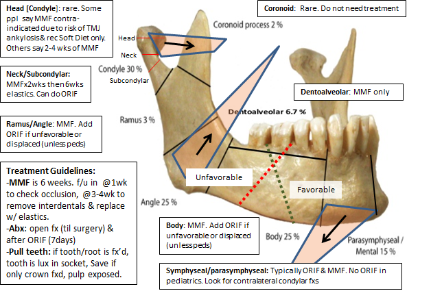

------
------------------------------------------------------------------

## layout: default

title: Facial Trauma Guide

#### 
Guidelines

- 
Not all traumas need to be seen by ENT service when resident is not in house

- 
On call resident must be called for all fractures as per previous ED practice

- 
All imaging must be reviewed by on call resident at time of call

- 
As outlined below, Category 1 patients do not need to be seen, unless deemed necessary by Resident after reviewing imaging. On call Resident will see every patient in Category 2.

- 
ALL pediatric facial trauma should be seen in ED, regardless of category (Pediatric Trauma service should be consulted as well)

- 
All trauma consults that come in from 7 am to 5 pm will be seen, regardless of Category.

- 
All fractures, even if Category 1, will be seen in ED if they have lacerations that require ENT repair

- 
Any patient transferred to Tufts from OSH for ENT/Facial trauma evaluation must be seen ED

- 
Any patient with specific concern raised by ED attending will be seen in ED

- 
All outpatients/discharges should have followed up scheduled within 1 week of trauma as outlined below -- Resident will coordinate this and provide information to the ED

#### 
Timing of Trauma
Follow up

**Timing of Trauma**
 | 

**Follow up**
 | 

Mon-Wed
 | 

By end of week
 | 

Thur
 | 

Friday or beginning of following week
 | 

Fri-Sun
 | 

Beginning of following week
 | 

- 
Exception is operative nasal bone fractures, which should be seen earlier so that they may be seen in clinic and taken to OR in appropriate time.

**

- 
Adult -- arrange clinic follow up in 2-3 days, plan for OR in 7-10 days

- 
Pediatric -- clinic follow up ASAP, plan for OR in 4-6 days

#### 
Category
1: Facial fractures that do not require evaluation in the ED

- 
Nasal bone fracture w/o concern for septal hematoma

- 
Maxillary sinus fractures

- 
Zygomatic arch fracture

- 
Orbital floor fracture (has been evaluated by Ophtho and IOP/fundoscopic exam/visual acuity normal and no subjective vision complaints **ie no entrapment)**

- 
Mandible fracture (non displaced and no intraoral lacerations)

- 
ZMC fracture (if concomitant floor component then same rules as #4 apply)

- 
Medial orbital wall/ lamina papyracea fractures with no visual complaints and normal Ophthalmology evaluation

- 
Lateral orbital wall fractures with no visual complaints and normal Ophthalmology evaluation

- 
Frontal process of maxilla

- 
Isolated anterior nasal spine

#### 
Category 2: Facial fractures requiring evaluation in the ED

- 
Nasal bone fracture with concern for septal hematoma

- 
Orbital floor fracture with abnormal Ophthalmologic exam or subjective visual complaints

- 
Mandible fractures (w/ Intraoral lacerations requiring repair, bilateral condylar fractures or concern for airway, or displaced/mobile segments that may require bridle wiring)

- 
All LeFort fractures

- 
All frontal sinus fractures

#### 
Category
3: Temporal bone fractures

- 
Resident must be called, imaging must be reviewed

- 
Isolated squamous temporal bone fractures, or any temporal bone with no involvement of otic capsule, facial nerve, middle ear, or subjective hearing loss, does not require ENT consultation. Patient should be seen in follow up in 2 weeks.

- 
If involves carotid canal, consider CTA

- 
Bloody otorrhea should be managed with drops (Floxin or equivalent, 5 gtt BID) but does not require evaluation. Must set up outpatient follow up 1 week.

- 
If patient is being admitted, must be seen by ENT in house within 24 hours

- 
tuning fork on all awake patients

#### 
Trauma Red Flags

- 

Penetrating Trauma: Levels of Neck- explore level II.

- 

Enophthalmos, Proptosis, EOM, PERRL, Pain on motion,
diplopia

- 

Clear otorrhea, hemotympanum, perforation, abnormal tuning
fork,

- 

Clear rhinorrhea, Perforated septum, septal hematoma,

- 

Trismus, Malocclusion, Teeth fractured,

- 

C-spine tenderness

- 

Abnormal Cranial Nerve exam

## 
Mandible Fractures and
their management

\

In general: Locking plates: preferred because they are less likely to
bring segments of bone towards the plate when screwing

#### 
Mandible Fracture
Plates

load sharing (lag-screw plates, compression plates, miniplates)

load bearing (big recon bars - needed for comminuted fractures and
atrophic edentulous patients

#### 
Mandible
Fracture repair by site:

- 

Symphysis and parasymphysis: require two plates or one recon bar,
MMF = 24G. Simple can be MMF alone

- 

Body: MMF or MMF w/ ORIF and 2 straight plates or a recon bar.
Recon bar for edentulous fractures

- 

Angle: recommended two plates for ORIF with a champy plate to
prevent pivoting of the tension band or MMF for simple
fractures.

Pediatric Mandible Fractures:

In general just do MMF as ORIF on mandible may affect dentition. Open
at 7-10days for physiotherapy

**Younger than 2 years**---Before age 2, a child's jaws
are often edentulous. splint with

circummandibular wires. Can wire through the pyriform aperture.

2--5 years: Interdental wiring. Arch bars are difficult

5--8 years, deciduous molars may be used for fixation,

7--11 years, the primary molars and incisors may be used for
fixation.

9--12 years---MMF w/ arch bars.

[Back to homepage](index.html)

