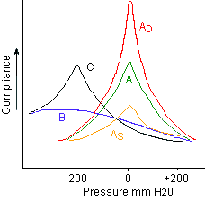

<h2 class="unnumbered" id="otology---clinic-guide">Otology - Clinic Guide</h2>
<h4 class="unnumbered" id="sillmannoonan-clinic">Sillman/Noonan Clinic</h4>
<ul>
<li>
Use the new patient or follow up visit templates for the physician exam

<ul>
<li>
For the ear exam: use the microscope. Put “Microscopic exam in the ear section”
</li>
<li>
For vertigo patients: do dix-hallpike, head thrust, rhomberg, Fukuda stepping tests +/- checking vibratory sensation, finger to nose prn
</li>
</ul></li>
<li>
Assessments in the assessment/problem section with the ICD-9 codes
</li>
<li>
Keep the plans short. Put a plan for each problem listed.

<ul>
<li>
including discussions regarding dry ear precautions. Put observation if no specific plan was proposed
</li>
</ul></li>
<li>
Put in the Attestation template and replace the *** with your name
</li>
<li>
Under follow up, put the time frame + “sooner prn.” Do NOT press done
</li>
</ul>
<h3 class="unnumbered" id="audiology">Audiology</h3>
<ul>
<li>
<strong>PTA (pure tone)</strong>: Hearing sensitivity at 500,1000,2000Hz
</li>
<li>
<strong>SRT</strong> - lowest threshold <strong>spondee</strong> can be repeated 50% of time
</li>
<li>
<strong>WRS (word rec)</strong> - % correct of a 50 word list of <u>monosyllabic phonetically balanced words.</u> Given at 40dB greater than SRT
</li>
<li>
<strong>Hearing loss levels:</strong> go down by 15dB starting at &lt;25dB
</li>
</ul>
<blockquote>

<strong>Audiogram symbols</strong>: Right = O, Left = X (triangle for right masking, square for left masking → THINK ROLEX)

</blockquote>
<h4 class="unnumbered" id="audiogram-patterns">Audiogram Patterns</h4>
<ol type="A">
<li>
<strong>2kHz notch</strong> (air-bone) otosclerosis
</li>
<li>
<strong>4kHz notch</strong> (SNHL) - noise exposure
</li>
<li>
<strong>Cookie bite</strong> – hereditary
</li>
<li>
<strong>Low Frequency</strong> (SNHL) — Meniere’s
</li>
</ol>
<h4 class="unnumbered" id="tympanometry">Tympanometry</h4>
<blockquote>

<strong>Ad = <u>D</u></strong>eep for <strong><u>d</u></strong>iscontinuity

As= <strong><u>s</u></strong>hallow for oto<strong><u>s</u></strong>clerosis /ossicular fixation

B + volume wnl: OME

B + large volume: perforation

C: ETD, retraction

</blockquote>
<h4 class="unnumbered" id="acoustic-reflex-testing">Acoustic Reflex Testing</h4>

Image to the right are common patterns (Red = absent. Green = present)

<strong>Right/Left</strong>: the side of the sound stimulus.

<strong>Ipsilateral/Contralateral</strong>: side that the reflect stimulus is detected.

<strong>Note</strong>: Acoustic reflexes should be <u>absent</u> in <u>CHL</u> (otosclerosis etc) <u>unless</u> patients have <u>semicircular canal dehiscence.</u>

<strong>OAEs</strong>: <u>T</u><strong>EOAE - newborn testing.</strong> <u>D</u>POAE - think <u>d</u>ouble tones (2 pure-tone freq.) DPOAE are good f or screening ototoxicity/noise toxicity

<strong>ECoG</strong>: Basically measuring Wave I on a ABR. The big thing to know is <strong><u>&gt;0.45 SP/AP</u></strong> is associated with <strong><u>Meniere's</u></strong>

<strong>ABR</strong>: <strong><u>Wave V latency</u></strong> (&gt;0.2ms) due to retrocochlear pathology

<ol type="A">
<li>
Abnormal wave I-V and III-V latency = CHL
</li>
</ol>

  
<a href="../index.html">Back to homepage</a>

