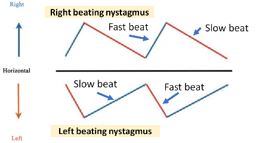

## 
Neuro-otology Imaging

**CT Temporal Bone**:

**Stenvers/Perpendicular** view: a long-axis projection of the petrous portion of the temporal bone, perpendicular to axis of cochlear (best for seeing cochlear implant electrode array) and is used to depict the **round** window, **tegmen**, as well as other structures.

The **Poschl/Parallel** view, a short-axis view of the petrous pyramid, was used to optimally visualize the **superior semicircular canal**

#### 
How to Read Temporal Bone Images

**Divide into:** EAC, Middle Ear, Inner Ear, Petrous Apex, Intratemporal Facial Nerve

**External Auditory Canal (EAC):**

- 

Necrotizing otitis externa: inflamed EAC and auricle w/ bony erosion of inferior EAC. T1 w/ contrast: cellulitis enhances. Same with T2

- 

Cholesteatoma: eroding mass in inferior, posterior EAC. MRI shows T1 iso/hypointense.T2 intermediate/high intensity. DWI is bright (aka restricted)

- 

Keratosis Obturans does not have bony destruction

- 

Exostoses (swimmers ears): typically at suture lines and are bilateral.

- 

Osteomas: Typically ovoid \1.5mm. Look for Mondini malformation: think Pendred's

- 

Hypoplastic CN8: If \

 | 

Tissue Type
 | 

 | 

 | 

 | 

Fat
 | 

Soft Tissue
 | 

CSF/Water
 | 

Edema
 | 

Best for
 | 

T1W
 | 

↑
 | 

↔︎
 | 

↓
 | 

↓
 | 

Marrow, Fat, SAH
 | 

T1W w/ Gad
 | 

↔︎
 | 

↔︎/↑
 | 

↓
 | 

↓
 | 

Infection, Tumor, Inflamation
 | 

T2W
 | 

↓
 | 

↔︎
 | 

↑
 | 

↑
 | 

Nerves
 | 

FIESTA/CISS
 | 

↓
 | 

↓/↔︎
 | 

↑
 | 

↑
 | 

Membranous labyrinth/IAC/Nerves
 | 

FLAIR
 | 

↑
 | 

↔︎
 | 

↓
 | 

↑
 | 

Epidermoids, SAH
 | 

DWI
 | 

↓
 | 

↔︎
 | 

↓
 | 

↑
 | 

Cholesteatomas
 | 

Pathology:

 | 

T1
 | 

T2
 | 

T1 w/ Gad
 | 

Notes
 | 

Vestibular Schwannomas
 | 

↔︎
 | 

↑
 | 

↑
 | 

Brighter than meningiomas on T2, Meningiomas tend to be broad against dural surface
 | 

Glomus tumors (paraganglioms)
 | 

↔︎
 | 

↑
 | 

↑
 | 

Salt & Pepper appearance of T1
 | 

Epidermoids/Arachnoid Cysts
 | 

↓
 | 

↑
 | 

↓
 | 

 | 

Cholesterol Granuloma
 | 

↑
 | 

↑
 | 

↑
 | 

 | 

Cholesteatomas
 | 

↔︎
 | 

↑
 | 

↔︎
 | 

Lights up on DWI
 | 

### 
Vertigo

#### 
History

- 

Time course of sensation

- 

Seconds: BPPV

- 

Minutes to hours: Meniere's, vestibular migraines

- 

Days: Vestibular neuritis, labyrinthitis

- 

Constant: Central

- 

Accompanying symptoms:

- 

Ear fullness/hearing loss: Meniere's

- 

Fatigability

- 

Photophobia: vestibular migraines.

- 

Occurs with loud sounds: SCCD.

- 

Syncope: Neuro cardiogenic syncope.

- 

Relation to movement/Head position

 
 | 

Peripheral Vertigo
 | 

Central Vertigo
 | 

Intensity
 | 

Severe
 | 

Mild
 | 

Fatigability
 | 

Fatigues
 | 

Does not fatigue
 | 

Associated symptoms
 | 

Nausea, sweating
 | 

Falls, weakness, numbness
 | 

Eye closure
 | 

Worse with eye closure
 | 

Better with eye closure
 | 

Nystagmus
 | 

Horizontal
 | 

Vertical
 | 

Fixation/suppression
 | 

Fixation suppresses nystagmus
 | 

No effect
 | 

95% of Vertigo can be diagnosed by asking about hearing loss and time course:

 | 

Episodic vertigo
 | 

Constant vertigo
 | 

Hearing Loss
 | 

Meniere's
 | 

Labyrinthitis
 | 

Normal hearing
 | 

BPPV
 | 

Vestibular Neuritis
 | 

#### 
Physical exam for Vertigo

- 

Test hearing with tuning forks

- 

Test cranial nerves

- 

Nystagmus: **nystagmus named in direction of fast phase**

- 

Does fixation help the vertigo (test by removing fixation: frenzel googles. Turning off lights, asking pt to close eyes)

- 

Gets worse when looking to the side of the lesion

- 

Vertical nystagmus = central

- 

Smooth pursuit: if patient cant track eyes smoothly: CNS pathology

- 

Test vestibulospinal reflex: Fukuda stepping test/Romberg

- 

Check for BPPV:

- 

**Dix Hallpike**: have head turned to one side then drop patient flat with head hanging slightly backwards. Repeat for both sides. Rotatory nystagmus occurs on the side of the lesion. Posterior SCC most common site

- 

**Head-shake test:**

**

Ask patient to close eyes then shake head (lateral rotation left and right) twice a second (2Hz) for 15-20 seconds. Ask them to open eyes. **Fast phase = towards lesion**

- 

**Head Impulse test/Head Trust**

**

Hold head and quickly rotate it toward one ear while patient fixates on your nose. If their eyes don't stay locked on you, patient has lesion on the side you rotate them towards

- 

**Oscillopsia test**: a quick test to evaluate for bilateral vestibular loss: Have patient do a head shake test while reading a snellen chart. If visual acuity significantly different than at rest, suspect b/l vestibular dysfunction

Additional testing

**VNG/ENG**: If you have a nystagmus graph. Use ur arms to determine which side. Ur left arm can be parallel to left sided slow beating.

#### 
Caloric Testing

- 

Normal nystagmus response: Cold Opposite Warm Same (COWS)

- 

It's the only test for horizontal SCC. Test works by comparing sides. Can't detect bilateral lesions - will need rotary chair for this)

- 

Interpreting results

- 

Unilateral weakness (UW): UW \>25-30% = abnormal

- 

Directional preponderamce (DP): classic teaching is that DP \>30% = signficiant

- 

DP towards central lesion/away from peripheral lesion

#### 
Rotary Chair

- 

Used to determine bilateral vestibular impairment (aminoglycoside toxicity)

- 

Gain: normal is 1, decreased in acute peripheral disease, normalizes with time

- 

If gain is still abnormal, patient would benefit from vestibular rehab

- 

Phase lead - exaggerated in peripheral disease

**VEMP** (cervical to SCM)

- 

cVEMP evaluates saccule (vertical acceleration) -\> inferior vestibular nerve

- 

oVEMP evaluates utricle (horizontal acceleration) -\> superior vestibular nerve

- 

Unilateral decreased **amplitude** - peripheral lesion

- 

Decreased **threshold** - SCC dehiscence or perilymph fistula

- 

Increased **threshold** - middle ear pathology or ossicular chain abnormalities

#### 
Other

- 

**vHIT**: basically a recorded head impulse test

- 

**Computer Dynamic Posturography**: expensive test to test proprioception

#### 
Vignettes

- 

Down beating nystagmus with lateral gaze- Arnold chiari malformation (low medulla lesion)

- 

Bilateral INO lesions- lag dysmetria with lateral gaze. This is MS.

### 
Causes of Vertigo

#### 
Perilymph Fistula

-sudden SNHL w/ vertigo s/p trauma

-Tullio's phenomenon (vertigo w/ loud sound) Hennebert's sign: (vertigo w/ pneumatoscopy)

-Tx: bedrest, stool softeners, avoid straining

#### 
Superior Semicircular Canal Dehiscence

-vertigo, autophony, Tullio's & Hennebert's sign, aural fullness

-Audiogram: CHL, supernormal bone conduction. cVEMP (↓threshold, ↑amplitude), **acoustic reflexes are present**

-CT Temporal Bone: Get Porshl's view

-r/o otosclerosis with acoustic reflexes (otosclerosis: reflexes would be negative)

#### 
BPPV - Clinical Practice Guideline

-Dix-Hallpike: offending side=side closer to the ground. Nystagmus: geotropic (posterior SCC BPPV). If strong hx & neg dix-hallpike. Consider Lateral SCC BPPV and perform supine test

-Assess patient's home safety/risk of falling + ability to perform Epley

\-**No** i**maging or vestibular testing or vestibular suppressants** for those who have symptoms+exam findings of BPPV

-Can offer observation, vestibular rehab, or Epley maneuver: Dix hall pike to the offending side. Wait for nystagmus to stop, rotate head to contralateral side. **Hold head** and ask patient to rotate onto stomach, then have them tuck heels to bum and sit up. **Repeat** until nystagmus is gone

-can do Semont maneuver. Ask patient to keep head elevated for 48hours.

-patients w/ migraines and motion refractory take longer to recover. F/u in 4-6 weeks. If refractory, send to neurology to r/o migraines and get MRI to r/o retrocochlear pathology.

-surgery Tx: singular Neuroectomy (historic) posterior SCC occlusion (pack Posterior SCC with bone wax)

#### 
Meniere's Disease

Symptoms (Tetrad): FATE: Fluctuating SNHL (low-mid frequency), aural fullness, tinnitus, episodic vertigo. Typically unilateral. Bilateral in 25%. Can have sudden loss of consciousness or drop attacks (Crisis of Tumarkin).

Dx: Audiogram & ECoG: SP/AP \>0.35

Tx: restrict salt intake \<1.5g/day, avoid EtOH, caffeine, even out water consumption

**Acute Vertigo** (diazepam 5-10mg q12hrs/lorazepam 0.5-1mg q6hrs + zofran 4mg q8hrs +/- Benadryl 25-50mg q4-6hrs)

**Maintenance therapy**: HCTZ 50mg qdaily

**Surgery**: endolymphatic sac decompression, transtympanic gentamycin injection (0.5 to 0.75 mL of a 40 mg/mL solution of gentamicin into middle ear space)

#### 
Other causes of vertigo

Cogan Syndrome: if patients have rapidly progressing blurry vision (interstitial keratitis) w/ vertigo + fluctuating SNHL. Tx: High dose steroids

Labyrinthine Concussion: BPPV like symptoms after trauma

[Back to homepage](../index.html)

