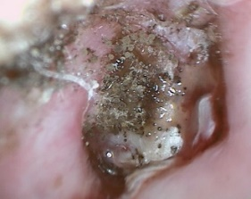

<h2 class="unnumbered" id="otitis">
Otitis
</h2>
<h4 class="unnumbered" id="acute-otitis-externa-clinical-practice-guideline">
Acute Otitis Externa -- Clinical Practice Guideline
</h4>
<ul>
<li>

``<strong>Diagnosis`</strong>: rapid onset (over 2 days) + ear pain, itchiness, fullness + EITHER signs of ear canal fullness (tenderness of tragus/pinnae) OR diffuse canal edema. Otorrhea is not needed for diagnosis. `<strong>MCC`</strong>: P aeruginosa + staph aureus. `<strong>Eval for`</strong>: Hx of T2DM, HIV, hx of XRT/immunocompromised. `<strong>Check for`</strong> TM perforation/Tubes -- ciprodex/ofloxacin are the only drops if perforation/tubes are present. `<u>If cranial nerve palsy or granulation tissue on inferior aspect of canal (at bony-cartilaginous junction)`</u>: consider malignant otitis externa (which is AOE + osteomyelitis of skull base)

</li>
<li>

`<strong>Tx`</strong>: `<strong>Topical Abx:`</strong> Ciprodex/cipro HC, cortisporin, acetic acid (Vinegar), Vosol HC (acetic acid+hydrocortisone). Dosing should be at least BID, for 7-10days Don't give systemic antibiotics unless patients are high risk: T2DM, HIV, `<strong>Tell patients how to apply otic drops`</strong>: lie with affected ear up. Put drops. Tragus pump to help. Stay in position x3-5mins.

</li>
<li>

When to place ear wick: If EAC edema means TM cannot be seen

</li>
<li>

`Follow up should be in 2-3 days

</li>
</ul>
<h4 class="unnumbered" id="malignant-otitis-externa">
Malignant Otitis Externa
</h4>

-granulation tissue in EAC at bony-cartilaginous junction

-CN7→X→XI involvement

-Technetium-99 (osteoblastic) to establish dx

Gallium-67 to follow.

-Tx: anti-pseudomonas Abx. Topical antibiotics. Debridement. Hyperbaric oxygen

<h4 class="unnumbered" id="chronic-otitis-externa">
Chronic Otitis Externa
</h4>

-\>6weeks of persistent OE.

-first try `<strong>mineral oil`</strong> 2-3 drops at night. F/U in 2 months

-next can try `<strong>DermOtic`</strong> (fluocinolone) if that doesn't work

<h4 class="unnumbered" id="fungal-otitis-external-otomycosis">
Fungal Otitis External (Otomycosis)
</h4>

MCC: aspergillus. Exam shows sheets of keratin with black conidophores on top of white filamentous hyphae. Tx: acetic acid (vinegar) vs c`<strong>lotrimazole 1% solution (lotrimin)`</strong>, glucose control, dry ear precautions. Consider gentian violet or methyl-cresyl actate for refractors cases

<h3 class="unnumbered" id="tinnitus-clinical-practice-guideline">
Tinnitus-`<strong>Clinical Practice Guideline`</strong>
</h3>

- definitely get audiogram for tinnitus that is unilateral, persistent (\>6months) or associated with hearing loss. Note: Dr. Sillman says every tinnitus patient should get an audiogram as they often have high-tone SNHL (if hearing loss, can recommend hearing aids)
  

  

  -In general, don't get imaging. Only get imaging if tinnitus + either unilateral/asymmetric hearing loss or neurological abnormalities
  

  

  -Tx: can observe for bothersome tinnitus that has lasted for \<6months. For tinnitus that is bothersome & persistent (\>6months) guideline recommends: `<strong>sound therapy`</strong> (white noise machine), `<strong>cognitive behavior therapy`</strong>, and `<strong>hearing aids`</strong> (ONLY IF patients have hearing loss). Guideline recommend against: dietary supplements, deep-brain stimulation, medical therapy. Dr Sillman also likely to recommend meditation.
  

  <h3 class="unnumbered" id="otosclerosis">
  Otosclerosis
  </h3>
  <ul>
  <li>
  

  Ask: Progressive CHL beginning in 20-40yo. Strong family history (`<strong>Autosomal Dominant w/ incomplete penetrance)`</strong>. Often have tinnitus. Hear better in noise
  

  </li>
  <li>
  

  Exam: Schwartze sign (red hue behind TM). Audiogram: look for Carharts notch @ 2kHz (CO2: Carhart notch in Otosclerosis at 2Khz). Absent acoustic reflex. Shallow tympanometry (As: for Oto`<u>s`</u>clerosis)
  

  </li>
  <li>
  

  DDx: SSCD (has present acoustic reflexes). Congenital stapes fixation (CHl since birth), Ossicular fixation (2/2 tympanosclerosis: presents w/ same findings/audiogram -- hard to differentiate), Paget's disease/Osteopetrosis (imaging is different)
  

  </li>
  <li>
  

  Tx: hearing aids or stapedectomy (criteria for stapedectomy: 25dB air-bone gap) w/ good bone line, good word rec)
  

  </li>
  <li>
  

  Stapedectomy: things to check:
  

  <ol type="A">
  <li>
  

  Only 1 good ear = contraindication. If both ears are bad: initial surgery on poorer ear
  

  </li>
  <li>
  

  Check CT for:
  

  <ol type="1">
  <li>
  

  Widened IAC: associated w/ stapes gusher
  

  </li>
  <li>
  

  Check for middle meningeal artery: patients may have persistent stapedial artery.
  

  </li>
  </ol>
  </li>
  </ol>
  </li>
  <li>
  

  Floating footplate: if footplate becomes mobile after stapes superstructure removed
  

  <ol type="A">
  <li>
  

  If retrievable, remove. If non-retrievable: abort and wait for plate to refix
  

  </li>
  </ol>
  </li>
  </ul>
  <h3 class="unnumbered" id="facial-nerve">
  Facial Nerve
  </h3>
  

  `<strong>Intracranial segment`</strong>: gives of Nervus intermedius -- contributes to GSPN and chorda tympani -\> `<strong>meatal`</strong>: through IAC to fundus -\> `<strong>labyrinthine`</strong>: shortest segment -- goes to geniculate ganglion and gives of GSPN \[gives off pregang. Parasymp to lacrimal gland\] -\> `<strong>tympanic`</strong> : goes inferior to HSCC & above oval window/stapes (which is why you down-fracture stapes) -\> mastoid segment
  

  

  `<strong>Management of FN paralysis`</strong>:
  

  <ul>
  <li>
  

  `<strong>HBI`</strong>-`<strong>V (Day 0-14)`</strong>: Give 14 day course of prednisone and have them f/u within 1 week. If progressed to HBVI at f/u, get a ENoG,
  

  </li>
  <li>
  

  `<strong>HBVI (Day 0-3):`</strong> Give 14 day course of prednisone, f/u within 1 week
  

  </li>
  <li>
  

  `<strong>HBVI (Day3-14)`</strong>: Get ENoG. If \>90% degeneration: Get EMG: decompress nerve if EMG is negative, observe if positive. If \<90% degeneration: give Prednisone.
  

  </li>
  </ul>
  <h4 class="unnumbered" id="bells-palsy-clinical-practice-guideline">
  Bell's Palsy -- Clinical Practice Guideline
  </h4>
  

  Dx: typically rapid onset unilateral FN paresis or paralysis. `<strong>R/O stroke, parotid mass, systemic/infection`</strong>. Ask about `<strong>Sarcoidosis`</strong> (Heerfordt fever). Guidelines say: `<strong>no lab or imaging tests needed`</strong>. If complete paralysis (HBVI) can `<em>offer`</em> ENoG/EMG (get after 7 days). If HBI→HBV: don't get nerve testing
  

  

  Tx: `<strong>eye protection`</strong>: tape eyes shut at night, eye drops + `<strong>steroids within 72hrs of symptoms:`</strong> at least 5 days of high dose then taper. Can add antivirals but meh evidence. `<strong>f/u in 3 months`</strong> sooner if ocular symptoms or new/worsening neurological symptoms
  

  

  Counsel: recover starts in 2-3 weeks, typically complete in 3-4months. HBVI (complete paralysis): 70% chance of recovery. HB1→HBV: 94% of recovery.
  

  <h4 class="unnumbered" id="sudden-sensorineural-hearing-loss---clinical-practice-guideline">
  Sudden Sensorineural Hearing Loss - Clinical Practice Guideline
  </h4>
  

  -non-CPG recommendations are in `<em>italics`</em>
  

  

  -audiometric criteria: decrease in hearing of \>30db in 3 consecutive frequencies
  

  <ol>
  <li>
  Clinician's should exclude CHL
  </li>
  <li>
  Assess for modifying factors: check for bilateral SNHL, recurrent episodes, associated vertigo or eye symptoms or focal defects
  </li>
  <li>
  Do not order CT head/brain for presumptive SSNHL.
  </li>
  <li>
  Obtain audiogram to confirm diagnosis
  </li>
  <li>
  Do not obtain lab testing
  </li>
  <li>
  We SHOULD r/o retrocochlear pathology w/ MRI, ABR, or audio followup
  </li>
  <li>
  Counsel patients on natural history of idiopathic SSNHL:
  

  \~1/3 to 2/3 of patients recover some function within 2 weeks.
  

  

  If no return of hearing within 2 weeks, less likely to recover
  

  </li>
  <li>
  Can (but not required) initiate steroid treatment (prednisone 1mg/kg/d (max 60mg/d), methylprednisone 48mg/d or decadron 10mg/d) for 7-14 days then taper over similar time. Offer up to 6 weeks out.
  </li>
  <li>
  Can give hyperbaric oxygen therapy within 3 months of disease
  </li>
  <li>
  Don't give any other meds (antivirals, thrombolytics, vasodilators, antioxidants)
  </li>
  <li>
  Can offer intratympanic steroids for those who fail initial therapy"
  </li>
  <li>
  Decadron: 24mg/mL or 16mg/mL (compound) or 10mg/mL (stock)
  </li>
  <li>
  Methylprednisolone: 30-40mg/mL
  </li>
  <li>
  Inject 0.4-0.8mL into middle ear q3-7 days for 3-4 sessions. Keep head and affected ear up for 15-30mins after injection
  </li>
  <li>
  Repeat audio in 6 months
  </li>
  <li>
  If no improvement, should offer hearing aids
  </li>
  </ol>
  

  `<a href="../index.html">Back to homepage`</a>
  

