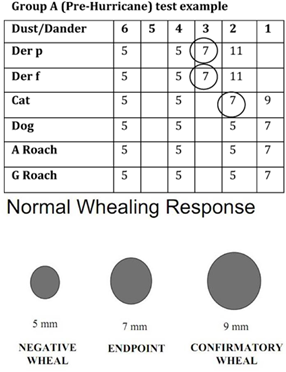
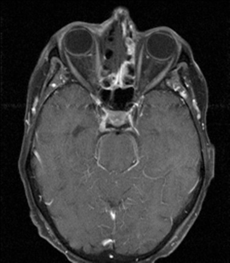
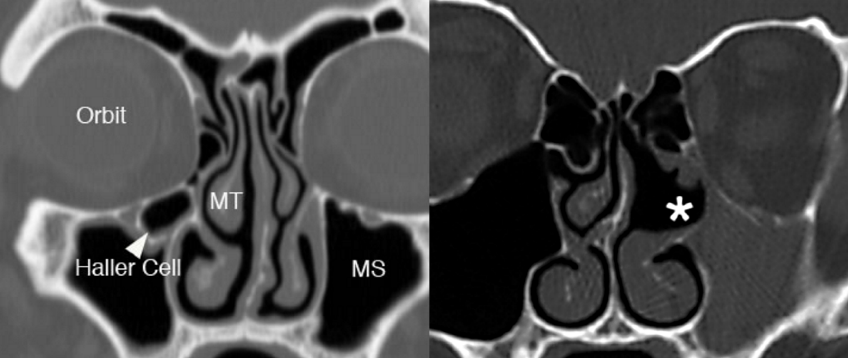
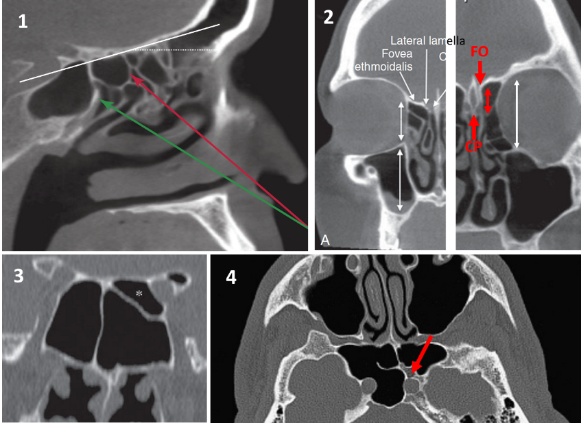
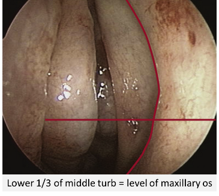
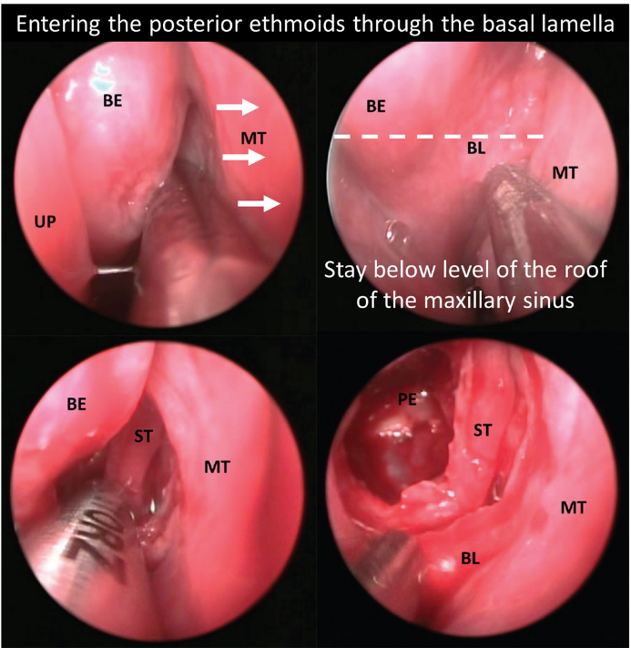

<!-- BEGIN Rhinology section imported from pocket guide -->
<h1 class="unnumbered" id="rhinology">
Rhinology
</h1>
<h2 class="unnumbered" id="rhinology-clinic-guide">
Rhinology Clinic
Guide
</h2>
<h3 class="unnumbered" id="allergy">
Allergy
</h3>
<h4 class="unnumbered" id="allergic-rhinitis-clinical-practice-guideline">
Allergic Rhinitis --
Clinical Practice Guideline
</h4>
<ol type="I">
<li>

Dx: nasal congestion, rhinorrhea, itchy nose or sneezing with an
allergic etiology

</li>
<li>

Workup: can treat empirically but if no response or if you want
to target therapy get allergy testing (aka: pretty much always get
allergy testing)

<ol type="A">
<li>
Ask about allergies to pollen, animals, insects, molds.
</li>
</ol>
</li>
<li>

Medical treatment:

<ol type="A">
<li>

Nasal steroids (Flonase/Nasacort/Nasonex/Rhinocort)

</li>
<li>

Can give oral 2``{=html}nd``{=html} gen antihistamines if sneezing,
itching

</li>
<li>

Can give intranasal antihistamines for seasonal or episodic AR
(Olopatadine/Azelastine/Dymista) 1-2 sprays 1-2x/day

</li>
<li>

Don't give Montelukast

</li>
</ol>
</li>
<li>

Avoidance:

<ol type="A">
<li>

Dust: dust resistant mattress covers, hard floors, plastic pillow
cases, acaricides (chemicals that kill dust mites)

</li>
<li>

Mold: dehumidify basements, clean fridge, throw away old blankets
etc

</li>
<li>

Pollen: air filters, keep windows closed

</li>
<li>

Animals: shoot the animals (jokes) but can recommend washing
animals more frequently (not great evidence)

</li>
</ol>
</li>
<li>

`<strong>`{=html}Inferior turbinate reduction:`</strong>`{=html} can be offered if
allergic rhinitis \_ nasal obstruction+ enlarged inferior turbinates +
failed medical management. Dr. Rebeiz likes to offer one side at a time
to see if patients get a response before he does the other
side.

</li>
<li>

Can offer immunotherapy for refractory cases:

<ol type="A">
<li>

Subcutaneous Immunotherapy (SCIT)

<ol type="1">
<li>

Higher risk of anaphylaxis

</li>
<li>

Give 5-20ug of allergan. Given in physician's office

</li>
<li>

More likely to be covered by insurance

</li>
<li>

More likely to cause SOB, wheezing

</li>
</ol>
</li>
<li>

Sublingual Immunotherapy (SLIT)

<ol type="1">
<li>

Probably safer and more effective

</li>
<li>

1``{=html}st``{=html} dose in office. After that, administered at
home

</li>
<li>

More likely to cause GI upset

</li>
</ol>
</li>
</ol>
</li>
</ol>
<blockquote>

`<strong>`{=html}Allergy testing`</strong>`{=html}:

</blockquote>
<ol type="I">
<li>

`<u>`{=html}Skin testing`</u>`{=html}: contraindicated in eczema, uncontrolled
asthma, cardiovascular disease or on beta-blockers (Can do blood tests
on these patients instead). `<strong>`{=html}Patients should stop antihistamines
48-72hrs prior`</strong>`{=html}

</li>
<li>

Intradermal Skin Allergies Testing: Inject 0.01-0.02mL of antigen
into dermis with 27G needle to make a 2-3mm wheal. Dilute the extract
100-1000 times less than the concentration for skin extract. Wheal and
flare is read in 15-20 minutes. Increase concentration 1:5 until wheal
enlarges (use 1ml of previous strength + 4ml of dilute)

</li>
</ol>
<h4 class="unnumbered" id="allergens-will-associated-oral-allergy-triggers">
``{=html}Allergens (will associated
oral allergy triggers)
</h4>

`<strong>`{=html}Spring`</strong>`{=html} --- trees (birch) → Apples, Peaches, Carrots,
Peanuts

`<strong>`{=html}Summer`</strong>`{=html} --- grass → dates, orange, tomato,
watermelon

`<strong>`{=html}Summer/Fall`</strong>`{=html} --- Mugwort → celery, carrots

`<strong>`{=html}Fall`</strong>`{=html} --- Ragweed → bananas, melon

`<strong>`{=html}Nighttime`</strong>`{=html} --- dust mites

`<strong>`{=html}Cross-reactive oral allergens`</strong>`{=html}:

Peach → 55% of apple, plum, pear

Cantaloupe → 92% avocado, banana, kiwi

Latex → 30-50% avocado, banana, kiwi

Pediatric Allergens

Most likely to resolve - Cow's milk & Eggs

Least likely to resolve with age - Tree nuts, then peanuts)

<h3 class="unnumbered" id="other-causes-of-rhinitis">
Other causes of
Rhinitis
</h3>

`<strong>`{=html}Acid reflux`</strong>`{=html}. MCC of rhinitis. Especially at
night.

`<strong>`{=html}Rhinoscleroma:`</strong>`{=html} nasal deformity 2/2 klebsiella

`<strong>`{=html}Rhinosporidososis`</strong>`{=html}: strawberry friable nasal mass 2/2
rhinosporidium seebri

`<strong>`{=html}Nonallergic rhinitis w/ eosinophilia Syndrome
(NARES):`</strong>`{=html} associated w/ aspirin allergies.

`<strong>`{=html}Rhinitis of pregnancy`</strong>`{=html}: avoid afrin. Consider
turbinate reduction

`<strong>`{=html}Atrophic Rhinitis`</strong>`{=html}: Includes empty nose syndrome.

`<strong>`{=html}Rhinitis Medicamentosa`</strong>`{=html}: due to overuse of afrin

`<strong>`{=html}Vasomotor Rhinitis`</strong>`{=html}: diagnosis of exclusion.

<h3 class="unnumbered" id="sinusitis-clinical-practice-guideline-italicized-not-part-of-guidelines">
Sinusitis
-- Clinical Practice Guideline (`<em>`{=html}Italicized`</em>`{=html} = not part of
guidelines)
</h3>

`<strong>`{=html}ARS`</strong>`{=html}: purulent nasal `<strong>`{=html}drainage`</strong>`{=html}
accompanied by nasal `<strong>`{=html}obstruction`</strong>`{=html}, facial
`<strong>`{=html}pain`</strong>`{=html}-pressure fullness,

or both. `<strong>`{=html}Suspect Acute Bacterial Rhinosinusitis (ABRS) if
symptoms \>10days or get better then worse.`</strong>`{=html} If you see
patients w/ symptoms \<10days, this is likely viral: give Flonase,
nasal saline, Tylenol/ibuprofen.

`<strong>`{=html}ABRS:`</strong>`{=html} amox or augmentin x5-10days (doxycycline or
levoquin or moxifloxacin for PCN allergic patients). Can do watchful
waiting for 7 days in reliable patients. If no improvement after 7 days:
give antibiotics (if watchful waiting) or change antibiotics (if patient
given amox/augmentin, do doxycycline, Levaquin, or combo clindamycin +
3``{=html}rd``{=html} gen cephalosporin)

`<em>`{=html}`<u>`{=html}Frontal sinusitis`</u>`{=html}: treat more aggressively`</em>`{=html}

`<strong>`{=html}Recurrent ABRS`</strong>`{=html}: 4+ episodes a year with periods
where symptoms are gone/

`<strong>`{=html}Chronic Rhinosinusitis`</strong>`{=html}: \>12 weeks of symptoms.
Confirm diagnosis with clinical exam (anterior rhinoscopy, nasal
endoscopy) or CT sinus. Patients should be evaluated for asthma, cystic
fibrosis, immunocompromised state, and ciliary dyskinesia +/- allergy
and immunology testing. Patients should be evaluated for polyps.

Tx: Flonase and/or saline. Some evidence that macrolides or
budesonide rinses maybe useful for CRS w/ polyps but not officially
recommended. Don't give antifungals.

`<em>`{=html}If no response to Flonase, can give course of oral steroids (2-4
week) + antibiotics (macrolides especially -- for 3-6 weeks) at same time
(especially for CRSw/ polyps)`</em>`{=html}

<h4 class="unnumbered" id="allergic-fungal-rhinosinusitis">
Allergic
Fungal Rhinosinusitis
</h4>
<ol type="I">
<li>

Major Criteria (Bent & Kuhn)

<ol type="A">
<li>

Type 1 hypersensitivity (skin or serology testing)

</li>
<li>

Nasal poylps

</li>
<li>

Double density sign on CT sinus

</li>
<li>

Eosinophilic mucus w/o fungal invasion

</li>
<li>

Positive fungal stain of sinus content

</li>
</ol>
</li>
<li>

``{=html}`<strong>`{=html}Mycetoma (Fungal
Ball)`</strong>`{=html}: typically aspergillus (Y-shaped 45 degree septated
hyphae) in one sinus treated with surgery

</li>
<li>

Tx: oral/nasal steroids. Surgical debridement

</li>
</ol>
<h4 class="unnumbered" id="invasive-fungal-sinusitis">
Invasive Fungal
Sinusitis
</h4>
<ol type="I">
<li>

Seen in immunocompromised (diabetics, transplant pts,
HIV+)

</li>
<li>

Typically Mucor (nonseptate 90degree broad based)

</li>
<li>

Dx: MRI shows T1 w/ gad: absent mucosal enhancement (2/2
necrosis) -- invasion outside sinus is enhanced.

</li>
</ol>
<h3 class="unnumbered" id="nasal-polyps">
Nasal Polyps
</h3>

Causes: CRS, Cystic Fibrosis, Trauma, Churg-Strauss

Ask: Asthma? ASA sensitivity? (Samter's Triad = severe, recurring,
recalcitrant form of disease)

R/O: encephalocele, inverted papilloma, glioma, antrochoanal polyp
(retention cyst of max sinus that protrudes through antrum). `<strong>`{=html}Get
CT scan, allergy test`</strong>`{=html}

Surgical Tx: Do FESS -- polypectomy, sphenoidethmoidectomy, max
antrostomy. Send specimen to r/o inverted papilloma

Medical Tx : aggressive allergy mgmt`<strong>`{=html}, flonase`</strong>`{=html} +/-
rhinocort aqua (Budesonide) or Azelastine HCl 137mcg/spray (H1 blocker)
\[2 sprays BID\], avoid ASA

`<em>`{=html}Severe disease`</em>`{=html}: consider low-dose steroids, budesonide
rinses, corticosteroid eluding stents (propel)

<h3 class="unnumbered" id="inverted-papilloma">
Inverted Papilloma
</h3>
<ol type="I">
<li>

Caused by HPV 6/11. Have Schneiderian mucosa on path
report

</li>
<li>

Tend to be unilateral + vascular. Occur on lateral nasal wall.
Require Medial Maxillectomy. Freq involve middle turbinate

</li>
<li>

10% risk of becoming SCCA

</li>
</ol>
<h3 class="unnumbered" id="other-nasal-mass-vignettes">
Other Nasal Mass
Vignettes
</h3>
<ol type="1">
<li>

Bluish mass behind middle turbinate in adolescent male w/ hx of
epistaxis→ Juvenile Nasopharyngeal Angiofibroma

</li>
<li>

Friable mass on septum in pregnant women → pyogenic granuloma
(Lobular capillary hemangioma)

</li>
<li>

Unilateral OME in elderly Chinese male → Nasopharyngeal
CA

</li>
<li>

Nasal mass in wood and leather workers → adenocarcinoma

</li>
<li>

Brown friable mass that has bimodal distribution (teens and
elderly) → esthesioneuroblastoma

</li>
<li>

Male with a few years of clear rhinorrhea and nasal obstruction
develops septal perforation, rapidly progressive ulceration around nasal
cavity → Lethal Midline Granuloma

</li>
</ol>
<h3 class="unnumbered" id="epistaxis-1">
Epistaxis
</h3>

`<strong>`{=html}Anatomy`</strong>`{=html}

<ol type="I">
<li>

Anterior bleeds : 1) int carotid -\> ophthalmic -\> ant.
ethmoid 2) ext carotid -\> facial -\> superior labial 3) ext carotid
-\> int max -\> greater palatine 4) ext carotid -\> int max -\>
sphenopalatine

</li>
<li>

Posterior bleeds: 1) ext carotid -\> int max -\>
sphenopalatine 2) ext carotid -\> ascending pharyngeal

</li>
</ol>
<h4 class="unnumbered" id="hereditary-hemorrhagic-telangiectasia">
Hereditary Hemorrhagic
Telangiectasia
</h4>

Autosomal dominant. Tx: NdYAG laser. `<strong>`{=html}Saunder's
dermoplasty`</strong>`{=html}: removal telangiectic mucosa and replaced with STSG
`<strong>`{=html}Young's procedure`</strong>`{=html}: close nasal cavity. For acute bleeds
in the ED: surgiflo works well.

<h3 class="unnumbered" id="adult-obstructive-sleep-apnea">
Adult
Obstructive Sleep Apnea
</h3>

`<em>`{=html}See Dr. Wein's Head & Neck clinic section for Inspire
patients`</em>`{=html}

`<strong>`{=html}Apnea`</strong>`{=html} = cessation of nasal air pressure \[defined as
90% of baseline\] (for \>10secs)

`<strong>`{=html}Hypopnea`</strong>`{=html}:

<ul>
<li>

30+4 criteria: drop in 30% of baseline nasal air pressure + 4% O2
desat (for \>10 secs)

</li>
<li>

30+3/arousal criteria: drop in 30% of baseline + 3% O2 desat
`<strong>`{=html}or`</strong>`{=html} an arousal (\>10secs)

</li>
</ul>

`<strong>`{=html}AHI`</strong>`{=html}: Apnea+hypopnea per hour. AHI \> 5 = OSA.
\>15 = moderate. \>30 = severe

`<strong>`{=html}RERA`</strong>`{=html}: Arousal preceded by inc. respiratory effort
(for \>10sec)

`<strong>`{=html}RDI`</strong>`{=html}: Apnea+hypopnea+RERA/hour

`<strong>`{=html}Central Apnea:`</strong>`{=html} cessation of respiratory effort
during apnea. \>5 central apneas/hour = primary central sleep
apnea.

<h4 class="unnumbered" id="evaluation">
Evaluation
</h4>
<ul>
<li>

Perform fiberoptic scope w/ exam to determine site of
collapse:

</li>
<li>

Nose: septum, turbinates, nasal valve → improves CPAP compliance,
doesn't affect AHI

</li>
<li>

Nasopharynx: Adenoids?

</li>
<li>

Velopharynx: do `<strong>`{=html}mullers maneuver`</strong>`{=html}: attempt to
breathing in with mouth/nose closed. `<strong>`{=html}If \>50%
collapse`</strong>`{=html}→ retropalatal/retrolingual collapse
(velopharynx)

</li>
<li>

Can address with uvulopalatopharyngoplasty (UPPP) or lateral
pharyngoplasty (but this can make air leak w/ CPAP worse).
Midface/Mandibular advancement for severe cases

</li>
<li>

Oral Cavity: tonsillar hypertrophy

</li>
<li>

OP/Hypopharyngeal: lingual tonsillectomy, genioglossal
advancement, hyoid suspension, INSPIRE placement

</li>
</ul>
<h3 class="unnumbered" id="zenkers-diverticulum">
Zenkers
Diverticulum
</h3>

Presents w/ dysphagia and regurgitation of indigested food

`<strong>`{=html}Pulsion`</strong>`{=html} diverticulum at Killians Triangle (between
cricopharyngeus and inferior constrictor). Occurs on left side 90% of
time

<h3 class="unnumbered" id="nasal-cavitysinus-cancer">
Nasal Cavity/Sinus
Cancer
</h3>

Ask: about exposure to heavy metals and job (woodworkers inc. rate of
SCCA (if soft wood work) and Adenocarcinoma (if hard wood))

`<strong>`{=html}Types`</strong>`{=html}:

SCCA, Adenocarcinoma (in wood/leather workers), Adenoid Cystic (slow
groeth), Melanoma (bad), Esthesioneuroblastoma (teens and elderly)
Rhabdomyosarcoma (pleomorphic MC in adults). Chordoma (from clivus/skull
base) or chondro/osteosarcomas: bad. Juvenile Nasopharyngeal
Angiofibroma (bluish mass at post. Aspect of middle turbinate. Consider
preop embolization, hormonal therapy)

<h3 class="unnumbered" id="otolaryngologic-manifestations-of-autoimmune-diseases">
Otolaryngologic
Manifestations of Autoimmune Diseases
</h3>

`<strong>`{=html}W.A.S.: Autoimmune`</strong>`{=html} laryngeal manifestations →
Wegener's=supraglottic. Amyloid = Glottic. Sarcoidosis= Subglottic

`<strong>`{=html}Wegener's (Granulomatosis with Polyangiitis GPA):`</strong>`{=html} MC
H&N symptom recurrent sinusitis. Also associated w/ septal
perforation, chronic otitis, subglottic stenosis. Order c-ANCA

`<strong>`{=html}Amyloidosis`</strong>`{=html}: causes macroglossia, deposits on TVF.
Requires biopsy for diagnosis

`<strong>`{=html}Sarcoidosis`</strong>`{=html}: can cause `<u>`{=html}supraglottic`</u>`{=html} mass
(epiglottis) w/ TVF immobility. Also risk of FN palsy (w/ uveitis and
parotitis = Heerfordt's disease) Order ACE levels

<h2 class="unnumbered" id="surgical-planning-the-ct-sinus-scan">
Surgical
Planning: The CT Sinus Scan
</h2>
<h4 class="unnumbered" id="maxillary-antrostomy">
Maxillary
Antrostomy
</h4>
<ul>
<li>

Look at coronal & axial

</li>
<li>

Identify uncinate process and its relation to medial orbital
wall`<strong>`{=html}. Check that it is not lateralized as a lateralized uncinate
= easy orbital entry`</strong>`{=html}

</li>
<li>

Look for `<strong>`{=html}Haller cells`</strong>`{=html} (infraorbital cells) as
thse crowd middle meatus and can be hard to reach

</li>
<li>

Look on floor of maxillary sinus for retention cyst/polyp (if
present, may need angled instruments)

</li>
</ul>

``{=html}

Figure 8: (Left) Haller cell (Right) Lateralized uncinate process.
Palmer and Chiu, `<em>`{=html}Atlas of Endoscopic Sinus and Skull Base
Surgery`</em>`{=html}.

<h4 class="unnumbered" id="ethmoidectomysphenoidectomy-figure-8">
Ethmoidectomy/Sphenoidectomy
(Figure 8)
</h4>
<ul>
<li>

Sagittal Look at `<strong>`{=html}slope of skull base`</strong>`{=html} the more it
slopes, the lower your entry through the basal lamella should be (image
1 below)

</li>
<li>

The height of the skull base doesn't matter as much as the
difference between the height of the `<strong>`{=html}roof of maxillary to height
of skull base`</strong>`{=html} matters. Maxillary sinus roof is ur landmark, if
the maxillary sinus roof is high, and skull base is low, u may enter
basal lamella too high (image 2)

</li>
<li>

Keros classification: Distance between fovea ethmoidalis &
cribriform plate. Type I: 1-3mm; Type 2: 3-7mm; Type 3 (most dangerous)
7-16mm (Image 2)

</li>
<li>

Identify `<strong>`{=html}onodi cells`</strong>`{=html} (check coronals) - this is
a posterior ethmoid cell superior or lateral to sphenoid. Important
because the sphenoid isn't posterior to it but the optic nerve/apex is!
(Image

<ol start="3" type="1">
<li>
</li>
</ol>
</li>
<li>

Check i`<strong>`{=html}ntrasinus septum of sphenoid`</strong>`{=html} (check
axials) to make sure its doesn't lead to carotid (Image 4)

</li>
</ul>
<h4 class="unnumbered" id="frontal-sinusotomy">
Frontal Sinusotomy
</h4>
<ul>
<li>

Check sagittal. Determine `<strong>`{=html}anterior-posterior dimension of
frontal recess`</strong>`{=html}. If small, stripping the mucosa in the recess =
high likelihood of restenosis

</li>
<li>

Check for extra cells

<ol type="A">
<li>

Around bullae: retrobullar, suprabullar, frontal bullar,

</li>
<li>

Around orbit: supraorbital ethmoid cell

</li>
<li>

Around frontal recess

<ol type="1">
<li>

`<strong>`{=html}Agger nasi`</strong>`{=html}

</li>
<li>

Type 1 (the 1st cell above agger nasi)

</li>
<li>

Type 2 any cells that are above Type 1 but don't go into frontal
sinus

</li>
<li>

Type 3, any cell that extends into frontal sinus

</li>
<li>

Type 4 within frontal sinus

</li>
</ol>
</li>
</ol>
</li>
</ul>

``{=html}

Figure 9: Palmer and Chiu, Atlas of Endoscopic Sinus and Skull Base
Surgery.

<h2 class="unnumbered" id="rhinology-or-guide">
Rhinology -- OR Guide
</h2>
<h3 class="unnumbered" id="rebeiz-fess-set-up-procedure">
REBEIZ FESS SET
UP / PROCEDURE
</h3>
<ul>
<li>

TELL ANESTHESIA: Ancef or clinda, NOT before cultures are taken.
ETT to the left (no oral rae) no eye protection.

</li>
<li>

PATIENT SET-UP: Gel donut head rest. No turning, bring bed south
a bit away from anesthesia, mild reverse tberg. Nothing on the eye (no
ointment, no tegaderm). Make sure headpiece screws are tightened. Tuck
arms. Throat pack (vag pack). Pack nasal cavity with afrin. Prep with 5%
betadine just on nose. Drape with blue towels: 1 over lip and 1 above
fusion forehead, no towel clamps, split sheet.

</li>
<li>

EQUIPMENT/FUSION SET-UP: Tower on opposite side, slave tower on
surgeon side. Fusion monitor under surgeon monitor. Set up fusion:
attach forehead sticker and adjust the sticker on fusion screen to
match. Fusion sensing probe 1 fist away from face. Drape fusion with
lahey bag. Register fusion first before anything! After registered and
confirmed, remove probe and register two fusion suctions (curved and
straight). Suction should be connected with silastic tubing. Do not open
microdebrider unless rebeiz wants it. If microdebrider is used, ask
scrub to set it up first (takes time to calibrate) 0 degree 4mm rigid
hopkins rod, white balance and focus. Fred on patient's right cheek. Wet
sponge too.

</li>
</ul>

SURGERY:

<ul>
<li>

``{=html}`<strong>`{=html}Inject`</strong>`{=html} 1%
lido + epi : root of middle turb and lateral nasal wall. Inject with
patties in place in middle meatus

</li>
<li>

Remove packs, use upbiting forceps to medialize middle
turb.

</li>
<li>

`<strong>`{=html}`<u>`{=html}Turbinoplasty`</u>`{=html}`</strong>`{=html} with up biting tru-cut
along inferomedial, inferior, inferolateral surface of middle turb and
hold medially for 30 secs

</li>
<li>

`<strong>`{=html}`<u>`{=html}Uncinectomy`</u>`{=html}`</strong>`{=html}: Use `<strong>`{=html}ostium
seeker`</strong>`{=html} to probe max ostium. With `<strong>`{=html}cottle`</strong>`{=html},
perform uncinectomy, then remove inferior portion with a small
`<strong>`{=html}backbiter`</strong>`{=html}. Use `<strong>`{=html}ostium seeker`</strong>`{=html} to pull
the superior uncinate and remove with a `<strong>`{=html}upbiting
tru-bite`</strong>`{=html}. Used `<strong>`{=html}curved navigation suction`</strong>`{=html} to
confirm you've opened it up.

</li>
<li>

`<strong>`{=html}`<u>`{=html}Widen maxillary antrostomy`</u>`{=html}`</strong>`{=html} by excising
the posterior fontanelle posterior to the maxillary os with a
`<strong>`{=html}straight tru-bite`</strong>`{=html}

</li>
<li>

`<strong>`{=html}`<u>`{=html}Anterior ethmoidectomy`</u>`{=html}`</strong>`{=html} enter ethmoid
bullae with suction, remove pieces with `<strong>`{=html}blakesley
forcep`</strong>`{=html}

</li>
<li>

`<strong>`{=html}`<u>`{=html}Posterior ethmoidectomy`</u>`{=html}`</strong>`{=html}: identify basal
lamella (horizontal/vertical portion). Enter basal lamella with a
`<strong>`{=html}j curette`</strong>`{=html} on inferior/medial aspect below level of the
roof of the maxillary sinus

</li>
</ul>

``{=html}

Figure 10: Palmer and Chiu, Atlas of Endoscopic Sinus and Skull Base
Surgery.

<ul>
<li>

`<strong>`{=html}`<u>`{=html}Sphenoidotomy`</u>`{=html}`</strong>`{=html}: anterior face of sphenoid
= 7cm from nasal sill. Find it medial to superior turbinate or the
bolger's box method (the box is superior turbinate \[medial\], lamina
papyracea \[laterally\], skull base, basal lamella: locate it
inferior/medially). Use a straight tru-bite to transect lower 1/3 of
superior turbinate to better visualize sphenoid os, then use j curette
to enlarge os `<strong>`{=html}laterally`</strong>`{=html}

</li>
<li>

Come back along skull base using `<strong>`{=html}J
curette`</strong>`{=html}

</li>
<li>

`<strong>`{=html}`<u>`{=html}Frontal sinusotomy`</u>`{=html}:`</strong>`{=html} Enter frontal sinus
with `<strong>`{=html}ostium seeker`</strong>`{=html} then curved suction. Take down the
superior part of the uncinate if that hasn't already been done. If there
is an agger nasi cell, get a `<strong>`{=html}45 or 70 degree scope`</strong>`{=html} and
take down `<u>`{=html}inferior`</u>`{=html} part of agger nasi. `<u>`{=html}Do not strip
mucosa`</u>`{=html}. A lot of people just do balloon dilation for frontal
sinus

</li>
<li>

Pack and repeat on other side. 

</li>
</ul>

Closing:

<ul>
<li>

Surgiflo in middle meatus. Suction surgiflo, place kennedy pack
in middle meatus. Irrigate nasal cavity to inflate pack then place
bactroban around pack in middle meatus. Suction floor of nose to
nasopharynx.

</li>
<li>

Benzoine along nasal tip. Tie kennedy packs and secure to dorsum
with steristrips. Remove throat pack.

</li>
</ul>

Post-op: 

<ul>
<li>

Keflex or clinda (if permanent packing in place)

</li>
<li>

f/u a week (Tuesday or Thursday)

</li>
</ul>
<h3 class="unnumbered" id="soneru-fess-set-up-procedure">
SONERU FESS SET
UP / PROCEDURE
</h3>
<ul>
<li>

Soneru typically sends pre-operative antibiotics, steroids, and
nasal saline rinses (NeilMed Sinus Rinse)

</li>
<li>

Once in the OR, intubate patient and tape the tube to the left
lower lip.

</li>
<li>

Turn 90 Degrees counter-clockwise. Video tower should be at the
left side of the patient's head across from where you will stand.
Medtronic Stealth Navigation tower will be place to the right of the
video tower.

</li>
<li>

Place Afrin soaked pledgets in bilateral nasal cavities.

</li>
<li>

Microdebrider, Medtronic navigation instruments, and FESS trays
are needed for standard FESS

</li>
<li>

Have suction electrocautery and nasopores for hemostasis

</li>
</ul>
<!-- END Rhinology section -->

`<a href="index.html">`{=html}Back to homepage`</a>`{=html}

