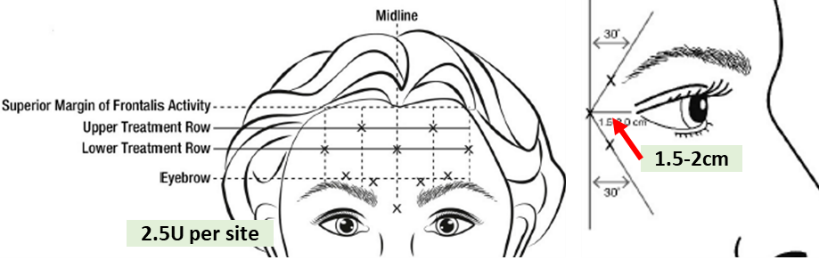

# Facial Plastics – Clinic Guide

## Injectables: Botox

* **Horizontal Rhytids**: Procerus (glabella) & Frontalis (raises brow)
* **Vertical Rhytids**: Corrugator supercilii

### Technique

Dilute to 1.25U per 0.1cc (8cc in a 100U vial):

* If 60U in 3mL from OR (20U per mL) → add 1.8cc NS
* If 20U in 1mL from OR (20U per mL) → add 0.6cc NS \n Inject 0.2cc (2.5U) in each site (X) below

 

## Rhinoplasty – Clinical Practice Guideline

* Preop eval: sleep apnea, body dysmorphia, bleeding disorders, Rhinitis medicamentosa (e.g. Afrin abuse)
* Exam - assess for nasal airway obstruction
  * adenoids, caudal/septal deviation, inferior turbinates, nasal valve (Cottle/modified Cottle), septal spur, sinus ostia
* Preop pain: Decadron 8–10mg, iced gauze on nose intraop
* Postop: saline + Flonase rinses, avoid nasal packing. NSAIDs ok
* Avoid periop Abx >24 hrs; don’t routinely pack unless bleeding
* Follow-up at 1 year to assess satisfaction

# Facial Analysis (Rhinoplasty Focus)

## I. Frontal View

* A. Base of nose = bottom of earlobe
* B. Divide face into:
  * Vertical fifths → intercanthal distance
  * Horizontal thirds:

    
    1. Upper 1/3 = **trichion** to **glabella**

       
       1. Forehead: flat vs sloping
    2. Middle 1/3 = glabella to **subnasale**
    3. Lower 1/3 = subnasale to **menton**
* Nose thirds (line at the superior aspect of ULC and inferior aspect of ULC):
  * Superior 1/3 \[radix to cephalic edge of ULC\] = nasal bones
    * Should be 75% of intercanthal distance
    * Deviations treated with osteotomies
  * Middle 1/3 \[cephalic to caudal edge of ULC\]= middle vault
    * Assess brow-tip aesthetic line
    * Inverted V = short bones, weak ULC, dorsal hump reduction → spreader grafts
    * Think nasal valve dysfunction if narrow
    * Crooked nose → septoplasty, ULC disarticulation, osteotomies
  * Lower 1/3 = nasal tip: comment on double break and divergence of medial crura
    * Domes of medial crura = divergence. Goal is 50-60%
    * Narrow tip = pinched tip. This is tip bulbousness (different from base bulbousness)

## II. Lateral View

* Describe nasofrontal angle: \~120degrees (115-130)
* Radix—shallow, normal, deep
* Describe dorsal profile - dorsal hump?
* Define projection
  * Line from nasion/sellion to tip defining point.
    * **3-4-5 ratio (Crumley's method):** Vertical line peripendicular to frankfort's horizontal line through alar groove. Then a horizontal line from this line to nasal tip and a line connecting the other two lines. Ratio should be 3 to 4 to 5
    * \*\*Goode's ratio: \*\*line perpendicular to alar groove and line from tip to rhinion/glabella: 0.5-0.6
    * **Simons** method: tip to subnasale is 1:1 with subnasale to upper lip.
    * **120 deg nasofrontal:** Line from glabella to nasion to line between nasion and supratip point = 120
    * **If over projected:** push on tip to determine supports: springy - support is crura, if hard, support is from septum
    * Define rotation with nasolabial angle
    * Angle at subnasale of columella to infratip point
      * Should be 90-105 deg in males and 95-110 in females
        * More narrow in men and ethnic groups due to midface retrusion
      * **If wide nasolabial angle.** Tip is overrotated - typically due to caudal septal excess
      * Assess alar rim and columella show
      * **Columella show**; alar rim should be 2-4mm above columella
      * Supratip break - where dorsum ends and tip begins: usually 1-3mm above tip defining point
      * Tip projection: Tip defining point: should "lead" dorsum by 1-2 mm.
      * Infratip break - when infratip lobule meets columella
      * Define Zero-meridian for chin (Gonzalez-Ulloa method)
      * Line perpendicular to frankfort's horizontal line and through Nasion and vermillion/cutaneous junction of lower lip
        * Pogonion should be infront of this line in men and behind this line in women
      * Microgenia = small chin. Retrognathia: class II occlusion, backwards displacement of chin but normal size.
      * Other measurements that are tested
      * If a line from the nasion to the menton is drawn. The nasion to the subnasale should be 43% and the subnasale to menton should be 57%
      * Width of nasal bone should be 75-80% of alar base width

        ar base width

        \

 

## III. Oblique View

* Tip should align with malar eminence
* Evaluate brow-tip line
* Pseudohump =  middle vault is smaller than bony vault

## IV. Basal View

* Tip at midline of eyebrows, base at medial canthi
* Dome divergence ideally = 120°
* Lobule–columella ratio = 1/3 to 2/3s
  * Shape of nasal base should be a triangle. If it is a trapazoid - tip is bulbous
  * Base should be same width as distance between medial canti. Increasing tip projection narrows base
  * Nostrils should be oval. Asymmetry should be worked up (due to dislocation of caudal septum off maxillary spine, alar retraction
* Assess length of medial crura and footplate
* If they are short - deprojection should be at the base. If they are long, deproject at the lobule

## Points on the Face

* Trichion → superior margin of forehead
* Nasion → depression at root of nose where the nasofrontal suture is
* Sellion → deepest nasofrontal point
* Rhinion → between the ULC and nasal bone
* Pogonion → most anterior border of chin
* Menton → most inferior aspect of chin
* Gonion → most posterior/inferior point of angle of mandible

## Problems

I. **Narrow Nasal Valve**

* Angle between septum & lower border of ULC
* Worse with osteotomies with hump removal
* Spreader grafts help

II. **Uneven transition from medial portion of brow to tip of nose**

III. **Bulbous Tip**

* Fix by trimming scroll (ULC/LLC junction)

IV. **Crooked Nose**

* Septoplasty
* ULC disarticulation (divide where they join the septum at the rhinion)
* Osteotomies
* Fracture central compartment,
* Crushed cartilage along side walls of nose

V. **To Increase Tip Projection:**

* 1–2 mm: shield graft in pocket of tip
* 2 mm: suture a columella strut between the medial crura
* Transdomal suture. Lateral crus steel

VI. **To Decrease Tip Projection:**

* A. Full transfixion incision
* B. Shorten crura ± shield graft if crura is a major support
* C. Radix graft to give illusion of deprojection

VII. **To Increase Tip Rotation:**

* A. Hump reduction
* B. Excision of caudal septum (if there is caudal septal show)
* C. Shorten lateral crura (will decrease projection)
* D. Shield graft

VIII. **To Decrease Tip Rotation:**

* A. Trim caudal septum near spine
* B. Augment dorsum

**IX. To Decrease Bulbosity:**

* Trim cephalic lateral crura

**X. To Narrow Tip:**

* Suture medial crura or domes (interdomal stitch)

**XI. External Valve Collapse:**

* Use alar batten graft

## Complications

I. **Rocker Deformity**

* Medial osteotomy too high → re-do cephalic fracture lower on the nasal bone
* Osteotomies should be medial → lateral

II. **Inverted V / Open Roof**

* Due to inadequate lateralization
* or incomplete osteotomy
* or if the perpendicular plate of the ethmoid is deviated

III. **Polly-Beak (Late)**

* A. Causes:

  
  1. (MCC) Inadequate dorsal hum reduction
  2. Inadequate tip support (e.g. overresection of LLC)
  3. Inadequate resection of anterior septal angle
  4. Supratip scar formation
* Most commonly due to under correction of cartilaginous dorsum (incomplete dorsal reduction), but can be overresection of lower lateral cartilages causing a loss of tip support. Worse in patients with thick skin or if tip deprojects due to scarFix with columella struts

IV. **Saddle Nose**

* Over-resection of septum or failure to preserve L strut

## Approaches

I. **Endonasal**

* Intercartilaginous: between ULC–LLC
* Transcartilaginous: through LLC (to help narrow nasal tip)
* Delivery: Marginal incisions + intercartilaginous

II. **External**

* Best exposure for suturing grafts

