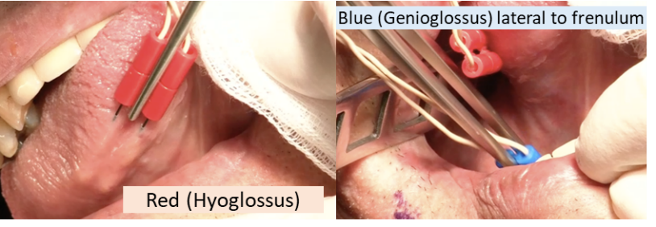
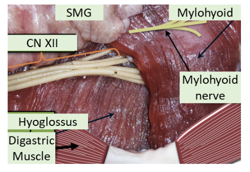

## 
Head & Neck -- OR
Guide

### 
Dr.
Tracy's Radial Forearm Free Flap

**Raising the flap**

Prep:

Shave arm

Prep arm, shoulder, chest with Chloraprep while someone holds the
arm, and prep the head and neck in the usual fashion

Tuck half sheet covered with towels under the flank. Arm needs to
rest on arm board, place sterile drape on arm board.

Place a towel around the armpit and use Edna to clip it. Then, wrap a
sponge around the thumb to supinate the forearm and clip the sponge to
the arm board with an Edna.

Then cover the arm with towel to keep sterile.

Dr. Tracy will then wrap the arm with an elastic wrap to drain it off
its venous supply. Then the tourniquet will be applied as a setting of
250 and a timer for 1 hour starts.

Begin by incising the lateral aspect of the skin paddle to find the
Cephalic vein which is preserved and follow it all the way up to the
antecubital fossa. Next use forceps to find the vascular pedicle then
you can raise the flap on the contralateral side and isolate and tie off
the vascular pedicle and start lifting the flap

### 
Dr. O'Leary's
Thyroidectomy

Laryngeal nerve monitoring tube is needed and the Medtronic NIM
monitor. No paralytics, and needs antibiotics. Watch anesthesia's
glidescope to ensure that the blue stripe is adjacent to the vocal
cords. Place the gel ax roll as the shoulder roll and recheck the tube
placement with the glidescope. Attach the nerve monitor consul at the
head of the bed and tape it in place. Ensure that the nerve monitor is
working appropriately by tapping in the neck. Mark the neck along a
nerve crease if possible 2-3 cm above the sternal notch. Inject with 1%
lidocaine with epi. Prep with betadine.

### 
Dr. Dhingra's Thyroidectomy

Inject incision in preop.

Make generous incision 2 inches above the sternum then make the
incision down past the platysma on both sides and use the Bovie to
develop yourself sub-platysmal flaps. Use your finger as a come hither
motion to get them going and work a free edge. Go down to the sternum on
the inferior flap. Go up to the cricoid/thyroid notch superiorly.

Then travel down midline kind of like you would do with a trach. Use
kelly's to present the midline fascia for someone to divide with the
bovie.

Keep going making sure you're a midline until you come down to the
thyroid. Be careful inferiorly because there is a plexus of vessels and
become very vascular. Here use the ligasure to make sure you don't make
anything bleed.

Once you found the thyroid then you want to work the sternothyroid
off the thyroid to develop the lateral edge of the thyroid. To do this,
get two peanuts: one using to retract the thyroid towards you and the
other to push on the undersurface of the sternothyroid to elevate it
off. Once you have enough of an edge, ask for the lady finger for
someone to retract. Once you've developed the lateral edge, keep doing
it up towards the superior pole. Here there are a lot of vessels so be
sure to use the Ligasure.

This is the part to pay attention to: developing the superior pole is
the one of three or four critical steps. You should not look for the
superior laryngeal nerve necessarily but you should be cognizant of the
cricothyroid muscle.

Once you have freed the superior pole you can develop the middle a
little bit more but don't get too deep/posterior. This is when you have
to check to see where your current laryngeal nerve is remember the
different landmarks.

- 

Located in simon's triangle: trachea, carotid, and inferior
lobe.

- 

RLN is deep to berry's ligament

- 

Tubercle of Zuckerkandl: RLN is medial to it. Superior thyroid is
superior to it

- 

Left RLN is more medial than right RLN. Left RLN is reliably deep
to inferior thyroid a

- 

Superior Parathyroid is posterior to RLN. Inferior parathyroid is
anterior to RLN

In reality you're going to use a snit forcep spreading in the
direction of the nerve and using the stimulator. Once you found it
follow superiorly and inferiorly see that you are confident of the plane
typically people follow it all the way into its insertion.

Once you've done that you can free the rest of the middle and
inferior pole of the thyroid and of the trachea. You can do this
relatively quickly as the nerve is protected. Once the thyroid only
attached to the trachea, use a Kelly and spread along the trachea in the
midline superior to inferior (you can use a bovie to take it off the
trachea as well as the plane is pretty well developed). Then you can
transect half of it and do the otherside. Dump some thrombin soaked
Gelfoam into the resected area close the straps with 3-0 Vicryl. Close
the platysma with 4-0 Vicryl and close the wound with a subcuticular 5-0
Monocryl.

### 
Dr Wein Thyroidectomy

Similar set up to Dhingra's. When you lift the upper subplatysmal
flap, roll skin over a wet 4x8 gauze and suture to mandible with 2-0
silk to retract it. Use 3 lone stars on lower flap. Split the straps.
Free the middle of the thyroid. Use middle finger on gauze to retract
thyroid towards you. Use a ladyfinger to retract straps. Bipolar through
fascia. When you approach superior pole, hug gland. Dr Wein doesn't
necessarily go hunting for the nerve

### 
Dr Wein INSPIRE Hypoglossal Nerve Implants

**Set Up:**

- 

Patient rotated 180. Tube taped to the left

- 

Place shoulder roll. Tuck right arm. Leave mouth
open

- 

NIM Monitor (NIM 3.0): 3 lead setup:

- 

Leads 1 & 2 go into tongue (include=blue,
exclude=red)

- 

Lead 3 (purple) goes into marginal mandibular

Figure 11: INSPIRE Implant Training, 2016

**Incisions:**

Neck: 4-6cm starting from anterior aspect of submandibular gland to
\~1cm from midline.

Mark EJ, SMG, midline, hyoid, mandible

Implant Pocket: 5cm inferior to clavicle. 5.5cm in length. Between
deltopectoral groove & sternum

Sensor: Use inferolateral margin of pec (should be 5^th^
intercostal space)

 4-5cm incision lateral to
nipple line

**Prep**

- 

Betadine from upper lip to mid abdomen. As far lateral as you can
go to just past midline

- 

1020 drape just above mandible (so tongue is visible)

- 

Drap off the rest. Then place ioban from superior to
inferior.

- 

Split drape: drap up to head. Then half-drape around head &
top of 1000 drape (allow tongue to still be visible

**Steps:**

**Neck**: Incision through past platysma. Watch out for
marginal mandibular (its just under platysma). Dissect to find
mylohyoid/digastric tendon junction. If you first find the ant. belly of
digastric, follow it posteriorly to digastric tendon. Then tunnel under
DG tendon to free the entire length of posterior margin of mylohyoid.
Retract mylohyoid anteriorly. This exposes the Ranine vein and the
hypoglossal nerve.

Isolate nerve fibers of hypoglossal nerve. Use bipolar NIM electrode
to determine inclusion (GGh, GGo, T/V)/exclusion (HG/SG) fibers. Use
vessel loop to help retract nerve to pass stimulator cuff around
inclusion fibers

Pass stimulator under digastric tendon then tie stimulation lead to
anterior belly of digastric. Pack w/ baci-soaked gauze

**Implant Pocket**: Incision down to but not through pec
major fascia. Dissect pocket inferiorly to about 6cm deep

Throw 2 silk sutures on medial edge of incision one 1cm superior to
the other (vertical plane)

**Sensor lead**: Incision on 5th intercostal space.
Serratus fibers = most superficial running lateral to medial (inserting
on ribs). External intercostals: run superior/lateral to inferior/medial
(looks like packing tape). Make incision on medial aspect of incision
through ext intercostals and dissect through until internal intercostals
(running superior/medial to inferior/lateral) are seen.

Use malleable to dissect plane btw ext & int intercostals
(medially between ribs). Insert electrode. Fix sensor to ext
intercostals w/ 4x 3-0 silk on RB-1

**Tunnels:** Use tunneling shaft from neck incision to
implant incision (avoid ext jugular) in the subplatysmal plane. Then
tunnel from implant incision above pectoralis to sensor lead incision.
Pass sensor leads from neck and chest sensors to implant. Put leads into
implant. Screw in (press down and rotate for 4 clicks). Tie implant to
pocket with 2-0 silks

Close: 4-0 or 3-0 vicyrl for deeps. 5-0 monocyrl for superficial.
Wash incision. Steri-stripes (perpendicular along incision than 3
parallel to incision to hide any blood stains. Unmarked 4x8 Gauze over
incision taped down with Medipore tape

**Post-op**

No antibiotics

Pain medication

Give post-INSPIRE d/c instructions

Get Lateral Neck and CXR in PACU. Make sure patient has no
PTX

[Back to homepage](../../../index.html)

