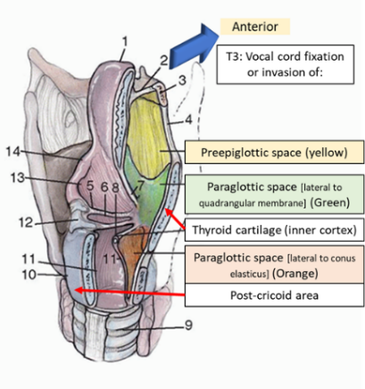

## 
Head &
Neck Staging - 8^th^ Edition

- 

AJCC 8th Edition Staging

- 

GENERAL THEMES: For Oral Cavity, Oropharynx, Hypopharynx,
Salivary Gland, Thyroid CA (in general)

T1---\

N category
 | 

HPV Negative
 | 

N1

 

 | 

**Single** ipsilateral, \6cm

N3b: ENE_positive_

 | 
- 

For Nasopharyngeal and P16 positive

HPV Positive
 | 

ipsilateral **\6cm
 | 

- 

Tumor Staging

Head & Neck Cancer Staging (for most cancers)

 
 | 

N2
 | 

N3
 | 

T1
 | 

I
 | 

IVA
 | 

IVB
 | 

T2
 | 

II
 | 

T3
 | 

\*except Nasopharynx, p16 positive OP, salivary, thyroid CAs

### 
 ORAL CAVITY

T category
 | 

 T0

Tis

 | 

 No primary identified

Carcinoma in situ

 | 

 T1
 | 

 \4cm or DOI \>10mm
 | 

 T4a

 Invades

- 
**

Mandible (into cortex)

Inf. alveolar nerve

FOM

Skin

Tongue musculature

 | 
 | 

Invades

Masticator space

Pterygoid plates

Skull base

Carotid

\*note similarities to T4b of p16_neg_ OPC

 | 

 

### 
OROPHARYNGEAL

**HPV Neg (p16-) and HPV Pos**

Tx

 No primary identified
 | 

 

 \4cm or extension to lingual surface of epiglottis
 | 

 same
 | 

 T4

- 

Larynx

- 

Tongue musculature

- 

Medial pterygoids

- 

Hard palate

- 

Mandible

**T4a** - Same

**T4b** - Invades

- 

Lateral nasopharynx

- 

Lateral pterygoids/pterygoid plate

- 

Skull base

- 

Carotid

Red = only for p16 negative OP cancers

Clinical N staging

**Note: ECE** automatically **bumps you up a N
stage in the pathological N grading system** (not
shown).

Basically, if you have a N1 node and path shows ECE then its becomes
a N2a node.

With Pathological N Staging

HPV Positive - clinical
 | 

HPV Positive - Pathological
 | 

Positive nodes ≤4
 | 

Positive nodes \>4
 | 

\-
 | 

Staging - Oropharyngeal

HPV Positive

T4
 | 

HPV Positive Staging

(based on pathological N stage)

HPV Negative

### 
 LARYNX

Supraglottic subsites:

- 

Suprahyoid epiglottis

- 

Infrahyoid epiglottis

- 

Aryepiglottic folds (laryngeal aspect)

- 

Arytenoids

- 

Ventricular bands (false vocal folds)

#### 
 SUPRAGLOTTIS

Criteria
 | 

 Tumor in 1 subsite. Normal TVF
 | 

Tumor in 2+ subsites (can be glottis, vallecula).

Normal TVF movement

 | 

Vocal cord fixation and/OR

Invasion of

- 

Inner cortex of thyroid cartilage

- 

Paraglottic space

- 

Post-cricoid area

- 

Preepiglottic space

- 

Through thyroid cartilage

- 

Neck soft tissue

- 

Esophageus/Trachea

- 

Prevertebral space

- 

Around carotid

- 

Mediastinum

 

In general, for Laryngeal Cancer

#### 
Glottis

T1a

T1b

 | 

1 vocal cord. Normal movement

Both vocal cords. Normal movement

 | 

Either:

- 

Extension to supraglottis or subglottis

- 

Impaired VF movement

\*not similarity to supraglottic T3

 | 

- 

Esophagus/Trachea

\*note similarity to Supraglottic T4a

 | 

\*note similarity to Supraglottic T4b

 | 

Glottic Stage and VF movement

T1
 | 

T2
 | 

T3
 | 

Normal Movement
 | 

Less movement
 | 

No movement
 | 
#### 
SUBGLOTTIS

Limited to subglottis

Extends to glottis
 | 

Vocal cord fixation
 | 
#### 
HYPOPHARYNX

- 

Hypopharynx subsites

- 

Pyriform sinuses

- 

Lateral/posterior hypopharyngeal wall

- 

Post-cricoid region

One subsite AND \4cm OR invades **esophageus** OR causes VF
fixation
 | 

- 

Trachea

### 
MAXILLARY SINUS

Limited to maxillary sinus mucosa
 | 

Erosion into bone EXCEPT orbital floor or posterior wall

Invasion into:

- 

Orbital floor/ethmoid sinus (think V2 numbness)

- 

Posterior wall/pterygoid fossa

- 

Orbital contents

- 

Skin

- 

Pterygoid plates/infratemporal fossa

- 

Sphenoid/frontal sinus/cribriform plate

- 

Orbital apex

- 

Dura/brain/skull base

- 

Cranial Nerves (except V2)

- 

nasopharynx

### 
NASAL
CAVITY/ETHMOID SINUS

Limited to one subsite in nasoethmoid complex
 | 

More than 1 subsite in nasoethmoid complex (aka both nose and
ethmoid)

- 

Orbital floor

- 

Maxillary sinus

- 

Cribriform plate

\*Note similarity to Maxillary sinus CA

 | 

- 

Nasopharynx

### 
 NASOPHARYNGEAL CA

**WHO Type I** - Keratinizing SCCA

**WHO Type II** - Nonkerating SCCA (associated with EBV,
better prognosis)

**WHO Type III** - Undifferentiated CA

Nasopharynx/nasal cavity
 | 

Invaded parapharyngeal space or pterygoids musces

(If they have trismus)

 | 

Invasion into bones and/or sinuses
 | 

- 

hypopharynx

- 

Cranial nerves

- 

Orbit

 N stage
 | 

N1
 | 

Unilateral
 | 

Bilateral
 | 
### 
SALIVARY GLAND

\4cm OR extraparenchymal extension
 | 

- 

Facial nerve

- 

mandible

- 

pterygoids

- 

Wraps around carotid

### 
WELL
DIFFERENTIATED THYROID CA

Tumor
 | 

Lymph
 | 

T1: \4cm limited to thyroid

T3b: ETE invading strap muscles

 | 

 
 | 

T4a: invasion beyond capsule&straps

T4b: invading into carotid/mediastinum/RLN

 | 

Thyroid cancer staging

**Only \>55 years old**: those \T3a or N1+)

Metastatic disease = Stage IVB

id="non-melanoma-skin-cancer-scc-etc"\>NON-MELANOMA SKIN CANCER (SCC
etc)

 *T category*
 | 

*T1*
 | 

\4cm or **DOI \>6mm** or Perineural/minor bone
invasion
 | 

*T4a*

*T4b*

 | 

Gross cortical bone/bone marrow invasion

Tumor with skull base/foramina invasion

 | 
### 
 

### 
 MELANOMA (SKIN)

 **a/b/c classification**

T stage: IF **ulceration** stage is **B**
(as in T2-\>T2b)

N stage

(a) if micrometastasis
    

    

    (b) if macrometasis
        

        

        (c) given if in transit/satellite lesions
            

            
            w/o metastatic nodes
            

            
            
            
            T
             | 
            
            N
             | 
            
            
            T1
            

            
            T1a
            

            
            
            \4mm thick
             | 
            ### 
            MUCOSAL MELANOMA
            

            
            
            N/M stage
             | 
            
            Mucosal melanoma
             | 
            
            Any lymph node mets
             | 
            
            
            T4a
            

            
            
            Involves soft tissue, cartilage, bone,
            

            
            Overlying skin
            

             | 
            
            **M1**
             | 
            
            Any mets
             | 
            
            Involves skull base, cranial nerve, carotid, masticator,
            prevertebral space
             | 
            
            
            

            
            [Back to homepage](../../../index.html)
            

             | 
             | 
             | 
             | 
             | 
            
            
             | 
             | 
             | 
            
