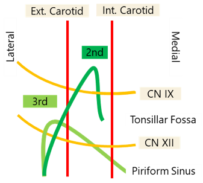

PEDIATRIC NECK MASSES

**History**:

* Ask if mass was present at birth,
* growth,
* fluctuate in size.
* Travel history.
* Pets at home (rabbits/cats).
* Exposure to farm animals (cows/pigs).
* B-symptoms (Fevers, chills, night sweats).
* Exposure to phenytoin (drug-induced)

**Work up**: First determine if congenital or acquired

* **Congenital + midline:** thyroglossal duct cyst → thyroid U/S (\~1% of thyroglossal cysts are the only thyroid tissue in a patient)
* **Congenital + lateral:** If suspected to be branchial cleft cyst, LVM, dermoid → MRI/CT
* Acquire + infectious/inflammatory:
  * Get CBC, EBV, cat-scratch (Bartonella), PPD. If atypical mycobacteria, consider surgical excision otherwise consider trial of antibiotics
  * Additional labs to consider: Toxoplasmosis, Tularemia (rabits), Brucella (cows/pigs), ACE levels (Sarcoid)

* **Acquired + suspicious for malignancy (eg HL)**: consider CBC, CXR, CT and excise

## CONGENITAL NECK MASSES

### **Thyroglossal Duct cysts**:

* **Get Thyroid U/S** to evaluate for thyroid tissue (1% of patients, TDC will be only thyroid tissue)
* Excision - **Sistrunk:** get mid portion of hyoid and cuff of tongue base (see *Posterior hyoid space as related to excision of the thyroglossal duct cyst. J Maddalozzo, J Alderfer, V Modi - The Laryngoscope, 2010*)

**Thymic cysts**:

 

* always on the left side and are cysts. Consider if patient has a macrocystic lymphatic malformation but no loculations (LVMs are multiple cysts, Thymic cysts are a single cyst).
  * **Get serial calcium** and eval for **DiGeorge Syndrome**

### **Congenital Torticollis (SCM tumors of infancy)**:

* consider in patients with fibrous tissue within SCM.
* Typically increases in size for 2-3 months then regresses for 4-8 months.
* Typically disappears w/ physiotherapy.

### Branchial Cleft Cyst

 

**First Branchial Cleft Cysts**:

* **Type 1:** 1 layer (ectoderm): Present as pre or post-auricular masses.
  * Runs along EAC. Lateral to CN7
* **Type 2:** 2 layers (ectoderm + mesoderm). **More common.**
  * Angle of mandible → Ends in/near EAC.
  * Can be medial to CN7 and may require a superficial parotidectomy (NIM monitoring required)

**Second Branchial Cleft:**

* Deep to CN7 (2nd arch). Superficial to CN9 (3rd arch)
* Anterior border of SCM → Between carotids → Superficial to CN9, CN12 → Tonsillar Fossa
* **Treatment:** Excision, may need tonsillectomy

**Third Branchial Cleft**:

* Deep to CN9 (3rd arch). Superficial to CN10. Ends in piriform

  \

**Fourth Branchial Cleft**:

* Starts by clavicle/base of SCM → loops under subclavian or aortic arch → goes superiorly deep to carotids → loops around CN12 and goes to piriform sinus like 3rd branchial cleft cysts

**Treatment of 3rd & 4th Branchial Cleft Cysts**

* **Endoscopic Cauterization of Piriform Sinus Tract:** Success rates similar to open technique. Occasionally needs 2 or 3 treatments

  
  1. Especially good for patients who are revisions or have had multiple infections (lots of scarring in neck)
  2. Use a 5 Fr Bugbee dome-tipped electrode. Use a setting of 8 on the Valleylab electrosurgical unit. Can throw a simple interrupted with a 6-0 or 7-0 polyglactin suture (Endoscopic electrocauterization of pyriform fossa sinus tracts as definitive treatment, EY Chen et al IJPORL 2009)

* Open excision should include partial thyroidectomy (superior pole of affected side)

## INFECTIOUS/INFLAMMATORY NECK MASSES

### **Viral**:

Post-infectious (especially after EBV infections). EBV also helpful to **r/o Postransplantation lymphproliferative disease (PTLD)**

### **Bacterial**:

Suppurative lymphadenopathy: **Staph** and **Group A strep** are MCC. Cover for anaerobic (19%) and MRSA (34%)

* **Cat-Scratch (Bartonella):** Treat with azithromycin
* **Tularemia:** via rabbits. Tonsillitis, pharyngitis, painful LAD, fever, chills, headaches
* **Brucella:** Cows, pigs, goats, elk and bison weakness, sweating, chills, malaise, headache, backache, and arthralgia typically occur. Afternoon fever peaks
* **Toxoplasmoisis:** look out for myocarditis/pneumoitis. Refer to ID
* **Atypical mycobacterium** (although m. tuberculosis rate is ↑) **Get PPD** (cannot distinguish between atypical mycobacterium and TB)

  
  1. **Tx:** Surgical excision vs anti-TB drugs. Surgical excision is typically better since anti-TB drugs need to be taken for 3-12months

### **Inflammatory**:

* **Kawasaki:** fever x 5days + four of the following:

  
  1. Cervical LAD
  2. Desquamation of hands/feet
  3. Exanthum (rash)
  4. Conjunctivitis
  5. Lip/OC erythema (Strawberry tongue)
* **Rosai-Dorfman.** Looks like mono. Plasma cells and histiocytes in biopsy
* **Drug-induced:** Phenytoin (also pyrimethamine, allopurinol, phenylbutazone)
* **Sarcoidosis:** Get ACE levels

## PEDIATRIC VASCULAR LESIONS

* In general: They grow at the same rate as the child, do not involute

  \

### **Infantile Hemangiomas**:

* Can be present at birth but typically noted after birth (unlike vascular malformations). **Enlarge w/ crying/straining.** Associated w/ GLUT-1
* Phases
  * Proliferation: Enlarge to about 80% final size by 12months (rarely grows after 12months)
  * Involution: 50% regress by 5 years, 70% by 7years
* **Diagnosis:** MRI - high intensity T2, flow voids
  * If in beard distribution CNV: think PHACES (posterior fossa, hemangiomas, aorta/cardiac, seye, sternal pits) more common in females

    
    1. Get **cardiac u/s & Head MRI to r/o posterior cranial fossa abnormalities.** Possible risk of subglottic hemangiomas **(do DLB if any respiratory symptoms)**
* **Treatment:**
  * **Propanolol:** during proliferative phase (aka under 1yo)
    * Make sure no cardiac issues and >5weeks old: consider in-hospital if high risk (concurrent diagnoses, airway symptoms), monitor glucose.
    * Dose: Start 0.5mg/kg/day (divided into 2-3x/day dosing).
      * Give 1st dose in office. Monitor vitals for 2 hours and check blood sugar.
      * Advance dose by 0.5mg/kk/dose q4days to 2 mg/kg/day as tolerated (many ppl have patients come back when increasing dose to monitor for another 2 hours).
      * Stop after 12 month old (taper over 4 weeks).
      * Stop if patient has illness (n/v) or wheezing from a cold. Once illness has resolved, can resume treatment
  * **Superficial:** can be treated with Pulse dye laser (PDL)
  * **Subglottic:** Treat with CO2 laser resection

### Congenital Hemangiomas

* **Not associated with GLUT-1.** Typically fully formed at birth.
  * **Rapidly Involuting (RICH):** disappear by 18month of age
  * **Non-involving (NICH):** consider embolization and excision once child is school age

### **Kasabach-merrit**

* Unlike infantile hemangiomas - they **do not spontaneously involute**
* Cause coagulopathy, bleeding risk

## LOW FLOW VASCULAR MALFORMATIONS

### **Capillary Malformations**: 

* Presents with **Port-Wine stain at birth.** 
* Associated with **Sturge Weber** syndrome: 
  * **Can involve leptomeninges** - risk of seizures, mental retardation. 
* **Treatment:** Pulse Dye Laser

### **Venous malformations**: 

* Commonly on the lips. **Bluish hue.** 
* Can cause **consumption coagulopathy.** 
* Imaging shows **calcifications (phleboliths)** because of low flow. 
* **Tx:** Sclerotherapy

  \

### **Lymphatic Malformations**

* **Macrocystic:** >2cm squared 
* **Microcystic:** <2cm squared
* Staging: **suprahyoid worse** than infrahyoid and **bilateral worse** than unilateral

  
  1. Lateral to lateral canthus — tend to be macrocytic. Medial = microcystic.
* Symptoms/Presentation: 
  * **Airway compression** (often needs an EXIT procedure if detected in utereo). 
  * Painful if infected. 
  * Hemorrhage into cyst can cause **rapid enlargement**
* **Treatment:**

  
  1. **Sclerotherapy:** 100% ethanol, OK-432, doxycycline, bleomycin, Sirolimus
     * If suprahyoid, may involve oral/mucosa look for airway swelling w/ therapy
     * Best for Macrocystic stage I diseases (microcystic/bilateral is more resistant)
  2. Macrocystic posterior neck, infrahyoid, LMs without septations **can be observed**
  3. **Excision if symptomatic** (low recurrence if completely removed but should be conservative)

## HIGH FLOW — ARTERIAL/ARTERIOVENOUS

* Small in childhood then rapid growth with puberty.
* Patients have a bruit. **Untreated, can have heart failure**
* **Workup:** Doppler, CTA. 
* **Tx:** preop embolization and then resection

## MALIGNANT LESIONS

* **Lipomas:** mobile
* **Neurofibromas:** 
  * Think family history of NF1 (Chr 17). 
  * Look for:
  * Ocular symptoms (optic gliomas (astrocytomas); 
  * Lisch nodules (Hamartomas of iris)
  * Axillary/inguinal freckles.
* **Lymphoma:** Hogkins is more common than NHL in the neck: 
  * HL = B - symptoms

