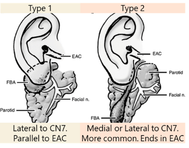
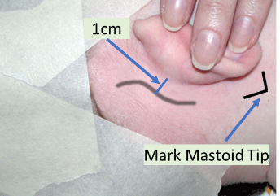
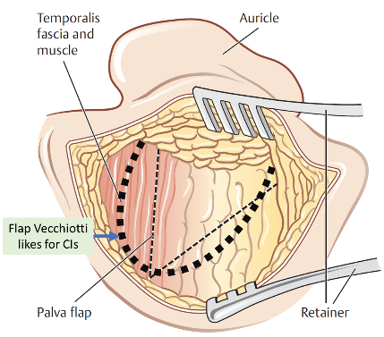

## 
Pediatric Otolaryngology
Clinic Guide

#### 
New patient visit
format

\_\_\_\_\_ is a **-year-old patient born full term. No NICU admission, no
intubation, passed NBHS. No prenatal, perinatal, or postnatal problems.
The patient presents to clinic today with**

#### 
F/U visit format

\_\_\_\_\_ is a **-year-old patient who is followed by this clinic for** .
He/She was last seen on ***, at that time*** was noted and the plan for
the patient was ***. Today, the patient returns. Since then***

#### 
NEED to ASK

- 
Weight

- 
Pregnancy

- 
Birth Hx (NICU stay / Newborn hearing screen / Intubation hx how long; what size tube; traumatic intubation/extubation)

- 
Siblings

- 
Smoking Exposure

- 
Daycare

- 
Pets

- 
Travel

- 
Exposures

- 
Last time on Antibiotics

- 
Double course of antibiotics

- 
\# of infections in last year (2 yr; 3 yrs)

- 
OSA hx (mouth breathing, snoring, drooling, dry mouth, daytime somnolence, hyperactivity, inattentiveness, day time napping, enuresis)

- 
Allergy testing

- 
Immunizations (Up to date Vaccines?)

- 
Growth (milestones?) height / weight / head circumference

- 
Social delay; motor skills

- 
Speech delay

- 
Feeding

- 
Family hx of ear disease; ankyloglossia (paternal);

#### 
Pediatric ROS

**Ears: No** episodes of AOM. No otorrhea or otalgia. No
concerns for hearing loss. No difficulty with balance. No history of
speech delay.

**Nose**: Denies chronic nasal congestion or rhinorrhea.
No epistaxis. No history or symptoms of environmental allergies; no
formal allergy evaluation to date.

**Throat**: No snoring or mouth breathing at night. No
witnessed apneic pauses in breathing while sleeping. No nighttime
enuresis. No episodes of tonsillitis or frequent sore throats.

**Airway**: No dysphagia or odynophagia. Denies any
change in sound of voice or cry, no hoarseness. No gasping or choking
spells. No episodes of respiratory distress. (Stridor/how's the
patient's cry, choking w. food/hx of respiration PNA, weight loss/FTT,
blue spells)

### 
OME -
Clinical Practice Guidelines

**Recurrent AOM:** 3 discrete episodes of AOM in 6months
or 4 in past 12 months

**Chronic OME**: OME that persists for 3+ months

Always use pneumatic otoscopy. Tympanometry if diagnosis is
uncertain. Council parents of newborns who fail NBHS of importance of
f/u due to risk of SNHL. Should screen of OME in at-risk patients.
**Watchful waiting recommended for** c**hild with OME
w/o risk factors.** Don't give steroids, antihistamines, or
decongestants to childrens with OME. **OME \>3months -- get
audiogram**. Re-eval patients with OME q3-6months until OME no
longer present or hearing loss identified (yes, repeat hearing test
q3-6months) or structural abnormalities/middle ear disease suspected.
**Chronic OME + hearing loss or symptoms that are consistent w/
hearing loss** -- book for tympanostomy tube placement.
**Recurrent AOM**: book for tympanostomy tube placement if
OME seen on day of visit. **Patients \>4yo should get an
adenoidectomy with ear tubes.**

**SRBD/OSA**

- 

Obtain PSG if: (1) obese \>95^th^ %ile (2) down
syndrome (3) craniofacial disorder (4) neuromuscular disorder (5) sickle
cell or mucopolysaccaharidose patients (6) when exam and history don't
match up

- 

Tx: T&A if tonsillar hypertrophy: Post-op admission in
patients (1) \10 or nadir \ DiGeorge)

id="timeline-for-cleft-lippalate-patients"\>Timeline for Cleft Lip/Palate
patients

- 

Birth: taping, lip adhesion, NAM (nasoalveolar molding),

- 

10 weeks: Cleft lip repair. Ear tubes (rule of 10s: 10 HgB, 10
weeks, 10 lbs) +/- primary rhinoplasty

- 

10 months: Cleft palate repair:

- 

6-12 years: consider revision rhino

- 

3-5 years: speech surgery

- 

14-18 years: definitive orthognathic and rhinoplasty
procedures

#### 
Pierre Robin
Sequence

- 

Work Up

- 

Birth history:

- 

gestation age, weight, complications of pregnancy: did mum
smoking, use opioids,

- 

delivery, complications,

- 

Current status and work-up:

- 

Stable/unstable?

- 

Respiratory status: intubated, desats, PCO2, blue spells

- 

Cardiac: Tetrology of Fallot (VSD, Aortic valve over ventricular
septum, RV outflow obstruction, RV hypertrophy) Truncus arteriosus) -
Think VCFS/DiGeorge

- 

Neuro: reflexes? Tone? Important to determine Trach vs
MDO

- 

GI: weight gain? Ability to tolerate PO? Determines in MDO is
needed, how severe symptoms are

- 

Eyes: Lower lid coloboma? Treacher Collins; Large eyes, myopia,
Retinal detachment Sticklers

- 

Hearing: Treacher Collins, Sticklers

- 

Hypocalcemia: VCFS

- 

Extremities: absent radii? Nager

- 

Family History

- 

One of the parents has it? Treacher Collins, Sticklers are
autosomal dominant

- 

Exam

- 

Vitals including the trend of weight, PO intake (in % of overall
feeds)

- 

Head & Neck Exam: looking for ocular abnormalities, auricular
abnormalities, symmetry of facial features, size/shape of jaw, cleft
palate,

- 

Other: Neuro exam: reflexes and tone. Extremities, respiratory
status (accessory muscle use)

- 

Perform fiberoptic exam: assess base of tongue obstruction and
for other airway lesions (phrayngeal narrowing, anterior glottic
web)

- 

Lab Work

- 

pCO2 - check if intervention is needed

- 

Ca2+: hypocalcemia? Think VCFS

- 

Microarray?

- 

Radiology

- 

CT facial bone if planning internal distraction.

- 

Associated syndromes

- 

MC: Sticklers -\> DiGeorge -\> Treacher Collins -\>
Goldenhar -\> Nager Syndrome

### 
Microtia/Aural
Atresia

Workup: If newborn hearing screen on contralateral ear is ok, can
delay formal audiogram until 6-7 months of age (ABR if fails on
that side)

#### 
Microtia

**Grade I**: cup or lop ear. **Grade II**:
rudimentary subunits **Grade III**: peanut ear
**Grade IV**: anotia

Most commonly right side, seen in men.

Ask: about teratogens (isotretinoin, thalidomide, vascular insults
during pregnancy)

Look for associated conditions: **Goldenhar**
(mandibular hypoplasia/hemifacial microsomia → OAV if spine defects
noted) **CHARGE** (coloboma, heart defects, choanal
atresia, retardation, genital hypoplasia, ear abnormalities)

For crypotia, stahl ear or other partial deformations, noted at
birth, wait 1 week to see if ear self corrects (1/3 of cases) then can
do molding, but this must be done within first 3 weeks (mold for 4
weeks). After 6 weeks, cannot mold

#### 
Aural Atresia

Associated w/ microtia in 55-90%.

**Jahrsdoerfer** (10 total points, \>7 = candidate for
repair) **SOME FIRMM**:

**S**tapes present (2 points), **O**val
window, **M**iddle ear space, **E**xternal ear
appearance

**F**acial nerve, **I**ncus-stapes
connection, **R**ound window,
**M**alleus-Incus complex **M**astoid
pneumatization

No need to get CT before 4 years of age. CT to evaluate for
**cholesteatoma** + to assess if candidate for aural
atresia repair. Aural atresia repaired AFTER microtia (because you want
skin w/ excellent blood supply for microtia)

## 
PEDIATRIC NECK
MASSES

**History**: Ask if mass was present at birth, growth,
fluctuate in size. Travel history. Pets at home (rabbits/cats). Exposure
to farm animals (cows/pigs). B-symptoms (Fevers, chills, night sweats).
Exposure to phenytoin (drug-induced)

**Work up**: First determine if congenital or
acquired

**

**Congenital + midline:** thyroglossal duct cyst →
thyroid U/S (\~1% of thyroglossal cysts are the only thyroid tissue in a
patient)

**Congenital + lateral:** If suspected to be branchial
cleft cyst, LVM, dermoid → MRI/CT

**Acquire + infectious/inflammatory:**

Get CBC, EBV, cat-scratch (Bartonella), PPD. If atypical
mycobacteria, consider surgical excision otherwise consider trial of
antibiotics

Additional labs to consider: Toxoplasmosis, Tularemia (rabits),
Brucella (cows/pigs), ACE levels (Sarcoid)

**Acquired + suspicious for malignancy (eg HL)**:
consider CBC, CXR, CT and excise

### 
CONGENITAL NECK
MASSES

**Thyroglossal Duct cysts**:

- 

Get Thyroid U/S to evaluate for thyroid tissue (1% of patients,
TDC will be only thyroid tissue)

- 

Excision: Sistrunk: get mid portion of hyoid and cuff of tongue
base (see *Posterior hyoid space as related to excision of the
thyroglossal duct cyst. J Maddalozzo, J Alderfer, V Modi - The
Laryngoscope, 2010*)

**Thymic cysts**:

- 

always
on the left side and are cysts. Consider if patient has a macrocystic
lymphatic malformation but no loculations (LVMs are multiple cysts,
Thymic cysts are a single cyst). Get serial calcium and eval for
Consider DiGeorge Syndrome

**Congenital Torticollis (SCM tumors of infancy)**:

- 

consider in patients with fibrous tissue within SCM. Typically
increases in size for 2-3 months then regresses for 4-8 months.
Typically disappears w/ physiotherapy.

#### 
Branchial Cleft
Cyst

**First Branchial Cleft Cysts**:

- 

Type 1: 1 layer (ectoderm): Present as pre or post-auricular
masses. Runs along EAC. Lateral to CN7

- 

Type 2: 2 layers (ectoderm +
mesoderm)  More common

- 

Angle of mandible → Ends in/near EAC. Can be medial to CN7 and
may require a superficial parotidectomy (NIM monitoring
required)

- 

**Second Branchial Cleft:** Deep to CN7 (2nd arch).
Superficial to CN9 (3rd arch)

- 

Anterior border of SCM → Between carotids → Superficial to CN9,
CN12 → Tonsillar Fossa

- 

Treatment: Excision, may need tonsillectomy

- 

**Third Branchial Cleft**: Deep to CN9 (3rdarch).
Superficial to CN10. Ends in piriform

- 

**Fourth Branchial Cleft**: Starts by clavicle/base
of SCM → loops under subclavian or aortic arch → goes superiorly deep to
carotids → loops around CN12 and goes to piriform sinus like 3rd
branchial cleft cysts

- 

Treatment of 3rd & 4th Branchial Cleft cysts

- 

Endoscopic Cauterization of Piriform Sinus Tract: Success rates
similar to open technique. Occasionally needs 2 or 3 treatments

- 

Especially good for patients who are revisions or have had
multiple infections (lots of scarring in neck)

- 

Use a 5 Fr Bugbee dome-tipped electrode. Use a setting of 8 on
the Valleylab electrosurgical unit. Can throw a simple interrupted with
a 6-0 or 7-0 polyglactin suture (Endoscopic electrocauterization of
pyriform fossa sinus tracts as definitive treatment, EY Chen et al
IJPORL 2009)

- 

Open excision should include partial thyroidectomy (superior pole
of affected side)

id="infectiousinflammatory-neck-masses"\>INFECTIOUS/INFLAMMATORY NECK

**Viral**: Post-infectious (especially after EBV
infections). EBV also helpful to r/o Postransplantation
lymphproliferative disease (PTLD)

**Bacterial**:

- 

Suppurative lymphadenopathy: Staph and Group A strep are MCC.
Cover for anaerobic (19%) and MRSA (34%)

- 

Cat-Scratch (Bartonella): Treat with azithromycin

- 

Tularemia: via rabbits. Tonsillitis, pharyngitis, painful LAD,
fever, chills, headaches

- 

Brucella: Cows, pigs, goats, elk and bison weakness, sweating,
chills, malaise, headache, backache, and arthralgia typically occur.
Afternoon fever peaks

- 

Toxoplasmoisis: look out for myocarditis/pneumoitis. Refer to
ID

- 

Atypical mycobacterium (although m. tuberculosis rate is ↑) Get
PPD (cannot distinguish between atypical mycobacterium and TB)

- 

Tx: Surgical excision vs anti-TB drugs. Surgical excision is
typically better since anti-TB drugs need to be taken for
3-12months

**Inflammatory**:

- 

Kawasaki: fever x 5days + four of the following:

- 

Cervical LAD (2) Desquamation of hands/feet (3) Exanthum (rash)
(4) Conjunctivitis (5) Lip/OC erythema (Strawberry tongue)

- 

Rosai-Dorfman. Looks like mono. Plasma cells and histiocytes in
biopsy

- 

Drug-induced: Phenytoin (also pyrimethamine, allopurinol,
phenylbutazone)

- 

Sarcoidosis: Get ACE levels

### 
PEDIATRIC VASCULAR LESIONS

- 
In general: They grow at the same rate as the child, do not involute

**Infantile Hemangiomas**:

- 
Can be present at birth but typically noted after birth (unlike vascular malformations). Enlarge w/ crying/straining. Associated w/ GLUT-1

- 
Phases

- 
Proliferation: Enlarge to about 80% final size by 12months (rarely grows after 12months)

- 
Involution: 50% regress by 5 years, 70% by 7years

- 
Diagnosis: MRI - high intensity T2, flow voids

- 
If in beard distribution CNV: think PHACES (posterior fossa, hemangiomas, aorta/cardiac, seye, sternal pits) more common in females

- 
Get cardiac u/s & Head MRI to r/o posterior cranial fossa abnormalities. Possible risk of subglottic hemangiomas (do DLB if any respiratory symptoms)

- 
Treatment: Propanolol: during proliferative phase (aka under 1yo)

- 
Make sure no cardiac issues and \>5weeks old: consider in-hospital if high risk (concurrent diagnoses, airway symptoms), monitor glucose.

- 
Dose: Start 0.5mg/kg/day (divided into 2-3x/day dosing). Give 1^st^ dose in office. Monitor vitals for 2 hours and check blood sugar. Advance dose by 0.5mg/kg/dose q4days to 2 mg/kg/day as tolerated (many ppl have patients come back when increasing dose to monitor for another 2 hours). Stop after 12 month old (taper over 4 weeks). Stop if patient has illness (n/v) or wheezing from a cold. Once illness has resolved, can resume treatment

- 
Superficial: can be treated with Pulse dye laser (PDL)

- 
Subglottic: Treat with CO2 laser resection

#### 
Congenital Hemangiomas

- 
Not associated with GLUT-1. Typically fully formed at birth. Types:

- 
Rapidly Involuting (RICH): disappear by 18month of age

- 
Non-involving (NICH): consider embolization and excision once child is school age

**Kasabach-merrit dx**:

- 
Unlike infantile hemangiomas - they do not spontaneously involute

- 
Cause coagulopathy, bleeding risk

#### 
LOW FLOW VASCULAR MALFORMATIONS

- 
**Capillary Malformations**: Presents with Port-Wine stain at birth. Associated with Sturge Weber syndrome: Can involve leptomeninges- risk of seizures, mental retardation. Treatment: Pulse Dye Laser

- 
**Venous malformations**: Commonly on the lips. Bluish hue. Can cause consumption coagulopathy. Imaging shows calcifications (phleboliths) because of low flow. Tx Sclerotherapy

- 
**Lymphatic Malformations**

- 
Macrocystic \>2cm^2^. Microcystic \Open Neck
Cases eg thyroglossal duct cyst (Vecchiotti)

Dr. Vecchiotti's glove size: **7**

PREPPING - You need:

- 

"1000 drapes" cut in half. Mastisol. Betadine. Marking pen.
Alcohol swabs. 1% lido with 1:100,000 epi (use 0.5 % with 1:200,000 epi
if young infant, ask if in doubt) .

- 

2 sets of headlights

Have marking pen ready to pre-mark incision -- have alcohol swabs
ready if need to erase/remark. Apply mastisol around your operative
field. Place the 1000 drapes on all 4 sides. Do a wide prep with
betadine. **Put on headlight before you scrub.** Have
bipolar set on 10/10.

CLOSING -- in general:

- 

4.0 vicryl for deep layers; buried interrupted

- 

5.0 or 6.0 fast absorbing gut for skin; simple running

- 

5.0 monocryl if closing skin with subcuticular stitches

- 

Prolene if placing drain

- 

Bacitracin ointment (occasionally dermabond)

**Sistrunk (Thyroglossal Duct Cyst Excision)
Technique:** see article *Posterior Hyoid Space as Related to
Excision of the Thyroglossal Duct Cyst* John Maddalozzo, MD, FAAP,
FACS, Jeremy Alderfer, MD; Vikash Modi, MD *The Laryngoscope
2010*

### 
Cochlear
Implants (Vecchiotti)

**To confirm before patient enters room**

- 
**

Check the patient's ear in the pre-op area to r/o mucoid
effusion.

Make sure CPD have pulled the cochlear implant instruments kit (there
is a special kit for each CI manufacturer), the ear kit, an M&T kit,
the Paparella press (for tympmastoids) the Visao drill with a 6 cutting,
3 cutting, 2 coarse diamond and 1 fine diamond drill on the field (a 1.5
fine diamond off the field as well)

Make sure they have the PURPLE permanent marker on the field (it's
the only one that draws on the Ioban)

Make sure they have a NIM nerve stimulator (the one where you can
change the voltage) on the field

A big bag of saline and big bag of sterile water handing on the
irrigation machine (the one used for the microdebrider). Don't allow the
scrubs to open an actual microdebrider...for their sake.

Make sure the cochlear instruments have these templates (Cochlear
Corp)

Balance the microscope. Don't drape it yet.

Call audiology and give them
the serial numbers for the cochlear implants

**Things to put on the non-sterile side table:**

M&T kit, mastisol, 1000 drapes cut in half (need 5-6), NIM
electrodes, tegederms cut in ½, a razor, alcohol prep pads,
lidocaine)

**Set up**

Bed rotated 180 degrees.
Leica microscope at head of bed, tower can be on the scrub side of
microscope, NIM monitor and suction on the scrub side by the feet.

Draw out the BTE template. Draw out the location of the implant using
the silicone template. This has to be above the temporal line and make
the angle that it sits \>45 degrees (Vecchiotti likes it more vertical
than usual) from the temporal line. Shave the hair by the proposed
implant site.

Draw a lazy S incision 0.5cm behind the post-auricular crease.

Place the NIM and curl the
leads before you stick the Tegaderm down. Test the monitor. Volume to
max, voltage at 0.8.

Put mastisol where the 1000 drapes will go and put the 1000 drapes
down.

**Evaluate the TM with the microscope before you
prep**.

Prep a wide area. Get the parts of the 1000 drapes that slip behind
each other. put the craniotomy drape (the one that collects fluid) on
the patient. Redraw template. Cut the ear out. Then put the Ioban from
posterior to anterior pulling the ear forward as you do. Redraw template
markings again. Have scrub drape the microscope and the chairs.

**Procedure**

15 blade for incision, carry down to the temporalis fascia. Raise
supraperiosteal flaps anteriorly to the posterior aspect of the EAC.

Create a palva flap -- use a bovie (if no contralateral implant
placed) down to the bone. Raise the flap with a Lempert periosteal
elevator to the spine of henle.

Do a cortical mastoidectomy,
focus on the corner where the tegmen and EAC meet. Use a #6 until you
hit Koerner septum, then switch to a #3 to expose the lateral
semicircular canal, incus buttress and the fossa incudes. The incus
points to the facial recess. Use the facial nerve stimulator to get an
idea where the facial nerve is, then take down the air cells on the EAC
(your gonna take corda) to get through the facial recess. Expose round
window. Drill part of your cochlostomy with a 1 diamond burr
anterior/inferior to round window until you are about to pop through it
then stop.

Use a freer to create your pocket (make it small/tight. He'll pimp
you on what is keeps the implant from moving. The answer is the
temporalis tendon blocks the anterior/inferior corner of the implant
from migrating) Put the metal implant template on a Kelly and use that
to dissect the pocket for a good fit. Use a pen to mark a line from the
metal template to the mastoid cavity and use a 3 cutting burr to drill a
well for the electrodes. Take some temporalis fascia for later

Irrigate the mastoid. Ask for blue towels to put around the sterile
area and change gloves. Open to the cochlear implant. Ask the nurses to
disconnect the bovie and the circulator to order the portable x-ray

Use the #1 diamond burr to finish your cochleostomy. Hold the implant
fin with AOS forceps and put the implant into the cochleostomy until you
hit the Silastic stopper. Then advance the electrodes, stop if you feel
resistance, until the white tabs line up. Pack the cochleostomy

Use non-compressed gelfoam to pack the mastoid. Close palva flap with
running 4-0 vicryl. Close deep layer with 4-0 vicyrl. Superficial with a
5-0 fast absorbing plain gut, use dermabond over that. Use a kerlex for
fluffs. Then do a mastoid dressing (with 2 kerlexs)

**Post-op Instructions**

Mastoid/glasscock dressing for 24 hours. Then glasscock dressing at
night until follow up

Keflex until f/u (give a refill on script)

HOB \>30 degrees. Sinus precautions. Dry ear precautions

Call for fevers, chills, drainage, persistent vertigo etc

### 
Botox injections to salivary glands - both MV & AS

- 
Call pedi ultrasound to make sure they're available and will be in the room at start of case

- 
x4 1cc syringes

- 
x4 yellow tip 27gauge needles

- 
x1 5cc syringe filled with sterile NS. Use 18gauge needle to dilute botox in the 5cc sterile NS.

- 
Draw 1cc into each of the 1cc syringes. Place 27gauge needles on the 4 1cc syringes

- 
Alcohol swabs to clean skin before injections

- 
Usually inject 1cc or 20 units/gland

### 
Dr Scott's OR Guide

For **Andrew Scott operative note** you need to
focus on FINDINGS: **+/- submucus cleft, Size of Tonsils, Size of
Adenoids, Electrocautery Settings.**

[]{#_Toc139824229 .anchor}Adenotonsillectomy
(Scott):

- 

Have shoulder roll and head drape ready

- 

Drape head, place shoulder roll after intubated and rotated 90
degrees away from anesthesia

- 

Place Crowe-Davis mouth gag, feel for submucus cleft
palate

- 

Place soft suction catheter through nasal cavity; place rolled
gauze between soft suction catheter and clamp to secure in place
(Vecchiotti does not use rolled gauze)

- 

Start with adenoidectomy- use microdebrider with the curved
blade. Get all the adenoids out before blood hits the suction machine
(this is Scott's gauge if you're doing it correctly)

- 

Pack with tonsil ball(s)

- 

Remove tonsils using Bovie electrocautery at setting of 20 and
20. Start more laterally than Vecchiotti (take the anterior pillar)
Cauterize the tonsillar fossa with suction electrocautery at setting of
20.

- 

Remove the tonsil balls, cauterize adenoid bed at setting of
28.

- 

Irrigate oral and nasal cavity with saline. (The correct way to
irrigate the nasal cavity is to place the bulb suction in the nostril,
squeeze, and gradually remove will still squeezing so irrigation gets on
the patient's face. Do not release the squeeze while in the nose, as
this could cause epistaxis and general annoyance.)

- 

Suction stomach with adult orogastric tube "Tummy time"

- 

Remove everything, you're done!

### 
Nasal endoscopy case/DCR in combo w/ ophtho - Scott

- 
Afrin-soaked pledgets

- 
4.0 zero degree scope (this can be obtained from airway cart, does not need to be sterile, i.e. don't need pedi FESS kit solely for the scope)

- 
lido w/ epi with yellow tip 27gauge needle

- 
4.0 Vicryl TF (if suturing stent in place)

- 
BMT kit usually adequate for equipment (alligator, Frazier tip suctions), also might need freer - unless planning for full DCR in which case FESS kit +/- drill (not sure which kind) may be necessary

### 
Butterfly
tympanoplasty -- Scott

Steps:

- 
inject canal. Make an incision on posterior tragus. Incise through the cartilage to anterior surface. Elevate anterior surface first. Then do posterior. Keep scissors bevel up (check what this means). KEEP the perichondrium on the cartilage

- 
just close incision with 2 interrupted sutures to prevent a tragal hematoma

- 
rim perforation. Then use cartilage, size it 2mm larger than perforation. Butterfly the cartilage with a #15 blade (circumferentially score it). The perichondrium will cause the edges to curl so it looks like a ear tube. Place it in the perforation.

id="pediatric-otolaryngology-post-op-guide"\>Pediatric Otolaryngology --
Post Op Guide

- 

Pediatric hospitalist consult is MANDATORY for all children under
2 year old

#### 
Tonsillectomy
Patients

**Orders**: IVF, soft diet, pulse oximetry, cool
humidified air, ice pack to back of neck,

**Meds**:

Tylenol & ibuprofen liquid PO (should be standing orders, to be
given 3 hours apart), Tylenol PR

Oxycodone and Morphine (since they are inpatient, its find to give to
patients \Laryngotracheal
Reconstruction (LTR) Protocol

POD#0-5: Make sure patient is on zosyn. Check for pressure necrosis
(occiput, heels), and alar necrosis.

**Periextubation plan (POD#5):** Decadron 0.25-0.5mg/kg
to be given 13 hours prior to extubation q6hrs x3 so last dose is 1 hour
prior to extubation. Propofol "washout": 8-10 hours prior to
planned extubation: start propofol 30mcg/kg/min (can titrate up to max
100mcg/kg/min) then after 1 hour, can cut opioid and benzodiazepine
infusions to 25-50% of previous level. continue precedex at same rate.
Discontinue vecuronium 4-6 hours prior to extubation

\[see LTR protocol\]

#### 
Vecchiotti Ear
Patient

- 

Keflex x1 week

- 

Glasscock x 24 hours then at night prn comfort

- 

Ciprodex & Bactroban: Remove the cotton ball in ear, apply 3
drops of ciprodex, then placed a new cotton ball coated in Bactroban
back into the ear. Do this three times a day

- 

Sinus precautions and dry ear precautions x 2
weeks

- 

Follow up in 2 weeks

- 

Perform tuning fork and facial nerve exam post-op

#### 
Scott Cleft Lip
& Cleft Palate

**Medications**:

- 

Tylenol

- 

Motrin (ONLY if \>6 months)

- 

Morphine

- 

+/- Oxycodone

- 

LR @ mIVF rate

- 

Nasal saline spray: 4 drops to each nostril and to lip incisions
q4 hours **\[cleft lip only\]** (this is super
important -- write an RN order to clean nose with q-tip if there is any
crusting and do this on rounds in the AM)

- 

Amoxicillin x1 week (Azithromycin for PCN allergic
patients)

**Non-Medication Orders**:

- 

Vitals per unit routine

- 

Activity ad lib

- 

Regular Pedi Age-appropriate diet **\[cleft
lip\]**

- 

Soft/Pureed diet until follow up **\[cleft
palate\]**

- 

Welcome sleeves at all times (except under direct supervision) x2
weeks (*sign the restraint order form in PACU otherwise you WILL get
a page at night)*

- 

No sippy cups or cups that have a valve or from a bottle. May
drink from a regular cup. May be spoon fed. May not use a
pacifier.

- 

Humidified air at all times

- 

Continuous O2 sat monitoring

- 

Titrate FiO2 to maintain sats \>92%

- 

Call ENT for significant bleeding or desaturations

- 

I&O per unit routine

- 

HOB elevated 30 degrees

- 

No ointment of any kind to incisions

- 

Follow up is 3 weeks

[Back to homepage](../../index.html)

id="tonsils-adenoids-ear-tubes-vecchiotti"\>Tonsils, Adenoids, Ear Tubes
(Vecchiotti)

id="laryngotracheal-reconstruction-vecchiotti-scott"\>Laryngotracheal
Reconstruction (Vecchiotti & Scott)

