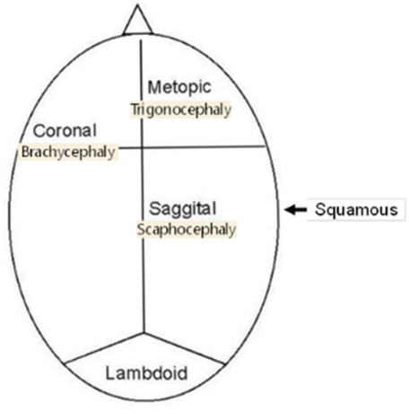

# Pediatric Syndromes

 

## DiGeorge/Velocardiofacial syndrome

**C** – Cardiac (trunk defect)

**A** – Abnormal facies (almond eyes, bulbous tip nose)

**T** – Thymic aplasia (immunodeficient)

**C** – Cleft lip/palate (this is why we get called)

**H** – Hypoparathyroidism (low calcum)

**22**q11 deletion

**15% patients have glottic webs**. Also have medialized carotids (important for tonsillectomies)

## CHARGE Syndrome

**C** – Coloboma (iris keyhole defect)

**H** – Heart defects

**A** – Atresia (choanal – nurses can’t pass suction through nose)

**R** – Retardation

**G** – Genital hypoplasia

**E** – Ear abnormalities (microtia, inner ear abnormalities)

### Cleft lip/palate

* FISH 22q (r/o DiGeorge)
* cardiac u/s (r/o conotruncal abnormalities -> DiGeorge)

#### **Timeline for Cleft Lip/Palate patients**

* **Birth:** taping, lip adhesion, NAM (nasoalveolar molding),
* **10 weeks:** 
  * Cleft lip repair. 
  * Ear tubes (rule of 10s: 10 HgB, 10 weeks, 10 lbs) 
  * +/- primary rhinoplasty
* **10 months:** Cleft palate repair:
* **6-12 years:** consider revision rhino
* **3-5 years:** speech surgery
* **14-18 years:** definitive orthognathic and rhinoplasty procedures

#### Pierre Robin Sequence

1. Work Up

   
   1. Birth history:

      
      1. gestation age, weight, complications of pregnancy: did mum smoke, use opioids,
      2. delivery, complications,
   2. Current status and work-up:

      
      1. **Stable/unstable?**
      2. Respiratory status: intubated, desats, PCO2, blue spells
      3. Cardiac: 

         
         1. Tetrology of Fallot (VSD, Aortic valve over ventricular septum, RV outflow obstruction, RV hypertrophy) Truncus arteriosus) - Think VCFS/DiGeorge
      4. Neuro: 

         
         1. reflexes? 
         2. Tone? 
         3. Important to determine Trach vs MDO
      5. GI: 

         
         1. weight gain? 
         2. Ability to tolerate PO? 
         3. Determines if MDO is needed, how severe symptoms are
      6. Eyes: 

         
         1. Lower lid coloboma? Treacher Collins; Large eyes, myopia, Retinal detachment Sticklers
      7. Hearing: Treacher Collins, Sticklers
      8. Hypocalcemia: VCFS
      9. Extremities: absent radii? Nager
   3. Family History

      
      1. One of the parents has it? Treacher Collins, Sticklers are autosomal dominant
2. Exam

   
   1. Vitals including the trend of weight, PO intake (in % of overall feeds)
   2. Head & Neck Exam, looking for: 

      
      1. ocular abnormalities, 
      2. auricular abnormalities, 
      3. symmetry of facial features, 
      4. size/shape of jaw, 
      5. cleft palate,
   3. Other: 

      
      1. Neuro exam: reflexes and tone. 
      2. Extremities
      3. Respiratory status (accessory muscle use)
   4. Perform fiberoptic exam: assess base of tongue obstruction and for other airway lesions (phrayngeal narrowing, anterior glottic web)
3. Lab Work

   
   1. **pCO2** - check if intervention is needed
   2. **Ca2+**: hypocalcemia? Think VCFS
   3. **Microarray?**
4. Radiology

   
   1. **CT facial bone** if planning internal distraction.
5. Associated syndromes

   
   1. MC: Sticklers -> DiGeorge -> Treacher Collins -> Goldenhar -> Nager Syndrome

## Microtia/Aural Atresia

**Workup:** If newborn hearing screen on contralateral ear is ok, **can delay formal audiogram until 6-7 months of age** (ABR if fails on that side)

#### 

#### **Microtia**

* Grading
  * **Grade I**: cup or lop ear. 
  * **Grade II**: rudimentary subunits 
  * **Grade III**: peanut ear 
  * **Grade IV**: anotia
* Most commonly right side, seen in men.
* **Ask:** about teratogens (isotretinoin, thalidomide, vascular insults during pregnancy)
* Look for associated conditions: 
  * **Goldenhar** (mandibular hypoplasia/hemifacial microsomia → OAV if spine defects noted) 
  * **CHARGE** (coloboma, heart defects, choanal atresia, retardation, genital hypoplasia, ear abnormalities)
* For crypotia, stahl ear or other partial deformations, noted at birth, wait 1 week to see if ear self corrects (1/3 of cases) then can do molding, but this must be done within first 3 weeks (mold for 4 weeks). 
  * After 6 weeks, cannot mold

#### 

#### **Aural Atresia**

* Associated w/ microtia in 55-90%.
* **Jahrsdoerfer** (10 total points, >7 = candidate for repair) **SOME FIRMM**:
* **S**tapes present (2 points), **O**val window, **M**iddle ear space, **E**xternal ear appearance
* **F**acial nerve, **I**ncus-stapes connection, **R**ound window, **M**alleus-Incus complex **M**astoid pneumatization
* No need to get CT before 4 years of age. CT to evaluate for **cholesteatoma** + to assess if candidate for aural atresia repair. Aural atresia repaired AFTER microtia (because you want skin w/ excellent blood supply for microtia)

